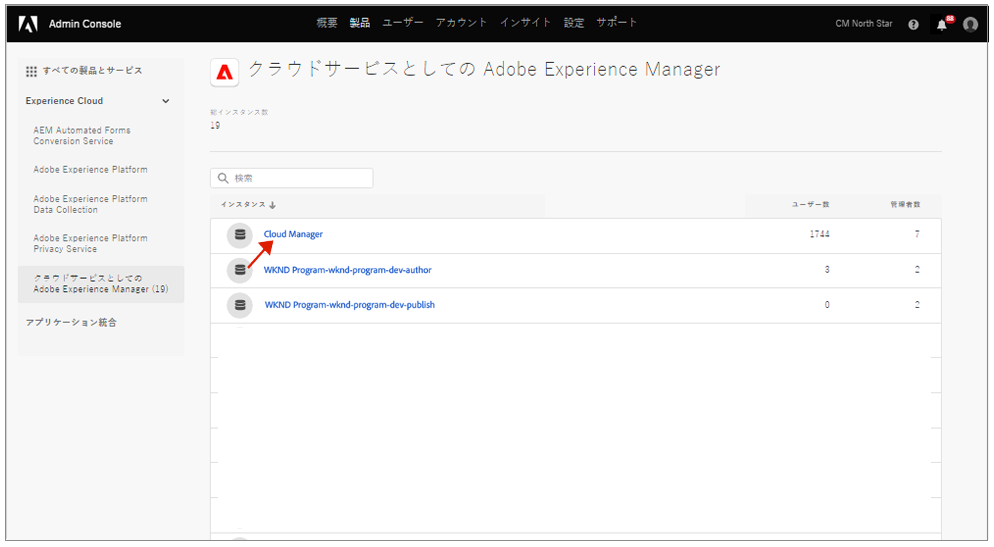
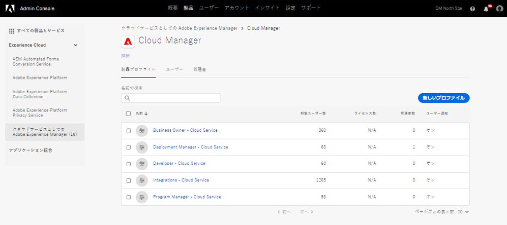
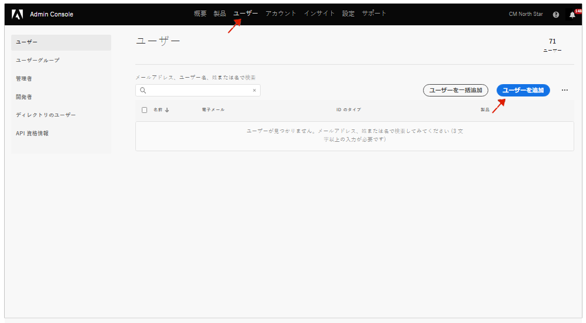

# 通知用のユーザーグループ {#user-groups}

重要な電子メール通知の受信を管理するために、Admin Consoleでユーザーグループを作成する方法を説明します。

## 概要 {#overview}

時々、Adobeは、AEMのas a Cloud Service環境に関してユーザーに連絡する必要があります。 Adobeは、製品内通知に加えて、通知に電子メールを使用する場合もあります。 このような電子メール通知には、次の 2 種類があります。

* **インシデントの通知**  — これらの通知は、インシデント発生時またはAdobeがAEM as a Cloud Service環境で可用性の問題を特定した際に送信されます。
* **事前通知**  — これらの通知は、Adobeサポートチームのメンバーが、AEMのas a Cloud Service環境に役立つ潜在的な最適化または推奨事項に関するガイダンスを提供したい場合に送信されます。

これらの通知を正しいユーザーが受け取るには、ユーザーグループを設定して割り当て、このドキュメントで説明する必要があります。

## 前提条件 {#prerequisites}

ユーザーグループはAdmin Console内で作成および管理されるので、通知用のユーザーグループを作成する前に、次の操作を行う必要があります。

* グループメンバーシップを追加および編集する権限を持っている。
* 有効なAdobe Admin Consoleプロファイルがある。

## 新しい Cloud Manager 製品プロファイルの作成 {#create-groups}

通知の受信を適切に設定するには、2 つのユーザーグループを作成する必要があります。 これらの手順は、1 回のみ実行する必要があります。

1. 次の場所でAdmin Consoleにログイン [`https://adminconsole.adobe.com`.](https://adminconsole.adobe.com)

1. **概要**&#x200B;ページで、**製品とサービス**&#x200B;カードから「**Adobe Experience Manager as a Cloud Service**」を選択します。

   

1. すべてのインスタンスのリストから **Cloud Manager** インスタンスを選択して、そこに移動します。

   

1. 設定済みのすべての Cloud Manager 製品プロファイルのリストが表示されます。

   

1. クリック **新しいプロファイル** 次の詳細を入力します。

   * **製品プロファイル名**: `Incident Notification - Cloud Service`
   * **表示名**: `Incident Notification - Cloud Service`
   * **説明**:インシデント発生時またはAdobeがAEM as a Cloud Service環境で可用性の問題を特定した場合に通知を受け取るユーザーの Cloud Manager プロファイル

1. 「**保存**」をクリックします。

1. クリック **新しいプロファイル** もう一度表示し、次の詳細を指定します。

   * **製品プロファイル名**: `Proactive Notification - Cloud Service`
   * **表示名**: `Proactive Notification - Cloud Service`
   * **説明**:AdobeサポートチームメンバーがAEMas a Cloud Serviceの環境設定に関して潜在的な最適化や推奨事項に関するガイダンスを提供したい場合に通知を受け取るユーザーの Cloud Manager プロファイル

1. 「**保存**」をクリックします。

2 つの新しい通知グループが作成されます。

>[!NOTE]
>
>Cloud Manager が重要です。 **製品プロファイル名** は、指定されたとおりです。 エラーを避けるために、提供された製品プロファイル名をコピーして貼り付けてください。 偏差や入力ミスがあれば、通知は必要に応じて送信されません。
>
>エラーが発生した場合、またはプロファイルが定義されていない場合、Adobeはデフォルトで、 **Cloud Manager 開発者** または **デプロイメントマネージャー** プロファイル：

## ユーザーを新しい通知製品プロファイルに割り当て {#add-users}

グループが作成されたら、適切なユーザーを割り当てる必要があります。 これは、新しいユーザーを作成する際に実行するか、既存のユーザーを更新する際に実行できます。

### グループに新しいユーザーを追加 {#new-user}

Federated ID が設定されていないユーザーを追加するには、次の手順に従います。

1. インシデントまたは事前通知を受け取るユーザーを特定します。

1. 次の場所でAdmin Consoleにログイン [`https://adminconsole.adobe.com`](https://adminconsole.adobe.com) まだログインしていない場合は、をクリックします。

1. **概要**&#x200B;ページで、**製品とサービス**&#x200B;カードから「**Adobe Experience Manager as a Cloud Service**」を選択します。

   

1. チームメンバーの Federated ID が設定されていない場合は、 **ユーザー** 上部のナビゲーションの「 」タブで、「 」を選択します。 **ユーザーを追加**. それ以外の場合は、「 」セクションにスキップします。 [既存のユーザーをグループに追加します。](#existing-users)

   

1. 内 **チームにユーザーを追加する** ダイアログで、追加するユーザーの電子メール ID を入力し、「 」を選択します。 `Adobe ID` の **ID Type**.

1. の下のプラスボタンをクリックします。 **製品を選択** 製品の選択を開始するための見出し。

1. 選択 **Adobe Experience Manager as a Cloud Service** 新しいグループの 1 つまたは両方をユーザーに割り当てます。

   * **インシデント通知 —Cloud Service**
   * **事前通知 —Cloud Service**

1. 「**保存**」をクリックすると、追加したユーザー宛に「ようこそ」の電子メールが送信されます。

招待されたユーザーに通知が届きます。 通知を受信するチームのユーザーに対して、これらの手順を繰り返します。

### グループに既存のユーザーを追加 {#existing-user}

Federated ID が既に存在するユーザーを追加するには、次の手順に従います。

1. インシデントまたは事前通知を受け取るユーザーを特定します。

1. 次の場所でAdmin Consoleにログイン [`https://adminconsole.adobe.com`](https://adminconsole.adobe.com) まだログインしていない場合は、をクリックします。

1. **概要**&#x200B;ページで、**製品とサービス**&#x200B;カードから「**Adobe Experience Manager as a Cloud Service**」を選択します。

1. を選択します。 **ユーザー** 」タブをクリックします。

1. 通知グループに追加するチームメンバーの Federated ID が既に存在する場合は、そのユーザーをリスト内で探し、クリックします。 それ以外の場合は、「 」セクションにスキップします。 [新しいユーザーをグループに追加します。](#add-user)

1. 内 **製品** 「ユーザーの詳細」ウィンドウの「 」セクションで、省略記号ボタンをクリックし、「 」を選択します。 **編集**.

1. 内 **製品を編集** ウィンドウで、 **製品を選択** 製品の選択を開始するための見出し。

1. 選択 **Adobe Experience Manager as a Cloud Service** 新しいグループの 1 つまたは両方をユーザーに割り当てます。

   * **インシデント通知 —Cloud Service**
   * **事前通知 —Cloud Service**

1. 「**保存**」をクリックすると、追加したユーザー宛に「ようこそ」の電子メールが送信されます。

招待されたユーザーに通知が届きます。 通知を受信するチームのユーザーに対して、これらの手順を繰り返します。
