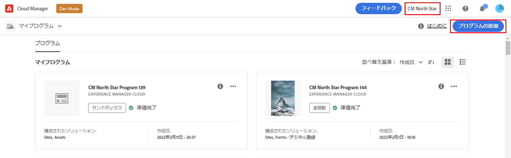
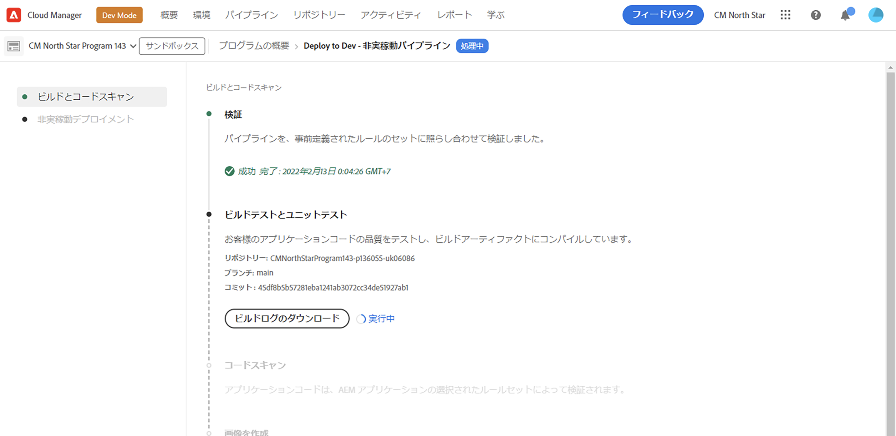

# プログラムを作成 {#creating-a-program}

新しいプログラムとパイプラインを設定してアドオンをデプロイする方法を説明します。

## これまでの説明内容 {#story-so-far}

Adobe Experience Manager（AEM） Reference Demo Add-on ジャーニーの前のドキュメントである [Reference Demo Add-on のインストールについて ](installation.md) では、Reference Demos Add-on のインストールプロセスを学び、異なる要素がどのように連携するのかを確認しました。 その結果、以下を習得しました。

* Cloud Manager の基本を理解しました。
* パイプラインで AEM にコンテンツと設定を配信する方法を理解しました。
* 数回クリックするだけで、デモコンテンツがあらかじめ登録された新しいサイトをテンプレートで作成できることがわかりました。

この記事では、これらの基本事項にもとづいて、テスト用のプログラムを作成する最初の設定手順を実行し、パイプラインを使用してアドオンコンテンツをデプロイします。

## 目的 {#objective}

このドキュメントは、新しいプログラムとパイプラインを設定してアドオンをデプロイする方法を理解するのに役立ちます。読み終えると、次のことを理解できるようになります。

* Cloud Manager を使用して新しいプログラムを作成する方法を理解し、説明することができます。
* 新しいプログラムで参照デモアドオンをアクティベートします。
* アドオンコンテンツをデプロイできるように、パイプラインを実行します。

## プログラムを作成 {#create-program}

Cloud Manager にログインした後、テストやデモを目的としたサンドボックスプログラムを作成できます。

>[!NOTE]
>
>プログラムを作成するには、組織の Cloud Manager で&#x200B;**ビジネスオーナー**&#x200B;の役割のメンバーである必要があります。

1. [my.cloudmanager.adobe.com](https://my.cloudmanager.adobe.com/) で Adobe Cloud Manager にログインします。

1. ログインしたら、画面の右上隅で正しい組織に所属していることを確認します。1 つの組織のみに所属している場合、この手順は不要です。

   

1. ウィンドウの右上にある「**プログラムを追加**」を選択します。

1. **プログラムを作成**&#x200B;ダイアログで、次の操作を実行します。

   1. プログラムを説明する&#x200B;**プログラム名**&#x200B;を指定します。
   1. **プログラムの目的**&#x200B;に「**サンドボックスを設定**」を選択します。
   1. 「**続行**」を選択します。

   

1. **ソリューションとアドオン**&#x200B;テーブルの&#x200B;**サンドボックスを設定**&#x200B;ダイアログで、リストの **Sites** エントリをタップまたはクリックして展開し、「**参照デモ**」のチェックをオンにします。

   * AEM Screens のデモも作成する場合は、リストの「**Screens**」オプションもチェックします。「**更新**」を選択します。

   

1. 「**作成**」を選択すると、Cloud Manager がサンドボックスプログラムの設定を開始します。プログラムの概要画面が表示され、プロセスが開始したことを示す短いバナー通知が表示されます。新しいプログラムの概要ページにカードが追加されます。設定プロセスが完了するまでに数分かかります。

1. 設定が完了すると、概要ページの環境のカードに、そのステータスが&#x200B;**準備完了**&#x200B;として表示されます。カードを選択して、環境を開きます。

   

1. 環境の準備が整い、アドオンがオプションとして有効になりましたが、デモの内容を AEM で利用できるようにするには、その内容をデプロイする必要があります。それには、**パイプライン**&#x200B;カードの「開発環境にデプロイ」パイプラインの横にある省略記号ボタンを選択して、「**実行**」を選択します。

   

1. パイプラインが開始し、デプロイメントの進行状況を詳しく説明するページが表示されます。プログラムの作成時にこの画面から移動し、必要に応じて後で戻ることができます。

   

パイプラインの完了には数分かかる場合があります。完了後は、アドオンとそのデモコンテンツを AEM オーサリング環境で使用できるようになります。

## 次の手順 {#what-is-next}

これで、AEM Reference Demo Add-On ジャーニーのこの手順が完了しました。この手順で学んだことは次のとおりです。

* Cloud Manager を使用してプログラムを作成する方法を理解します。
* 新しいプログラムの参照デモのアドオンを有効にする方法について説明します。
* パイプラインを実行してアドオンコンテンツをデプロイできるようにします。

この知識に基づいて、次に[デモサイトを作成](create-site.md)を確認し、AEM 参照デモのアドオンのジャーニーを続行します。ここでは、パイプラインでデプロイされた事前設定済みのテンプレートのライブラリに基づいて、AEM でデモサイトを作成する方法について説明します。

## その他のリソース {#additional-resources}

* [Cloud Manager のドキュメント](https://experienceleague.adobe.com/docs/experience-manager-cloud-service/content/onboarding/onboarding-concepts/cloud-manager-introduction.html?lang=ja) - Cloud Manager の機能について詳しくは、詳細な技術ドキュメントを直接参照してください。
