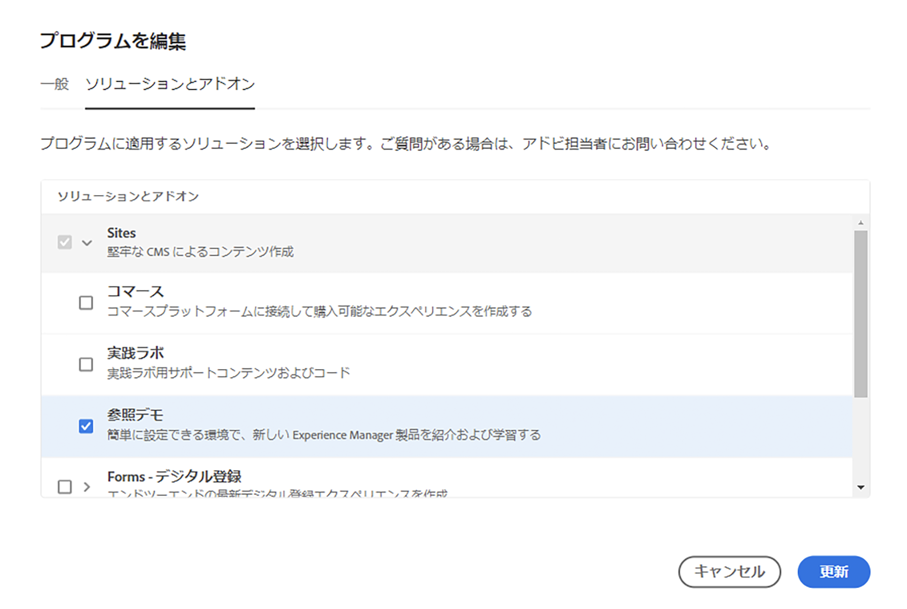

# プログラムを作成 {#creating-a-program}

新しいプログラムとパイプラインを設定してアドオンをデプロイする方法を説明します。

## これまでの説明内容 {#story-so-far}

前のドキュメントのAEM Reference Demos Add-On ジャーニーでは、 [リファレンスデモアドオンのインストールについて、](installation.md) リファレンスデモアドオンのインストールプロセスを学習し、異なる要素がどのように連携するかを示しました。 その結果、以下を達成できました。

* Cloud Manager の基本を理解している。
* パイプラインがAEMにコンテンツと設定を配信する方法を説明します。
* 数回のクリックでデモコンテンツが事前入力された新しいサイトをテンプレートで作成する方法をご覧ください。

この記事は、これらの基本事項に基づいて構築され、テスト用のプログラムを作成する最初の設定手順を実行し、パイプラインを使用してアドオンコンテンツをデプロイします。

## 目的 {#objective}

このドキュメントでは、新しいプログラムとパイプラインを設定してアドオンをデプロイする方法を説明します。 ドキュメントを読めば、以下が可能です。

* Cloud Manager を使用して新しいプログラムを作成する方法を説明します。
* 新しいプログラムの参照デモアドオンを有効化する方法を説明します。
* パイプラインを実行してアドオンコンテンツをデプロイできる。

## プログラムの作成 {#create-program}

Cloud Manager にログインした後、テストやデモを目的とした新しいサンドボックスプログラムを作成できます。

>[!NOTE]
>
>ユーザーは、 **ビジネスオーナー** 組織内の Cloud Manager での役割（プログラムを作成するため）

1. 次の場所にあるAdobeCloud Manager にログインします。 [my.cloudmanager.adobe.com](https://my.cloudmanager.adobe.com/).

1. ログインしたら、画面の右上隅で正しい組織に属していることを確認します。 1 つの組織のメンバーのみの場合、この手順は不要です。

   

1. タップまたはクリック **プログラムの追加** をクリックします。

1. 内 **プログラムを作成しましょう** ダイアログで、 **Adobe Experience Manager** が次の中で選択されています： **製品** その後、タップまたはクリックします **続行**.

   

1. 次のダイアログで、以下の手順を実行します。

   * 次を提供： **プログラム名** プログラムを説明する。
   * タップまたはクリック **サンドボックスの設定** の **プログラムの目的**

   次に、「 」をタップまたはクリックします。 **作成**.

   

1. プログラムの概要画面が表示され、プログラムの作成プロセスを確認できます。 Cloud Manager では、残り時間の予測値が提供されます。 プログラムの作成時にこの画面から移動し、必要に応じて後で戻ることができます。

   

1. 完了すると、Cloud Manager に、自動的に作成された環境とパイプラインを含む概要が表示されます。

   

1. ページの左上にあるプログラム名をクリックし、ドロップダウンで選択し、プログラムの詳細を編集します **プログラムを編集**.

   

1. 内 **プログラムを編集** ダイアログ、 **ソリューションとアドオン** タブをクリックします。

   

1. の **ソリューションとアドオン** タブ、展開 **サイト** リスト内のエントリを確認し、 **参照デモ**. AEM Screensのデモも作成する場合は、 **スクリーン** 」オプションも使用できます。 「**更新**」をタップまたはクリックします。

   

1. アドオンがオプションとして有効になりましたが、使用するには、その内容をAEMにデプロイする必要があります。 プログラムの概要ページに戻り、「 」をタップまたはクリックします。 **開始** をクリックして、AEMにアドオンコンテンツをデプロイするためのパイプラインを開始します。

   

1. パイプラインが開始し、デプロイメントの進行状況を詳しく説明するページが表示されます。 プログラムの作成時にこの画面から移動し、必要に応じて後で戻ることができます。

   

パイプラインが完了すると、アドオンとそのデモコンテンツをAEMオーサリング環境で使用できるようになります。

## 次のステップ {#what-is-next}

これで、AEM Reference Demo Add-On ジャーニーのこの部分が完了し、以下をおこなう必要があります。

* Cloud Manager を使用して新しいプログラムを作成する方法を説明します。
* 新しいプログラムの参照デモアドオンを有効化する方法を説明します。
* パイプラインを実行してアドオンコンテンツをデプロイできる。

この知識に基づいてドキュメントを次に確認し、AEM Reference Demo Add-On のジャーニーを続行します。 [デモサイトの作成、](create-site.md) ここでは、パイプラインでデプロイされた事前設定済みのテンプレートのライブラリに基づいて、AEMでデモサイトを作成する方法を学びます。

## その他のリソース {#additional-resources}

* [Cloud Manager のドキュメント](https://experienceleague.adobe.com/docs/experience-manager-cloud-service/onboarding/onboarding-concepts/cloud-manager-introduction.html) - Cloud Manager の機能の詳細については、詳細な技術ドキュメントを直接お問い合わせください。
