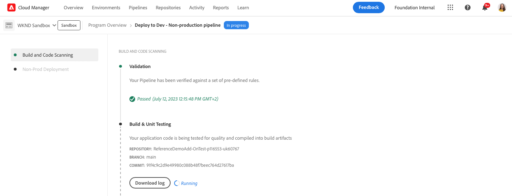

# プログラムを作成 {#creating-a-program}

新しいプログラムとパイプラインを設定してアドオンをデプロイする方法を説明します。

## これまでの説明内容 {#story-so-far}

前のドキュメントのAdobe Experience Manager(AEM) リファレンスデモアドオンジャーニーでは、 [リファレンスデモアドオンのインストールについて、](installation.md) リファレンスデモアドオンのインストールプロセスを学び、異なる要素がどのように連携するかを示しました。 その結果、以下を習得しました。

* Cloud Manager の基本を理解しました。
* パイプラインで AEM にコンテンツと設定を配信する方法を理解しました。
* 数回のクリックでデモコンテンツが事前に埋め込まれたサイトを、テンプレートで作成する方法をご覧ください。

この記事では、これらの基本事項にもとづいて、テスト用のプログラムを作成する最初の設定手順を実行し、パイプラインを使用してアドオンコンテンツをデプロイします。

## 目的 {#objective}

このドキュメントは、新しいプログラムとパイプラインを設定してアドオンをデプロイする方法を理解するのに役立ちます。読み終えた後、次の操作を実行できるようになります。

* Cloud Manager を使用してプログラムを作成する方法を説明し、理解します。
* 新しいプログラムの参照デモアドオンを有効化します。
* アドオンコンテンツをデプロイできるように、パイプラインを実行します。

## プログラムの作成 {#create-program}

Cloud Manager にログインした後、テストやデモ用のサンドボックスプログラムを作成できます。

>[!NOTE]
>
>ユーザーは、 **ビジネスオーナー** 組織内の Cloud Manager で、プログラムを作成するための役割。

1. [my.cloudmanager.adobe.com](https://my.cloudmanager.adobe.com/) で Adobe Cloud Manager にログインします。

1. ログインしたら、画面の右上隅で正しい組織に所属していることを確認します。1 つの組織のメンバーのみの場合、この手順は不要です。

   

1. ウィンドウの右上にある「**プログラムの追加**」をタップまたはクリックします。

1. Adobe Analytics の **プログラムを作成しましょう** ダイアログ：

   1. プログラムを説明する&#x200B;**プログラム名**&#x200B;を指定します。
   1. **プログラムの目的**&#x200B;の「**サンドボックスの設定**」をタップまたはクリックします
   1. 「**続行**」をタップまたはクリックします。

   

1. Adobe Analytics の **サンドボックスの設定** ダイアログ **ソリューションとアドオン** テーブル、展開 **Sites** リスト内のエントリをタップまたはクリックしてから、 **参照デモ**.

   * AEM Screensのデモも作成する場合は、 **Screens** 」オプションを使用します。 「**更新**」をタップまたはクリックします。

   

1. タップまたはクリック **作成** と Cloud Manager がサンドボックスプログラムの設定を開始します。 プログラムの概要画面が表示され、プロセスが開始したことを示す短いバナー通知が表示されます。 新しいプログラムの概要ページにカードが追加されました。 設定プロセスが完了するまでに数分かかります。

1. 設定が完了すると、概要ページの環境のカードに、そのステータスが **準備完了**. カードをタップまたはクリックして、環境を開きます。

   

1. 環境の準備が整い、アドオンがオプションとして有効になりましたが、デモの内容をAEMで利用できるようにするには、その内容をデプロイする必要があります。 それには、 **パイプライン** カードと選択 **実行**.

   

1. パイプラインが開始し、デプロイメントの進行状況を詳しく説明するページが表示されます。プログラムの作成時にこの画面から移動し、必要に応じて後で戻ることができます。

   

パイプラインの完了には数分かかる場合があります。 完了すると、アドオンとそのデモコンテンツをAEMオーサリング環境で使用できるようになります。

## 次の手順 {#what-is-next}

これで、AEM Reference Demo アドオンのジャーニーのこの部分が完了し、以下をおこなう必要があります。

* Cloud Manager を使用してプログラムを作成する方法を説明します。
* プログラムの参照デモアドオンを有効にする方法を説明します。
* パイプラインを実行してアドオンコンテンツをデプロイできる。

この知識に基づいて次のレビューを行い、AEM Reference Demo Add-on のジャーニーを継続します。 [デモサイトの作成](create-site.md). ここでは、パイプラインでデプロイされた事前設定済みのテンプレートのライブラリに基づいて、AEMでデモサイトを作成する方法を学びます。

## その他のリソース {#additional-resources}

* [Cloud Manager のドキュメント](https://experienceleague.adobe.com/docs/experience-manager-cloud-service/content/onboarding/onboarding-concepts/cloud-manager-introduction.html) - Cloud Manager の機能について詳しくは、詳細な技術ドキュメントを直接参照してください。
