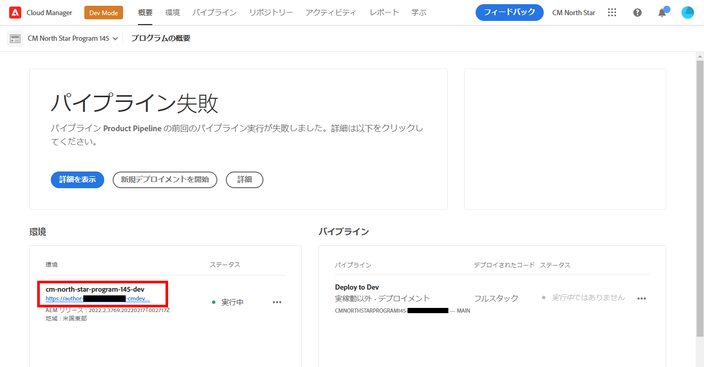
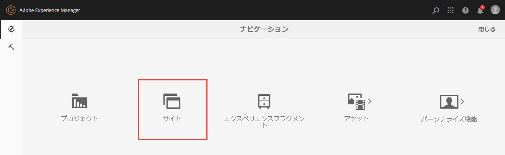
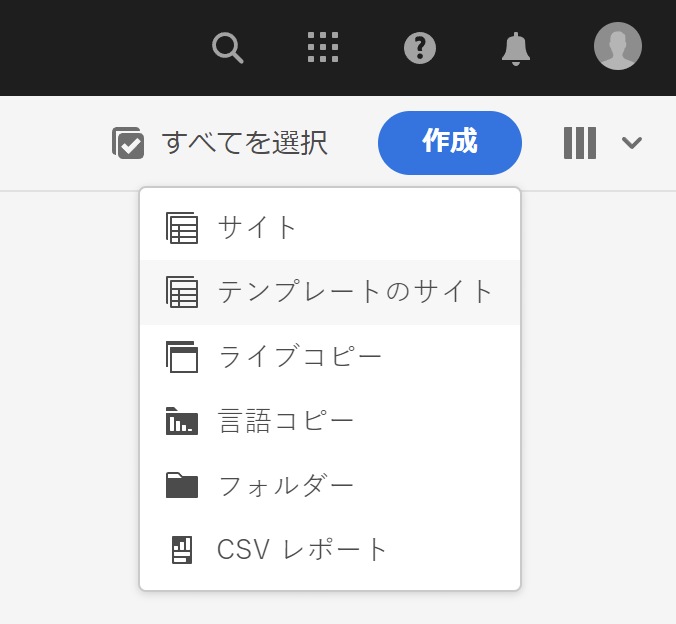
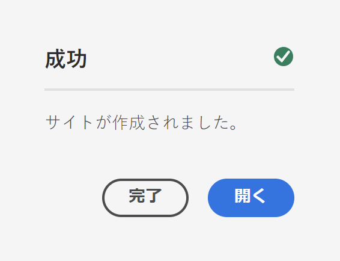
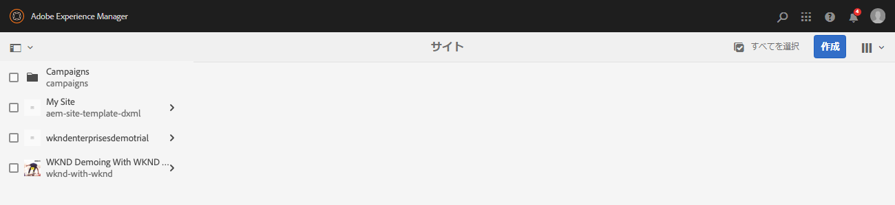
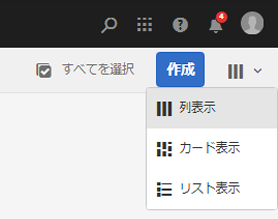
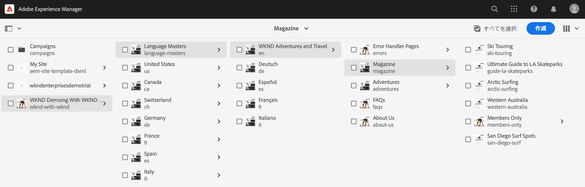
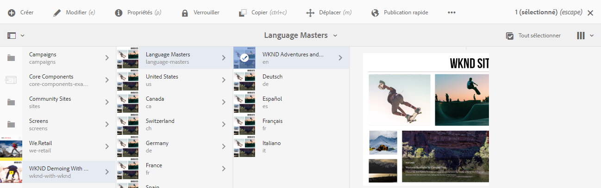
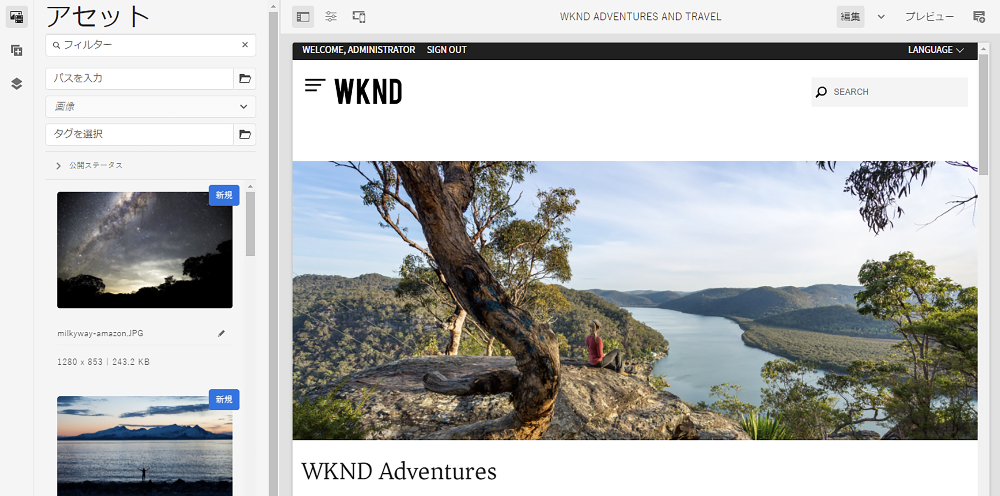

# デモサイトを作成 {#creating-a-site}

事前設定済みのテンプレートのライブラリに基づいて、AEM にデモサイトを作成します。

## これまでの説明内容 {#story-so-far}

AEM Reference Demos Add-On ジャーニーの前のドキュメントである [ プログラムを作成 ](create-program.md) では、最初の設定手順で、テスト用のプログラムを作成し、パイプラインを使用してアドオンコンテンツをデプロイしました。 その結果、以下を習得しました。

* Cloud Manager を使用してプログラムを作成する方法を理解します。
* 新しいプログラムの Reference Demos Add-On を有効にする方法。
* パイプラインを実行してアドオンコンテンツをデプロイ。

この記事では、参照デモのアドオンのテンプレートに基づいて AEM でサイトまたは AEM Screens プロジェクトを作成することで、プロセスの次の手順を説明します。

## 目的 {#objective}

このドキュメントは、参照デモのアドオンのテンプレートに基づいてサイトを作成する方法を理解するのに役立ちます。読み終えると、次のことが習得できます。

* AEM オーサリング環境へのアクセス方法の理解。
* テンプレートに基づくサイトの作成方法の理解。
* サイト構造内を移動し、ページを編集する際の基本事項の理解。

## デモサイトまたは Screens プロジェクトの作成 {#create-site}

パイプラインが参照デモのアドオンをデプロイすると、AEM オーサリング環境にアクセスして、アドオンコンテンツに基づくデモサイトを作成できます。

1. Cloud Manager のプログラムの概要ページで、AEM オーサリング環境へのリンクを選択します。

   

1. AEM のメインメニューから、「**Sites**」を選択します。

   

1. Sites コンソールから、画面の右上にある「**作成**」を選択し、ドロップダウンで「**テンプレートからサイト**」を選択します。

   

1. サイト作成ウィザードが開始されます。左側の列には、パイプラインがオーサリングインスタンスにデプロイしたデモテンプレートが表示されます。1 つを選択すると、右側の列に詳細が表示されます。AEM Screens のテストやデモを行う場合は、必ず「**We.Cafe サイトテンプレート**」を選択します。「**次へ**」を選択します。

   

1. 次の画面で、サイトのタイトルまたは Screens プロジェクトのタイトルを指定します。サイト名を指定できます。省略した場合はタイトルからサイト名が生成されます。「**作成**」を選択します。

   * サイトのタイトルは、ブラウザーのタイトルバーに表示されます。
   * サイト名が URL の一部になります。
   * サイト名は、AEM のページ命名規則に従う必要があります。詳細については、[その他のリソース](#additional-resources)の節を参照してください。

   

1. ダイアログで、サイトの作成が確認されます。「**完了**」を選択します。

   

独自のデモサイトを作成しました。

## デモサイトを使用 {#use-site}

デモサイトが作成されたので、AEM 内の他のサイトと同様に移動して使用できます。

1. サイトがサイトコンソールに表示されます。

   

1. 画面の右上隅で、コンソールビューが&#x200B;**列表示**&#x200B;に設定されていることを確認します。

   

1. 構造とコンテンツを参照するサイトを選択します。デモサイトのコンテンツツリーを移動すると、列表示が継続的に展開します。

   

1. ページを選択し、ツールバーの「**編集**」を選択します。

   

1. コンポーネントやアセットの追加や編集など、他の AEM コンテンツページと同様にページを編集し、AEM の機能をテストできます。

   

これで完了です。これで、デモサイトのコンテンツをさらに詳しく調べ、Reference Demo Add-On のベストプラクティスコンテンツを通じて AEM が提供するすべてを見つけることができます。

他のテンプレートに基づいて追加のサイトを作成し、より多くの AEM 機能を調べます。

## 次の手順 {#what-is-next}

これで、AEM Reference Demo Add-On ジャーニーのこのステップが完了し、以下を習得しました。

* AEM オーサリング環境へのアクセス方法の理解。
* テンプレートに基づくサイトの作成方法の理解。
* サイト構造内を移動し、ページを編集する際の基本事項の理解。

アドオンコンテンツを使用して AEM の機能をテストできるようになりました。ジャーニーを続行するには、次の 2 つのオプションがあります。

* AEM Screensのコンテンツの完全なデモとテストを行う場合は、前に説明したように、**We.Cafe サイトテンプレート** に基づいてサイトをデプロイし、続いて [ デモサイトに対してAEM Screensを有効にする ](screens.md) を行います。
* Sites コンテンツのデモのみの場合は、続いて [ デモサイトの管理 ](manage.md) に進んで、デモサイトの管理に役立つツールと、デモサイトを削除する方法を学びます。

## その他のリソース {#additional-resources}

* [Cloud Manager のドキュメント](https://experienceleague.adobe.com/docs/experience-manager-cloud-service/onboarding/onboarding-concepts/cloud-manager-introduction.html?lang=ja) - Cloud Manager の機能について詳しくは、詳細な技術ドキュメントを直接参照してください。
* [サイトを作成](/help/sites-cloud/administering/site-creation/create-site.md) - AEM を使用して、サイトテンプレートを使用してサイトを作成し、サイトのスタイルと構造を定義する方法を説明します。
* [AEM のページ命名規則](/help/sites-cloud/authoring/sites-console/organizing-pages.md#page-name-restrictions-and-best-practices)。AEM ページを整理する際の規則を理解するには、このページを参照してください。
* [AEM の基本操作](/help/sites-cloud/authoring/basic-handling.md) - AEM を初めて使用する場合は、ナビゲーションやコンソールの構成などの基本的な概念を理解するために、このドキュメントを参照してください。
