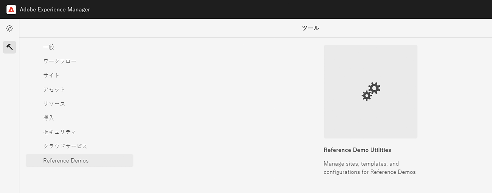

# デモサイトを管理 {#manage-demo-sites}

デモサイトの管理に役立つツールと、デモサイトを削除する方法について説明します。

## これまでの説明内容 {#story-so-far}

AEM Reference Demo Add-On ジャーニーの前のドキュメントである [ サイトを作成 ](create-site.md) では、Reference Demo Add-On のテンプレートに基づいて新しいデモサイトを作成しました。 その結果、以下を習得しました。

* AEM オーサリング環境へのアクセス方法の理解。
* テンプレートに基づくサイトの作成方法の理解。
* サイト構造内を移動し、ページを編集する際の基本事項の理解。

また [ デモサイトに対してAEM Screensを有効にした ](screens.md) 場合、次のことも習得しました。

* AEM Screens の基本的な知識。
* We.Cafe デモコンテンツの理解。
* We.Cafe 用の AEM Screens の設定方法。

調査する独自のデモサイトができたので、この記事では、デモサイトの管理に役立つツールと、その削除方法について説明します。

## 目的 {#objective}

このドキュメントは、作成したデモサイトの管理方法を理解するのに役立ちます。読み終えると、次のことが習得できます。

* Self-Service Demo Utilities へアクセスする方法を理解します。
* 使用可能なユーティリティを把握する。
* 既存のデモサイトまたはテンプレートを削除する方法。

## Self-Service Demo Utilities へのアクセス {#accessing-utilities}

独自のデモサイトができたので、それらの管理方法を知りたいと思われるかもしれません。パイプラインは、デモサイトのコンテンツを提供するためにサイトテンプレートをデプロイしただけでなく、これらのサイトを管理するための一連のユーティリティもデプロイしました。

1. AEM グローバルナビゲーションバーで、**ツール**／**Reference Demos**／**Reference Demos Utilities** を選択します。

   

1. Reference Demo Utilities は、Adobe Experience Manager 環境の設定と監視に役立つ便利な機能のコレクションです。最初の表示は&#x200B;**ダッシュボード**&#x200B;であり、環境とそのデモ機能のステータスチェックとして機能します。

   

Self-Service Demo Utilities には、いくつかのツールが用意されています。

* **サイトを削除** - この Adobe Experience Manager インスタンスで削除するサイトを選択します。これは破壊的なアクションであり、一度開始すると元に戻すことはできません。
* **サイトテンプレートを削除** - この Adobe Experience Manager インスタンスで削除するサイトテンプレートを選択します。サイトテンプレートを削除する前に、そのテンプレートを参照するすべてのサイトも削除されていることを確認してください。これは破壊的なアクションであり、一度開始すると元に戻すことはできません。
* **Prime Author Cache** - Adobe Experience Manager インスタンス内の複数のリソースを取得し、取得時間を高速化します。数秒かかる場合があります。
* **Android アプリ** - デモ Android アプリをインストールして起動するためのツール。**WKND 単一ページアプリ**&#x200B;に基づいてサイトを作成し、このページに入力します。Android デバイス、エミュレーター、または Bluestacks から使用します。
* **ユーザーの環境設定** - チュートリアルポップアップダイアログをオフにします。
* **GraphQL の設定** - グローバル GraphQL エンドポイントをすばやく設定します。

## デモサイトとテンプレートの削除 {#deleting}

一連の AEM 機能をテストすると、デモサイトや基になるテンプレートさえも不要になる場合があります。デモサイトとサイトテンプレートの両方を簡単に削除できます。

1. 「**Reference Demo Utilities**」にアクセスし、「**サイトを削除**」を選択します。

   

1. 使用可能なサイトはリストに表示されます。削除するサイト（複数可）を選択し、「**削除**」を選択します。

   >[!CAUTION]
   >
   >サイトとテンプレートの削除は破壊的なアクションであり、開始後に元に戻すことはできません。

1. ダイアログでサイトの削除を確認します。

   

1. AEM は選択したサイトを削除し、その進行状況を以前「**削除**」ボタンがあった場所に表示します。

   

これでサイトが削除されました。

**Reference Demos Utilities** の「**サイトテンプレートの削除**」という見出しの下で、同じ方法でテンプレートを削除できます。

>[!CAUTION]
>
>サイトテンプレートを削除する前に、そのテンプレートを参照するすべてのサイトも削除されていることを確認してください。

## ジャーニーの終了 {#end-of-journey}

これで完了です。AEM Reference Demos Add-On のジャーニーが完了しました。その結果、以下を習得しました。

* Cloud Manager の基本を理解し、パイプラインがコンテンツと設定を AEM に配信する方法を理解します。
* Cloud Manager を使用してプログラムを作成する方法を理解します。
* 新しいプログラムの Reference Demos Add-On をアクティブ化する方法を理解し、パイプラインを実行してアドオンコンテンツをデプロイできるようにします。
* AEM オーサリング環境にアクセスし、テンプレートに基づいてサイトを作成する方法を理解します。
* Self-Service Demo Utilities へアクセスする方法を理解します。
* 既存のデモサイトまたはテンプレートを削除する方法を理解します。

これで、独自のデモサイトを使用して AEM の機能を探索する準備が整いました。ただし、AEM は強力なツールであり、その他にも使用可能なオプションが多数あります。このジャーニーで説明した機能について詳しくは、[その他のリソース](#additional-resources)の節で紹介しているその他のリソースを参照してください。

## その他のリソース {#additional-resources}

* [Cloud Manager のドキュメント](https://experienceleague.adobe.com/docs/experience-manager-cloud-service/onboarding/onboarding-concepts/cloud-manager-introduction.html?lang=ja) - Cloud Manager の機能について詳しくは、詳細な技術ドキュメントを直接参照してください。
* [サイトを作成](/help/sites-cloud/administering/site-creation/create-site.md) - AEM を使用して、サイトテンプレートを使用してサイトを作成し、サイトのスタイルと構造を定義する方法を説明します。
* [AEM のページ命名規則](/help/sites-cloud/authoring/sites-console/organizing-pages.md#page-name-restrictions-and-best-practices)。AEM ページを整理する際の規則を理解するには、このページを参照してください。
* [AEM の基本操作](/help/sites-cloud/authoring/basic-handling.md) - AEM を初めて使用する場合は、ナビゲーションやコンソールの構成などの基本的な概念を理解するために、このドキュメントを参照してください。
* [AEM as a Cloud Service 技術ドキュメント](https://experienceleague.adobe.com/docs/experience-manager-cloud-service.html?lang=ja) - AEM を既にしっかり理解している場合は、詳細な技術ドキュメントを直接参照してください。
* [サイトテンプレート](/help/sites-cloud/administering/site-creation/site-templates.md) - サイトテンプレートの構造とサイト作成への使用方法について詳しくは、このドキュメントを参照してください。
