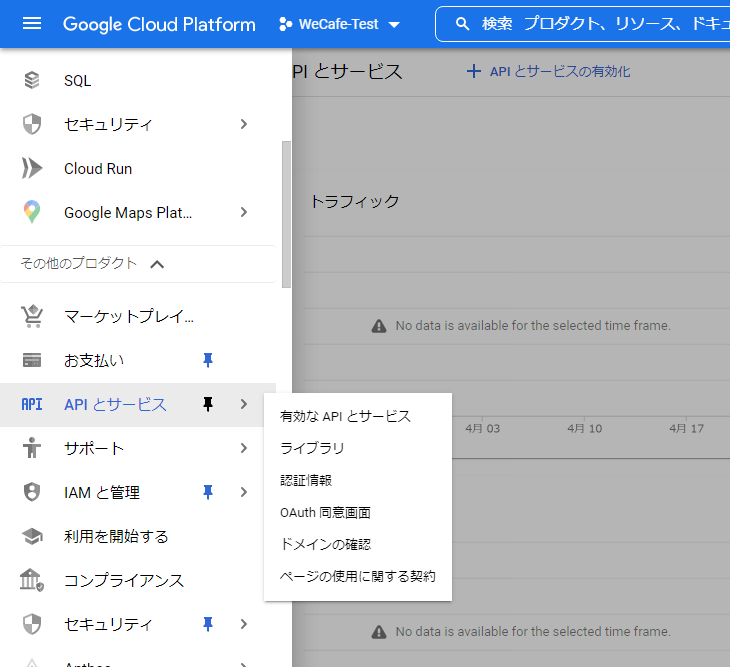
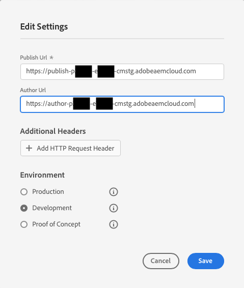

# デモサイトで AEM Screens を有効にする {#enable-screens}

デモサイトで AEM Screens as a Cloud Service の完全なエクスペリエンスを有効にする手順を説明します。

>[!NOTE]
>
>AEM Screens デモを Cloud Manager プログラムに追加するには、Screens アドオンが必要です。 追加方法について詳しくは、[Cloud Manager での新しいプログラムに対する Screens のアドオンとしての追加](/help/screens-cloud/onboarding-screens-cloud/add-on-new-program-screens-cloud.md)を参照してください。

## これまでの説明内容 {#story-so-far}

AEM 参照デモのアドオンジャーニーの前のドキュメントである[デモサイトの作成](create-site.md)では、参照デモのアドオンのテンプレートに基づいてデモサイトを作成しました。その結果、以下を習得しました。

* AEM オーサリング環境へのアクセス方法の理解。
* テンプレートに基づくサイトの作成方法の理解。
* サイト構造内を移動し、ページを編集する際の基本事項の理解。

独自のデモサイトを探索し、デモサイトの管理に役立つツールを理解できたので、デモサイトで AEM Screens as a Cloud Service の完全なエクスペリエンスを有効にすることができます。

## 目的 {#objective}

AEM 参照デモのアドオンには、コーヒーショップ業界の We.Cafe 用の AEM Screens コンテンツが含まれています。このドキュメントでは、AEM Screens のコンテキストで We.Cafe デモの設定を実行する方法を説明します。読み終えると、次のことができるようになります。

* AEM Screens の基本的な知識。
* We.Cafe デモコンテンツの理解。
* We.Cafe 用の AEM Screens の設定方法。
   * We.Cafe 用の Screens プロジェクトの作成方法。
   * Google シートおよび API を使用してシミュレーションした気象サービスの設定。
   * 「天気予報サービス」に基づいて動的に変化する Screens コンテンツのシミュレーション。
   * Screens Player のインストールと使用。

## Screens について {#understand-screens}

AEM Screens as a Cloud Service は、マーケターが動的なデジタルエクスペリエンスを大規模に作成および管理できるデジタルサイネージソリューションです。AEM Screens as a Cloud Service を使用すると、公共の場所で使用するための魅力的で動的なデジタルサイネージエクスペリエンスを作成できます。

>[!TIP]
>
>AEM Screens as a Cloud Service の詳細については、このドキュメントの最後にある、[その他のリソース](#additional-resources)の節を参照してください。

AEM 参照デモアドオンをインストールすると、デモオーサリング環境で AEM Screens の We.Cafe コンテンツを自動的に使用できるようになります。[デモ用 Screens プロジェクトのデプロイ](#deploy-project)に示す手順に従って、コンテンツを公開し、メディアプレーヤーなどにデプロイして、AEM Screens の完全なエクスペリエンスを有効にできます。

## デモコンテンツについて {#demo-content}

We.Cafe コーヒーショップは、米国の 3 か所に 3 店舗を構えています。3 つの店では 3 つの同じようなエクスペリエンスを提供しています。

* カウンター上に設置された、縦パネルが 2 つまたは 3 つのメニューボード
* 客を誘い込むために通りに面してエントランス設置された、横パネルまたは縦パネルが 1 つのディスプレイ
* 1 台の縦型タブレットで行列を回避するセルフオーダーのキオスクブース

>[!NOTE]
>
>現在のバージョンのデモでは、エントランスのディスプレイのみテストできます。その他のディスプレイは、今後のバージョンで対応予定です。
>
>キオスクは、現在のバージョンのデモには含まれていません。今後のバージョンに含まれる予定です。

ニューヨークの店舗は、スペースの少ない小さな店舗であると想定されるため、次のような設定になります。

* 縦パネルが 2 つのみのメニューボード。サンフランシスコとサンノゼでは縦パネルは 3 つ
* エントランスの表示は、横ではなく縦に配置

>[!NOTE]
>
>[Screens as a Cloud Service の接続](#connect-screens)の節で、Screens Cloud Service に接続することにした場合、ディスプレイの下に場所のフォルダーを作成してください。ディスプレイについて詳しくは、このドキュメントの最後にある[その他のリソース](#additional-resources)の節を参照してください。

### カフェレイアウト {#care-layouts}

We.Cafe の場所のレイアウトは次のとおりです。


>[!NOTE]
>
>画面の測定値はインチ単位です。

### エントランス {#entrance}

エントランスのディスプレイは日割りで、最初の画像を午前から午後に変更するだけです。また、シーケンスの各パスでは、特別なコーヒーの淹れ方を宣伝し、メーター制の埋め込みシーケンスを使って、毎回異なるアイテムを再生します。

エントランスチャネルの最後の画像も、外部温度に基づいてターゲティング（つまり動的に変更）されます。これは、[シミュレーションデータソースの作成](#data-source)の節で説明されているようにシミュレートできます。

## デモ用 Screens プロジェクトのデプロイ {#deploy-project}

[プログラムの作成](create-program.md)手順で作成したサンドボックスでデモコンテンツを使用するには、テンプレートを基にサイトを作成する必要があります。

We.Cafe デモサイトをまだ作成していない場合は、[デモサイトの作成](create-site.md)の節の同じ手順に従ってください。テンプレートを選択する場合は、**We.Cafe web サイトテンプレート**&#x200B;を選択します。


ウィザードが完了したら、Sites の下にコンテンツがデプロイされ、他のコンテンツと同様に移動して参照できます。


We.Cafe デモコンテンツが用意できたので、AEM Screens のテスト方法を選択します。

* AEM Sites コンソール内のコンテンツのみを参照する場合は、[その他のリソース](#additional-resources)の節で詳細を参照および確認します。
* AEM Screens のすべての動的機能を体験する場合は、次の節 [Screens コンテンツの動的な変更](#dynamically-change)に進みます。

## Screens コンテンツの動的な変更 {#dynamically-change}

AEM Sites と同様に、AEM Screens もコンテキストに基づいて動的にコンテンツを変更できます。We.Cafe デモでは、現在の気温に応じて異なるコンテンツを表示するようにチャネルが設定されています。このエクスペリエンスをシミュレートするには、独自のシンプルな天気予報サービスを作成する必要があります。

### シミュレーションデータソースの作成 {#data-source}

デモ中やテスト中に天候を変えるのは非常に難しいので、気温の変化をシュミレートする必要があります。天気予報サービスは、AEM ContextHub が呼び出して気温を取得する Google Sheets スプレッドシートに気温の値を格納することでシミュレートされます。

#### Google API キーの作成 {#create-api-key}

まず、データ交換を促す Google API キーを作成する必要があります。

1. Googleアカウントにログオンします。
1. このリンク `https://console.cloud.google.com`.を使用して Cloud Console を開きます。
1. プロジェクトを作成するには、ツールバーの左上、**Google Cloud Platform** ラベルの後にある現在のプロジェクト名をクリックします。

   

1. プロジェクトの選択ダイアログで、「**新しいプロジェクト**」をクリックします。

   

1. プロジェクトに名前を付け、「**作成**」をクリックします。

   

1. 新しいプロジェクトが選択されていることを確認し、Cloud Console のダッシュボードにあるハンバーガーメニューを使用して、「**API とサービス**」を選択します。

   

1. API とサービスウィンドウの左側のパネルで、ウィンドウ上部の「**資格情報**」をクリックし、「**資格情報を作成**」で「**API キー**」をクリックします。

   

1. ダイアログボックスの新しい API キーをコピーし、後で使用するために保存します。「**閉じる**」をクリックすると、ダイアログボックスを終了できます。

#### Google Sheets API の有効化 {#enable-sheets}

API キーを使用して Google Sheets のデータを交換できるようにするには、Google Sheets API を有効にする必要があります。

1. Google Cloud Console（`https://console.cloud.google.com`）のプロジェクトに戻り、ハンバーガーメニューを使用して、**API とサービス／ライブラリ**&#x200B;を選択します。

   

1. API ライブラリ画面で、スクロールして **Google Sheets API** を探します。

   

1. **Google Sheets API** ウィンドウで、「**有効にする**」をクリックします。

   

#### Google Sheets スプレッドシートの作成 {#create-spreadsheet}

これで、Google Sheets のスプレッドシートを作成して天気データを保存できます。

1. `https://docs.google.com` に移動して、新しい Google Sheets スプレッドシートを作成します。
1. 気温を定義するには、セル A2 に、`32` のように入力します。
1. ウインドウ右上の「**共有**」をクリックしてドキュメントを共有します。**リンクを取得**&#x200B;で、「**変更**」をクリックします。

   

1. 次の手順のために、リンクをコピーします。

   

1. シート ID を探します。

   * シート ID は、コピーしたシートリンクの `d/` の後、`/edit`.より前のランダムな文字列です。
   * 例：
      * URL が `https://docs.google.com/spreadsheets/d/1cNM7j1B52HgMdsjf8frCQrXpnypIb8NkJ98YcxqaEP30/edit#gid=0` の場合
      * シート ID は `1cNM7j1B52HgMdsjf8frCQrXpnypIb8NkJ98YcxqaEP30`.です。

1. 後で使用するためにシート ID をコピーします。

#### 気象サービスのテスト {#test-weather-service}

データソースを Google シートのスプレッドシートに作成し、API を介したアクセスを有効にしたので、テストして「気象サービス」にアクセスできることを確認します。

1. Web ブラウザーを開きます。

1. 次のリクエストを入力し、以前に保存したシート ID と API キーの値を置き換えます。

   ```
   https://sheets.googleapis.com/v4/spreadsheets/<yourSheetID>/values/Sheet1?key=<yourAPIKey>
   ```

1. 次のような JSON データを受け取った場合は、適切に設定されています。

   ```json
   {
     "range": "Sheet1!A1:Z1000",
     "majorDimension": "ROWS",
     "values": [
       [],
       [
         "32"
       ]
     ]
   }
   ```

AEM Screens も、これと同じサービスを使用して、次の手順で設定されるシミュレートされた気象データにアクセスできます。

### ContextHub の設定 {#configure-contexthub}

AEM Screens は、コンテキストに基づいて動的にコンテンツを変更できます。We.Cafe デモでは、AEM ContextHub を使用して、現在の気温に応じて異なるコンテンツを表示するチャネルが設定されています。

>[!TIP]
>
>ContextHub の詳細については、このドキュメントの最後にある、[その他のリソース](#additional-resources)の節を参照してください。

画面のコンテンツが表示されると、ContextHub は気象サービスを呼び出して現在の気温を調べ、表示するコンテンツを決定します。

デモ用に、シートの値を変更できます。ContextHub はこの事実を認識し、更新された温度に応じてチャネル内でコンテンツを調整します。

1. AEMaaCS オーサーインスタンスで、**グローバルナビゲーション／ツール／Sites／ContextHub** に移動します。
1. **We.Cafe web サイトテンプレート**&#x200B;から Screens プロジェクトを作成した際に付けた名前と同じ名前の設定コンテナを選択します。
1. **設定／ContextHub 設定／Google Sheets** を選択し、右上の「**次へ**」をクリックします。
1. 設定には、既に JSON データが設定されている必要があります。次の 2 つの値を変更する必要があります。
   1. `[your Google Sheets id]` と、[以前に保存した](#create-spreadsheet)シート ID を置き換えます。
   1. `[your Google API Key]` と、[以前に保存した](#create-api-key) API キーを置き換えます。
1. 「**保存**」をクリックします。

これで、Google Sheets スプレッドシートで気温の値を変更できるようになり、ContextHub は「天気の変化を確認」すると Screens を動的に更新します。

### 動的データのテスト {#test-dynamic}

AEM Screens と ContextHub が天気予報サービスに接続されたので、Screens がコンテンツを動的に更新する方法をテストして確認できます。

1. サンドボックスオーサーインスタンスにアクセスします。
1. **グローバルナビゲーション／Sites** からサイトコンソールに移動し、以下のページ **Screens／&lt;project-name>／チャネル／エントランス朝（縦）**&#x200B;を選択します。

   

1. ツールバーの「**編集**」をクリックするか、ショートカットキー `e` を入力すると、ページを編集できます。

1. エディターで、コンテンツを表示できます。1 つの画像が青色でハイライト表示され、隅にターゲティングアイコンが表示されます。

   

1. スプレッドシートに入力した気温を 32 から 70 に変更し、内容の変更を確認します。

   

凍えるような 32 °F（0 °C）から快適な 70 °F（21 °C）に変化したことにより、フィーチャー画像が温かい飲み物から涼しげなアイスコーヒーに変わりました。

>[!IMPORTANT]
>
>説明されている Google Sheets のソリューションは、デモ目的のみに使用してください。アドビでは、実稼動環境への Google Sheets の使用はサポートしていません。

## Screens as a Cloud Service に接続 {#connect-screens}

デジタルサイネージデバイスやコンピューターで動作する Player を含め、実際のデジタルサイネージエクスペリエンスも設定する場合は、次の手順に従います。

または、AEMaaCS のチャネルエディターで簡単にデモをプレビューできます。

>[!TIP]
>
>チャネルエディターの詳細については、このドキュメントの最後にある、[その他のリソース](#additional-resources)の節を参照してください。

### AEM Screens as a Cloud Service の設定 {#configure-screens}

まず、Screens デモコンテンツを AEM Screens as a Cloud Service に公開し、サービスを設定する必要があります。

1. デモスクリーンプロジェクトのコンテンツを公開します。
1. Screens as a Cloud Service `https://experience.adobe.com/screens` に移動し、ログインします。
1. 画面の右上に、自分の組織が表示されていることを確認します。

   

1. 左上隅付近にある、歯車のような形をした「**設定を編集**」アイコンをクリックします。

   

1. デモサイトを作成した AEMaaCS オーサーインスタンスとパブリッシュインスタンスの URL を指定し、「**保存**」をクリックします。

   

1. デモインスタンスに接続すると、Screens がチャネルコンテンツを取り込みます。左側のパネルで「**チャネル**」をクリックすると、公開済みのチャネルが表示されます。 情報が表示されるまでしばらく時間がかかる場合があります。画面右上の青い「**同期**」ボタンをクリックすると、情報を更新できます。

   

1. 左側のパネルの「**ディスプレイ**」をクリックします。まだデモ用に作成していません。We.Cafe の場所ごとにフォルダーを作成することで、その場所をシミュレートできます。画面右上の「**作成**」をクリックし、「**フォルダー**」を選択します。

   

1. ダイアログボックスで、**サンノゼ**&#x200B;などとフォルダー名を指定し、「**作成**」をクリックします。

1. フォルダーをクリックして開き、右上の「**作成**」をクリックし、「**ディスプレイ**」を選択します。

1. ディスプレイ名を入力し、「**作成**」をクリックします。

   

1. ディスプレイが作成されたら、ディスプレイの名前をクリックしてディスプレイの詳細画面を開きます。デモサイトから同期されたチャネルがディスプレイに割り当てられている必要があります。画面の右上にある「**チャネルを割り当て**」をクリックします。

   

1. ダイアログで、チャネルを選択し、「**割り当て**」をクリックします。

   

追加の場所とディスプレイに対して、これらの手順を繰り返します。完了したら、デモサイトを AEM Screens にリンクし、必要な設定を完了します。

AEMaaCS のチャネルエディターで簡単にデモをプレビューできます。

### Screens Player の使用 {#screens-player}

実際の画面に表示されるようにコンテンツを表示するには、Player をダウンロードして、ローカルに設定します。AEM Screens as a Cloud Service がコンテンツを Player に配信します

#### 登録コードの生成 {#registration-code}

まず、Player を AEM Screens as a Cloud Service に安全に接続するための登録コードを作成する必要があります。

1. Screens as a Cloud Service `https://experience.adobe.com/screens` に移動し、ログインします。
1. 画面の右上に、自分の組織が表示されていることを確認します。

   

1. 左側のパネルで、**プレーヤー管理／登録コード**&#x200B;をクリックし、次に、画面右上の「**コードを作成**」をクリックします。


1. コードの名前を入力し、「**作成**」をクリックします。

   

1. コードが作成されると、リストに表示されます。クリックして、コードをコピーします。

   

#### Player のインストールおよび設定 {#install-player}

1. お使いのプラットフォーム用の Player を `https://download.macromedia.com/screens/` からダウンロードしてインストールします。
1. Player を実行し、「**設定**」タブに切り替えます。
1. 下までスクロールし、「**ファクトリー設定にリセット**」および「**クラウドモードに変更**」オプションをクリックして両方を確定します。

   

1. プレーヤーは自動的に「**プレーヤー登録**」タブに移動します。以前に生成したコードを入力し、「**登録**」をクリックします。

   

1. 「**システム情報**」タブに移動し、Player が登録されたことを確認します。

   

#### Player のディスプレイへの割り当て {#assign-player}

1. Screens as a Cloud Service `https://experience.adobe.com/screens` に移動し、ログインします。
1. 画面の右上に、自分の組織が表示されていることを確認します。

   

1. 左側のパネルで、**プレーヤー管理／プレーヤー**&#x200B;をクリックすると、以前にインストールして登録したプレーヤーが表示されます。

   

1. プレーヤー名をクリックして、詳細を開きます。画面右上の「**ディスプレイを割り当て**」をクリックします。

   

1. ダイアログボックスで、以前に作成したディスプレイを選択し、「**選択**」をクリックします。

   

#### 再生 {#playback}

Player にディスプレイを割り当てると、AEM Screens as a Cloud Service はコンテンツを Player に配信し、コンテンツが表示されるようにします。


## 次のステップ {#what-is-next}

これで、AEM Reference Demo Add-On ジャーニーのこの手順が完了しました。この手順で学んだことは次のとおりです。

* AEM Screens の基本的な知識。
* We.Cafe デモコンテンツの理解。
* We.Cafe 用の AEM Screens の設定方法。

これで、独自のデモサイトを使用して AEM Screens の機能を試す準備が整いました。続いてジャーニーの次の節、[デモサイトの管理](manage.md)に進んで、デモサイトの管理に役立つツールと、デモサイトを削除する方法を学びます。

また、このジャーニーで説明した機能について詳しくは、[その他のリソース](#additional-resources)の節で紹介しているその他のリソースを参照してください。

## その他のリソース {#additional-resources}

* [ContextHub ドキュメント](/help/sites-cloud/authoring/personalization/contexthub.md) - ContextHub を使用して、天気に関係なく、ユーザーコンテキストに基づいてコンテンツをパーソナライズする方法を説明します。
* [API キーの使用 - Google ドキュメント](https://developers.google.com/maps/documentation/javascript/get-api-key) - Google の API キーの使用の詳細に関する便利なリファレンスです。
* [ディスプレイ](/help/screens-cloud/creating-content/creating-displays-screens-cloud.md) - AEM Screens でのディスプレイの詳細と機能について説明します。
* [Player をダウンロード](/help/screens-cloud/managing-players-registration/installing-screens-cloud-player.md) - Screens Player へのアクセス方法とインストール方法について説明します。
* [Player を登録](/help/screens-cloud/managing-players-registration/registering-players-screens-cloud.md) - Player を設定して AEM Screens プロジェクトに登録する方法を説明します。
* [ディスプレイへの Player の割り当て](/help/screens-cloud/managing-players-registration/assigning-player-display.md) - Player でコンテンツを表示するように設定します。
