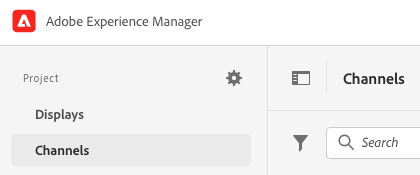
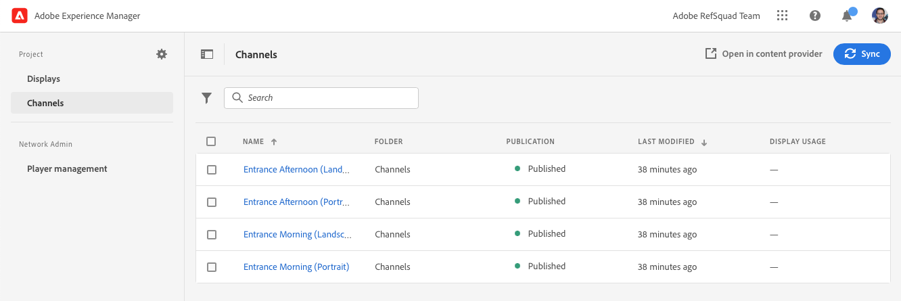

# デモサイトにAEM Screensを有効にする {#enable-screens}

デモサイトでAEM Screensのas a Cloud Service的なエクスペリエンスを完全に有効にする手順を説明します。

## これまでの説明内容 {#story-so-far}

前のドキュメントのAEM Reference Demos Add-On ジャーニーでは、 [デモサイトの作成、](create-site.md) 参照デモアドオンのテンプレートに基づいて新しいデモサイトを作成しました。 その結果、以下を達成できました。

* AEMオーサリング環境へのアクセス方法を説明します。
* テンプレートに基づくサイトの作成方法を理解する。
* サイト構造内を移動し、ページを編集する際の基本事項を理解します。

デモサイトを管理するのに役立つツールを参照および理解できる独自のデモサイトを用意したので、デモサイトでAEM Screensのas a Cloud Service的なエクスペリエンスをフルに活用できます。

## 目的 {#objective}

AEM Reference Demos Add-On には、コーヒーショップのビジネスバーティカルである We.Cafe のAEM Screensコンテンツが含まれています。 このドキュメントでは、AEM Screensのコンテキストで We.Cafe デモ設定を実行する方法を説明します。 ドキュメントを読めば、以下が可能です。

* AEM Screensの基本を知る。
* We.Cafe デモコンテンツを理解します。
* We.Cafe 用のAEM Screensの設定方法を説明します。
   * We.Cafe 用の Screens プロジェクトの作成方法を説明します。
   * Googleシートおよび API を使用して、シミュレートされた気象サービスを設定できる。
   * 「天気予報サービス」に基づいて、動的に変化する Screens コンテンツをシミュレートします。
   * Screens Player をインストールして使用します。

## Screens について {#understand-screens}

AEM Screens as a Cloud Service は、マーケターが動的なデジタルエクスペリエンスを大規模に作成および管理できるデジタルサイネージソリューションです。AEM Screens as a Cloud Service を使用すると、公共の場所で使用するための魅力的で動的なデジタルサイネージエクスペリエンスを作成できます。

>[!TIP]
>
>AEM Screensas a Cloud Serviceの詳細については、 [その他のリソース](#additional-resources) 」セクションを開きます。

AEM Reference Demos Add-On をインストールすると、デモオーサリング環境でAEM Screensの We.Cafe コンテンツを自動的に使用できるようになります。 以下に示す手順については、 [デモ用スクリーンプロジェクトのデプロイ](#deploy-project) では、コンテンツを公開し、メディアプレーヤーにデプロイするなどして、AEM Screensのフルエクスペリエンスを有効にすることができます。

## デモコンテンツについて {#demo-content}

We.Cafe コーヒーショップは、米国の 3 か所に 3 店舗を構成しています。 3 つの店はすべて、3 つの同じような経験を持っています。

* カウンターの上に 2 枚または 3 枚の縦パネルを持つメニューボード
* 店に来るお客を誘う横パネルまたは縦パネルが一つ並んで、通りに面したエントランスディスプレイ
* 1 つの縦型タブレットでキューをバイパスする、簡単な自己注文キオスクブース

>[!NOTE]
>
>現在のバージョンのデモでは、入り口のディスプレイのみテストできます。 その他のディスプレイは、将来のバージョンで使用されます。
>
>キオスクは、現在のバージョンのデモには含まれていません。 将来のバージョンに含まれる予定です。

New-York は、スペースの少ない小さな店舗であると想定され、次のようになります。

* メニューボードには、サンフランシスコとサンノゼの縦パネルが 3 つではなく、2 つの縦パネルのみが表示されます
* 入り口の表示は、水平ではなく垂直に配置されます

>[!NOTE]
>
>ScreensCloud Service( [Screens にas a Cloud Service](#connect-screens) 「 」セクションで、「 」の下にフォルダーとしてロケーションを作成してください。 詳しくは、 [その他のリソース](#additional-resources) の節を参照してください。

### カフェレイアウト {#care-layouts}

We.Cafe の場所のレイアウトは次のとおりです。


>[!NOTE]
>
>画面の測定値はインチ単位です。

### 入口 {#entrance}

入り口のディスプレイは日分割され、朝から午後に、最初の画像を変更するだけです。 また、各パスでは、別の特別なコーヒー製剤を宣伝し、有料埋め込みシーケンスを使用して、毎回異なるアイテムを再生します。

入り口チャネルの最後の画像も、外部温度に基づいてターゲット化（すなわち動的に変化）され、 [シミュレートされたデータソースを作成](#data-source) 」セクションに入力します。

## デモ用スクリーンプロジェクトのデプロイ {#deploy-project}

で作成したサンドボックスのデモコンテンツを使用するには、 [プログラムを作成](create-program.md) 手順：サイトは、テンプレートに基づいて作成する必要があります。

We.Cafe デモサイトをまだ作成していない場合は、 [デモサイトを作成](create-site.md) 」セクションに入力します。 テンプレートを選択する場合は、 **We.Cafe Web サイトテンプレート**.


ウィザードが完了したら、 Sites の下にコンテンツがデプロイされ、他のコンテンツと同様に移動して参照できます。


We.Cafe デモコンテンツが用意されたので、AEM Screensのテスト方法を選択できます。

* AEM Sitesコンソール内のコンテンツのみを参照したい場合は、次の場所で詳細を参照および確認します。 [その他のリソース](#additional-resources) セクション！ これ以上のアクションは必要ありません。
* AEM Screensのすべての動的機能を体験したい場合は、次の節に進みます。 [Screens コンテンツを動的に変更します。](#dynamically-change)

## Screens コンテンツの動的な変更 {#dynamically-change}

AEM Sitesと同様に、AEM Screensもコンテキストに基づいて動的にコンテンツを変更できます。 We.Cafe デモでは、現在の温度に応じて異なるコンテンツを表示するようにチャネルが設定されています。 これをシミュレートするには、独自のシンプルな気象サービスを作成する必要があります。

### シミュレートされたデータソースを作成 {#data-source}

デモ中やテスト中に天候を変えるのは非常に難しいので、温度の変化をシミュレートする必要があります。 AEM ContextHub が呼び出して温度を取得するGoogleシートのスプレッドシートに温度値を保存することで、気象サービスをシミュレートします。

#### Google API キーを作成 {#create-api-key}

まず、データ交換を容易にするGoogle API キーを作成する必要があります。

1. Googleアカウントにログインします。
1. このリンクを使用してクラウドコンソールを開きます。 `https://console.cloud.google.com`.
1. 新しいプロジェクトを作成するには、ツールバーの左上にある現在のプロジェクト名をクリックします。 **Google Cloud Platform** ラベル

   

1. プロジェクトセレクターダイアログで、 **新規プロジェクト**.

   

1. プロジェクトに名前を付け、「 **作成**.

   

1. 新しいプロジェクトが選択されていることを確認し、Cloud Console のダッシュボードにあるハンバーガーメニューを使用して、「 」を選択します。 **API とサービス**.

   

1. API とサービスウィンドウの左側のパネルで、 **資格情報** ウィンドウの上部で、「 **資格情報を作成** および **API キー**.

   

1. ダイアログで、新しい API キーをコピーし、後で使用するために保存します。 クリック **閉じる** をクリックしてダイアログを閉じます。

#### Google Sheets API の有効化 {#enable-sheets}

API キーを使用してGoogle Sheets のデータを交換できるようにするには、Google Sheets API を有効にする必要があります。

1. Google Cloud Console( ) に戻ります。 `https://console.cloud.google.com` プロジェクトの次にハンバーガーメニューを使用して **API とサービス —> ライブラリ**.

   

1. API ライブラリ画面で、スクロールしてを探します。 **Google Sheets API**. クリックします。

   

1. 内 **Google Sheets API** ウィンドウクリック **有効にする**.

   

#### Google Sheet スプレッドシートを作成 {#create-spreadsheet}

これで、Googleシートのスプレッドシートを作成して天気データを保存できます。

1. に移動します。 `https://docs.google.com` をクリックし、新しいGoogle Sheet スプレッドシートを作成します。
1. 温度を定義するには、次のように入力します。 `32` （セル A2 内）
1. 「 」をクリックしてドキュメントを共有します。 **共有** 窓の右上の下に **リンクを取得** クリック **変更**.

   

1. 次の手順のリンクをコピーします。

   

1. シート ID を探します。

   * シート ID は、シートリンクの後にコピーした文字のランダムな文字列です `d/` 以前 `/edit`.
   * 次に例を示します。
      * URL が `https://docs.google.com/spreadsheets/d/1cNM7j1B52HgMdsjf8frCQrXpnypIb8NkJ98YcxqaEP30/edit#gid=0`
      * シート ID はです。 `1cNM7j1B52HgMdsjf8frCQrXpnypIb8NkJ98YcxqaEP30`.

1. 後で使用するためにシート ID をコピーします。

#### ウェザーサービスのテスト {#test-weather-service}

これで、データソースをGoogleシートのスプレッドシートとして作成し、API を介したアクセスを有効にしたので、テストして「weather service」にアクセスできることを確認します。

1. Web ブラウザーを開きます。

1. 次のリクエストを入力し、以前に保存したシート ID と API キーの値を置き換えます。

   ```
   https://sheets.googleapis.com/v4/spreadsheets/<yourSheetID>/values/Sheet1?key=<yourAPIKey>
   ```

1. 次のような JSON データを受け取った場合は、適切に設定してください。

   ```json
   {
     "range": "Sheet1!A1:Z1000",
     "majorDimension": "ROWS",
     "values": [
       [],
       [
         "32"
       ]
     ]
   }
   ```

AEM Screensも同じサービスを使用して、シミュレートされた気象データにアクセスできます。 これは、次の手順で設定します。

### ContextHub の設定 {#configure-contexthub}

AEM Screensは、コンテキストに基づいて動的にコンテンツを変更できます。 We.Cafe デモでは、AEM ContextHub を利用して、現在の温度に応じて異なるコンテンツを表示するようにチャネルを設定しています。

>[!TIP]
>
>ContextHub について詳しくは、 [その他のリソース](#additional-resources) 」セクションを開きます。

画面のコンテンツが表示されると、ContextHub は気象サービスを呼び出して現在の温度を見つけ、表示するコンテンツを決定します。

デモ用に、シートの値を変更できます。 ContextHub はこれを認識し、コンテンツは更新された温度に応じてチャネル内で調整されます。

1. AEMaaCS オーサーインスタンスで、に移動します。 **グローバルナビゲーション/ツール/サイト/ ContextHub**.
1. Screens プロジェクトを **We.Cafe Web サイトテンプレート**.
1. 選択 **「設定」/「 ContextHub 設定」/「 Google Sheets 」** 次に、 **次へ** 右上
1. 設定には、既に JSON データが設定されている必要があります。 次の 2 つの値を変更する必要があります。
   1. 置換 `[your Google Sheets id]` とシート ID [以前に保存しました。](#create-spreadsheet)
   1. 置換 `[your Google API Key]` と API キー [以前に保存しました。](#create-api-key)
1. 「**保存**」をクリックします。

これで、Googleシートのスプレッドシートで温度値を変更でき、ContextHub は「天気の変化が見られる」と同時に Screens を動的に更新します。

### 動的データをテスト {#test-dynamic}

これで、AEM Screensと ContextHub が天気予報サービスに接続されたので、これをテストして、Screens でコンテンツを動的に更新する方法を確認できます。

1. サンドボックスオーサーインスタンスにアクセスします。
1. 経由でサイトコンソールに移動します。 **グローバルナビゲーション/サイト** 次のページを選択します。 **スクリーン —> &lt;project-name> -> チャネル —> 入口の朝（縦長）**.

   

1. ツールバーの「編集」をクリックするか、ショートカットキーを入力します `e` をクリックしてページを編集します。

1. エディターで、コンテンツを表示できます。 1 つの画像は青でハイライト表示され、隅にはターゲティングアイコンが表示されます。

   

1. スプレッドシートに入力した温度を 32 から 70 に変更し、内容の変更を確認します。

   

凍結 32 °F(0 °C) から快適な 70 °F(21 °C) に変化する温度に基づいて、お茶の温かみカップから冷たいアイスコーヒーに変化した特徴画像。

>[!IMPORTANT]
>
>デモ目的で、説明されているGoogleシートのソリューションのみを使用してください。 Adobeは、実稼動環境でのGoogleシートの使用をサポートしていません。

## Screens にas a Cloud Service {#connect-screens}

デジタルサイネージデバイスやコンピューターで動作するプレーヤーを含め、実際のデジタルサイネージエクスペリエンスも設定する場合は、次の手順に従います。

または、AEMaaCS のチャネルエディターで簡単にデモをプレビューできます。

>[!TIP]
>
>チャネルエディターの詳細については、 [その他のリソース](#additional-resources) 」セクションを開きます。

### AEM Screensas a Cloud Serviceの設定 {#configure-screens}

まず、Screens デモコンテンツをAEM Screensas a Cloud Serviceに公開し、サービスを設定する必要があります。

1. デモスクリーンプロジェクトのコンテンツを公開します。
1. 次の場所にある Screens as a Cloud Serviceに移動します。 `https://experience.adobe.com/screens` をクリックし、ログインします。
1. 画面の右上で、自分が正しい組織に属していることを確認します。

   

1. 左上で、 **設定を編集** 歯車のような形をしたアイコン。

   

1. デモサイトを作成した AEMaaCS オーサーインスタンスとパブリッシュインスタンスの URL を指定し、「 **保存**.

   

1. デモインスタンスに接続すると、Screens がチャネルコンテンツを取り込みます。 クリック **チャネル** 左側のパネルで、公開済みのチャネルを確認します。 情報が入力されるまでしばらく時間がかかる場合があります。 青色をクリックできます **同期** ボタンをクリックして、情報を更新します。

   

1. クリック **表示** をクリックします。 まだデモ用にを作成していません。 We.Cafe の場所を、それぞれのフォルダを作成してシミュレートします。 クリック **作成** 画面の右上にある「 」をクリックし、 **フォルダー**.

   

1. ダイアログで、次のようなフォルダー名を指定します。 **サンノゼ** をクリックし、 **作成**.

1. フォルダーをクリックして開き、「 **作成** 右上にあるを選択し、 **表示**.

1. 表示名を入力し、 **作成**.

   

1. チャネルを作成したら、そのチャネルをクリックして詳細を表示します。 デモサイトから同期されたチャネルがディスプレイに割り当てられている必要があります。 クリック **チャネルを割り当て** をクリックします。

   

1. ダイアログで、チャネルを選択し、 **割り当て**.

   

追加のロケーションとディスプレイに対して、これらの手順を繰り返すことができます。 完了したら、デモサイトをAEM Screensにリンクし、必要な設定を完了します。

AEMaaCS のチャネルエディターで簡単にデモをプレビューできます。

### Screens Player の使用 {#screens-player}

実際の画面に表示されるようにコンテンツを表示するには、プレーヤーをダウンロードして、ローカルに設定できます。 AEM Screens as a Cloud Serviceがコンテンツをプレーヤーに配信します

#### 登録コードの生成 {#registration-code}

まず、プレーヤーをAEM Screens as a Cloud Serviceに安全に接続するための登録コードを作成する必要があります。

1. 次の場所にある Screens as a Cloud Serviceに移動します。 `https://experience.adobe.com/screens` をクリックし、ログインします。
1. 画面の右上で、自分が正しい組織に属していることを確認します。

   

1. 左側のパネルで、 **プレーヤー管理/登録コード** 次に、 **コードの作成** をクリックします。


1. コード名を入力し、 **作成**.

   

1. コードが作成されると、リストに表示されます。 「 」をクリックして、コードをコピーします。

   

#### プレーヤーのインストールと設定 {#install-player}

1. 使用するプラットフォーム用のプレーヤーのダウンロード先 `https://download.macromedia.com/screens/` をクリックし、インストールします。
1. プレーヤーを実行し、 **設定** タブ、下までスクロールしてクリックし、両方を確定します。 **工場出荷時にリセット** その後 **クラウドモードに変更**.

   

1. プレーヤーは自動的に **プレーヤーの登録** タブをクリックします。 以前に生成したコードを入力し、 **登録**.

   

1. 次に切り替え： **システム情報** タブをクリックして、プレーヤーが登録されたことを確認します。

   

#### プレーヤーをディスプレイに割り当てる {#assign-player}

1. 次の場所にある Screens as a Cloud Serviceに移動します。 `https://experience.adobe.com/screens` をクリックし、ログインします。
1. 画面の右上で、自分が正しい組織に属していることを確認します。

   

1. 左側のパネルで、 **プレーヤー管理/プレーヤー** そして、以前にインストールして登録したプレーヤーが表示されます。

   

1. プレーヤー名をクリックして詳細を開き、「 」をクリックします。 **表示に割り当て** をクリックします。

   

1. ダイアログで、以前に作成した表示を選択し、 **選択**.

   

#### 再生! {#playback}

プレーヤーにディスプレイを割り当てると、AEM Screensas a Cloud Serviceはコンテンツをプレーヤーに配信し、そこにコンテンツが表示されるようにします。


## 次のステップ {#what-is-next}

これで、AEM Reference Demo Add-On ジャーニーのこの部分が完了し、以下をおこなう必要があります。

* AEM Screensの基本を知る。
* We.Cafe デモコンテンツを理解します。
* We.Cafe 用のAEM Screensの設定方法を説明します。

これで、独自のデモサイトを使用してAEM Screensの機能を探索する準備が整いました。 ジャーニーの次の節に進みます。 [デモサイトの管理、](manage.md) ここでは、デモサイトの管理と削除方法に役立つツールについて説明します。

また、 [「その他のリソース」セクション](#additional-resources) このジャーニーで確認した機能の詳細を確認するには、以下を参照してください。

## その他のリソース {#additional-resources}

* [ContextHub ドキュメント](/help/sites-cloud/authoring/personalization/contexthub.md) - ContextHub を使用して、天候の状況に関係なく、ユーザーコンテキストに基づいてコンテンツをパーソナライズする方法を説明します。
* [API キーの使用 — Google Documentation](https://developers.google.com/maps/documentation/javascript/get-api-key) - Googleの API キーの使用の詳細に関する便利なリファレンスです。
* [表示](/help/screens-cloud/creating-content/creating-displays-screens-cloud.md) - AEM Screensでのディスプレイの詳細と機能について説明します。
* [プレーヤーをダウンロード](/help/screens-cloud/managing-players-registration/installing-screens-cloud-player.md) - Screens Player へのアクセス方法とインストール方法について説明します。
* [プレーヤーを登録](/help/screens-cloud/managing-players-registration/registering-players-screens-cloud.md)  — プレーヤーを設定してAEM Screensプロジェクトに登録する方法を説明します。
* [ディスプレイへのプレーヤーの割り当て](/help/screens-cloud/managing-players-registration/assigning-player-display.md)  — プレーヤーでコンテンツを表示するように設定します。
