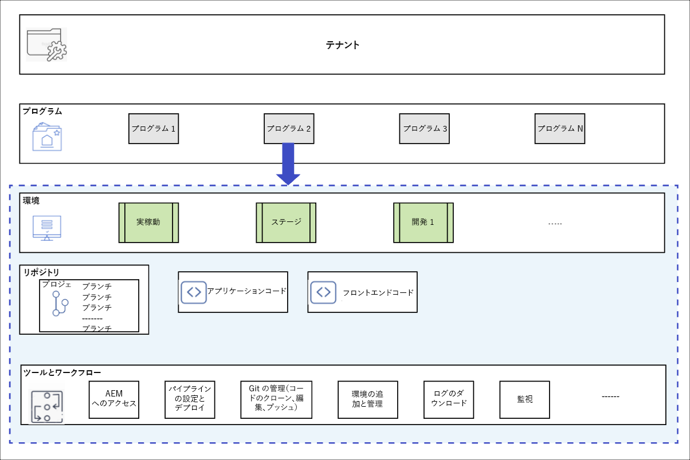
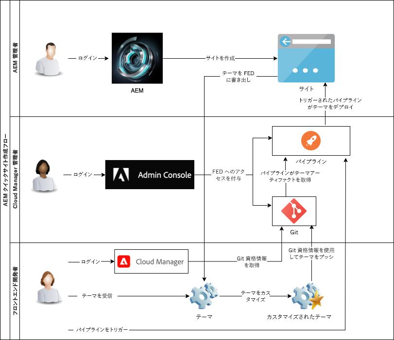

# Cloud Manager とクイックサイト作成ワークフローについて {#understand-cloud-manager}

{{traditional-aem}}

Cloud Manager と、新しいクイックサイト作成プロセスとの結び付けを説明します。

>[!TIP]
>
>自分の役割がフロントエンド開発のみである場合は、このジャーニーの記事 [Git リポジトリのアクセス情報の取得](retrieve-access.md) にスキップできます。
>
>AEM 管理者（Cloud Manager 管理者）が、フロントエンド開発と管理者の両方のタスクを担当している場合、または AEM のフロントエンド開発のエンドツーエンドプロセスを理解したい場合は、現在のドキュメントを引き続き読み、このジャーニーを続行します。

## 目的 {#objective}

このドキュメントは、AEM クイックサイト作成ツールの仕組みを理解するのに役立ち、エンドツーエンドのフローの概要を示しています。読み終えると、次のことができるようになります。

* AEM Sites と Cloud Manager が連携してフロントエンド開発を容易にする仕組みを理解する。
* フロントエンドのカスタマイズ手順が AEM から完全に切り離されており、AEM に関する知識を必要としない仕組みを確認する。

このドキュメントでは、設定を開始するジャーニーの次のステップに進む前に、クイックサイト作成ソリューションのこれらの基本的な要素を理解することに焦点を当てています。

このジャーニーを順を追って進めることをお勧めしますが、既に AEM Sites と Cloud Manager が連携することを理解していて、設定を直接開始する場合は、[ジャーニーの次のステップにスキップ](create-site.md)できます。

## 担当する役割 {#responsible-role}

このジャーニーの部分は、AEM 管理者と Cloud Manager 管理者の両方に適用されます。

## 要件と前提条件 {#requirements-prerequisites}

クイックサイト作成ツールを使用してサイトの作成とカスタマイズを開始する前に、いくつかの要件があります。

このジャーニーは、フロントエンド開発者、管理者、およびすべての役割の組み合わせを対象としているので、すべての役割の要件を以下に示します。

フロントエンド開発者は、AEM へのアクセスや知識が必要ないことを理解することが重要です。

### 知識 {#knowledge}

| 知識 | 役割 |
|---|---|
| フロントエンド開発の標準ツールとプロセスについて | フロントエンド開発者 |
| AEM でサイトを作成および管理する方法に関する基本的な知識 | AEM 管理者 |
| Cloud Manager の基本知識 | Cloud Manager 管理者 |

フロントエンド開発者にとって、AEM に関する知識は必要ありません。

### ツール {#tools}

| ツール | 役割 |
|---|---|
| 優先フロントエンド開発環境 | フロントエンド開発者 |
| npm | フロントエンド開発者 |
| webpack | フロントエンド開発者 |
| Cloud Manager へのアクセス | Cloud Manager 管理者 |
| Cloud Manager での **ビジネスオーナー** の役割のメンバーになる | Cloud Manager 管理者 |
| Cloud Manager でのシステム管理者になる | Cloud Manager 管理者 |
| Admin Console へのアクセス | Cloud Manager 管理者 |
| Cloud Manager での **デプロイメントマネージャー** の役割のメンバーになる | Cloud Manager 管理者 |
| Cloud Manager での **デプロイメントマネージャー** の役割のメンバーになる | フロントエンド開発者 |

フロントエンド開発者は、AEM を使用する必要はありません。

>[!TIP]
>
>Cloud Manager の役割と役割の管理に詳しくない場合は、[その他のリソース](#additional-resources)の節の役割に基づく権限のドキュメントを参照してください。

## Cloud Manager {#cloud-manager}

Cloud Manager は、AEM as a Cloud Service の必須コンポーネントであり、プラットフォームへの単一のエントリポイントとして機能します。

エンタープライズ開発の設定を行うお客様をサポートするために、AEM as a Cloud Service は Cloud Manager およびその専用 CI/CD パイプラインと完全に統合されています。クイックサイト作成ツールは、専用のフロントエンド開発パイプラインをサポートするために、これらの機能を拡張します。

このジャーニーのために、Cloud Manager を完全に理解する必要ありません。大まかに言えば、Cloud Manager は、複数のレベルの構造で構成されています。

* **テナント** - すべての顧客にテナントがプロビジョニングされます。
* **プログラム** - 各テナントには 1 つ以上のプログラムがあります。これらは、多くの場合、顧客がライセンスを取得したソリューションを反映しています。
* **環境** - 各プログラムには複数の環境があります。ライブコンテンツ用の実稼働環境、ステージングの環境、開発目的の環境などです。
* **リポジトリ** - 環境には Git リポジトリがあり、アプリケーションとフロントエンドコードが維持されています。
* **ツールとワークフロー** - パイプラインは、リポジトリから環境へのコードのデプロイメントを管理します。

多くの場合、この階層を具体的に説明するうえで例が役に立ちます。

* WKND Travel and Adventure Enterprises は、旅行関連のメディアに重点を置いた&#x200B;**テナント**&#x200B;とします。
* WKND Travel and Adventure Enterprises テナントには、2 つの **プログラム**&#x200B;があるとします。WKND Magazine 用の 1 つの Sites プログラムと WKND Media 用の 1 つの Assets プログラムです。
* WKND Magazine プログラムにも WKND Media プログラムにも、開発、ステージング、実稼動の各&#x200B;**環境**&#x200B;があります。

## クイックサイト作成フロントエンド開発フロー {#flow}

まだ Cloud Manager に関する豊富な経験がなくても、全体的なフローはシンプルで直感的です。

1. AEM 管理者は AEM 環境にサインインし、サイトテンプレートを使用して新しいサイトを作成します。
1. Cloud Manager 管理者が、Cloud Manager でフロントエンドパイプラインを作成します。パイプラインは、Git リポジトリから AEM 環境へのコードのデプロイメントを調整します。
1. AEM 管理者は、プログラムの AEM インスタンスからサイトテーマを書き出し、フロントエンド開発者に提供します。
1. Cloud Manager 管理者は、フロントエンド開発者に、カスタマイズをコミットできる AEM Git リポジトリへのアクセス権を付与します。
1. フロントエンド開発者は、Git およびパイプラインにアクセスするためのアクセス資格情報を取得します。
1. フロントエンド開発者は、テーマをカスタマイズし、プロキシを使用してサイトの実際のコンテンツを使用したテストを行い、その変更を Git リポジトリにコミットします。
1. フロントエンド開発者は、パイプラインを実行して、テーマのカスタマイズをプログラムの実稼動環境にデプロイします。

クイックサイト作成ツールを使用する主な利点は、純粋なフロントエンド開発者が実際のカスタマイズのみを担当することです。フロントエンド開発者は、AEM とのやり取りがなく、AEM の知識は必要ありません。

{{add-cm-allowlist-frontend-pipeline}}

## 次のステップ {#what-is-next}

これで、AEM クイックサイト作成ジャーニーのこのステップが完了しました。次のことを行う必要があります。

* AEM Sites と Cloud Manager が連携してフロントエンド開発を容易にする仕組みを理解する。
* フロントエンドのカスタマイズ手順が AEM から完全に切り離されており、AEM に関する知識を必要としない仕組みを確認する。

この知識を踏まえて、AEM クイックサイト作成ジャーニーを続けます。次は、テンプレートを使用して新規 AEM サイトをすばやく作成する方法を学ぶ、[テンプレートからサイトを作成する](create-site.md)のドキュメントを確認します。

## その他のリソース {#additional-resources}

[テンプレートからのサイトの作成](create-site.md)のドキュメントを確認して、クイックサイト作成ジャーニーの次のステップに進むことをお勧めします。以下のリソースではこのドキュメントで取り上げた概念についてさらに詳しく説明しています。なお、これらは追加のオプションリソースであり、ジャーニーを続けるうえで必須ではありません。

* [Cloud Manager のドキュメント](https://experienceleague.adobe.com/docs/experience-manager-cloud-service/onboarding/onboarding-concepts/cloud-manager-introduction.html?lang=ja) - Cloud Manager の機能について詳しくは、詳細な技術ドキュメントを直接参照してください。
* [役割に基づく権限](https://experienceleague.adobe.com/docs/experience-manager-cloud-manager/using/requirements/role-based-permissions.html?lang=ja) - Cloud Manager には、適切な権限を持つ役割が事前に設定されています。これらの役割の詳細と管理方法については、このドキュメントを参照してください。
* [npm](https://www.npmjs.com) - サイトをすばやく作成するために使用される AEM テーマが npm に基づいている場合。
* [webpack](https://webpack.js.org) - サイトをすばやく作成するために使用される AEM テーマが webpack に基づいている場合。
