# テンプレートからサイトを作成 {#create-site-from-template}

{{traditional-aem}}

サイトテンプレートを使用して新しい AEM サイトをすばやく作成する方法を説明します。

## これまでの説明内容 {#story-so-far}

AEM クイックサイト作成ジャーニーの前のドキュメントである [Cloud Manager とクイックサイト作成ワークフローについて](cloud-manager.md)では、Cloud Manager と、Cloud Manager が新しいクイックサイト作成プロセスをどのように結び付けるかについて説明しました。ここで、次のことを行う必要があります。

* AEM Sites と Cloud Manager が連携してフロントエンド開発を容易にする仕組みを理解する。
* フロントエンドのカスタマイズ手順が AEM から完全に切り離されており、AEM に関する知識を必要としない仕組みを確認する。

この記事はこうした基礎に基づいて作成されているため、最初の設定手順を実行してテンプレートからサイトを作成し、後でフロントエンドツールを使用してカスタマイズできます。

## 目的 {#objective}

この記事は、サイトテンプレートを使用して AEM サイトをすばやく作成する方法を理解するのに役立ちます。読み終えると、次のことができるようになります。

* AEM Site テンプレートの取得方法を理解する。
* テンプレートを使用して新しいサイトを作成する方法を学ぶ。
* 新しいサイトからテンプレートをダウンロードして、フロントエンド開発者に提供する方法を確認する。

## 担当する役割 {#responsible-role}

このジャーニーの部分は、AEM 管理者に適用されます。

## サイトテンプレート {#site-templates}

サイトテンプレートを使用すると、基本的なサイトコンテンツを組み合わせて、便利で再利用可能なパッケージを作成できます。サイトテンプレートには通常、新しいサイトをすばやく開始するために、ベースとなるサイトのコンテンツと構造、それとサイトのスタイル設定情報が含まれています。実際の構造は次のとおりです。

* `files`：UI キット、XD ファイル、およびその他のファイルを含むフォルダー
* `previews`：サイトテンプレートのスクリーンショットを含むフォルダー
* `site`：ページテンプレートやページなど、このテンプレートから作成したサイトごとにコピーされるコンテンツパッケージ。
* `theme`：CSS や JavaScript など、サイトの外観を変更するためのテンプレートテーマのソース。

テンプレートは、コンテンツ作成者が再利用してサイトをすばやく作成できるため非常に便利です。また、AEM のインストールで複数のテンプレートを使用できるので、様々なビジネスニーズに柔軟に対応できます。

>[!NOTE]
>
>サイトテンプレートをページテンプレートと混同しないでください。ここで説明するサイトテンプレートは、サイトの全体的な構造を定義します。ページテンプレートは、個々のページの構造と初期コンテンツを定義します。

## サイトテンプレートの取得 {#obtaining-template}

最も簡単に使い始める方法は、[AEM 標準サイトテンプレートの最新リリースを GitHub リポジトリからダウンロード](https://github.com/adobe/aem-site-template-standard/releases)することです。

ダウンロードが完了したら、他のパッケージと同様に AEM 環境にアップロードできます。このトピックに関する詳細情報が必要な場合は、 [その他のリソース](#additional-resources) を参照し、パッケージの操作方法を確認してください。

>[!TIP]
>
>AEM 標準サイトテンプレートは、プロジェクトのニーズに合わせてカスタマイズできるため、さらにカスタマイズする必要がなくなります。ただし、このトピックはこのジャーニーの範囲外です。詳しくは、標準サイトテンプレートの GitHub ドキュメントを参照してください。

>[!TIP]
>
>また、プロジェクトワークフローの一部として、ソースからテンプレートを作成するように選択することもできます。ただし、このトピックはこのジャーニーの範囲外です。詳しくは、標準サイトテンプレートの GitHub ドキュメントを参照してください。

## サイトテンプレートのインストール {#installing-template}

テンプレートを使用すると、簡単にサイトを作成できます。

1. AEM オーサリング環境にサインインし、サイトコンソールに移動します

   * `https://<your-author-environment>.adobeaemcloud.com/sites.html/content`

1. 画面の右上にある「**作成**」を選択し、ドロップダウンメニューから「**テンプレートのサイト**」を選択します。

   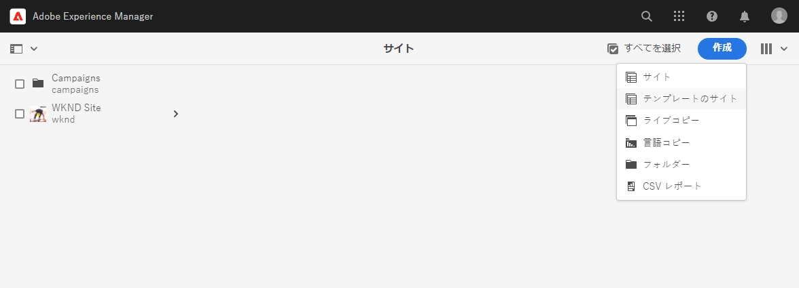

1. サイトの作成ウィザードで、左側の列の上部にある「**読み込み**」を選択します。

   

1. ファイルブラウザーで[以前ダウンロードした](#obtaining-template)テンプレートを見つけて、「**アップロード**」を選択します。

1. アップロードが完了すると、使用可能なテンプレートのリストに表示されます。テンプレートを選択して（右側の列にテンプレートに関する情報が表示されます）、「**次へ**」を選択します。

   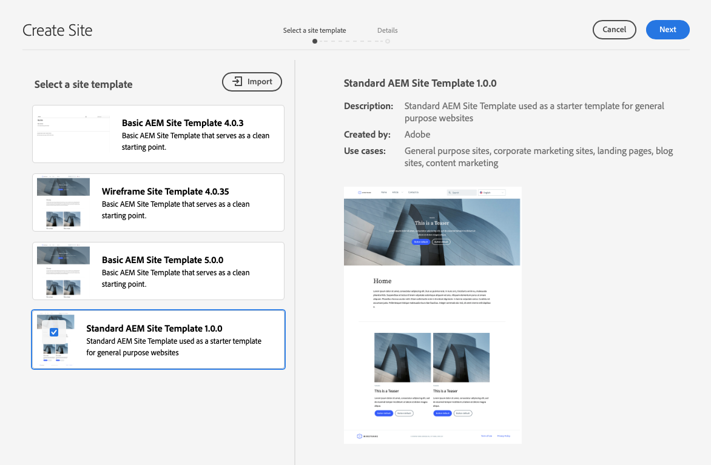

1. サイトのタイトルを指定します。サイト名を指定できます。省略した場合はタイトルからサイト名が生成されます。

   * サイトのタイトルは、ブラウザーのタイトルバーに表示されます。
   * サイト名が URL の一部になります。

1. 「**作成**」を選択すると、サイトテンプレートから新しいサイトが作成されます。

   

1. 表示される確認ダイアログで、「**完了**」を選択します。

   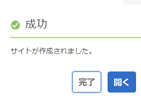

1. サイトコンソールでは、新しいサイトが表示され、テンプレートで定義されている基本構造を参照するために移動できます。

   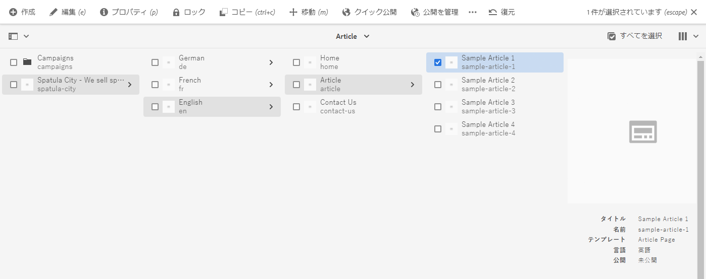

コンテンツ作成者はオーサリングを開始できるようになりました。

## さらにカスタマイズが必要な場合 {#customization-required}

サイトテンプレートは非常に強力で柔軟性が高く、プロジェクト用に任意の数を作成できるので、サイトのバリエーションを簡単に作成できます。 使用するサイトテンプレートで既に実行されているカスタマイズのレベルによっては、追加のフロントエンドカスタマイズが必要ない場合もあります。

* サイトで追加のカスタマイズが必要ない場合は、ここで完了です。ジャーニーはここで終了です。
* さらにフロントエンドのカスタマイズが必要な場合や、将来のカスタマイズが必要な場合に備えて完全なプロセスを理解したい場合は、この先を読み続けてください。

## サンプルページ {#example-page}

フロントエンドのカスタマイズを追加する必要がある場合は、フロントエンド開発者がコンテンツの詳細に慣れていない可能性があることに注意してください。したがって、テーマをカスタマイズする際に参照の基礎として使用できる、典型的なコンテンツへのパスを開発者に提供することをお勧めします。典型的な例としては、サイトのマスター言語のホームページが挙げられます。

1. サイトのブラウザーでメイン言語のホームページに移動し、ページを選択してメニューバーの「**編集**」を選択します。

   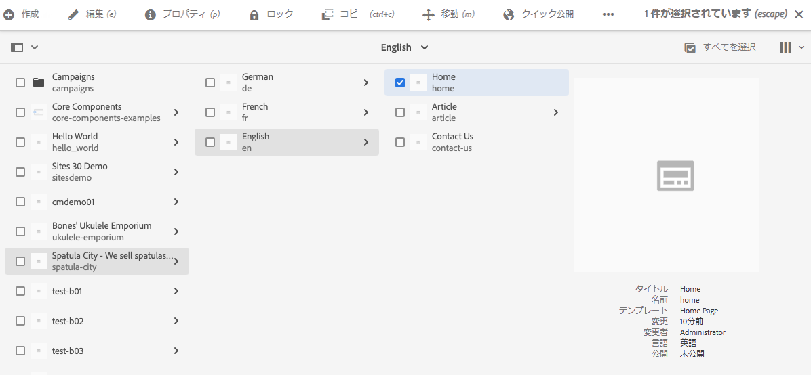

1. エディターで、ツールバーの「**ページ情報**」ボタンを選択してから、「**公開済みとして表示**」を選択します。

   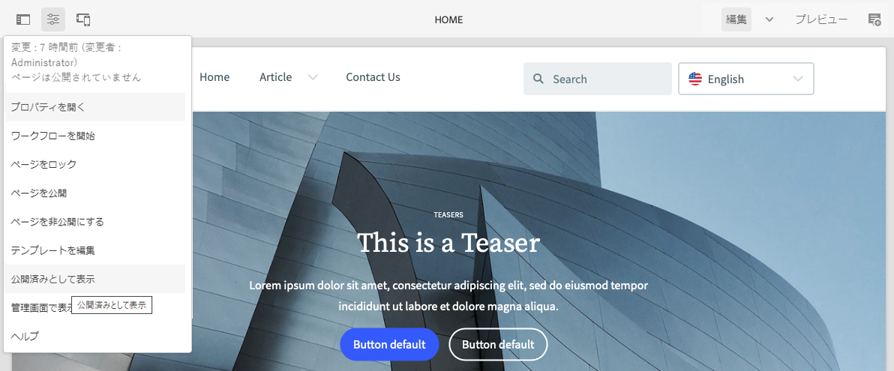

1. 開いたタブで、アドレスバーからコンテンツのパスをコピーします。次のようなパスになります。`/content/<your-site>/en/home.html?wcmmode=disabled`

   

1. パスを保存して、後でフロントエンド開発者に提供します。

## テーマのダウンロード {#download-theme}

サイトが作成されたので、テンプレートによって生成されたサイトのテーマをダウンロードし、フロントエンド開発者に提供して、カスタマイズを行うことができます。

1. サイトコンソールで、 **サイト** パネルを表示します。

   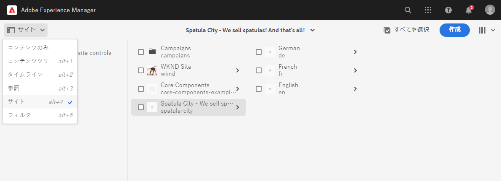

1. 新しいサイトのルートを選択し、サイトのパネルで「**テーマソースをダウンロード**」を選択します。

   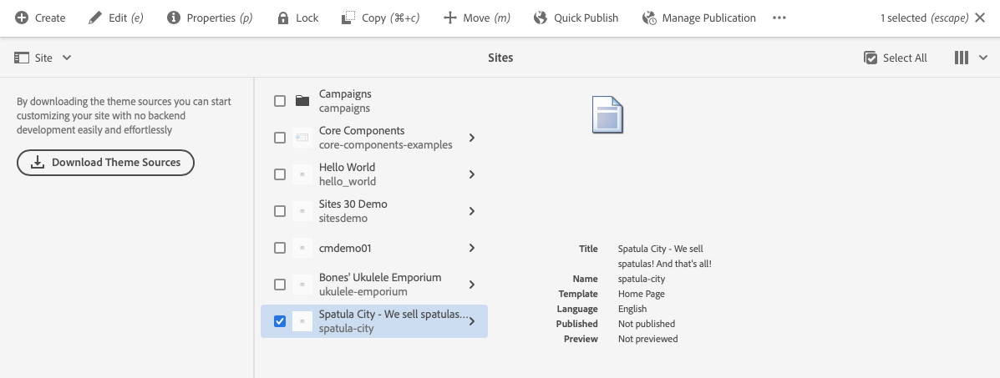

これで、ダウンロードファイルにテーマソースファイルのコピーが作成されました。

## プロキシユーザーの設定 {#proxy-user}

フロントエンド開発者がサイトの実際の AEM コンテンツを使用してカスタマイズをプレビューできるようにするには、プロキシユーザーを設定する必要があります。

1. AEM のメインナビゲーションから、**ツール**／**セキュリティ**／**ユーザー**&#x200B;に移動します。
1. ユーザー管理コンソールで「**作成**」を選択します。

   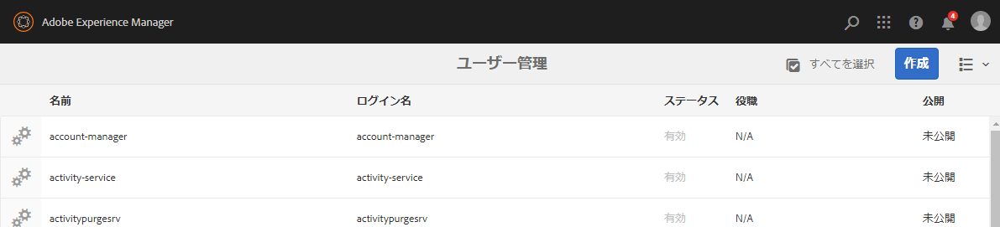
1. **新しいユーザーを作成** ウィンドウで、少なくとも次の情報を指定します。
   * **ID** - この値は、フロントエンド開発者に提供する必要があるので、メモしておきます。
   * **パスワード** - この値は、フロントエンド開発者に提供する必要があるので、パスワードコンテナに安全に保存します。

   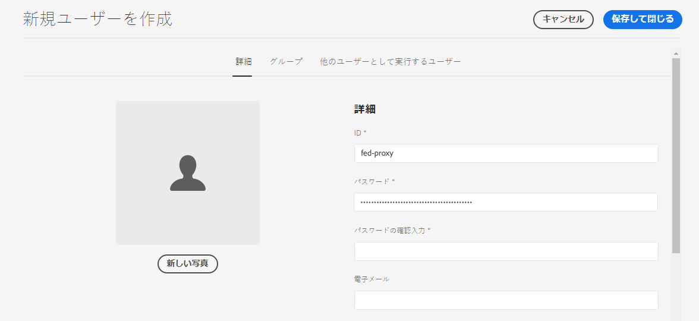

1. 「**グループ**」タブで、プロキシユーザーを `contributors` グループに追加します。
   * `contributors` という用語を入力すると、AEM のオートコンプリート機能がトリガーされ、グループを簡単に選択できます。

   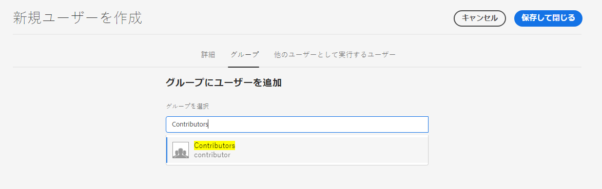

1. 「**保存して閉じる**」を選択します。

これで設定が完了しました。 コンテンツ作成者は、サイト準備開始のコンテンツ作成に取りかかれるようになり、ジャーニーの次のステップでフロントエンドのカスタマイズができるようになります。

## 次のステップ {#what-is-next}

これで、AEM クイックサイト作成ジャーニーのこのステップが完了しました。次のことを行う必要があります。

* AEM Site テンプレートの取得方法を理解する。
* テンプレートを使用して新しいサイトを作成する方法を学ぶ。
* 新しいサイトからテンプレートをダウンロードして、フロントエンド開発者に提供する方法を確認する。

この知識に基づいて、次は[パイプラインの設定](pipeline-setup.md)のドキュメントを確認して、AEM クイックサイト作成ジャーニーを続行します。そこでは、サイトテーマのカスタマイズを管理するフロントエンドパイプラインを作成します。

## その他のリソース {#additional-resources}

[パイプラインの設定](pipeline-setup.md)のドキュメントを確認して、クイックサイト作成ジャーニーの次のパートに進むことをお勧めします。次は追加的なオプションのリソースで、このドキュメントで取り上げた概念についてより詳しく説明していますが、ジャーニーを続ける上で必須ではありません。

* [AEM 標準サイトテンプレート](https://github.com/adobe/aem-site-template-standard) - これは AEM 標準サイトのテンプレートの GitHub リポジトリです。
* [ページの整理](/help/sites-cloud/authoring/sites-console/organizing-pages.md) - このガイドでは、AEM サイトのページを整理する方法について詳しく説明します。
* [ページの作成](/help/sites-cloud/authoring/sites-console/creating-pages.md) - このガイドでは、サイトに新しいページを追加する方法について詳しく説明します。
* [ページの管理](/help/sites-cloud/authoring/sites-console/managing-pages.md) - このガイドでは、移動、コピー、削除など、サイトのページを管理する方法について詳しく説明します。
* [パッケージの操作方法](/help/implementing/developing/tools/package-manager.md) - パッケージを使用すると、リポジトリコンテンツの読み込みと書き出しが可能になります。このドキュメントでは、AEM 6.5 でのパッケージの操作方法を説明します（AEMaaCS にも適用）。
* [サイト管理ドキュメント](/help/sites-cloud/administering/site-creation/create-site.md) - クイックサイト作成ツールの機能について詳しくは、サイト作成に関する技術ドキュメントを参照してください。
* [AEM Sites ページへのフォームの作成または追加](/help/forms/create-or-add-an-adaptive-form-to-aem-sites-page.md) - フォームを web サイトに統合し、デジタルエクスペリエンスを最適化して最大限の効果を得るための手順とベストプラクティスについて説明します。
