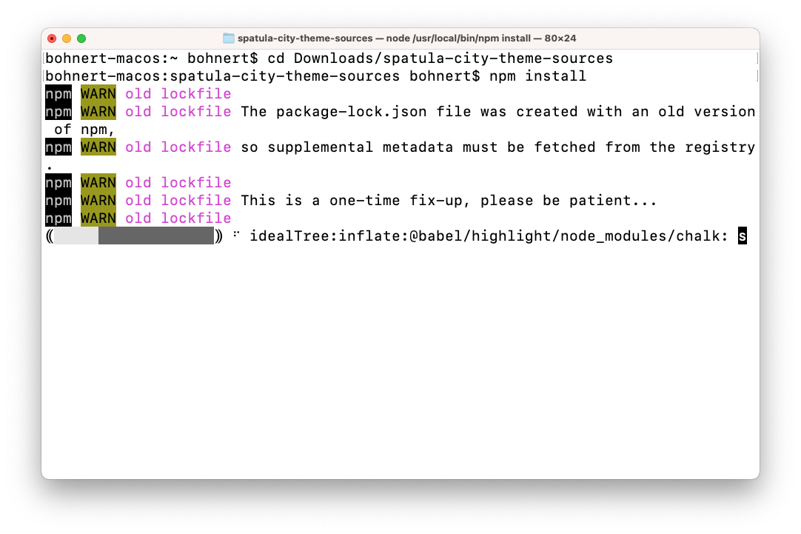
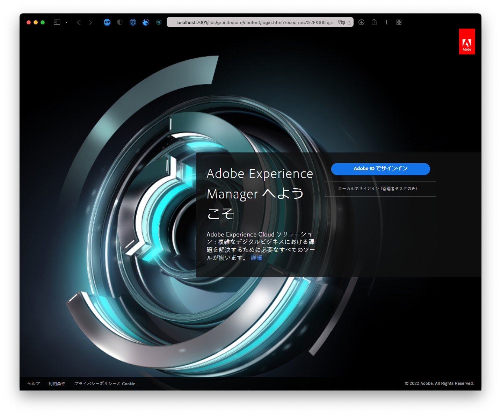
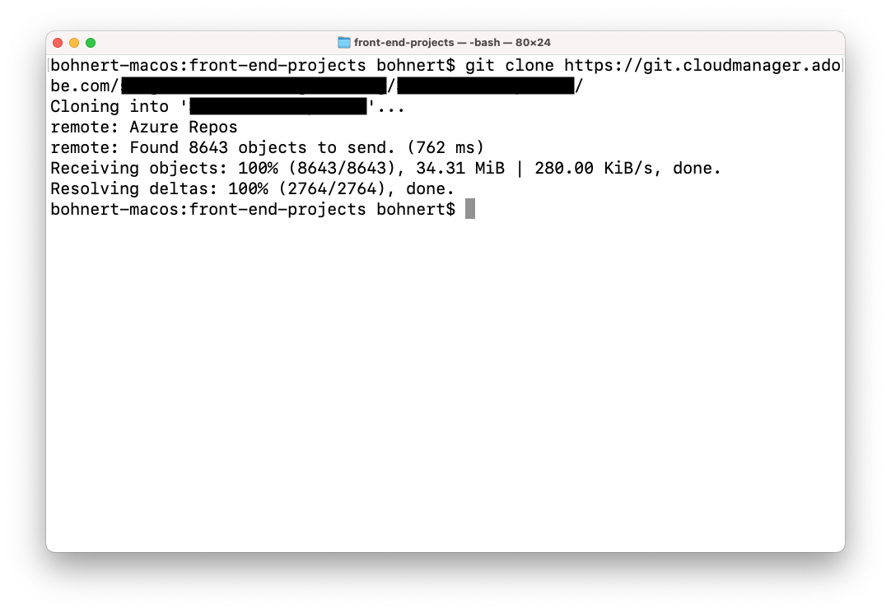

# サイトテーマのカスタマイズ {#customize-the-site-theme}

{{traditional-aem}}

サイトテーマの作成方法、カスタマイズ方法、および AEM のライブコンテンツを使用したテスト方法を説明します。

## これまでの説明内容 {#story-so-far}

AEM クイックサイト作成ジャーニーの前のドキュメントである [Git リポジトリのアクセス情報の取得](retrieve-access.md)では、フロントエンド開発者が Cloud Manager を使用して Git リポジトリ情報にアクセスする方法を確認しました。次のことができるようになりました。

* Cloud Manager とは何かをハイレベルで理解します。
* カスタマイズをコミットできるよう、AEM Git にアクセスするための資格情報を取得しました。

ジャーニーのこのパートでは次のステップに進み、サイトテーマについて掘り下げます。サイトテーマをカスタマイズし、取得したアクセス資格情報を使用してそれらのカスタマイズをコミットする方法を示します。

## 目的 {#objective}

このドキュメントでは、AEM サイトテーマの作成方法とカスタマイズ方法、および AEM のライブコンテンツを使用したテスト方法を説明します。読み終えると、次のことができるようになります。

* サイトテーマの基本構造と編集方法を理解する。
* ローカルプロキシを介して実際の AEM コンテンツを使用してテーマのカスタマイズをテストする方法を参照する。
* 変更を AEM Git リポジトリにコミットする方法を理解する。

## 担当する役割 {#responsible-role}

ジャーニーのこの部分は、フロントエンド開発者に適用されます。

## テーマの構造について {#understand-theme}

AEM 管理者が提供するテーマを編集場所に抽出し、目的のエディターで開きます。


テーマが一般的なフロントエンドプロジェクトであることがわかります。構造の最も重要な部分は次のとおりです。

* `src/main.ts`：JS および CSS テーマのメインエントリポイント
* `src/site`：サイト全体に適用される JS および CSS ファイル
* `src/components`：AEM コンポーネント固有の JS および CSS ファイル
* `src/resources`：アイコン、ロゴ、フォントなどの静的ファイル

>[!TIP]
>
>標準の AEM サイトテーマについて詳しくは、このドキュメントの最後にある [その他のリソース](#additional-resources) の節の GitHub リンクを参照してください。

テーマプロジェクトの構造に慣れたら、ローカルプロキシを起動して、実際の AEM コンテンツに基づいて、テーマのカスタマイズをリアルタイムで確認できるようにします。

## ローカルプロキシの起動 {#starting-proxy}

1. コマンドラインから、ローカルマシン上のテーマのルートに移動します。
1. `npm install` を実行すると、npm は依存関係を取得し、プロジェクトをインストールします。

   

1. `npm run live` を実行すると、プロキシサーバーが起動します。

   

1. プロキシサーバーが起動すると、`http://localhost:7001/` へのブラウザーが自動的に開きます。「**ローカルでログイン（管理者タスクのみ）**」を選択し、AEM 管理者から提供されたプロキシユーザーの資格情報を使用してサインオンします。

   

   >[!TIP]
   >
   >これらの資格情報がない場合は、このジャーニーにおける[「テンプレートからサイトを作成」記事の「プロキシユーザーを設定」の節](/help/journey-sites/quick-site/create-site.md#proxy-user)を言及したうえで、管理者にお問い合わせください。

1. ログインしたら、AEM 管理者が指定したサンプルコンテンツのパスを指すように、ブラウザーで URL を変更します。

   * 例えば、指定されたパスが `/content/<your-site>/en/home.html?wcmmode=disabled` であった場合
   * URL を `http://localhost:7001/content/<your-site>/en/home.html?wcmmode=disabled` に変更します

   

サイトに移動して、コンテンツを参照できます。サイトはライブ AEM インスタンスからライブで取り出されるため、実際のコンテンツに対してテーマをカスタマイズできます。

## テーマのカスタマイズ {#customize-theme}

これで、テーマのカスタマイズを開始できます。 次に、プロキシ経由で変更をライブで確認する方法を示す簡単な例を示します。

1. エディターで、`<your-theme-sources>/src/site/_variables.scss` ファイルを開きます。

   

1. `$color-background` 変数を編集し、白以外の値に設定します。この例では、`orange` が使用されます。

   

1. ファイルを保存すると、プロキシサーバーが `[Browsersync] File event [change]` 行を介して変更を認識していることがわかります。

   

1. プロキシサーバーのブラウザーに切り替えると、変更が直ちに表示されます。

   

AEM 管理者から提供された要件に基づいて、テーマのカスタマイズを続行できます。

## 変更のコミット {#committing-changes}

カスタマイズが完了したら、それらを AEM Git リポジトリにコミットできます。まず、リポジトリをローカルマシンにクローンする必要があります。

1. コマンドラインで、リポジトリのクローン先に移動します。
1. [以前に Cloud Manager から取得した](retrieve-access.md)コマンドを実行します。`git clone https://git.cloudmanager.adobe.com/<my-org>/<my-program>/` のようになります。[このジャーニーの前の部分で取得した](retrieve-access.md) Git ユーザー名とパスワードを使用します。

   

1. 編集中のテーマプロジェクトを、`mv <site-theme-sources> <cloned-repo>` のようなコマンドを使用して、クローンリポジトリに移動します。
1. クローンリポジトリのディレクトリで、先ほど移動したテーマファイルを次のコマンドでコミットします。

   ```text
   git add .
   git commit -m "Adding theme sources"
   git push
   ```

1. カスタマイズ内容は AEM Git リポジトリにプッシュされます。

   

これで、カスタマイズ内容が AEM Git リポジトリに安全に保存されました。

## 次のステップ {#what-is-next}

これで、AEM クイックサイト作成ジャーニーのこのステップが完了しました。次のことを行う必要があります。

* サイトテーマの基本構造と編集方法を理解する。
* ローカルプロキシを介して実際の AEM コンテンツを使用してテーマのカスタマイズをテストする方法を参照する。
* 変更を AEM Git リポジトリにコミットする方法を理解する。

この知識に基づき、次は[カスタマイズしたテーマのデプロイ](deploy-theme.md)のドキュメントを確認して、AEM クイックサイト作成ジャーニーを続行してください。そこでは、フロントエンドパイプラインを使用したテーマのデプロイ方法について説明します。

## その他のリソース {#additional-resources}

[カスタマイズしたテーマのデプロイ](deploy-theme.md)のドキュメントを確認して、クイックサイト作成ジャーニーの次のステップに進むことをお勧めします。次は追加的なオプションのリソースで、このドキュメントで取り上げた概念についてより詳しく説明していますが、ジャーニーを続ける上で必須ではありません。

* [AEM サイトテーマ](https://github.com/adobe/aem-site-template-standard-theme-e2e) - これは AEM サイトテーマの GitHub リポジトリです。
* [npm](https://www.npmjs.com) - サイトをすばやく作成するために使用される AEM テーマが npm に基づいている場合。
* [webpack](https://webpack.js.org) - サイトをすばやく作成するために使用される AEM テーマが webpack に基づいている場合。
