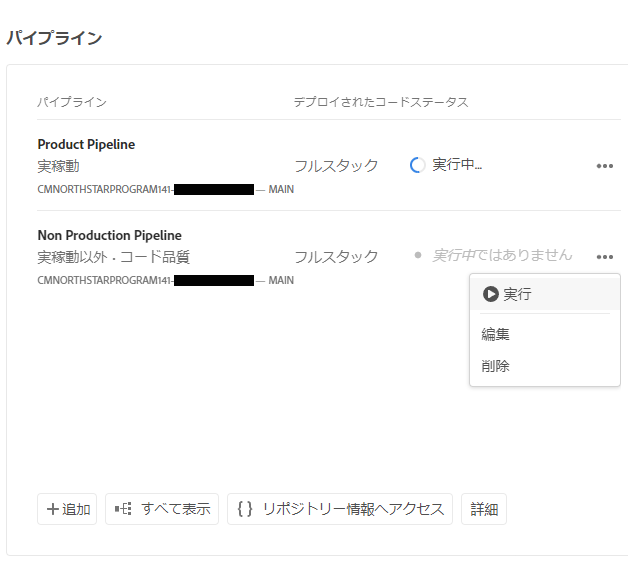
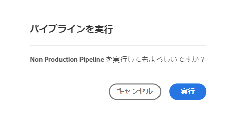
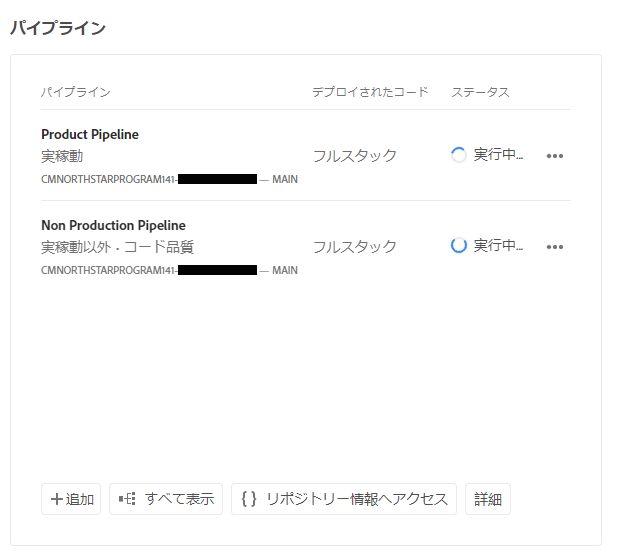
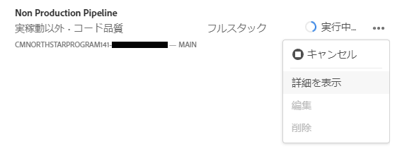
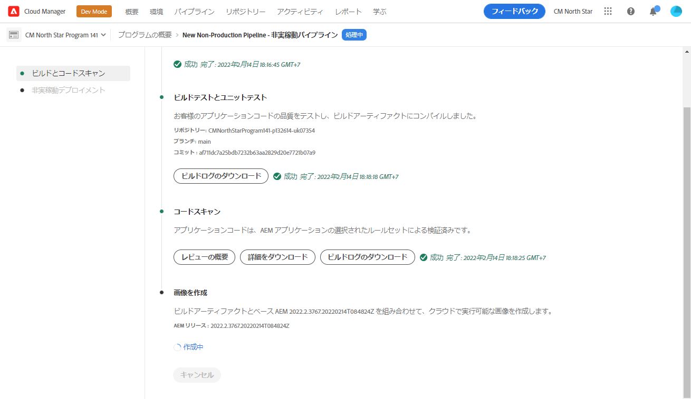
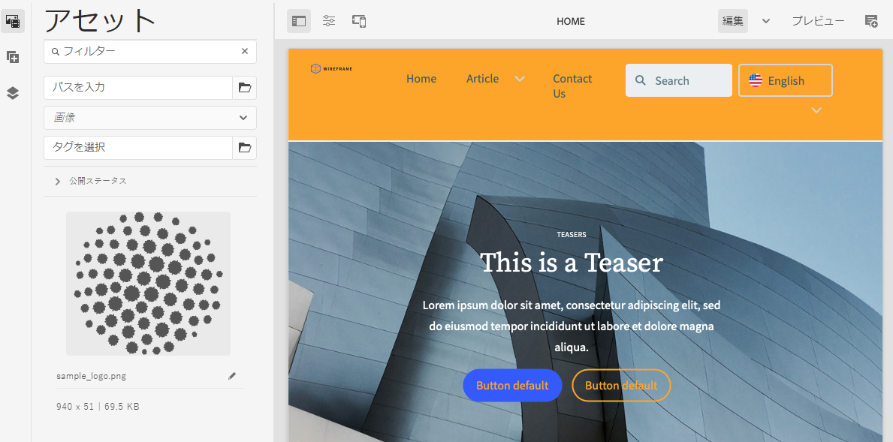

# カスタマイズしたテーマのデプロイ {#deploy-your-customized-theme}

{{traditional-aem}}

パイプラインを使用してサイトテーマをデプロイする方法を説明します。

## これまでの説明内容 {#story-so-far}

AEM クイックサイト作成ジャーニーの以前のドキュメントである[サイトテーマのカスタマイズ](customize-theme.md)では、テーマの作成方法、カスタマイズ方法、ライブ AEM コンテンツを使用したテスト方法について説明しました。次のことができるようになりました。

* サイトテーマの基本構造と編集方法を理解する。
* ローカルプロキシを介して実際の AEM コンテンツを使用してテーマのカスタマイズをテストする方法を参照する。
* 変更を AEM Git リポジトリにコミットする方法を理解する。

これで、最後の手順を実行し、パイプラインを使用してそれらをデプロイできます。

## 目的 {#objective}

このドキュメントでは、パイプラインを使用してテーマをデプロイする方法を説明します。読み終えると、次のことができるようになります。

* パイプラインデプロイメントのトリガー方法を理解する。
* デプロイメントのステータスを確認する方法を参照する。

## 担当する役割 {#responsible-role}

ジャーニーのこの部分は、フロントエンド開発者に適用されます。

## パイプラインを開始 {#start-pipeline}

テーマのカスタマイズの変更を AEM Git リポジトリにコミットしたら、[管理者が作成したパイプライン](pipeline-setup.md)を実行して変更をデプロイできます。

1. [Git のアクセス情報を取得する場合と同様に](retrieve-access.md) Cloud Manager にログインし、プログラムにアクセスします。「**概要**」タブには、**パイプライン**&#x200B;のカードが表示されます。

   

1. 開始する必要があるパイプラインの横の省略記号ボタンを選択します。ドロップダウンメニューから、 「**実行**」を選択します。

   

1. **パイプラインを実行**&#x200B;確認ダイアログで、「**はい**」を選択します。

   

1. パイプラインのリストで、「ステータス」列にパイプラインが現在実行中であることが示されます。

   

## パイプラインステータスの確認 {#pipeline-status}

パイプラインのステータスを確認して、進行状況の詳細をいつでも確認できます。

1. パイプラインの横にある省略記号（...）を選択します。

   

1. パイプラインの詳細ウィンドウに、パイプラインの進行状況の分類が表示されます。

   

>[!TIP]
>
>パイプラインの詳細ウィンドウでは、いずれかのステップが失敗した場合に、デバッグ目的でパイプラインの任意のステップの「**ログをダウンロード**」を選択できます。パイプラインのデバッグは、このジャーニーの範囲外です。このページの [その他のリソース](#additional-resources) の節で紹介している Cloud Manager の技術ドキュメントを参照してください。

## デプロイ済みのカスタマイズの検証 {#view-customizations}

パイプラインが完了したら、管理者に変更を検証するように通知できます。管理者は次の操作を実行します。

1. AEM オーサリング環境を開きます。
1. [管理者が以前作成したサイト](create-site.md)に移動します。
1. コンテンツページのいずれかを編集します。
1. 適用された変更を確認します。

## ジャーニーの終了 {#end-of-journey}

これで完了です。AEM クイックサイト作成ジャーニーを完了しました。その結果、以下を習得しました。

* Cloud Manager とフロントエンドパイプラインがフロントエンドカスタマイズの管理とデプロイのためにどのように機能するかを理解する。
* テンプレートに基づいて AEM サイトを作成する方法と、サイトテーマをダウンロードする方法を理解する。
* AEM Git リポジトリにアクセスできるようにフロントエンド開発者をオンボーディングする方法を理解する。
* プロキシ化された AEM コンテンツを使用してテーマをカスタマイズおよびテストし、その変更を AEM Git にコミットする方法を理解する。
* パイプラインを使用してフロントエンドのカスタマイズをデプロイする方法を理解する。

これで、独自の AEM サイトのテーマをカスタマイズする準備が整いました。ただし、複数のフロントエンドパイプラインを使用して様々なワークストリームの作成を開始する前に、[フロントエンドパイプラインを使用したサイトの開発](/help/implementing/developing/introduction/developing-with-front-end-pipelines.md)のドキュメントを確認してください。次の方法でフロントエンド開発を最大限に活用できます。

* 唯一の情報源を維持する。
* 関心の分離を維持する。

AEM は強力なツールであり、その他にも使用可能なオプションが多数あります。このジャーニーで説明した機能について詳しくは、[その他のリソース](#additional-resources)の節で紹介しているその他のリソースを参照してください。

## その他のリソース {#additional-resources}

以下の追加リソースでは、このドキュメントで言及したいくつかの概念について詳しく説明しています。

* [サイトパネルを使用したサイトテーマの管理](/help/sites-cloud/administering/site-creation/site-rail.md) - テーマソースのダウンロードやテーマバージョンの管理など、サイトテーマを簡単にカスタマイズおよび管理できるサイトパネルの強力な機能について説明します。
* [AEM as a Cloud Service 技術ドキュメント](https://experienceleague.adobe.com/docs/experience-manager-cloud-service.html?lang=ja) - AEM を既にしっかり理解している場合は、詳細な技術ドキュメントを直接参照してください。
* [Cloud Manager のドキュメント](https://experienceleague.adobe.com/docs/experience-manager-cloud-service/onboarding/onboarding-concepts/cloud-manager-introduction.html?lang=ja) - Cloud Manager の機能について詳しくは、詳細な技術ドキュメントを直接参照してください。
* [役割に基づく権限](https://experienceleague.adobe.com/docs/experience-manager-cloud-manager/using/requirements/role-based-permissions.html?lang=ja) - Cloud Manager には、適切な権限を持つ役割が事前に設定されています。これらの役割の詳細と管理方法については、このドキュメントを参照してください。
* [Cloud Manager リポジトリ](/help/implementing/cloud-manager/managing-code/managing-repositories.md) - AEMaaCS プロジェクトの Git リポジトリのセットアップおよび管理方法について詳しくは、このドキュメントを参照してください。
* [CI／CD パイプラインの設定 - Cloud Services](/help/implementing/cloud-manager/configuring-pipelines/introduction-ci-cd-pipelines.md) - フルスタックとフロントエンドの両方のパイプラインのセットアップについて詳しくは、このドキュメントを参照してください。
* [AEM 標準サイトテンプレート](https://github.com/adobe/aem-site-template-standard) - これは AEM 標準サイトのテンプレートの GitHub リポジトリです。
* [AEM サイトテーマ](https://github.com/adobe/aem-site-template-standard-theme-e2e) - これは AEM サイトテーマの GitHub リポジトリです。
* [npm](https://www.npmjs.com) - サイトをすばやく作成するために使用される AEM テーマが npm に基づいている場合。
* [webpack](https://webpack.js.org) - サイトをすばやく作成するために使用される AEM テーマが webpack に基づいている場合。
* [ページの整理](/help/sites-cloud/authoring/sites-console/organizing-pages.md) - このガイドでは、AEM のサイトのページを整理する方法について詳しく説明します。
* [ページの作成](/help/sites-cloud/authoring/sites-console/creating-pages.md) - このガイドでは、サイトに新しいページを追加する方法について詳しく説明します。
* [ページの管理](/help/sites-cloud/authoring/sites-console/managing-pages.md) - このガイドでは、移動、コピー、削除など、サイトのページを管理する方法について詳しく説明します。
* [パッケージの操作方法](/help/implementing/developing/tools/package-manager.md) - パッケージを使用すると、リポジトリコンテンツの読み込みと書き出しが可能になります。このドキュメントでは、AEM 6.5 でのパッケージの操作方法を説明します（AEMaaCS にも適用）。
* [オンボーディングジャーニー](/help/journey-onboarding/overview.md) - このガイドは、チームが確実に設定され、AEM as a Cloud Service にアクセスできるようにするための出発点となります。
* [Adobe Experience Manager Cloud Manager ドキュメント](https://experienceleague.adobe.com/docs/experience-manager-cloud-manager/using/introduction-to-cloud-manager.html?lang=ja) - Cloud Manager の機能について詳しくは、Cloud Manager のドキュメントを参照してください。
* [サイト管理ドキュメント](/help/sites-cloud/administering/site-creation/create-site.md) - クイックサイト作成ツールの機能について詳しくは、サイト作成に関する技術ドキュメントを参照してください。
* [フロントエンドパイプラインを使用したサイトの開発](/help/implementing/developing/introduction/developing-with-front-end-pipelines.md) - このドキュメントでは、フロントエンドパイプラインを使用したフロントエンド開発プロセスから、最大限の能力を引き出すために考慮すべき事項を説明します。
