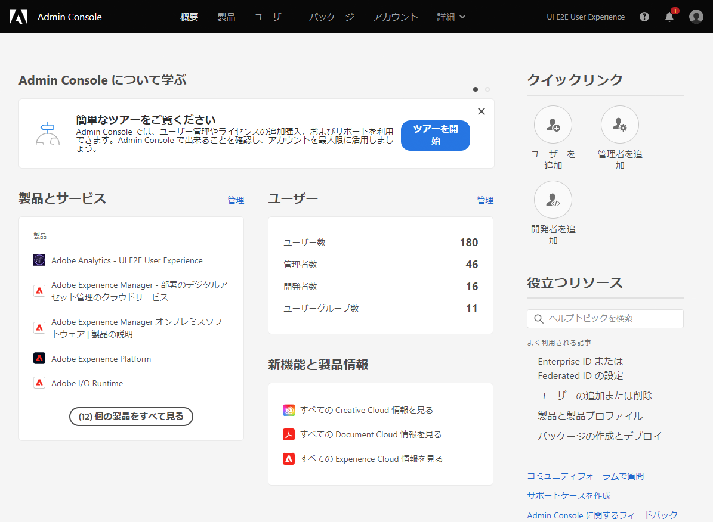
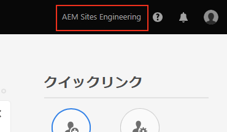
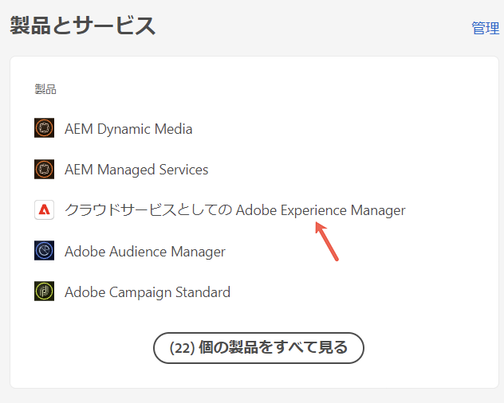
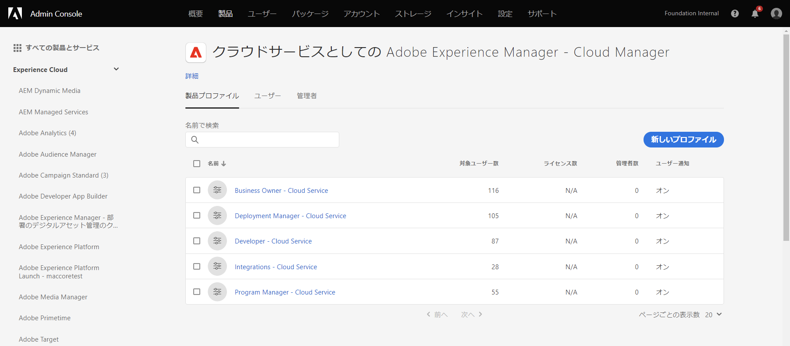
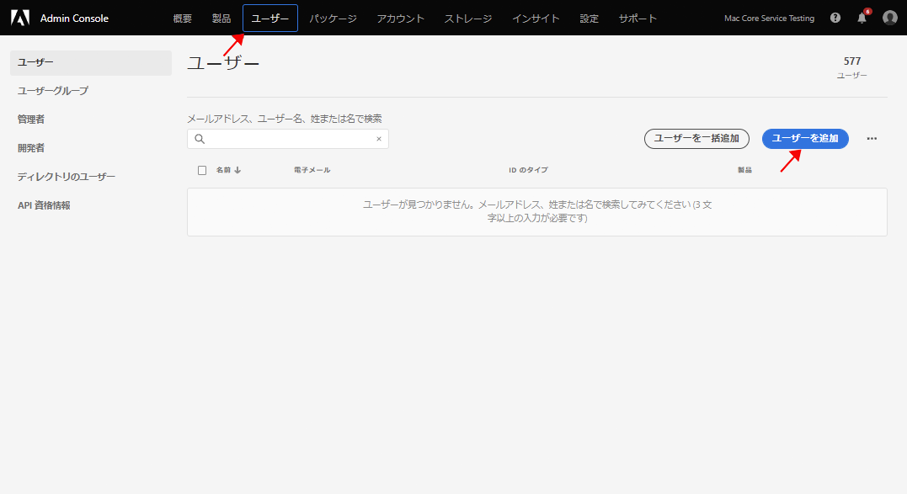
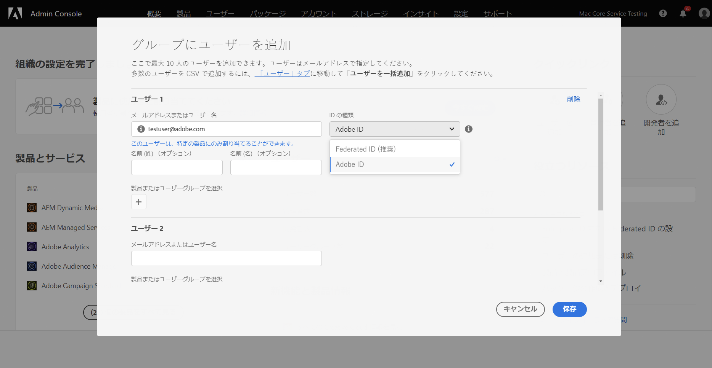
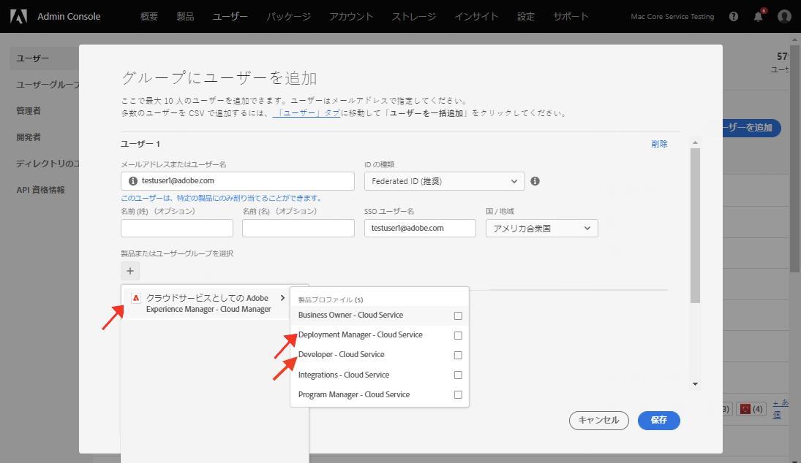

# フロントエンド開発者へのアクセス権の付与 {#grant-fed-access}

{{traditional-aem}}

フロントエンド開発者を Cloud Manager にオンボーディングして、AEM サイトの Git リポジトリとパイプラインにアクセスできるようにします。

## これまでの説明内容 {#story-so-far}

AEM クイックサイト作成ジャーニーの前のドキュメントである[パイプラインの設定](pipeline-setup.md)では、フロントエンドパイプラインを作成してサイトのテーマのカスタマイズを管理する方法を学びました。ここで、次のことを行う必要があります。

* フロントエンドパイプラインとは何かを理解する。
* Cloud Manager でフロントエンドパイプラインを設定する方法を理解する。

次に、オンボーディングプロセスを通じてフロントエンド開発者に Cloud Manager へのアクセス権を付与し、フロントエンド開発者が AEM Git リポジトリと作成したパイプラインにアクセスできるようにする必要があります。

## 目的 {#objective}

Cloud Manager へのアクセス権を付与し、ユーザーにユーザーの役割を割り当てるプロセスをオンボーディングと呼びます。このドキュメントでは、フロントエンド開発者をオンボーディングする際の最も重要な手順の概要を説明します。ドキュメントを参照した後、次のことを確認します。

* フロントエンド開発者をユーザーとして追加する方法。
* フロントエンド開発者に必要な役割を付与する方法。

>[!TIP]
>
>プロセスに関する追加の詳細が必要な場合は、このドキュメントの [その他のリソース](#additional-resources) にリンクされている、AEM as a Cloud Service へのチームのオンボーディングに特化したドキュメントジャーニー全体を参照してください。

## 担当する役割 {#responsible-role}

ジャーニーのこの部分は、Cloud Manager 管理者に適用されます。

## 要件 {#requirements}

* Cloud Manager の **ビジネスオーナー** の役割のメンバーである必要があります。
* Cloud Manager の **システム管理者** である必要があります。
* Admin Console にアクセスできる必要があります。

## フロントエンド開発者をユーザーとして追加する {#add-fed-user}

まず、Admin Console を使用して、フロントエンド開発者をユーザーとして追加する必要があります。

1. [https://adminconsole.adobe.com/](https://adminconsole.adobe.com/) で Admin Console にログインします。

1. ログインすると、次の図のような概要ページが表示されます。

   

1. 画面の右上隅にある組織名を確認して、適切な組織に属していることを確認します。

   

1. **製品とサービス** カードから「**Adobe Experience Manager as a Cloud Service**」を選択します。

   

1. 事前設定済みの Cloud Manager 製品プロファイルのリストが表示されます。これらのプロファイルが表示されない場合は、組織内の正しい権限がない可能性があるので、Cloud Manager 管理者にお問い合わせください。

   

1. フロントエンド開発者を正しいプロファイルに割り当てるには、「**ユーザー**」タブ、「**ユーザーを追加**」ボタンを選択します。

   

1. **チームにユーザーを追加** ダイアログボックスで、追加するユーザーのメール ID を入力します。「ID タイプ」で「Adobe ID」を選択します（チームメンバーの Federated ID がまだ設定されていない場合）。

   

1. 「**製品**」の選択で、「+」記号を選択し、**Adobe Experience Manager as a Cloud Service** を選択して、**デプロイメントマネージャー**&#x200B;と&#x200B;**開発者**&#x200B;の製品プロファイルをユーザーに割り当てます。

   

1. 「**保存**」を選択すると、「ようこそ」メールが、ユーザーとして追加したフロントエンド開発者に送信されます。

招待されたフロンドエンド開発者は、ウェルカムメールに記載されているリンクをクリックし、Adobe ID を使用してログインすることで、Cloud Manager にアクセスできます。

## フロントエンド開発者への引き渡し {#handover}

フロントエンド開発者に招待するメールが Cloud Manager に送信されるので、AEM 管理者は、フロントエンド開発者に、カスタマイズを開始するために必要な残りの情報を提供できるようになりました。

* [典型的なコンテンツへのパス](#example-page)
* [ダウンロードした](#download-theme) テーマソース
* [プロキシユーザー資格情報](#proxy-user)
* [Cloud Manager からコピーされた](pipeline-setup.md#login) プログラムの名前またはプログラムへの URL
* フロントエンドの設計要件

## 次のステップ {#what-is-next}

これで、AEM クイックサイト作成ジャーニーのこのステップが完了しました。次のことを行う必要があります。

* フロントエンド開発者をユーザーとして追加する方法。
* フロントエンド開発者に必要な役割を付与する方法。

この知識に基づいて、次に [Git リポジトリのアクセス情報の取得](retrieve-access.md)のドキュメントを確認して、AEM クイックサイト作成ジャーニーを続行してください。このドキュメントでは、フロントエンド開発者のみに視点を切り替え、フロントエンド開発者ユーザーが Cloud Manager を使用して Git リポジトリ情報にアクセスする方法を説明します。

## その他のリソース {#additional-resources}

[フロントエンド開発者資格情報の取得](retrieve-access.md)のドキュメントを確認して、クイックサイト作成ジャーニーの次のステップに進むことをお勧めします。次は追加的なオプションのリソースで、このドキュメントで取り上げた概念についてより詳しく説明していますが、ジャーニーを続ける上で必須ではありません。

* [オンボーディングジャーニー](/help/journey-onboarding/overview.md) - このガイドは、チームが確実に設定され、AEM as a Cloud Service にアクセスできるようにする出発点となります。
