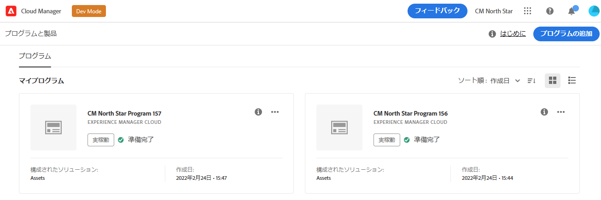
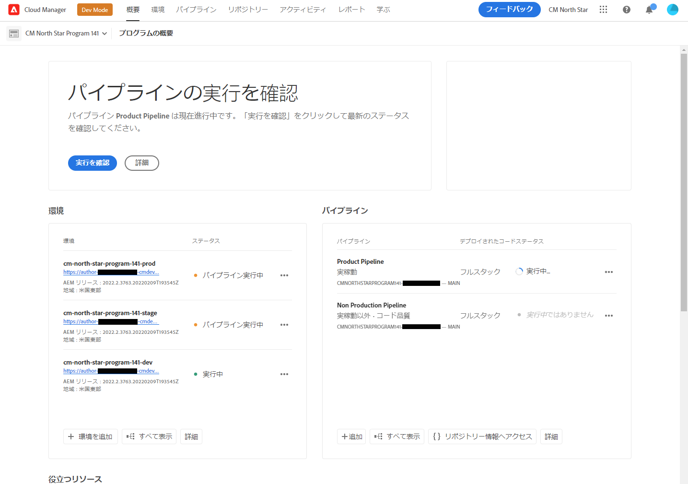
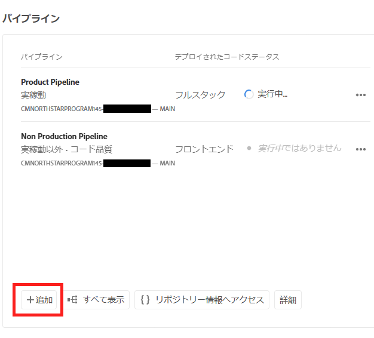
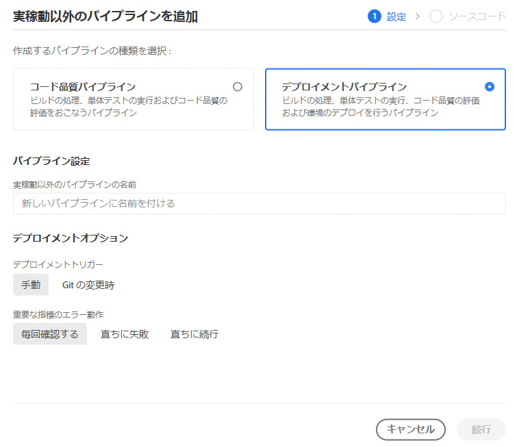
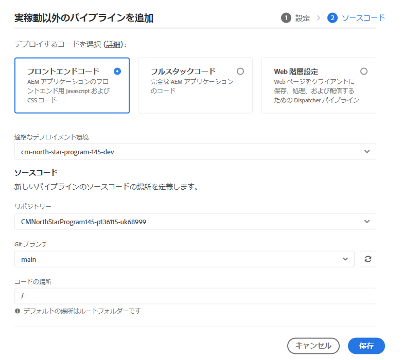
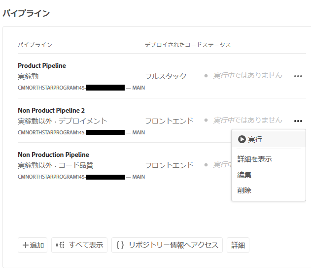

# パイプラインの設定 {#set-up-your-pipeline}

フロントエンドパイプラインを作成して、サイトのテーマのカスタマイズを管理します。

## これまでの説明内容 {#story-so-far}

AEM クイックサイト作成ジャーニーの前のドキュメントである [ テンプレートからサイトを作成 ](create-site.md) では、サイトテンプレートを使用してAEM サイトをすばやく作成する方法を学び、フロントエンドツールを使用してさらにカスタマイズできるようになりました。ここまでの学習内容を以下にまとめます。

* AEM Site テンプレートの取得方法を理解する。
* テンプレートを使用して新しいサイトを作成する方法を学ぶ。
* 新しいサイトからテンプレートをダウンロードして、フロントエンド開発者に提供する方法を確認する。

この記事では、これらの基本事項にもとづいて、フロントエンドパイプラインを設定できます。このパイプラインは、フロントエンド開発者がこのジャーニーの後半でフロントエンドのカスタマイズをデプロイするために使用します。

## 目的 {#objective}

このドキュメントは、フロントエンドパイプラインと、サイトのカスタマイズされたテーマのデプロイメントを管理するためのパイプラインの作成方法を理解するのに役立ちます。読み終えると、次のことができるようになります。

* フロントエンドパイプラインとは何かを理解する。
* Cloud Manager でフロントエンドパイプラインを設定する方法を理解する。

## 担当する役割 {#responsible-role}

ジャーニーのこの部分は、Cloud Manager 管理者に適用されます。

## 要件 {#requirements}

* Cloud Manager にアクセスできる必要があります。
* Cloud Manager で **デプロイメントマネージャー** の役割のメンバーである必要があります。
* AEM 環境の Git リポジトリは、Cloud Manager で設定する必要があります。
   * 通常、これは既にアクティブなプロジェクトの場合に当てはまります。ただし、そうでない場合は、[その他のリソース](#additional-resources)の節にある Cloud Manager リポジトリのドキュメントを参照してください。

## フロントエンドパイプラインとは {#front-end-pipeline}

フロントエンド開発では、AEM サイトのスタイルを定義する JavaScript、CSS、静的リソースのカスタマイズが必要になります。フロントエンド開発者は、独自のローカル環境で作業して、これらのカスタマイズを行います。準備が整うと、変更は AEM Git リポジトリにコミットされます。ただし、ソースコードにのみコミットされます。まだライブではありません。

フロントエンドパイプラインは、これらのコミット済みのカスタマイズを取得し、AEM 環境（通常は実稼動環境または非実稼動環境）にデプロイします。

このようにして、フロントエンド開発は、独自のデプロイメントパイプラインを持つ AEM 上のフルスタックバックエンド開発とは別に、それと並行して動作できます。

>[!NOTE]
>
>フロントエンドパイプラインでデプロイできるのは、AEM サイトのスタイルを設定する JavaScript、CSS、静的リソースのみです。ページやアセットなどのサイトコンテンツは、パイプラインにデプロイできません。

## Cloud Manager へのアクセス {#login}

1. [my.cloudmanager.adobe.com](https://my.cloudmanager.adobe.com/) にある Adobe Cloud Manager にログインします。

1. Cloud Manager に、使用可能な様々なプログラムのリストが表示されます。管理するものを選択します。AEM as a Cloud Service を使い始めたばかりの場合、1 つのプログラムしか使用できない可能性があります。

   

これで、プログラムの概要が表示されます。ページの内容は異なりますが、次の例のようになります。

URL にアクセスまたはコピーしたプログラムの名前をメモしておきます。後でフロントエンド開発者にこれを提供する必要があります。

## フロントエンドパイプラインの作成 {#create-front-end-pipeline}

これで Cloud Manager にアクセスし、フロントエンドデプロイメント用のパイプラインを作成できます。

1. Cloud Manager ページの「**パイプライン**」セクションで、「**追加**」ボタンを選択します。

   

1. 「**追加**」ボタンの下に表示されるポップアップメニューで、このジャーニーでは「**実稼動以外のパイプラインを追加**」を選択します。

1. 開いた **実稼動以外のパイプラインを追加** ダイアログの「**設定**」タブで、以下の操作を行います。
   * 「**デプロイメントパイプライン**」を選択します。
   * 「**実稼動以外のパイプライン名**」フィールドに名前をパイプラインに指定します。

   

1. 「**続行**」を選択します。

1. 「**ソースコード**」タブで、以下の操作を行います。
   * デプロイするコードのタイプとして「**フロントエンドコード**」を選択します。
   * 「**適格なデプロイメント環境**」で正しい環境が選択されていることを確認します。
   * 正しい「**リポジトリー**」を選択します。
   * パイプラインを関連付ける **Git ブランチ** を定義します。
   * フロントエンド開発が選択したリポジトリの特定のパスの下にある場合は、 **コードの場所** を定義します。デフォルト値はリポジトリのルートですが、多くの場合、フロントエンド開発およびバックエンドは異なるパスの下にあります。

   

1. 「**保存**」を選択します。

新しいパイプラインが作成され、Cloud Manager ウィンドウの「**パイプライン**」セクションに表示されます。パイプライン名の後の省略記号をタップまたはクリックすると、必要に応じて詳細を編集または表示するオプションが表示されます。

>[!TIP]
>
>AEMaaCS のパイプラインに精通しており、フロントエンドパイプラインの詳細を含む様々なタイプのパイプラインの違いを確認したい場合は、以下の[その他のリソース](#additional-resources)の節にリンクされている CI／CD パイプラインの設定 - Cloud Services を参照してください。

## 次の手順 {#what-is-next}

これで、AEM クイックサイト作成ジャーニーのこのステップが完了しました。次のことを行う必要があります。

* フロントエンドパイプラインとは何かを理解する。
* Cloud Manager でフロントエンドパイプラインを設定する方法を理解する。

この知識をもとに、[ フロントエンド開発者へのアクセス権の付与 ](grant-access.md) のドキュメントを確認して、AEM クイックサイト作成ジャーニーを続行します。このドキュメントでは、Cloud Managerにフロントエンド開発者をオンボーディングして、AEM サイトの Git リポジトリとパイプラインにアクセスできるようにします。

## その他のリソース {#additional-resources}

[ サイトテーマのカスタマイズ ](customize-theme.md) のドキュメントを確認して、クイックサイト作成ジャーニーの次のパートに進むことをお勧めしますが、以下のリソースではこのドキュメントで取り上げた概念についてより詳しく説明しています。追加的なオプションであり、ジャーニーを続ける上で必須のリソースではありません。

* [Cloud Manager のドキュメント](https://experienceleague.adobe.com/docs/experience-manager-cloud-service/onboarding/onboarding-concepts/cloud-manager-introduction.html?lang=ja) - Cloud Manager の機能について詳しくは、詳細な技術ドキュメントを直接参照してください。
* [Cloud Manager リポジトリ](/help/implementing/cloud-manager/managing-code/managing-repositories.md) - AEMaaCS プロジェクトの Git リポジトリの設定および管理方法について詳しくは、このドキュメントを参照してください。
* [CI／CD パイプラインの設定 - Cloud Services](/help/implementing/cloud-manager/configuring-pipelines/introduction-ci-cd-pipelines.md) - フルスタックとフロントエンドの両方のパイプラインのセットアップについて詳しくは、このドキュメントを参照してください。
