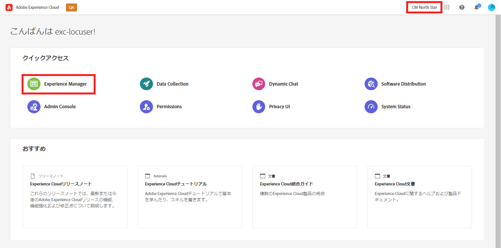
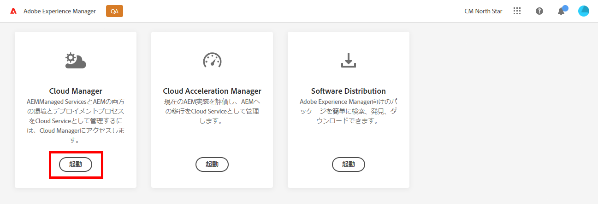

# パイプラインの設定 {#set-up-your-pipeline}

フロントエンドパイプラインを作成して、サイトのテーマのカスタマイズを管理します。

>[!CAUTION]
>
>現在、クイックサイト作成ツールはテクニカルプレビューです。 テストおよび評価の目的で使用できるようになり、Adobeサポートに同意しない限り、実稼動での使用は意図されません。

## これまでの説明内容 {#story-so-far}

前のドキュメントのAEM Quick Site Creation ジャーニーでは、 [テンプレートからサイトを作成し、](create-site.md) サイトテンプレートを使用してAEMサイトをすばやく作成する方法を学び、フロントエンドツールを使用してさらにカスタマイズできるようになりました。次の手順を実行する必要があります。

* AEM Site テンプレートの取得方法を説明します。
* テンプレートを使用して新しいサイトを作成する方法を説明します。
* 新しいサイトからテンプレートをダウンロードして、フロントエンド開発者に提供する方法を確認します。

この記事は、これらの基本事項に基づいて構築されるので、フロントエンドパイプラインを設定できます。フロントエンド開発者は、後でフロントエンドカスタマイズ機能をデプロイするために使用します。

## 目的 {#objective}

このドキュメントでは、フロントエンドパイプラインと、サイトのカスタマイズされたテーマのデプロイメントを管理するためのパイプラインの作成方法を説明します。 ドキュメントを読めば、以下が可能です。

* フロントエンドパイプラインとは何かを理解します。
* Cloud Manager でフロントエンドパイプラインを設定する方法を説明します。

## 担当ロール {#responsible-role}

このジャーニーの部分は、Cloud Manager 管理者に適用されます。

## 要件 {#requirements}

* Cloud Manager にアクセスできる必要があります。
* 次のメンバーである必要があります： **デプロイメントマネージャー** Cloud Manager での役割について説明します。
* AEM環境の Git リポジトリは、Cloud Manager で設定する必要があります。
   * 通常、これはすでにアクティブなプロジェクトの場合に当てはまります。 ただし、ない場合は、次のリンクにある Cloud Manager Repositories ドキュメントを参照してください。 [その他のリソース](#additional-resources) 」セクションに入力します。

## フロントエンドパイプラインとは {#front-end-pipeline}

フロントエンド開発では、AEMサイトのスタイルを定義する JavaScript、CSS、静的リソースのカスタマイズが必要になります。 フロントエンド開発者は、独自のローカル環境で作業して、これらのカスタマイズをおこないます。 準備が整うと、変更はAEM Git リポジトリにコミットされます。 ただし、ソースコードにのみコミットされます。 彼らはまだ生きていない。

フロントエンドパイプラインは、これらのコミット済みのカスタマイズを取得し、AEM環境（通常は実稼動環境または非実稼動環境）にデプロイします。

このようにして、フロントエンド開発は、独自のデプロイメントパイプラインを持つAEM上のフルスタックバックエンド開発とは別に、それと並行して動作できます。

>[!NOTE]
>
>フロントエンドパイプラインでデプロイできるのは、AEMサイトのスタイルを設定する JavaScript、CSS、静的リソースのみです。 ページやアセットなどのサイトコンテンツは、パイプラインにデプロイできません。

## Cloud Manager にアクセス {#login}

1. Adobe Experience Cloud( ) にログインします。 [my.cloudmanager.adobe.com](https://my.cloudmanager.adobe.com/).

1. ログインしたら、画面の右上隅で正しい組織に属していることを確認します。 1 つの組織のメンバーのみの場合、この手順は不要です。 次に、「 」をタップまたはクリックします。 **Experience Manager**.

   

1. 次のページで、 **起動** を起動します。 **Cloud Manager** アプリを使用します。

   

1. 次のページには、使用可能な様々なプログラムの一覧が表示されます。 管理する項目をタップまたはクリックします。 AEM as a Cloud Serviceを使い始めたばかりの場合、1 つのプログラムしか使用できない可能性があります。

   

これで、Cloud Manager の概要が表示されます。 ページの外観は異なりますが、次の例のようになります。

URL にアクセスまたはコピーしたプログラムの名前をメモしておきます。 後でフロントエンド開発者にこれを提供する必要があります。

## フロントエンドパイプラインの作成 {#create-front-end-pipeline}

これで Cloud Manager にアクセスし、フロントエンドデプロイメント用のパイプラインを作成できます。

1. 内 **パイプライン** 「 」セクションで、 **追加** 」ボタンをクリックします。

   

1. の下に表示されるポップアップメニュー **追加** ボタン選択 **実稼動以外のパイプラインを追加** この旅の目的で

1. の **設定** タブ **実稼動以外のパイプラインを追加** ダイアログが開きます。
   * 選択 **デプロイメントパイプライン**.
   * でパイプラインに名前を付けます。 **実稼動以外のパイプライン名** フィールドに入力します。

   

1. タップまたはクリック **続行**.

1. の **ソースコード** タブ：
   * 選択 **フロントエンドコード** をデプロイするコードのタイプとして使用します。
   * 以下で正しい環境が選択されていることを確認します。 **適格なデプロイメント環境**.
   * 正しい **リポジトリ**.
   * 定義する **Git ブランチ** パイプラインを関連付ける必要があります。
   * 次を定義： **コードの場所** （フロントエンド開発が、選択したリポジトリの特定のパスの下に配置されている場合）。 デフォルト値はリポジトリのルートですが、多くの場合、フロントエンド開発とバックエンドは異なるパスの下にあります。

   

1. 「**保存して閉じる**」をタップまたはクリックします。

新しいパイプラインが作成され、 **パイプライン** Cloud Manager ウィンドウの「 」セクションに表示されます。 パイプライン名の後の省略記号をタップすると、必要に応じて詳細を編集または表示するオプションが表示されます。

>[!TIP]
>
>AEMaaCS のパイプラインに既に精通しており、フロントエンドパイプラインの詳細を含む様々なタイプのパイプラインの違いについて詳しくは、 CI/CD パイプラインの設定 — でリンクされたCloud Servicesを参照してください [その他のリソース](#additional-resources) 」の節を参照してください。

## 次の手順 {#what-is-next}

これで、AEM Quick Site Creation ジャーニーのこの部分が完了し、次の作業をおこなう必要があります。

* フロントエンドパイプラインとは何かを理解します。
* Cloud Manager でフロントエンドパイプラインを設定する方法を説明します。

この知識に基づいてドキュメントを次に確認し、AEMクイックサイト作成のジャーニーを続行します [フロントエンド開発者にアクセス権を付与する](grant-access.md) ここでは、フロントエンドデベロッパーを Cloud Manager にオンボーディングして、AEMサイトの git リポジトリーとパイプラインにアクセスできるようにします。

## その他のリソース {#additional-resources}

クイックサイト作成ジャーニーの次の部分に進むことをお勧めしますが、ドキュメントを確認してください [サイトテーマのカスタマイズ](customize-theme.md) 以下に、このドキュメントで取り上げたいくつかの概念について詳しく説明する、その他のオプションのリソースを示します。ただし、このジャーニーを続行する必要はありません。

* [Cloud Manager のドキュメント](https://experienceleague.adobe.com/docs/experience-manager-cloud-service/onboarding/onboarding-concepts/cloud-manager-introduction.html) - Cloud Manager の機能の詳細については、詳細な技術ドキュメントを直接お問い合わせください。
* [Cloud Manager リポジトリ](/help/implementing/cloud-manager/managing-code/cloud-manager-repositories.md) - AEMaCS プロジェクトの Git リポジトリーの設定および管理方法について詳しくは、このドキュメントを参照してください。
* [CI/CD Pipeline の設定 —Cloud Services](/help/implementing/cloud-manager/configuring-pipelines/introduction-ci-cd-pipelines.md)  — このドキュメントでは、フルスタックとフロントエンドの両方のパイプラインの設定に関する詳細を説明します。