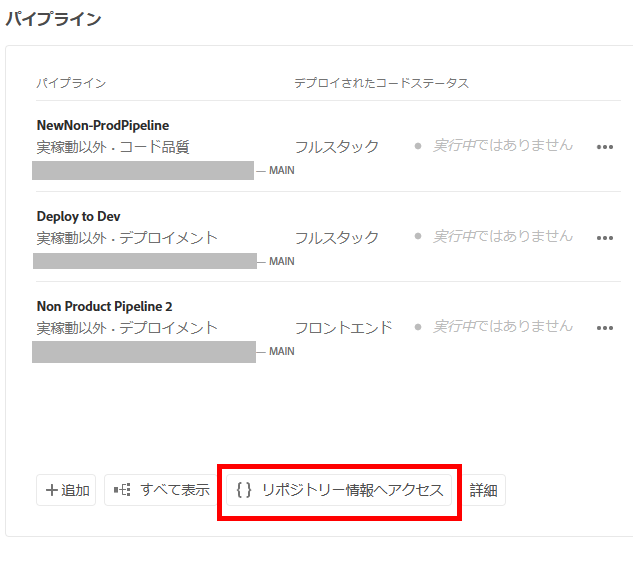
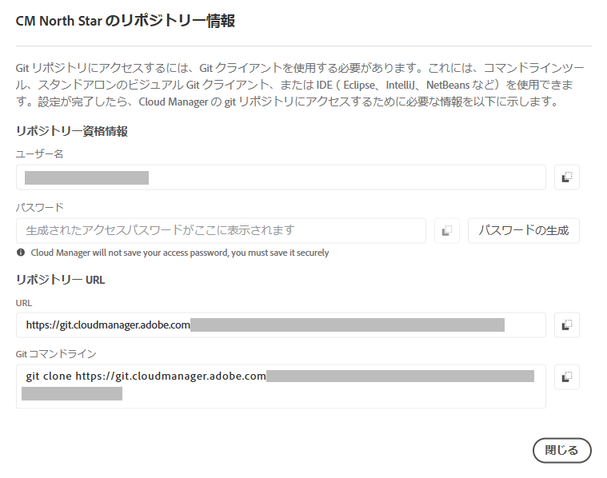

# Git リポジトリのアクセス情報の取得 {#retrieve-access}

{{traditional-aem}}

フロントエンド開発者が Cloud Manager を使用して Git リポジトリ情報にアクセスする方法について説明します。

## これまでの説明内容 {#story-so-far}

サイトテーマのカスタマイズのみを担当するフロントエンド開発者の場合、AEM の設定方法に関する知識は必要ないため、このドキュメントの 「[目的](#objective) 」の節にスキップしても構いません。

フロントエンド開発者だけではなく Cloud Manager または AEM 管理者の役割も担っている場合は、以前のドキュメントで、AEM クイックサイト作成ジャーニー、[フロントエンド開発者へのアクセス権の付与](grant-access.md)、Git リポジトリにアクセスできるようにフロントエンド開発者をオンボードする方法を学びましたが、ここでは次のことを知っておく必要があります。

* フロントエンド開発者をユーザーとして追加する方法。
* フロントエンド開発者に必要な役割を付与する方法。

この記事では、次の手順で、フロントエンド開発者が Cloud Manager へのアクセス権を使用して、AEM Git リポジトリにアクセスするための資格情報を取得する方法を説明します。

テンプレートに基づいたサイトが作成され、パイプラインが設定され、フロントエンド開発者がオンボーディングされ、必要な情報がすべて揃ったので、この記事では、管理者から離れ、フロントエンド開発者の役割のみに視点を移します。

## 目的 {#objective}

このドキュメントでは、フロントエンド開発者の役割で Cloud Manager にアクセスし、AEM Git リポジトリへのアクセス資格情報を取得する方法について説明します。読み終えると、次のことができるようになります。

* Cloud Manager とは何かをハイレベルで理解します。
* カスタマイズをコミットできるよう、AEM Git にアクセスするための資格情報を取得しました。

## 担当する役割 {#responsible-role}

ジャーニーのこの部分は、フロントエンド開発者に適用されます。

## 要件 {#requirements}

クイックサイト作成ツールを使用すると、フロントエンド開発者は AEM やその設定方法に関する知識がなくても、独立して作業できます。ただし、Cloud Manager 管理者はフロントエンド開発者をプロジェクトチームにオンボーディングする必要があり、AEM 管理者はフロントエンド開発者に必要な情報を提供する必要があります。続行する前に、次の情報を得ていることを確認してください。

* AEM 管理者から、次の手順を実行します。
   * カスタマイズするテーマのソースファイル
   * 参照のベースとして使用するサンプルページへのパス
   * AEM のライブコンテンツに対するカスタマイズをテストするためのプロキシユーザー資格情報
   * フロントエンドの設計要件
* Cloud Manager 管理者から：
   * Cloud Manager からのアクセスを通知するウェルカムメール
   * Cloud Manager 内のプログラム名またはプログラムへの URL

これらの項目のいずれかが欠けている場合は、AEM 管理者または Cloud Manager 管理者にお問い合わせください。

フロントエンド開発者は、フロントエンド開発ワークフローおよび次のようなインストール済みの汎用ツールに関する幅広い経験があることを前提としています。

* Git
* npm
* webpack
* お好みのエディター

## Cloud Manager について {#understanding-cloud-manager}

Cloud Manager を使用すると、クラウド内の AEM を組織で自己管理できるようになります。このサービスには継続的インテグレーションと継続的配信（CI/CD）フレームワークが備わっているので、IT チームや実装パートナーはパフォーマンスやセキュリティを妥協することなくカスタマイズや更新を迅速に配信できます。

フロントエンド開発者にとって、これは次へのゲートウェイです。

* AEM Git リポジトリ情報にアクセスして、フロントエンドのカスタマイズをコミットできるようにします。
* デプロイメントパイプラインを開始して、カスタマイズをデプロイします。

Cloud Manager 管理者から、Cloud Manager ユーザーとしてオンボーディングされます。次のようなウェルカムメールが届いているはずです。

このメールをまだ受け取っていない場合は、Cloud Manager 管理者にお問い合わせください。

## Cloud Manager へのアクセス {#access-cloud-manager}

1. [my.cloudmanager.adobe.com](https://my.cloudmanager.adobe.com/) の Adobe Experience Cloud にログインするか、ウェルカムメールに記載されているリンクをクリックします。

1. Cloud Manager に、使用可能な様々なプログラムのリストが表示されます。Cloud Manager 管理者から提供されたものの中から、アクセスする必要があるものを選択します。これが最初の AEMaaCS のフロントエンドプロジェクトの場合は、提供されるプログラムは 1 つだけでしょう。

   

これで、プログラムの概要が表示されます。ページの内容は異なりますが、次の例のようになります。

## リポジトリのアクセス情報の取得 {#repo-access}

1. Cloud Manager ページの「**パイプライン**」セクションで、「**リポジトリー情報へアクセス**」ボタンを選択します。

   

1. **リポジトリ情報** ダイアログが開きます。

   

1. 「**パスワードを生成**」ボタンを選択して、自分用のパスワードを作成します。

1. 生成したパスワードを安全なパスワードマネージャーに保存します。パスワードが再び表示されることはありません。

1. 「**ユーザー名**」フィールドと「**Git コマンドライン**」フィールドもコピーします。後でこの情報を使用して、リポジトリにアクセスします。

1. 「**閉じる**」を選択します。

## 次のステップ {#what-is-next}

これで、AEM クイックサイト作成ジャーニーのこのステップが完了しました。次のことを行う必要があります。

* Cloud Manager とは何かをハイレベルで理解します。
* カスタマイズをコミットできるよう、AEM Git にアクセスするための資格情報を取得しました。

この知識に基づいて、次は[サイトテーマのカスタマイズ](customize-theme.md)のドキュメントを確認して、AEM クイックサイト作成ジャーニーを続行してください。そこでは、サイトテーマの作成方法、カスタマイズ方法および AEM のライブコンテンツを使用したテスト方法を習得します。

## その他のリソース {#additional-resources}

[サイトテーマのカスタマイズ](customize-theme.md)のドキュメントを確認して、クイックサイト作成ジャーニーの次のステップに進むことをお勧めします。次は追加的なオプションのリソースで、このドキュメントで取り上げた概念についてより詳しく説明していますが、ジャーニーを続ける上で必須ではありません。

* [Adobe Experience Manager Cloud Manager ドキュメント](https://experienceleague.adobe.com/docs/experience-manager-cloud-manager/using/introduction-to-cloud-manager.html?lang=ja) - Cloud Manager の機能について詳しくは、Cloud Manager のドキュメントを参照してください。
