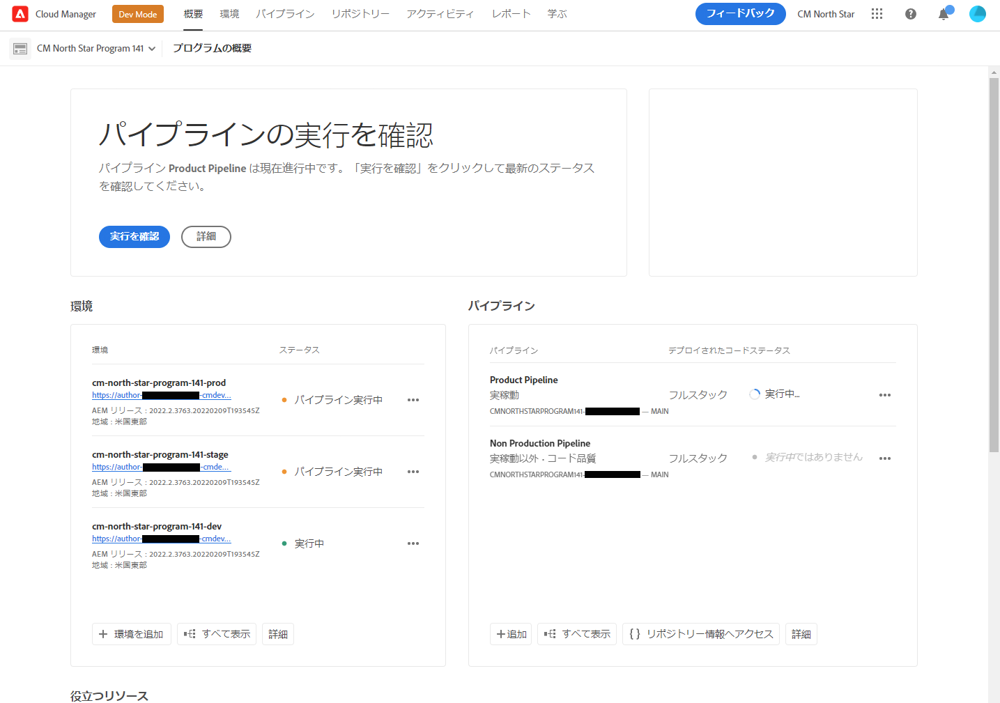

# Git リポジトリのアクセス情報の取得 {#retrieve-access}

フロントエンド開発者が Cloud Manager を使用して Git リポジトリ情報にアクセスする方法について説明します。

## これまでの説明内容 {#story-so-far}

サイトテーマのカスタマイズのみを担当するフロントエンド開発者は、AEMの設定方法に関する知識は必要ありません。この知識をスキップして、 [目的](#objective) 」の節を参照してください。

Cloud Manager またはAEM管理者の役割やフロントエンド開発者の役割も果たしている場合は、AEMクイックサイト作成ジャーニーの前のドキュメントで学習した内容です。 [フロントエンド開発者にアクセス権を付与する](grant-access.md) フロントエンドデベロッパーを git リポジトリーにアクセスできるようにオンボーディングする方法を説明します。次の情報が得られます。

* フロントエンド開発者をユーザーとして追加する方法。
* フロントエンド開発者に必要な役割を付与する方法。

この記事では、次の手順で、フロントエンド開発者が Cloud Manager へのアクセスを使用してAEM Git リポジトリにアクセスするための資格情報を取得する方法を示します。

テンプレートに基づいて作成されたサイトがあるので、パイプラインが設定され、フロントエンド開発者がオンボーディングされ、必要な情報がすべて含まれているので、この記事の全体像を管理者から離れ、フロントエンド開発者の役割のみに変更します。

## 目的 {#objective}

このドキュメントでは、フロントエンド開発者が Cloud Manager にアクセスし、AEM Git リポジトリーにアクセス資格情報を取得する方法について説明します。 読み終えたら、次の操作を行います。

* Cloud Manager の概要を説明します。
* カスタマイズをコミットできるよう、AEM Git にアクセスするための資格情報を取得しました。

## 担当ロール {#responsible-role}

このジャーニーの部分は、フロントエンド開発者に適用されます。

## 要件 {#requirements}

クイックサイト作成ツールを使用すると、AEMに関する知識や設定方法を知らなくても、フロントエンド開発者は独立して作業できます。 ただし、Cloud Manager 管理者はフロントエンド開発者をプロジェクトチームにオンボーディングし、AEM管理者がユーザーに必要な情報を提供する必要があります。 続行する前に、次の情報があることを確認してください。

* AEM管理者から、次の手順を実行します。
   * カスタマイズするテーマのソースファイル
   * 参照のベースとして使用するサンプルページのパス
   * ライブAEMコンテンツに対するカスタマイズをテストするためのプロキシユーザー資格情報
   * フロントエンドの設計要件
* Cloud Manager 管理者から、次の操作をおこないます。
   * Cloud Manager からアクセスを通知するお知らせメールが届きます。
   * Cloud Manager 内のプログラムの名前またはプログラムへの URL

これらの項目がない場合は、AEM管理者または Cloud Manager 管理者にお問い合わせください。

フロントエンド開発者は、フロントエンド開発ワークフローと、次のような一般的なツールを幅広く使用した経験があると想定されています。

* git
* npm モジュール。
* webpack
* 優先エディター

## Cloud Manager について {#understanding-cloud-manager}

Cloud Manager を使用すると、組織はクラウド内のAEMを自己管理できます。 このサービスには継続的統合および継続的配信（CI／CD）フレームワークが備わっているので、IT チームや実装パートナーはパフォーマンスやセキュリティを妥協することなくカスタマイズや更新を迅速に配信できます。

フロントエンド開発者の場合、これは次へのゲートウェイとなります。

* AEM Git リポジトリ情報にアクセスして、フロントエンドのカスタマイズをコミットできるようにします。
* デプロイメントパイプラインを開始して、カスタマイズをデプロイします。

Cloud Manager 管理者から Cloud Manager ユーザーとしてオンボーディングされます。 次のようなお知らせメールが届いているはずです。

この電子メールをまだ受け取っていない場合は、Cloud Manager 管理者にお問い合わせください。

## Cloud Manager にアクセス {#access-cloud-manager}

1. Adobe Experience Cloud( ) にログインします。 [my.cloudmanager.adobe.com](https://my.cloudmanager.adobe.com/) または「ようこそ」の電子メールに記載されているリンクをクリックします。

1. Cloud Manager には、使用可能な様々なプログラムのリストが表示されます。 Cloud Manager 管理者から提供された、アクセスする必要があるものをタップまたはクリックします。 AEMaaCS の初めてのフロントエンドプロジェクトの場合は、1 つのプログラムしか使用できない可能性があります。

   

これで、プログラムの概要が表示されます。 ページの外観は異なりますが、次の例のようになります。

## リポジトリのアクセス情報の取得 {#repo-access}

1. 内 **パイプライン** 「 」セクションで、 **リポジトリ情報にアクセス** 」ボタンをクリックします。

   

1. この **リポジトリ情報** ダイアログが開きます。

   

1. をタップまたはクリックします。 **パスワードを生成** ボタンをクリックして、自分用のパスワードを作成します。

1. 生成したパスワードを安全なパスワードマネージャーに保存します。 パスワードは再び表示されません。

1. また、 **ユーザー名** および **Git コマンドライン** フィールド。 後でこの情報を使用して、リポジトリにアクセスします。

1. タップまたはクリック **閉じる**.

## 次の手順 {#what-is-next}

これで、AEM Quick Site Creation ジャーニーのこの部分が完了し、次の作業をおこなう必要があります。

* Cloud Manager の概要を説明します。
* カスタマイズをコミットできるよう、AEM Git にアクセスするための資格情報を取得しました。

この知識に基づいてドキュメントを次に確認し、AEMクイックサイト作成のジャーニーを続行します [サイトテーマのカスタマイズ](customize-theme.md) ここでは、サイトテーマの構築方法、カスタマイズ方法、およびAEMのライブコンテンツを使用したテスト方法について説明します。

## その他のリソース {#additional-resources}

クイックサイト作成ジャーニーの次の部分に進むことをお勧めしますが、ドキュメントを確認してください [サイトテーマのカスタマイズ](customize-theme.md) 以下に、このドキュメントで取り上げたいくつかの概念について詳しく説明する、その他のオプションのリソースを示します。ただし、このジャーニーを続行する必要はありません。

* [Adobe Experience Manager Cloud Manager ドキュメント](https://experienceleague.adobe.com/docs/experience-manager-cloud-manager/using/introduction-to-cloud-manager.html?lang=ja) - Cloud Manager の機能の詳細については、 Cloud Manager のドキュメントを参照してください。
