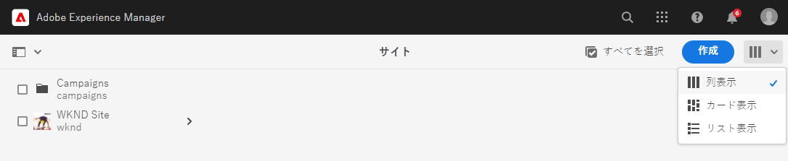
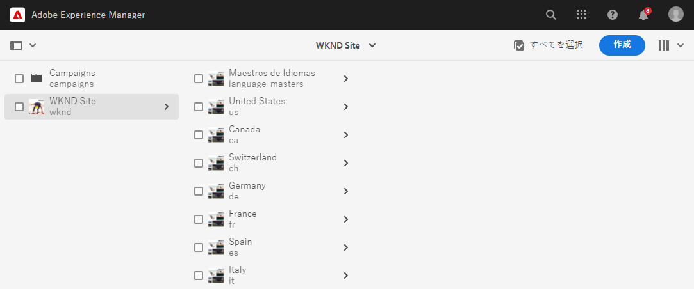
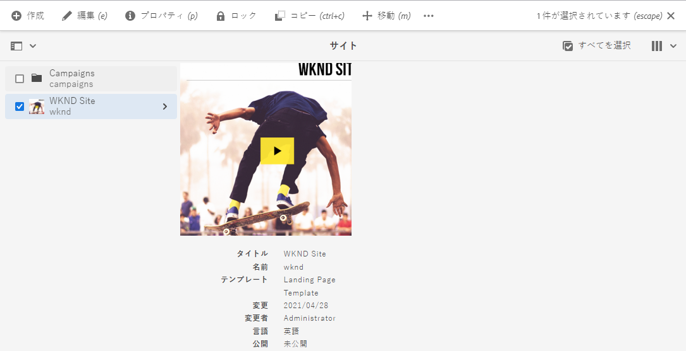
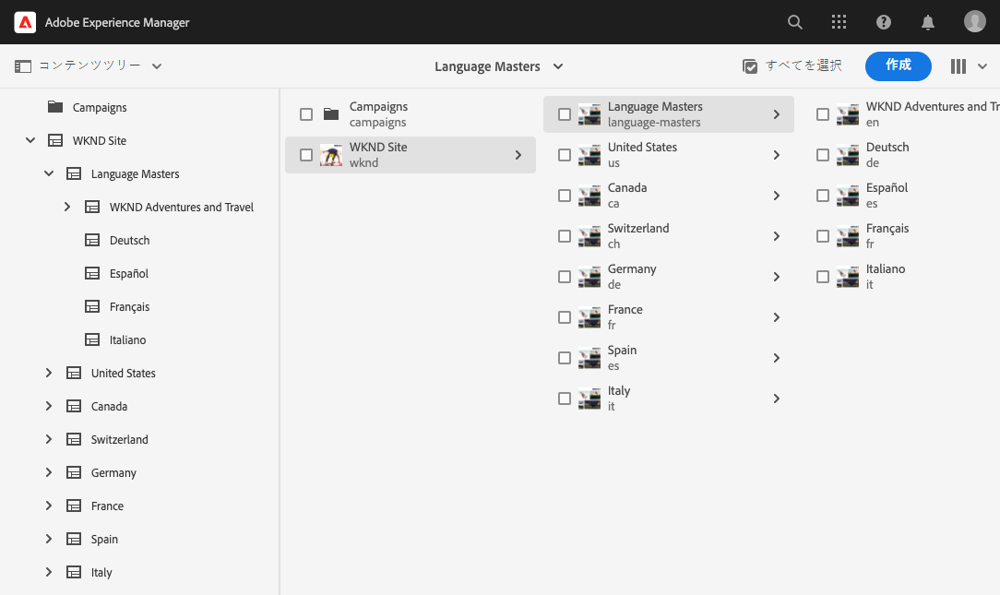
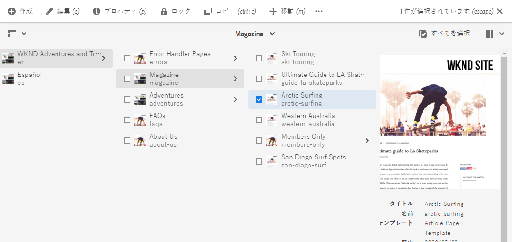
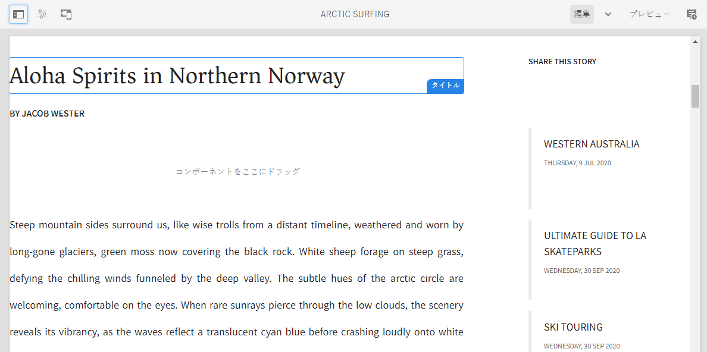

# AEM Sites Translationの概要 {#getting-started}

AEM Sitesコンテンツの整理方法とAEM翻訳ツールの仕組みについて説明します。

## これまでの説明内容 {#story-so-far}

AEM Sitesの翻訳ジャーニーの前のドキュメントで、[AEM SitesのコンテンツとAEM](learn-about.md)での翻訳方法について学び、AEM Sitesの基本理論を学び、次の作業を行う必要があります。

* AEM Sitesコンテンツ作成の基本概念を理解します。
* 翻訳のサポート方法については、AEMを参照してください。

この記事は、AEMでのコンテンツの保存と管理の仕組みと、AEM翻訳ツールを使用したコンテンツの翻訳方法を理解できるよう、これらの基本事項に基づいて構築されています。

## 目的 {#objective}

このドキュメントでは、AEMでサイトのコンテンツを翻訳し始める方法を説明します。 ドキュメントを読めば、以下が可能です。

* 翻訳に対するコンテンツ構造の重要性を理解します。
* AEMがコンテンツを保存する方法を理解します。
* AEMの翻訳ツールについて

## 要件と前提条件 {#requirements-prerequisites}

AEMコンテンツの翻訳を開始する前に、いくつかの要件があります。

### 知識 {#knowledge}

* CMSでのコンテンツの翻訳の経験
* 大規模なCMSの基本機能を使用した経験
* AEMの基本操作に関する実務知識がある
* 使用している翻訳サービスについて
* 翻訳するコンテンツの基本的な理解を得る

>[!TIP]
>
>AEMのような大規模なCMSの使用に慣れていない場合は、先に進む前に、[基本操作](/help/sites-cloud/authoring/getting-started/basic-handling.md)のドキュメントを確認することを検討してください。 基本操作のドキュメントはジャーニーに含まれていません。完了したら、このページに戻ってください。

### ツール {#tools}

* コンテンツの翻訳をテストするためのサンドボックスアクセス
* 目的の翻訳サービスに接続するための資格情報
* AEMの`project-administrators`グループのメンバーである

## AEMのコンテンツ保存方法 {#content-in-aem}

翻訳スペシャリストは、AEMによるコンテンツの管理方法を深く理解する必要はありません。 ただし、後でAEM翻訳ツールを使用する際には、基本概念と用語に精通していると便利です。 最も重要なのは、効果的に翻訳するために、独自のコンテンツとその構造を理解する必要があることです。

### サイトコンソール {#sites-console}

サイトコンソールは、コンテンツの構造の概要を提供し、コンテンツのナビゲーションを容易にし、新しいページの作成、ページの移動およびコピー、コンテンツの公開を行うことでコンテンツを管理します。

サイトコンソールにアクセスするには：

1. グローバルナビゲーションメニューで、**ナビゲーション** -> **サイト**&#x200B;をクリックまたはタップします。
1. サイトコンソールがコンテンツの最上位レベルに開きます。
1. ウィンドウの右上にある表示セレクターを使用して、**列表示**&#x200B;が選択されていることを確認します。

   

1. 列内の項目をタップまたはクリックすると、その項目の下に右側の列の列にコンテンツが表示されます。

   

1. 列内の項目のチェックボックスをタップまたはクリックすると、その項目が選択され、右側の列に選択した項目の詳細が表示され、上のツールバーに選択した項目で使用可能なアクションが表示されます。

   

1. 左上のパネルセレクターをタップまたはクリックして、コンテンツのツリー概要を表示する&#x200B;**コンテンツツリー**&#x200B;ビューを表示することもできます。

   

これらのシンプルなツールを使用すると、コンテンツ構造を直感的にナビゲートできます。

>[!NOTE]
>
>コンテンツアーキテクトは通常、コンテンツ構造を定義しますが、コンテンツ作成者はこの構造内にコンテンツを作成します。
>
>翻訳スペシャリストとして、その構造をナビゲートする方法とコンテンツの場所を理解する方法を簡単に理解することが重要です。

### ページエディター {#page-editor}

サイトコンソールを使用すると、コンテンツを移動し、構造の概要を表示できます。 個々のページの詳細を表示するには、サイトエディターを使用する必要があります。

ページを編集するには：

1. サイトコンソールを使用して、ページを検索して選択します。 個々のページを選択するには、そのページのチェックボックスをタップまたはクリックする必要があります。

   

1. ツールバーの「**編集**」オプションをタップします。
1. サイトエディターが開き、選択したページが編集用に新しいブラウザータブに読み込まれます。
1. コンテンツをマウスオーバーまたはタップすると、個々のコンポーネントのセレクターが表示されます。 コンポーネントは、ページを構成するドラッグ&amp;ドロップの構成要素です。

   

ブラウザーの「 」タブに戻ると、いつでもサイトコンソールに戻ることができます。 サイトエディターを使用すると、コンテンツ作成者とオーディエンスに表示されるページのコンテンツをすばやく表示できます。

>[!NOTE]
>
>コンテンツ作成者は、サイトエディターを使用してサイトコンテンツを作成します。
>
>翻訳スペシャリストとして、サイトエディターを使用してそのコンテンツの詳細を表示する方法を簡単に理解することが重要です。

## 構造がキー {#content-structure}

AEMのコンテンツは、その構造に基づいて駆動されます。 AEMではコンテンツ構造に関していくつかの要件が課されますが、プロジェクト計画の一環としてコンテンツ階層を慎重に検討すると、翻訳がより簡単になります。

>[!TIP]
>
>AEMプロジェクトの最初に翻訳を計画します。 プロジェクトマネージャーやコンテンツアーキテクトとの緊密な連携を早めにおこなう。
>
>国際化プロジェクトマネージャーは、翻訳するコンテンツと翻訳しないコンテンツ、および地域やローカルのコンテンツプロデューサーが変更する翻訳コンテンツを定義する責任を負う個人として必要になる場合があります。

## 推奨されるコンテンツ構造 {#recommended-structure}

以前に推奨されたように、コンテンツアーキテクトと協力して、独自のプロジェクトに適したコンテンツ構造を決定します。 ただし、次に示す構造は、非常に効果的で、実証済みでシンプルで直感的です。

`/content`の下に、プロジェクトのベースフォルダーを定義します。

```text
/content/<your-project>
```

コンテンツをオーサリングする言語を言語ルートと呼びます。 この例では、これは英語で、このパスの下に配置する必要があります。

```text
/content/<your-project>/en
```

ローカライズが必要になる可能性のあるプロジェクトコンテンツはすべて、言語ルートの下に配置する必要があります。

```text
/content/<your-project>/en/<your-project-content>
```

翻訳は、言語ルートの横に兄弟フォルダーとして作成し、その言語のISO-2言語コードを表すフォルダー名を付ける必要があります。 例えば、ドイツ語のパスは次のようになります。

```text
/content/<your-project>/de
```

>[!NOTE]
>
>コンテンツアーキテクトは、通常、これらの言語フォルダーを作成します。 翻訳ジョブが作成されていない場合、AEMは後で翻訳ジョブを作成できません。

最終的な構造は次のようになります。

```text
/content
    |- your-project
        |- en
            |- some
            |- exciting
            |- sites
            |- content
        |- de
        |- fr
        |- it
        |- ...
    |- another-project
    |- ...
```

コンテンツの特定のパスは、後で翻訳を設定する際に必要になるので、メモしておく必要があります。

>[!NOTE]
>
>多くの場合、翻訳スペシャリストと協力して、コンテンツ構造を定義するのはコンテンツアーキテクトの責任です。
>
>完全性を考慮して、ここで詳しく説明します。

## AEM Translation Tools {#translation-tools}

これで、サイトのコンソールとエディター、およびコンテンツ構造の重要性を理解したので、コンテンツの翻訳方法を見てみましょう。 AEMの翻訳ツールは非常に強力ですが、高いレベルで簡単に理解できます。

* **翻訳コネクタ**  — コネクタは、AEMと使用する翻訳サービスの間のリンクです。
* **翻訳ルール**  — 特定のパスの下で翻訳するコンテンツを定義します。
* **翻訳プロジェクト**  — 翻訳プロジェクトは、単一の翻訳作業として扱う必要があるコンテンツを収集し、翻訳の進行状況を追跡します。翻訳対象のコンテンツを送信し、翻訳サービスから返送します。

通常、コネクタはインスタンスに対して1回だけ設定し、プロジェクトごとにルールを設定します。 その後、翻訳プロジェクトを使用して、コンテンツを翻訳し、その翻訳を継続的に最新の状態に保ちます。

## 次の手順 {#what-is-next}

これで、AEM Sitesの翻訳ジャーニーのこの部分が完了し、次の作業をおこなう必要があります。

* 翻訳に対するコンテンツ構造の重要性を理解します。
* AEMがコンテンツを保存する方法を理解します。
* AEMの翻訳ツールについて

この知識に基づいてAEM Sitesの翻訳ジャーニーを継続し、次にドキュメント「[翻訳コネクタの設定](configure-connector.md)」を確認して、AEMを翻訳サービスに接続する方法を学びます。|

## その他のリソース {#additional-resources}

ドキュメント[翻訳コネクタの設定](configure-connector.md)を確認して、翻訳ジャーニーの次の部分に進むことをお勧めします。以下に、このドキュメントで取り上げたいくつかの概念について詳しく説明する、追加のオプションリソースを示します。

* [AEMの基本操作](/help/sites-cloud/authoring/getting-started/basic-handling.md)  — コンテンツを快適に検索したり、重要なタスクを実行したりできるAEM UIの基本について説明します。
* [翻訳するコンテンツの識別](/help/sites-cloud/administering/translation/rules.md)  — 翻訳ルールによって翻訳が必要なコンテンツが識別される方法を説明します。
* [翻訳統合フレームワークの設定](/help/sites-cloud/administering/translation/integration-framework.md)  — サードパーティの翻訳サービスと統合するための翻訳統合フレームワークの設定方法を説明します。
* [翻訳プロジェクトの管理](/help/sites-cloud/administering/translation/managing-projects.md)  - AEMで機械翻訳プロジェクトと人間翻訳プロジェクトの両方を作成および管理する方法を説明します。
