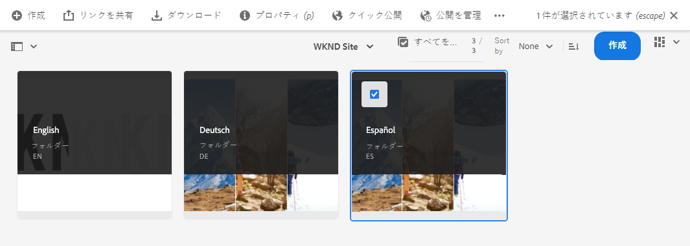
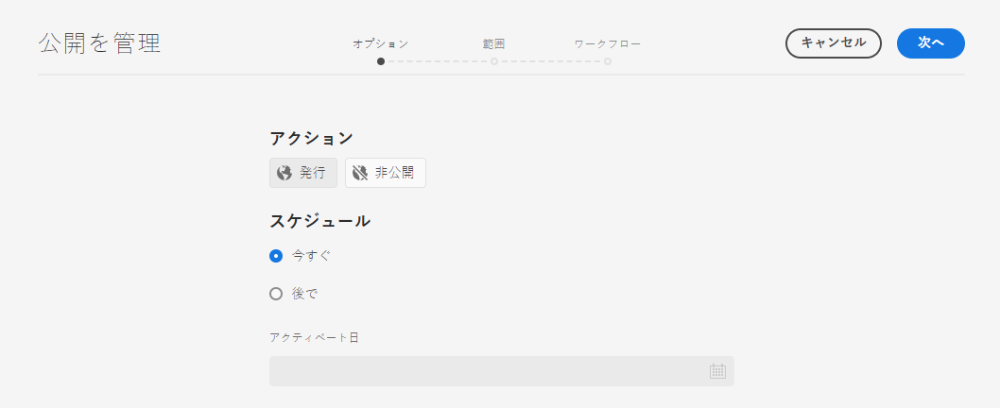
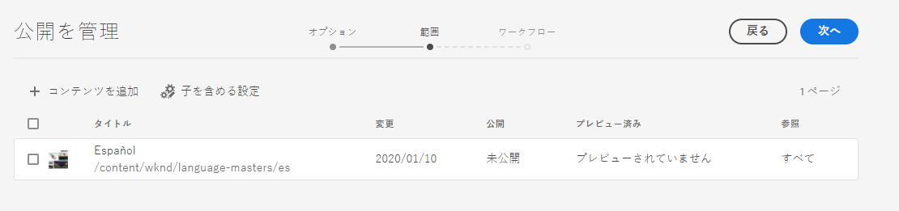
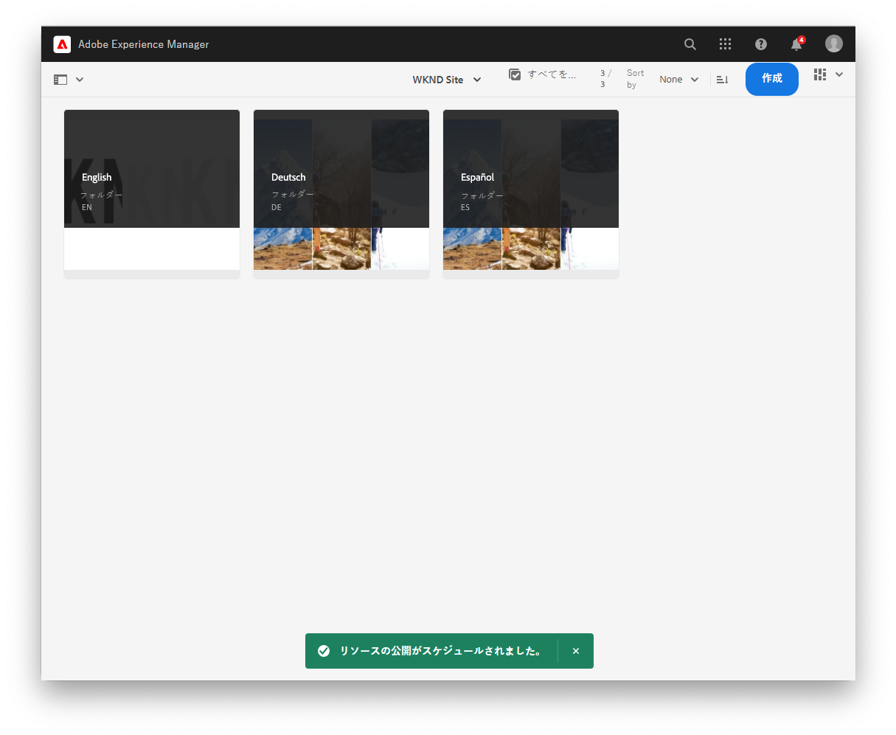
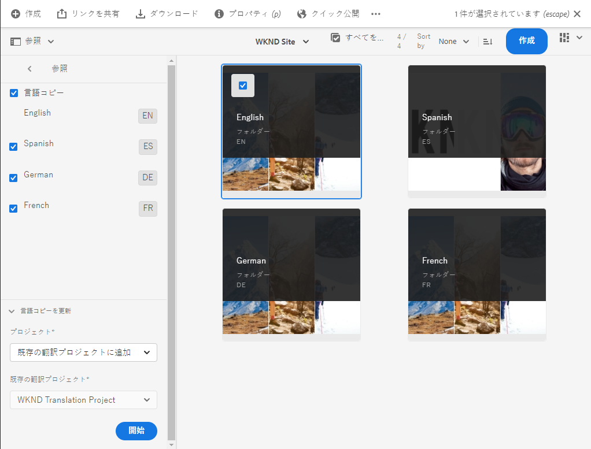
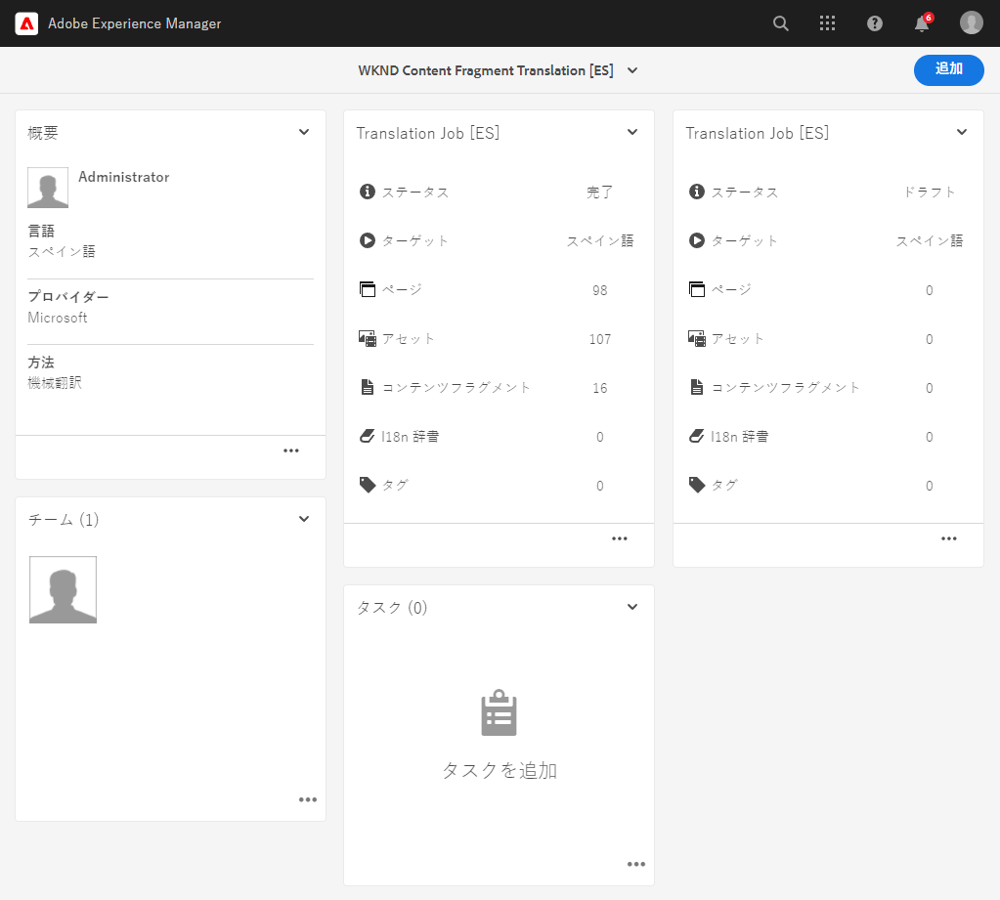
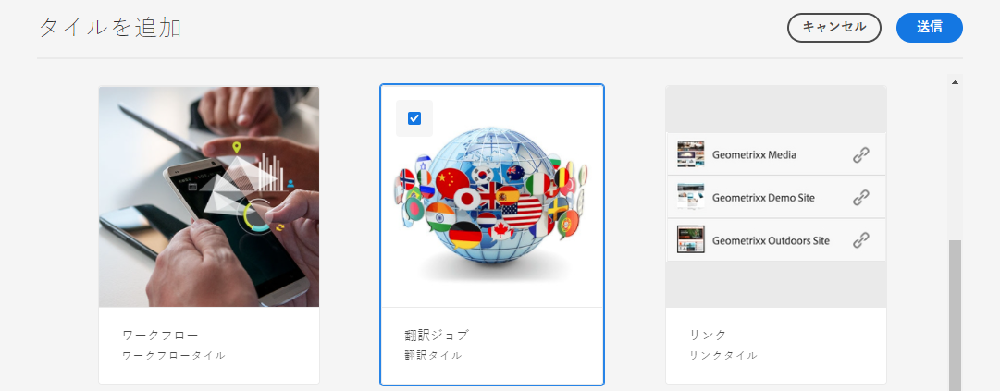
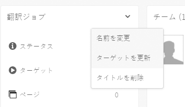
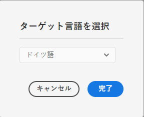

# 翻訳済みコンテンツの公開 {#publish-content}

翻訳済みコンテンツを公開し、コンテンツの更新に合わせて翻訳を更新する方法を説明します。

## これまでの説明内容 {#story-so-far}

AEM Sites翻訳ジャーニーの以前のドキュメント [ コンテンツの翻訳 ](configure-connector.md) では、AEM翻訳プロジェクトを使用してコンテンツを翻訳する方法について説明しました。 その結果、以下を達成できました。

* 翻訳プロジェクトの概要を理解する
* 新しい翻訳プロジェクトを作成できる
* 翻訳プロジェクトを使用してコンテンツを翻訳する

最初の翻訳が完了したので、この記事では次のステップとして、そのコンテンツを公開し、言語ルートにおける基になるコンテンツの変更に合わせて翻訳を更新する方法について説明します。

## 目的 {#objective}

このドキュメントを通じて、AEM でのコンテンツの公開方法と、継続的なワークフローを作成して翻訳を最新の状態に保つ方法を理解できるようになります。読み終えると、以下を達成できます。

* AEM のオーサー／パブリッシュモデルを理解する
* 翻訳済みコンテンツの公開方法を理解する
* 翻訳済みコンテンツの継続的な更新モデルを実装できる

## AEM のオーサー／パブリッシュモデル {#author-publish}

コンテンツを公開する前に、AEM のAEM のオーサー-パブリッシュモデルを理解しておくことをお勧めします。単純化すれば、AEM ではシステムのユーザーを 2 つのグループに分けます。

1. コンテンツやシステムを作成および管理するユーザー
1. システムからコンテンツを消費するユーザー

したがって、AEM は物理的に 2 つのインスタンスに分けられます。

1. **オーサー**&#x200B;インスタンスは、コンテンツ作成者と管理者がコンテンツの作成と管理に取り組む環境となるシステムです。
1. **パブリッシュ**&#x200B;インスタンスは、コンテンツをコンシューマーに配信するシステムです。

オーサーインスタンスでコンテンツを作成したあと、そのコンテンツを消費できるようにするには、コンテンツをパブリッシュインスタンスに転送する必要があります。オーサーからパブリッシュに転送するプロセスを&#x200B;**公開**&#x200B;と呼びます。

## 翻訳済みコンテンツの公開 {#publishing}

翻訳されたコンテンツの状態に満足したら、そのコンテンツを公開して、アクセスし消費できるようにする必要があります。このタスクは通常、翻訳担当者が行うものではありませんが、ワークフロー全体を説明するためにここに記載しています。

>[!NOTE]
>
>通常、翻訳が完了すると、翻訳の公開準備が整ったことが翻訳担当者からコンテンツ所有者に通知されます。そのあと、コンテンツ所有者がコンテンツを公開します。
>
>以下の手順は説明に漏れがないように記載されています。

翻訳を公開する最も簡単な方法は、プロジェクトフォルダーに移動することです。

```text
/content/<your-project>/
```

このパスの配下に翻訳言語ごとのサブフォルダーがあり、公開するサブフォルダーを選択できます。

1. **ナビゲーション**／**サイト**／**ファイル**&#x200B;に移動し、プロジェクトフォルダーを開きます。
1. ここに、言語ルートフォルダーとその他すべての言語フォルダーが表示されます。公開するローカライズ済みの言語（1 つまたは複数）を選択します。
   
1. 「**公開を管理**」を選択します。
1. **公開を管理**&#x200B;ウィンドウで、「**アクション**」の下の「**公開**」と、「**スケジュール**」の下の「**今すぐ**」が自動的に選択されていることを確認します。「**次へ**」を選択します。
   
1. 次の&#x200B;**公開を管理**&#x200B;ウィンドウで、適切なパス（1 つまたは複数）が選択されていることを確認します。「**公開**」を選択します。
   
1. AEM の画面の下部にポップアップメッセージが表示されて、公開アクションが確認されます。
   

翻訳済みコンテンツが公開されました。これで、そのコンテンツにアクセスして消費できるようになりました。

>[!TIP]
>
>公開時に複数の項目（複数の言語フォルダー）を選択して、複数の翻訳を一度に公開できます。

コンテンツを公開する際には、公開時刻のスケジュール設定などの追加オプションがありますが、それについてはこのジャーニーの範囲外ですので、ここでは扱いません。詳しくは、このドキュメントの最後にある[その他のリソース](#additional-resources)の節を参照してください。

## 翻訳済みコンテンツの更新 {#updating-translations}

翻訳が 1 回で済むことはほとんどありません。通常、コンテンツ作成者は、初回翻訳が完了した後も、引き続き言語ルートのコンテンツの追加や変更を行います。つまり、翻訳済みコンテンツも更新する必要があります。

翻訳の更新頻度と、更新を実行する前にどのような決定プロセスに従うかを具体的なプロジェクト要件で定義します。翻訳を更新する場合の AEM のプロセスは非常にシンプルです。初回翻訳が翻訳プロジェクトに基づいていたように、更新の場合も翻訳プロジェクトに基づいています。

ただし、前述のとおり、翻訳プロジェクトを自動的に作成するか手動で作成するかで、プロセスが若干異なります。

### 自動作成された翻訳プロジェクトの更新 {#updating-automatic-project}

1. **ナビゲーション**／**アセット**／**ファイル**&#x200B;に移動します。AEM では、コンテンツは `/content` の配下に保存されています。
1. プロジェクトの言語ルートを選択します。ここでは、`/content/wknd/en` を選択しました。
1. パネルセレクターを選択し、「**参照**」パネルを表示します。
1. 「**言語コピー**」を選択します。
1. 「**言語コピー**」チェックボックスをオンにします。
1. 参照パネル下部の「**言語コピーを更新**」セクションを展開します。
1. 「**プロジェクト**」ドロップダウンリストで「**既存の翻訳プロジェクトに追加**」を選択します。
1. 「**既存の翻訳プロジェクト**」ドロップダウンリストで、初回翻訳用に作成したプロジェクトを選択します。
1. 「**更新**」を選択します。



コンテンツが既存の翻訳プロジェクトに追加されます。翻訳プロジェクトを表示するには、次の操作を実行します。

1. **ナビゲーション**／**プロジェクト**&#x200B;に移動します。
1. 更新したプロジェクトを選択します。
1. 更新した言語または言語の 1 つを選択します。

新しいジョブカードがプロジェクトに追加されたことがわかります。この例では、別のスペイン語翻訳が追加されました。



お気づきかもしれませんが、新しいカードに表示される統計情報が異なります。これは、最後の翻訳以降に変更された内容を AEM が認識し、翻訳が必要なコンテンツのみを対象とするからです。これには、更新されたコンテンツの再翻訳と、新しいコンテンツの初回翻訳が含まれます。

これ以降は、[ 初回翻訳と同じように翻訳ジョブを開始および管理 ](translate-content.md#using-translation-project) します。

### 手動作成された翻訳プロジェクトの更新 {#updating-manual-project}

翻訳を更新するには、更新されたコンテンツの翻訳を担当する新しいジョブを既存のプロジェクトに追加します。

1. **ナビゲーション**／**プロジェクト**&#x200B;に移動します。
1. アップデートするプロジェクトを選択します。
1. ウィンドウの上部にある「**追加**」ボタンを選択します。
1. **タイルを追加**&#x200B;ウィンドウで、「**翻訳ジョブ**」を選択し、次に「**送信**」を選択します。

   

1. 新しい翻訳ジョブのカードで、カードの上部にある山形ボタンを選択し、「**ターゲットを更新**」を選択して新しいジョブのターゲット言語を定義します。

   

1. **ターゲット言語を選択**&#x200B;ダイアログで、ドロップダウンを使用して言語を選択し、「**完了**」を選択します。

   

1. 新しい翻訳ジョブのターゲット言語が設定されたら、ジョブカードの下部にある省略記号ボタンを選択して、ジョブの詳細を表示します。
1. ジョブを初めて作成したとき、ジョブは空です。**追加** ボタンをタップまたはクリックし、（翻訳プロジェクトの初回作成時と同じように [ パスブラウザーを使用して、ジョブにコンテンツを追加し ](translate-content.md##manually-creating) す。

>[!TIP]
>
>パスブラウザーの強力なフィルターは、更新されたコンテンツのみを見つけるのに役立ちます。
>
>パスブラウザーについて詳しくは、[ その他のリソース ](#additional-resources) の節を参照してください。

これ以降は、[ 初回翻訳と同じように翻訳ジョブを開始および管理 ](translate-content.md#using-translation-project) します。

## ジャーニーの終了 {#end-of-journey}

おめでとうございます。これで、AEM Sites 翻訳ジャーニーが完了しました。その結果、以下を達成できました。

* AEM のコンテンツ管理機能を基本的に理解する
* AEM の翻訳機能とその Sites コンテンツとの関連を理解する
* 独自のコンテンツの翻訳を開始できるようにします。

これで、AEM で独自のコンテンツを翻訳する準備が整いました。ただし、AEM は強力なツールであり、その他にも使用可能なオプションが多数あります。このジャーニーで説明した機能について詳しくは、[その他のリソース](#additional-resources)の節で紹介しているその他のリソースを参照してください。

## その他のリソース {#additional-resources}

* [翻訳プロジェクトの管理](/help/sites-cloud/administering/translation/managing-projects.md) - 翻訳プロジェクトの詳細と、人間による翻訳のワークフローや多言語プロジェクトなどの追加機能について説明します。
* [オーサリングに関する概念](/help/sites-cloud/authoring/author-publish.md) - AEM のオーサー／パブリッシュモデルについて説明します。このドキュメントでは、コンテンツフラグメントではなくページのオーサリングに重点を置いていますが、概念はそのまま適用できます。
* [ページの公開](/help/sites-cloud/authoring/sites-console/publishing-pages.md) - コンテンツの公開時に使用できるその他の機能について説明します。このドキュメントでは、コンテンツフラグメントではなくページのオーサリングに重点を置いていますが、概念はそのまま適用できます。
* [オーサリング環境とツール](/help/sites-cloud/authoring/path-selection.md#path-selection) - AEM には、堅牢なパスブラウザーなど、コンテンツを整理および編集するための様々なメカニズムが用意されています。このドキュメントでは、それらについて説明します。
