# コンテンツを翻訳 {#translate-content}

翻訳コネクタとルールを使用して、コンテンツを翻訳します。

## これまでの説明内容 {#story-so-far}

AEM Sitesの翻訳ジャーニーの前のドキュメントでは、 AEMの翻訳ルールを使用して翻訳コンテンツを識別する方法を学習した、[翻訳ルールの設定](translation-rules.md)を学びました。 次の手順を実行します。

* 翻訳ルールの動作を理解します。
* 独自の翻訳ルールを定義できる。

コネクタと翻訳のルールが設定されたので、この記事では、次の手順でAEM Sitesコンテンツを翻訳します。

## 目的 {#objective}

このドキュメントでは、AEM翻訳プロジェクトの使用方法と、コネクタおよび翻訳ルールを使用してコンテンツを翻訳する方法を説明します。 読み終えると、以下を達成できます。

* 翻訳プロジェクトの概要を説明します。
* 新しい翻訳プロジェクトを作成できる。
* 翻訳プロジェクトを使用して、AEM Sitesのコンテンツを翻訳します。

## 翻訳プロジェクトの作成 {#creating-translation-project}

翻訳プロジェクトを使用すると、AEM コンテンツの翻訳を管理できます。翻訳プロジェクトでは、翻訳作業を一元的に把握できるように、翻訳するコンテンツを1か所で収集します。

翻訳プロジェクトにコンテンツを追加すると、翻訳ジョブが作成されます。 リソースで実行される人間による翻訳と機械翻訳のワークフローの管理に使用するコマンドとステータス情報がジョブによって提供されます。

翻訳プロジェクトは、次の2つの方法で作成できます。

1. コンテンツの言語ルートを選択し、コンテンツパスに基づいてAEMで翻訳プロジェクトを自動的に作成します。
1. 空のプロジェクトを作成し、翻訳プロジェクトに追加するコンテンツを手動で選択する

どちらも、通常、翻訳を実行するペルソナによって異なる有効なアプローチです。

* 多くの場合、翻訳プロジェクトマネージャー(TPM)は、翻訳プロジェクトに対してコンテンツを手動で選択する柔軟性を必要とします。
* コンテンツ所有者も翻訳を担当する場合は、AEMで選択したコンテンツパスに基づいてプロジェクトを自動的に作成する方が簡単です。

両方のアプローチについては、以降の節で説明します。

### コンテンツパスに基づく翻訳プロジェクトの自動作成 {#automatically-creating}

翻訳も担当するコンテンツ所有者の場合、AEMで翻訳プロジェクトを自動的に作成するほうが簡単です。 コンテンツパスに基づいてAEMで翻訳プロジェクトを自動的に作成するには：

1. **ナビゲーション** -> **サイト**&#x200B;に移動し、プロジェクトをタップまたはクリックします。
1. プロジェクトの言語ルートを見つけます。 例えば、言語ルートが英語の場合、`/content/<your-project>/en`。
   * 最初の翻訳の前に、他の言語フォルダーは空のプレースホルダーであることに注意してください。 これらは通常、コンテンツアーキテクトによって作成されます。
1. プロジェクトの言語ルートを見つけます。
1. パネルセレクターをタップまたはクリックし、**参照**&#x200B;パネルを表示します。
1. 「**言語コピー**」をタップまたはクリックします。
1. 「**言語コピー**」チェックボックスをオンにします。
1. 参照パネルの下部にある「**言語コピーを更新**」セクションを展開します。
1. 「**プロジェクト**」ドロップダウンで、「**翻訳プロジェクトを作成**」を選択します。
1. 翻訳プロジェクトに適したタイトルを指定します。
1. 「**更新**」をタップまたはクリックします。

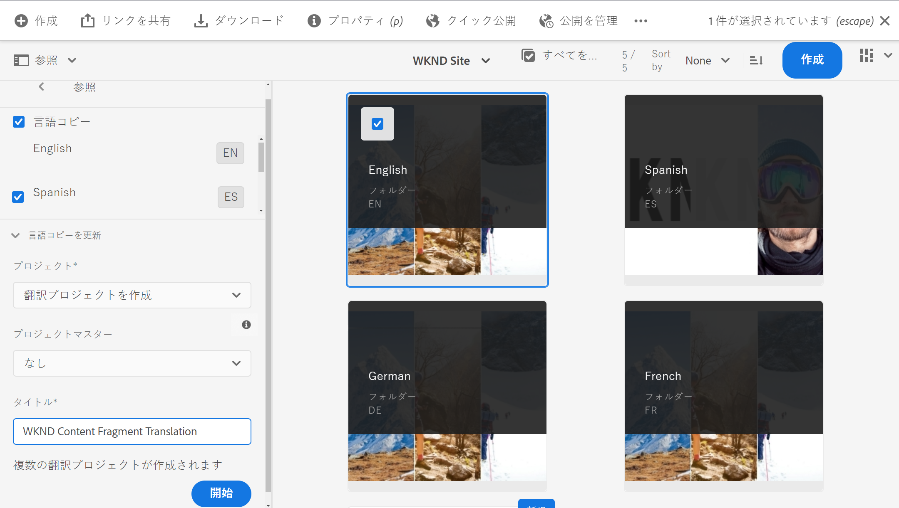

プロジェクトが作成されたことを示すメッセージが表示されます。

>[!NOTE]
>
>翻訳言語に必要な言語構造が、コンテンツ構造の[定義の一部として既に作成されていることを前提としています。](getting-started.md#content-structure) これは、コンテンツアーキテクトと共同でおこなう必要があります。
>
>前述の手順で説明したように、言語フォルダーが事前に作成されない場合は、言語コピーを作成できません。

### コンテンツを選択して翻訳プロジェクトを手動で作成する {#manually-creating}

翻訳プロジェクトマネージャーの場合、翻訳プロジェクトに含める特定のコンテンツを手動で選択する必要が生じることがよくあります。 手動翻訳プロジェクトを作成するには、まず空のプロジェクトを作成し、そのプロジェクトに追加するコンテンツを選択する必要があります。

1. **ナビゲーション** -> **プロジェクト**&#x200B;に移動します。
1. 「**作成** -> **フォルダー**」をタップまたはクリックして、プロジェクト用のフォルダーを作成します。
   * これはオプションですが、翻訳作業の整理に役立ちます。
1. **プロジェクト**&#x200B;を作成ウィンドウで、フォルダーの&#x200B;**タイトル**&#x200B;を追加し、「**作成**」をタップまたはクリックします。

   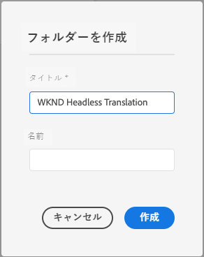

1. フォルダーをタップまたはクリックして、フォルダーを開きます。
1. 新しいプロジェクトフォルダーで、「**作成** -> **プロジェクト**」をタップまたはクリックします。
1. プロジェクトはテンプレートに基づいています。 **翻訳プロジェクト**&#x200B;テンプレートをタップまたはクリックして選択し、「**次へ**」をタップまたはクリックします。

   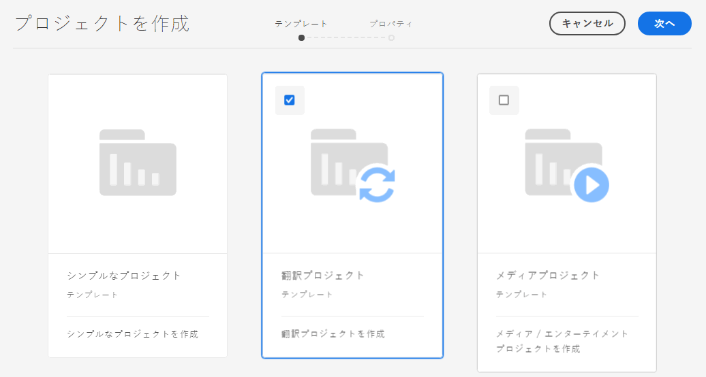

1. 「**基本**」タブで、新しいプロジェクトの名前を入力します。

   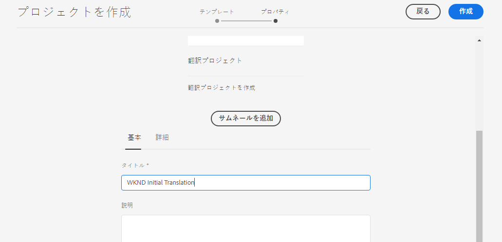

1. 「**詳細**」タブで、「**ターゲット言語**」ドロップダウンを使用して、コンテンツの翻訳先言語を選択します。 「**作成**」をタップまたはクリックします。

   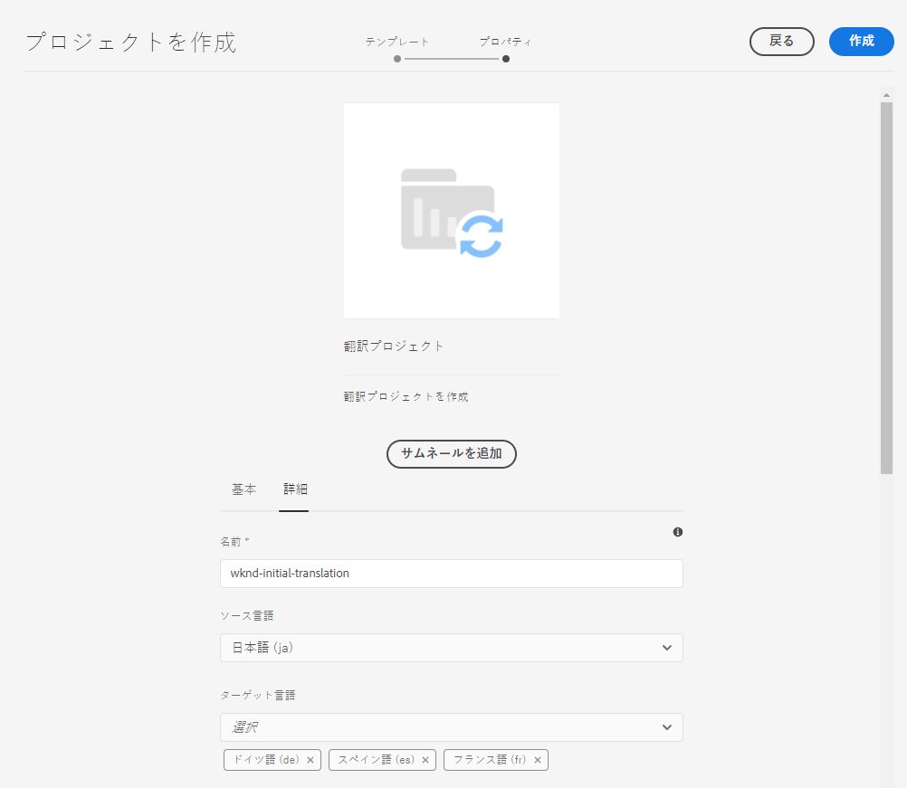

1. 確認ダイアログで「**開く**」をタップまたはクリックします。

   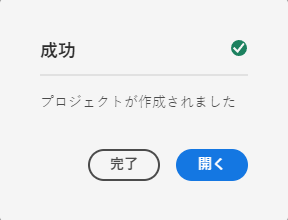

プロジェクトは作成されましたが、翻訳するコンテンツが含まれていません。 次の節では、プロジェクトの構造とコンテンツの追加方法について詳しく説明します。

## 翻訳プロジェクトの使用 {#using-translation-project}

翻訳プロジェクトは、翻訳作業に関連するすべてのコンテンツとタスクを1か所で収集し、翻訳を簡単かつ簡単に管理できるように設計されています。

翻訳プロジェクトを表示するには：

1. **ナビゲーション** -> **プロジェクト**&#x200B;に移動します。
1. 前の節で作成したプロジェクトをタップまたはクリックします（状況に応じて、「コンテンツパスに基づく翻訳プロジェクトの自動作成」](#automatically-creating)または「[コンテンツを選択して翻訳プロジェクトを手動で作成」）。[](#manually-creating)

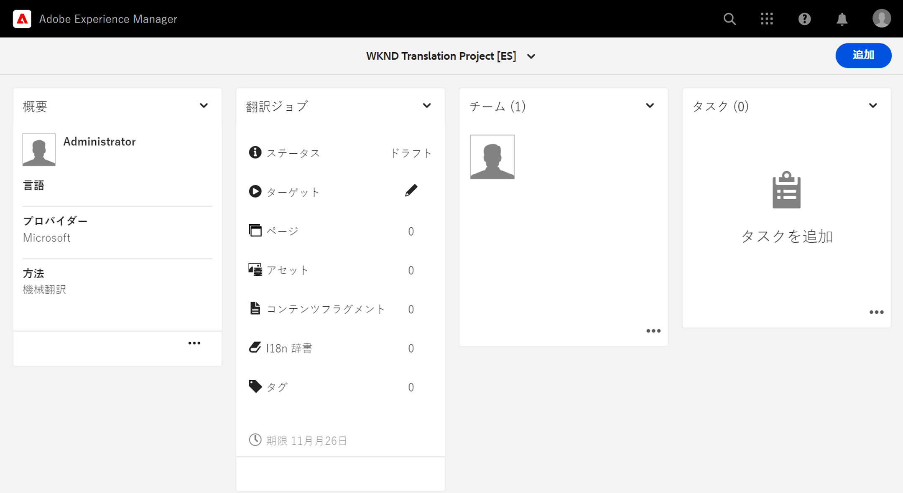

プロジェクトは複数のカードに分かれています。

* **概要**  — このカードには、所有者、言語、翻訳プロバイダーなど、プロジェクトの基本的なヘッダー情報が表示されます。
* **翻訳ジョブ**  — このカードまたは表示されるカードは、ステータス、アセット数など、実際の翻訳ジョブの概要を提供します。一般に、ジョブ名にISO-2言語コードが追加された言語ごとに1つのジョブが存在します。
   * [が翻訳ジョブを自動的に作成する場合、](#automatically-creating) AEMは非同期でジョブを作成するので、プロジェクト内にすぐには表示されない場合があります。
* **チーム**  — このカードには、この翻訳プロジェクトで共同作業を行っているユーザーが表示されます。このトピックでは扱いません。
* **タスク**  — 項目やワークフロー項目の実行など、コンテンツの翻訳に関連する追加タスク。このトピックでは扱いません。

AEMでの翻訳フローをより深く理解するには、プロジェクト設定を変更すると便利です。 この手順は、実稼動用の翻訳には必要ありませんが、プロセスの理解に役立ちます。

1. **概要**&#x200B;カードで、カードの下部にある省略記号ボタンをタップまたはクリックします。
1. 「**詳細**」タブで、「**昇格後にローンチを削除**」オプションのチェックを外します。

   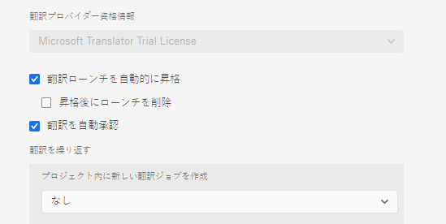

1. 「**保存して閉じる**」をタップまたはクリックします。

これで、翻訳プロジェクトを使用する準備が整いました。 翻訳プロジェクトの使用方法は、作成方法によって異なります。AEMによって自動的に、または手動で。

### 自動作成された翻訳プロジェクトの使用 {#using-automatic-project}

翻訳プロジェクトを自動的に作成する場合、AEMは、以前に定義した翻訳ルールに基づいて、選択したパスの下のコンテンツを評価します。 この評価に基づいて、翻訳が必要なコンテンツを新しい翻訳プロジェクトに抽出します。

このプロジェクトに含まれるコンテンツの詳細を表示するには：

1. **翻訳ジョブ**&#x200B;カードの下部にある省略記号ボタンをタップまたはクリックします。
1. **翻訳ジョブ**&#x200B;ウィンドウに、ジョブ内のすべての項目が表示されます。

   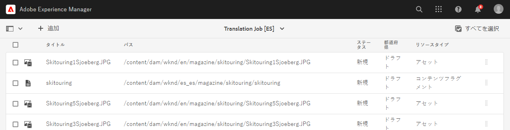

1. 1行をタップまたはクリックすると、その行の詳細が表示されます。1行は、翻訳する複数のコンテンツ項目を表す場合があることに注意してください。
1. 行項目の「選択」チェックボックスをタップまたはクリックして、追加のオプション（ジョブから削除するオプションやサイトコンソールで表示するオプションなど）を表示します。

   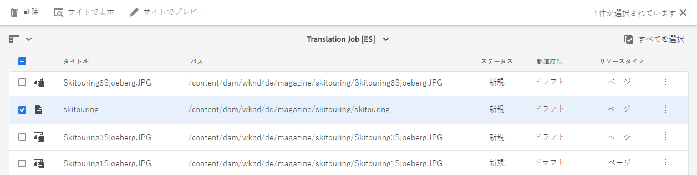

通常、翻訳ジョブのコンテンツは、**翻訳ジョブ**&#x200B;ウィンドウの&#x200B;**状態**&#x200B;列で示される&#x200B;**ドラフト**&#x200B;状態で開始します。

翻訳ジョブを開始するには、翻訳プロジェクトの概要に戻り、**翻訳ジョブ**&#x200B;カードの上部にある山形記号のボタンをタップまたはクリックし、「**開始**」を選択します。

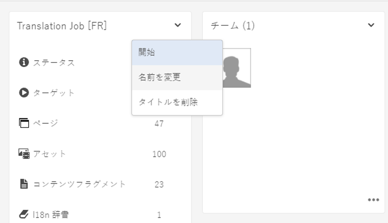

AEMは、翻訳設定およびコネクタと通信し、コンテンツを翻訳サービスに送信するようになります。 **翻訳ジョブ**&#x200B;ウィンドウに戻り、エントリの&#x200B;**状態**&#x200B;列を表示すると、翻訳の進行状況を確認できます。

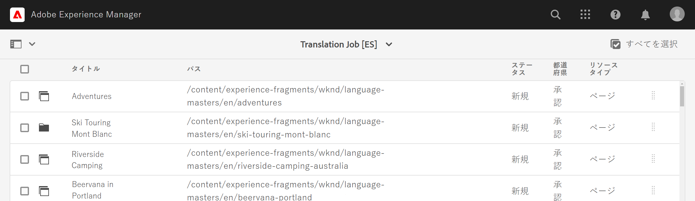

機械翻訳は自動的に&#x200B;**承認済み**&#x200B;の状態で返されます。 人間翻訳は、より多くのインタラクションを可能にしますが、このジャーニーの範囲を超えています。

>[!TIP]
>
>翻訳ジョブの処理には時間がかかる場合があります。翻訳項目が&#x200B;**ドラフト**&#x200B;から&#x200B;**処理中の翻訳**&#x200B;から&#x200B;**レビューの準備**&#x200B;に移動してから、**承認済み**&#x200B;の状態になります。 これは期待通りです。

>[!NOTE]
>
>前の節で説明したように、「昇格後にローンチを削除&#x200B;****」プロジェクトオプションを非アクティブ化しなかった場合、翻訳された項目は「**削除**」の状態で表示されます。 [](#using-translation-project)翻訳された項目が到達すると、AEMは翻訳レコードを自動的に破棄するので、これは正常です。 翻訳済みの項目は言語コピーとしてインポートされ、必要なくなった翻訳レコードのみが削除されました。
>
>これが不明な点は気にしないでください。 これらはAEMの仕組みの詳細で、ジャーニーの理解には影響しません。 AEMでの翻訳の処理方法を詳しく調べたい場合は、この記事の最後にある[追加リソース](#additional-resources)の節を参照してください。

### 手動で作成した翻訳プロジェクトの使用 {#using-manual-project}

翻訳プロジェクトを手動で作成する場合、AEMは必要なジョブを作成しますが、それらのジョブに含めるコンテンツは自動的には選択されません。 これにより、翻訳プロジェクトマネージャーは、翻訳するコンテンツを柔軟に選択できます。

翻訳ジョブにコンテンツを追加するには：

1. **翻訳ジョブ**&#x200B;カードの1つの下部にある省略記号ボタンをタップまたはクリックします。
1. ジョブにコンテンツが含まれていないことを確認します。 ウィンドウ上部の「**追加**」ボタンをタップまたはクリックし、ドロップダウンから「**アセット/ページ**」を選択します。

   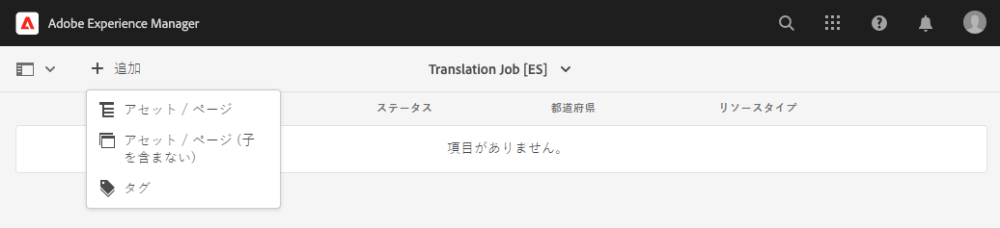

1. パスブラウザーが開き、追加するコンテンツを具体的に選択できます。 コンテンツを探し、タップまたはクリックして選択します。

   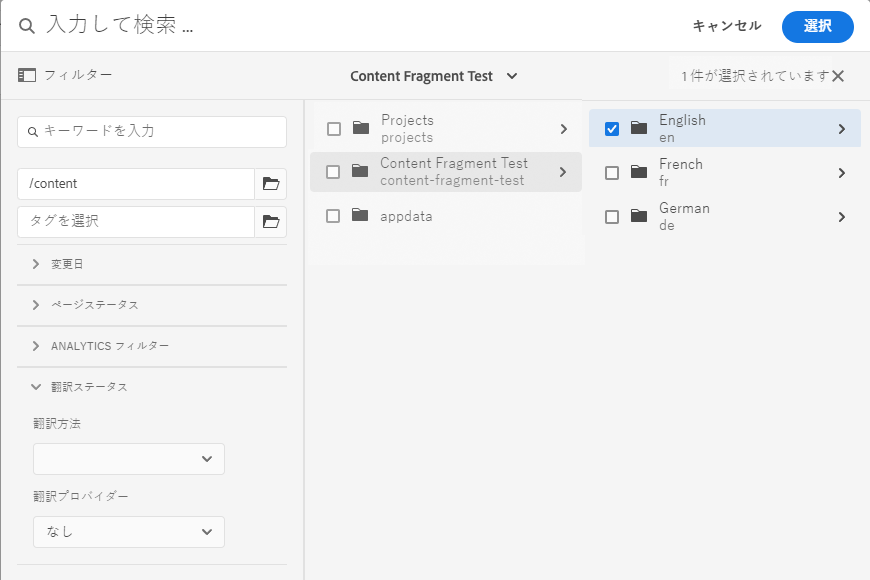

1. 「**選択**」をタップまたはクリックして、選択したコンテンツをジョブに追加します。
1. **翻訳**&#x200B;ダイアログで、**言語コピーを作成**&#x200B;するように指定します。

   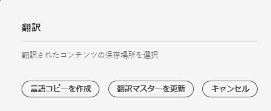

1. これで、コンテンツがジョブに含まれます。

   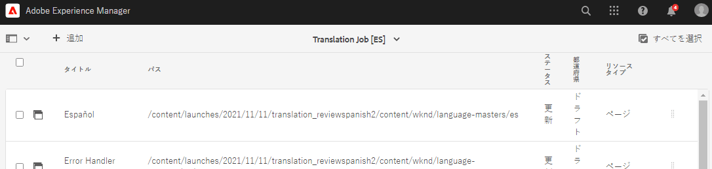

1. 行項目の「選択」チェックボックスをタップまたはクリックして、追加のオプション（ジョブから削除するオプションやサイトコンソールで表示するオプションなど）を表示します。

   

1. これらの手順を繰り返して、必要なコンテンツをすべてジョブに含めます。

>[!TIP]
>
>パスブラウザーは、コンテンツの検索、フィルタリング、ナビゲーションを可能にする強力なツールです。 「**コンテンツのみ/フィルター**」ボタンをタップまたはクリックしてサイドパネルを切り替え、「**変更日**」や「**翻訳ステータス**」などの詳細フィルターを表示します。
>
>パスブラウザーの詳細については、[追加リソースの節を参照してください。](#additional-resources)

前の手順を使用して、プロジェクトのすべての言語（ジョブ）に必要なコンテンツを追加できます。 コンテンツをすべて選択したら、翻訳を開始できます。

通常、翻訳ジョブのコンテンツは、**翻訳ジョブ**&#x200B;ウィンドウの&#x200B;**状態**&#x200B;列で示される&#x200B;**ドラフト**&#x200B;状態で開始します。

翻訳ジョブを開始するには、翻訳プロジェクトの概要に戻り、**翻訳ジョブ**&#x200B;カードの上部にある山形記号のボタンをタップまたはクリックし、「**開始**」を選択します。


AEMは、翻訳設定およびコネクタと通信し、コンテンツを翻訳サービスに送信するようになります。 **翻訳ジョブ**&#x200B;ウィンドウに戻り、エントリの&#x200B;**状態**&#x200B;列を表示すると、翻訳の進行状況を確認できます。


機械翻訳は自動的に&#x200B;**承認済み**&#x200B;の状態で返されます。 人間翻訳は、より多くのインタラクションを可能にしますが、このジャーニーの範囲を超えています。

>[!TIP]
>
>翻訳ジョブの処理には時間がかかる場合があります。翻訳項目が&#x200B;**ドラフト**&#x200B;から&#x200B;**処理中の翻訳**&#x200B;から&#x200B;**レビューの準備**&#x200B;に移動してから、**承認済み**&#x200B;の状態になります。 これは期待通りです。

>[!NOTE]
>
>前の節で説明したように、「昇格後にローンチを削除&#x200B;****」プロジェクトオプションを非アクティブ化しなかった場合、翻訳された項目は「**削除**」の状態で表示されます。 [](#using-translation-project)翻訳された項目が到達すると、AEMは翻訳レコードを自動的に破棄するので、これは正常です。 翻訳済みの項目は言語コピーとしてインポートされ、必要なくなった翻訳レコードのみが削除されました。
>
>これが不明な点は気にしないでください。 これらはAEMの仕組みの詳細で、ジャーニーの理解には影響しません。 AEMでの翻訳の処理方法を詳しく調べたい場合は、この記事の最後にある[追加リソース](#additional-resources)の節を参照してください。

## 翻訳済みコンテンツのレビュー {#reviewing}

[前述のように、](#using-translation-project) 機械翻訳コンテンツは、ステータスが「承認済み」のAEMに戻りま **** す。これは、機械翻訳が使用されているので、人が介入する必要がないと仮定しているからです。ただし、翻訳されたコンテンツをレビューすることはもちろん可能です。

完了した翻訳ジョブに移動し、チェックボックスをタップまたはクリックして行項目を選択します。 アイコン&#x200B;**Sitesでのプレビュー**&#x200B;がツールバーに表示されます。

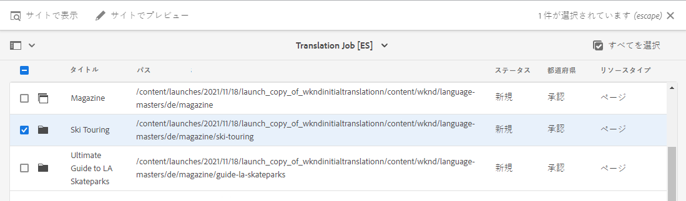

そのアイコンをタップまたはクリックすると、翻訳済みコンテンツがコンソールで開き、翻訳済みコンテンツの詳細が表示されます。

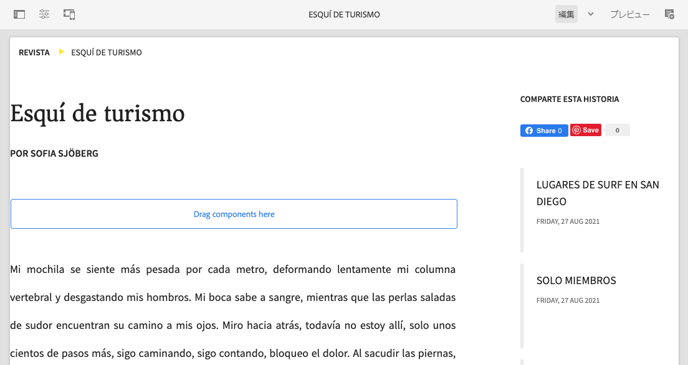

適切な権限があれば、翻訳済みのコンテンツを必要に応じて変更できますが、コンテンツの編集はこのジャーニーの範囲外です。 このトピックについて詳しくは、このドキュメントの最後にある「[その他のリソース](#additional-resources)」の節を参照してください。

このプロジェクトの目的は、簡単にアクセスし、明確な概要を得るために、翻訳に関連するすべてのリソースを1か所に収集することです。 ただし、翻訳済みアイテムの詳細を表示すると、翻訳自体が翻訳言語のサイトフォルダーに戻ります。 この例では、フォルダーは

```text
/content/<your-project>/es
```

**ナビゲーション** -> **サイト**&#x200B;経由でこのフォルダーに移動すると、翻訳されたコンテンツが表示されます。

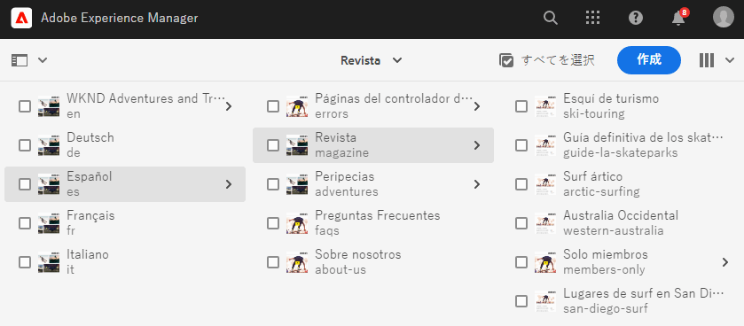

AEM翻訳フレームワークは、翻訳コネクタから翻訳を受け取り、言語ルートに基づいてコンテンツ構造を自動的に作成し、コネクタが提供する翻訳を使用します。

このコンテンツは公開されず、使用できないことを理解することが重要です。 このオーサーとパブリッシュの構造について学び、翻訳ジャーニーの次のステップで翻訳済みコンテンツの公開方法を確認します。

## 人間翻訳 {#human-translation}

翻訳サービスが人間による翻訳を提供する場合、レビュープロセスにはより多くのオプションが用意されています。 例えば、翻訳はステータス&#x200B;**ドラフト**&#x200B;でプロジェクトに再び届き、手動でレビューおよび承認または拒否する必要があります。

人間による翻訳は、このローカライゼーションのジャーニーの範囲外です。 このトピックについて詳しくは、このドキュメントの最後にある「[その他のリソース](#additional-resources)」の節を参照してください。 ただし、追加の承認オプション以外は、人間による翻訳のワークフローは、このジャーニーで説明する機械翻訳と同じです。

## 次の手順 {#what-is-next}

これで、AEM Sitesの翻訳ジャーニーのこの部分が完了し、次の作業をおこなう必要があります。

* 翻訳プロジェクトの概要を説明します。
* 新しい翻訳プロジェクトを作成できる。
* 翻訳プロジェクトを使用して、コンテンツを翻訳します。

この知識に基づいてAEM Sitesの翻訳ジャーニーを続けます。次に、翻訳済みコンテンツの公開方法と、言語ルートコンテンツの変更に応じた翻訳の更新方法に関するドキュメント「[翻訳済みコンテンツを公開](publish-content.md)」を確認します。

## その他のリソース {#additional-resources}

翻訳のジャーニーの次の部分に進むことをお勧めしますが、以下は、翻訳済みコンテンツの公開[ドキュメントで取り上げた概念に関する詳細を説明する、追加のオプションリソースです。](publish-content.md)

* [翻訳プロジェクトの管理](/help/sites-cloud/administering/translation/managing-projects.md)  — 翻訳プロジェクトの詳細と、人間による翻訳ワークフローや多言語プロジェクトなどの追加機能について説明します。
* [オーサリング環境とツール](/help/sites-cloud/authoring/fundamentals/environment-tools.md##path-selection)  - AEMは、堅牢なパスブラウザーを含む、コンテンツを整理および編集するための様々なメカニズムを提供します。
