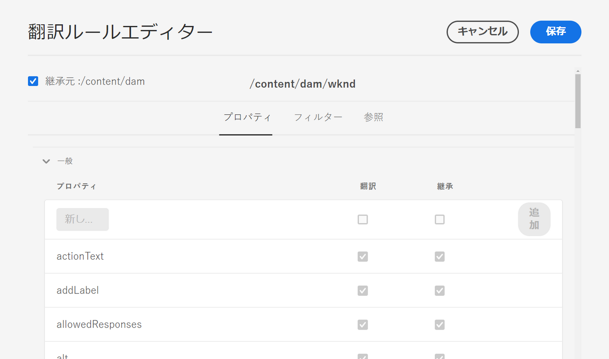

# 翻訳ルールの設定 {#configure-translation-rules}

翻訳するコンテンツを特定するための翻訳ルールを定義する方法を説明します。

## これまでの説明内容 {#story-so-far}

AEM Sites 翻訳ジャーニーの以前のドキュメント（[翻訳コネクタの設定](configure-connector.md)）では、翻訳コネクタをインストールおよび設定する方法について説明し、以下を達成できました。

* AEM の翻訳統合フレームワークの重要なパラメーターを理解する
* 翻訳サービスへの独自の接続をセットアップできる

コネクタがセットアップされたので、この記事では次のステップとして、翻訳が必要なコンテンツを特定する方法について説明します。

## 目的 {#objective}

このドキュメントを通じて、AEM の翻訳ルールを使用して翻訳コンテンツを特定する方法を理解できるようになります。このドキュメントを読み終えると、次のことが可能になります。

* 翻訳ルールの機能を理解する
* 独自の翻訳ルールを定義できる

## 翻訳ルール {#translation-rules}

AEM Sites ページには、多くの情報を含めることができます。プロジェクトのニーズによっては、ページ内のすべての情報を翻訳する必要がない場合があります。

翻訳ルールは、翻訳プロジェクトに含める、または翻訳プロジェクトから除外するコンテンツを特定します。コンテンツが翻訳されると、AEM はこれらのルールに基づいてコンテンツを抜き出すか組み込みます。このようにして、翻訳が必要なコンテンツのみが翻訳サービスに送信されます。

翻訳ルールには以下の情報が含まれます。

* ルールが適用されるコンテンツのパス
   * コンテンツの子ノードにもルールが適用されます
* 翻訳するコンテンツを含んだプロパティの名前
   * このプロパティは、特定のリソースタイプに固有のものでも、すべてのリソースタイプに固有のものでもかまいません

AEM はサイトページの翻訳ルールを自動的に作成しますが、各プロジェクトの要件は異なるので、ルールを審査しプロジェクトの必要に応じて適応させる方法を理解しておくことが重要です。

## 翻訳ルールの作成 {#creating-rules}

複数のルールを作成して、複雑な翻訳要件をサポートすることができます。例えば、取り組んでいるプロジェクトのうち一方では、すべてのページ情報を翻訳する必要があるのに対して、もう一方のページでは説明のみ翻訳が必要で、タイトルは翻訳せずにそのままにしておく、といった場合があります。

翻訳ルールは、このようなシナリオに対処するように設計されています。ただし、ここでは、単純な単一の設定に的を絞って、ルールの作成方法を具体的に説明します。

翻訳ルールの設定に使用できる&#x200B;**翻訳設定**&#x200B;コンソールがあります。

コンソールにアクセスするには：

1. **ツール**／**一般**&#x200B;に移動します。
1. 「**翻訳設定**」を選択します。

AEM は、すべてのコンテンツの翻訳ルールを自動的に作成します。これらのルールを表示するには：

1. `/content` コンテキストを選択します。
1. ツールバーの「**編集**」を選択します。
1. 翻訳ルールエディターが開き、AEM で `/content` パス用に自動的に作成されたルールが表示されます。

   

1. 翻訳されるページプロパティは、リストの「**一般**」セクションに表示されます。翻訳に明示的に含める既存のプロパティ名を追加または更新できます。
   1. 「**新しいプロパティ**」フィールドで、プロパティ名を入力します。「**翻訳**」オプションと「**継承**」オプションが自動的にオンになります。
   1. 「**追加**」を選択します。
   1. 翻訳が必要なすべてのフィールドについて、上記の手順を繰り返します。
   1. 「**保存**」を選択します。

これで、翻訳ルールが設定されました。

>[!NOTE]
>
>AEM は翻訳ルールを自動的に作成します。簡単な翻訳セットアップの場合や、翻訳ワークフローをテストする場合は、新しいルールを作成する必要はありません。また、自動的に作成された既存のルールを変更する必要もありません。これらの手順の詳細を提示することで、ルールの動作を説明し、AEM による翻訳の処理方法に関するコンテキストを提供します。

>[!TIP]
>
>また、翻訳設定コンソールの「**コンテキストを追加**」ボタンをタップまたはクリックして、特定のパスまたはプロジェクトだけのルールを作成することもできます。これは、このジャーニーの範囲外ですので、ここでは扱いません。

## 高度な使用方法 {#advanced-usage}

翻訳ルールの一部として設定できる追加のプロパティがいくつかあります。さらに、ルールを XML として手動で指定できるので、個別の要件への対応能力と柔軟性を高めることができます。

このような機能は、通常、コンテンツのローカライズを開始する際に必要なものではありませんが、興味があれば、[その他のリソース](#additional-resources)の節を参照して詳細を確認してください。

## 次のステップ {#what-is-next}

これで、AEM Sites 翻訳ジャーニーのこのステップが完了し、以下を達成できました。

* 翻訳ルールの機能を理解する
* 独自の翻訳ルールを定義できる

この知識を踏まえて、[コンテンツの翻訳](translate-content.md)のドキュメントを次に参照しながら、AEM Sites 翻訳ジャーニーを続けてください。このドキュメントでは、コネクタとルールを連携させてコンテンツを翻訳する方法について説明します。

## その他のリソース {#additional-resources}

[コンテンツの翻訳](translate-content.md)のドキュメントを確認して、翻訳ジャーニーの次のパートに進むことをお勧めします。以下のリソースでは、このドキュメントで取り上げた概念についてより詳しく説明しています。なお、これらは追加のオプションリソースであり、ジャーニーを続けるうえで必須ではありません。

* [翻訳するコンテンツの特定](/help/sites-cloud/administering/translation/rules.md) - 翻訳が必要なコンテンツを翻訳ルールで特定する方法について説明します。
