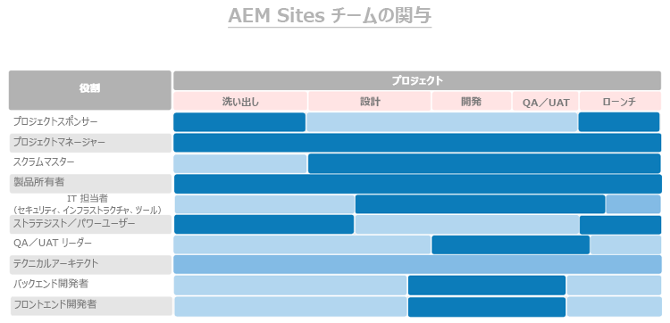
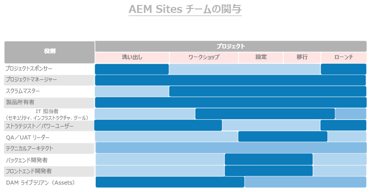

# **最初に、適切な役割を持つ適切なユーザーを獲得します。**

>[!CONTEXTUALHELP]
>id="aemcloud_chooseteam"
>title="適切なチームを選択"
>abstract="適切なスタッフを適切なジョブに配置して、Adobe Experience Managerのデプロイメントを成功に導く。"
>additional-url="https://experienceleague.adobe.com/docs/experience-manager-cloud-service/onboarding/best-practices/aligning-kpis.html?lang=en" text="KPIの整列"
>additional-url="https://experienceleague.adobe.com/docs/experience-manager-cloud-service/onboarding/best-practices/assessing-kpis.html?lang=en" text="KPIの評価"

多くの場合、組織内の複数の部門がデジタルエクスペリエンスの様々な側面を所有しています。 統治がなければ、舞台は、果てしない議論、内紛、混乱のために設けられます。

デジタルガバナンスは、まず、誰が何を担当し、誰がどのデジタルに焦点を当てた仕事をしているかを見極めることから始まります。 必要なスキルを追加するには、戦略的な採用が必要になる場合があります。 さらに大きな課題は、文化の変化を促すことです。新しい技術に対する幅広いサポートを構築し、人々が新しい方法に慣れるのを助けます。 その取り組みの重要な部分は、人々が互いに学び、サポートできるデジタルコミュニティを作り出すことです。

ここでは、適切な担当者を適切なジョブに配置して、Adobe Experience Managerのデプロイメントを促進することに焦点を当てます。 コア製品(Experience ManagerサイトとExperience Managerアセット)ごとに、ユーザーが様々な役割で効果的に活動するために必要な役割と、スキル、専門知識のレベル、属性のリストを用意しています。

今週の課題は、両方のリストを実装チームと共に確認し、各役割で適切な資格を持つ人がいることを確認することです。

## **AEMExperience Managerサイトの主な役割**

勝者クルーチームは、配置チームと同じように、9人の適切な席を必要とします。 Adobe Experience Manager Sitesでの成功は、チームメンバーの力と、メンバー同士の連携の強さに左右されます。 この9つの役割が割り当てられていることを確認します。
候補の資格を持つ人々に対して

| 役割 | スキル | 機能レベル | クォリティ |
|--- |--- |--- |--- |
| プロジェクトマネージャー | PMP認定、アジャイル認定、リスク管理の経験 | エキスパート | 公正、一貫性、責任ある、組織化された、積極的、親しみやすい、変化を受け入れる意志 |
| スクラムマスター | ScrumMaster認定、アジャイル認定、円滑化の経験 | エキスパート | 一貫性のあるクリエイティブ |
| 製品所有者 | 機敏な認定、ビジネスニーズの深い理解 | エキスパート | バランスが取れ、自信がある |
| セキュリティ、インフラストラクチャ、ツールのITリード | CISM認定、Adobe Experience Manager Component Developer認定 | エキスパート | 詳細方向 |
| ストラテジスト/パワーユーザー | Adobe Experience Manager Sitesの能力 | エキスパートの初心者 | 粘り強く、好奇心が強く、徹底的で、心が広く、変化を受け入れる意志、協調 |
| QA/UATリード | アジャイル認定、SDLCの理解 | 初心者から中級者 | 詳細指向、プロセス・ドライブ、一貫性 |
| テクニカルアーキテクト | ITインフラストラクチャの経験 | エキスパート | 詳細方向、プロセス主導、一貫性 |
| バックエンド開発者 | アジャイル認定、コンピュータプログラミングとコンピュータサイエンスの経験 | 初心者から中級者 | 詳細方向、プロセス主導、一貫性 |
| フロントエンド開発者 | アジャイル認定、HTML、CSSおよびJavaScriptに関する理解 | 初心者から中級者 | 詳細方向、プロセス主導、一貫性 |

どの役割が必要かがわかったので、以下の図を見て、実装プロセスで各役割が機能するタイミングを確認します。

 

**このリストを実装チームと共に確** 認し、各役割で適切な資格を持つユーザーがいることを確認します。Adobe Experience Cloudの知識が低いチームメンバーは、[Experience League](https://experienceleague.adobe.com/#recommended/solutions/experience-manager)の学習リソースを使用して、[Adobeデジタルラーニング](https://learning.adobe.com/certification.html)を通じて認定を受けることができます。

## **AEM Assetsの主な役割**

DAMライブラリアンを含め、このチームの役割はすべて不可欠です。

Adobe Experience Manager Assetsの実装を正常に実行するために必要な人のほとんどは、既に揃っている場合があります。 このリストはAdobe Experience Manager Sitesの場合と似ていますが、重要な追加が1つあります。デジタルアセットを見つけやすくする方法で整理し、ラベルを付けるには、ライブラリアンが必要です。

| 役割 | スキル | 機能レベル | クォリティ |
|--- |--- |--- |--- |
| プロジェクトマネージャー | PMP認定、アジャイル認定、リスク管理の経験 | エキスパート | 公正、一貫性、責任ある、組織化された、積極的、親しみやすい、変化を受け入れる意志 |
| スクラムマスター | ScrumMaster認定、アジャイル認定、円滑化の経験 | エキスパート | 一貫性のあるクリエイティブ |
| 製品所有者 | 機敏な認定、ビジネスニーズの深い理解 | エキスパート | バランスが取れ、自信がある |
| セキュリティ、インフラストラクチャ、ツールのITリード | CISM認定、Adobe Experience Manager Component Developer認定 | エキスパート | 詳細方向 |
| ストラテジスト/パワーユーザー | Adobe Experience Manager Sitesの能力 | エキスパートの初心者 | 粘り強く、好奇心が強く、徹底的で、心が広く、変化を受け入れる意志、協調 |
| QA/UATリード | アジャイル認定、SDLCの理解 | 初心者から中級者 | 詳細指向、プロセス・ドライブ、一貫性 |
| テクニカルアーキテクト | ITインフラストラクチャの経験 | エキスパート | 詳細方向、プロセス主導、一貫性 |
| バックエンド開発者 | アジャイル認定、コンピュータプログラミングとコンピュータサイエンスの経験 | 初心者から中級者 | 詳細方向、プロセス主導、一貫性 |
| フロントエンド開発者 | アジャイル認定、HTML、CSSおよびJavaScriptに関する理解 | 初心者から中級者 | 詳細方向、プロセス主導、一貫性 |
| DAMライブラリアン | 図書館科学の背景と学位 | エキスパート | 詳細方向、プロセス主導、整理 |

どの役割が必要かがわかったので、以下の図を見て、実装プロセスで各役割が機能するタイミングを確認します。

 

>[!TIP]
>
> Adobe Experience Cloudの詳細を説明し、[Experience League](https://experienceleague.adobe.com/#recommended/solutions/experience-manager)でリソースを活用し、[Adobeデジタルラーニング](https://learning.adobe.com/certification.html)で認定を受けます。
