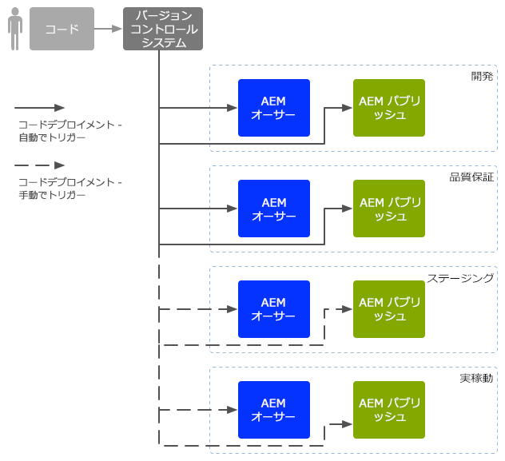
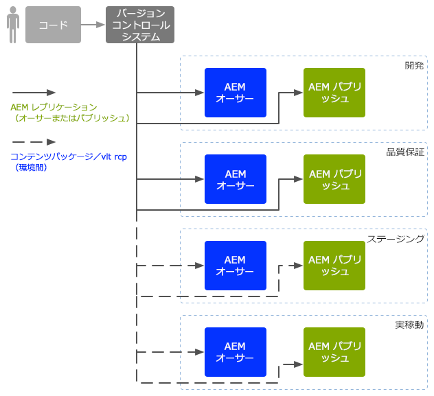

# Enterprise DevOps{#enterprise-devops}

DevOps は、以下の目的で必要なプロセス、メソッドおよびコミュニケーションをカバーしています。

* 様々な環境にまたがってソフトウェアのデプロイメントを簡単にする。
* 開発チーム、テストチームおよびデプロイメントチームのコラボレーションを簡素化する。

DevOps の目的は、次のような問題を回避することです。

* マニュアルエラー。
* 要素の抜け（ファイルや設定の詳細など）。
* 不一致（開発者のローカル環境とその他の環境など）。

## 環境 {#environments}

Adobe Experience Manager (AEM) as a Cloud Service は通常、次のような複数の環境で構成され、それぞれが様々なレベルで様々な目的に使用されます。

* [開発](#development)
* [品質保証](#quality-assurance)
* [ステージング](#staging)
* [実稼動](#production-author-and-publish)

>[!NOTE]
>
>実稼動環境には、オーサー環境とパブリッシュ環境が少なくとも 1 つずつ必要です。
>
>その他すべての環境もオーサー環境とパブリッシュ環境で構成することをお勧めします。そうすると、実稼動環境を反映して早期のテストが可能になります。

### 開発 {#development}

開発者の仕事は、提案されたプロジェクト（Web サイト、モバイルアプリケーション、DAM 実装など）を、必要な機能をすべて含めて開発し、カスタマイズすることです。開発者は、次の作業をおこないます。

* テンプレート、コンポーネント、ワークフロー、アプリケーションなど、必要な要素の開発とカスタマイズ
* デザインの実現
* 必要な機能を実装するために必要なサービスおよびスクリプトの開発

[開発](/help/implementing/developing/introduction/development-guidelines.md)環境の設定には様々な要素が影響しますが、通常は次のように構成されます。

* 統合されたコードベースを提供するための、バージョン管理機能を持つ統合開発システム。各開発者が使用している個々の開発環境からコードを結合し、統合するために使用します。
* 各開発者の個人環境。通常はローカルマシン上に存在します。適切な間隔で、コードはバージョン管理システムと同期されます。

システムの規模によっては、開発環境にオーサーインスタンスとパブリッシュインスタンスの両方を含めることができます。

### 品質保証 {#quality-assurance}

この環境は、品質保証チームが新しいシステムのデザインと機能を包括的にテストするために使用されます。適切なコンテンツを持つオーサー環境とパブリッシュ環境の両方を含み、完全なテストを実施するために必要なすべてのサービスを提供する必要があります。

### ステージング{#staging}

ステージング環境は、設定、コードおよびコンテンツに関して、実稼動環境のミラーである必要があります。

* 用途は、実際のデプロイメントの実装に使用するスクリプトをテストすることです。
* 実稼動環境にデプロイする前の最終テスト（デザイン、機能およびインターフェイス）に使用できます。
* ステージング環境を実稼動環境とまったく同じにすることが不可能な場合もありますが、パフォーマンスや負荷のテストができるように、可能な限り近付ける必要があります。

### 実稼動 - オーサーとパブリッシュ{#production-author-and-publish}

実稼動環境は、実装を実際に[オーサリングおよび公開](/help/sites-cloud/authoring/getting-started/concepts.md)するために必要な環境で構成されます。

実稼動環境は、少なくとも 1 つのオーサーインスタンスと 1 つのパブリッシュインスタンスで構成されます。

* コンテンツの入力用の[オーサー](#author)インスタンス。
* 訪問者やユーザーがコンテンツを使用できるようにするための[パブリッシュ](#publish)インスタンス。

プロジェクトの規模によりますが、多くの場合は複数のオーサーインスタンスやパブリッシュインスタンスで構成されます。下位レベルでは、リポジトリが複数のインスタンスにクラスター化される場合もあります。

#### オーサー{#author}

オーサーインスタンスは、通常、内部ファイアウォールの内側に配置されます。この環境では、ユーザーやユーザーの同僚が、以下のようなオーサリングタスクを実行します。

* システム全体の管理
* コンテンツの入力
* コンテンツのレイアウトとデザインの設定
* パブリッシュ環境に対するコンテンツのアクティベート

アクティベートされたコンテンツはパッケージ化され、オーサー環境のレプリケーションキューに配置されます。レプリケーションプロセスは、そのコンテンツをパブリッシュ環境へトランスポートします。

パブリッシュ環境で生成したデータを、オーサー環境へリバースレプリケーションするには、オーサー環境のレプリケーションリスナーがパブリッシュ環境をポーリングし、それらのコンテンツをパブリッシュ環境のリバースレプリケーション出力ボックスから取得します。

#### パブリッシュ{#publish}

パブリッシュ環境は通常、Demilitarized Zone（DMZ）にあります。この環境では、訪問者は、公開されているかイントラネット内かにかかわらず、コンテンツにアクセス（Web サイト経由、モバイルアプリケーションの形で、など）して操作します。パブリッシュ環境では、次の処理がおこなわれます。

* オーサー環境からレプリケートされたコンテンツを保持します。
* そのコンテンツを訪問者が利用できるようにします。
* コメントやその他のフォーム送信など、訪問者によって生成されたユーザーデータを保存します。
* オーサー環境へリバースレプリケーションできるように、出力ボックスにこれらのユーザーデータを追加するよう設定できます。

パブリッシュ環境では、コンテンツがリアルタイムで動的に生成されます。生成されたコンテンツは、個々のユーザーに合わせてパーソナライズできます。

## コードの移動{#code-movement}

コードは常に下から上へ反映させる必要があります。

* コードは、最初はローカルで、その後統合開発環境で開発
* 続いて、QA 環境で十分なテストを実施
* その後、ステージング環境でさらにテスト
* その後初めてコードは実稼動環境にデプロイされる

コード（カスタマイズされた Web アプリケーション機能やデザインテンプレートなど）は通常、異なるコンテンツリポジトリ間でパッケージを書き出したり読み込んだりすることによって転送されます。場合によっては、このレプリケーションを自動プロセスとして設定できます。

AEM as a Cloud Service プロジェクトは、多くの場合、コードのデプロイメントをトリガーします。

* 自動：開発環境および QA 環境への転送の場合。
* 手動：ステージング環境および実稼動環境へのデプロイメントは、より制御された方法でおこなわれるので、多くの場合は手動ですが、必要に応じて自動も可能です。

## コンテンツの移動 {#content-movement}

実稼動用に作成されているコンテンツは、実稼動オーサーインスタンスで&#x200B;**常に**&#x200B;オーサリングする必要があります。

コンテンツは、下位環境から上位環境へ移動するコードに従うことはできません。ローカルマシン以下の環境で作成者にコンテンツを作成させ、それを実稼動環境へ移動するのは適切な方法ではなく、エラーや不整合の原因となる可能性が高いからです。

実稼動コンテンツを実稼動環境からステージング環境へ移動して、ステージング環境で効率的かつ正確なテスト環境が提供されることを確認する必要があります。

>[!NOTE]
>
>これは、ステージングコンテンツを実稼動と絶えず同期する必要があるという意味ではなく、定期的な更新で十分ですが、新しいコードの繰り返しをテストする前は特別です。QA 環境および開発環境のコンテンツはそれほど頻繁に更新する必要はありません。実稼動コンテンツをよく表現してさえいれば問題ありません。

コンテンツは次のような転送が可能です。

* 異なる環境間 - パッケージを書き出したり読み込んだりします。
* 異なるインスタンス間 - コンテンツを直接レプリケート（AEM as a Cloud Service レプリケーション）します（HTTP または HTTPS 接続を使用）。

