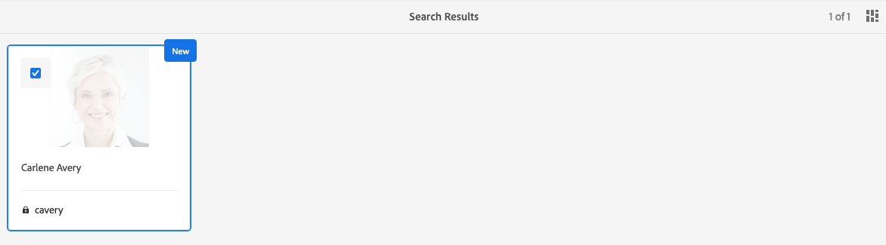

# データ保護とデータプライバシー規制に対するCloud Service基盤の準備としてのAdobe Experience Manager {#aem-foundation-readiness-for-data-protection-and-data-privacy-regulations}

>[!WARNING]
>
>このドキュメントの内容は法律上の助言とはならず、法律上の助言の代わりとしての意味も持たない。
>
>データ保護およびデータのプライバシーに関する規制に関するアドバイスについては、会社の法務部にお問い合わせください。

>[!NOTE]
>
>プライバシーに関する問題に対するAdobeの対応、およびAdobeのお客様にとっての意味について詳しくは、 [Adobeのプライバシーセンター](https://www.adobe.com/privacy.html)を参照してください。

## AEM Foundation Data Privacy and Protectionのサポート {#aem-foundation-data-privacy-and-protection-support}

AEM Foundationレベルでは、保存される個人データはUserプロファイルーに保持されます。 したがって、この記事の内容は、主に、アクセス要求と削除要求に対応するために、ユーザープロファイルにアクセスする方法と削除する方法に関するものです。

## ユーザープロファイルへのアクセス {#accessing-a-user-profile}

### 手動の手順 {#manual-steps}

1. Open the User Administration console, by browsing to **[!UICONTROL Tools - Security - Users]** or by browsing directly to `https://<serveraddress>:<serverport>/security/users.html`

<!--
   
-->

1. 次に、ページの上部にある検索バーに目的のユーザーの名前を入力して検索します。

   

1. 最後に、ユーザープロファイルをクリックして開き、「**[!UICONTROL 詳細]**」タブの下で情報を確認します。

   

### HTTP API {#http-api}

前述したように、自動化を促進するために、ユーザーデータにアクセスするための API が用意されています。利用可能な API には、以下のようにいくつかのタイプがあります。

**UserProperties API**

```shell
curl -u user:password http://localhost:4502/libs/granite/security/search/profile.userproperties.json\?authId\=cavery
```

**Sling API**

**ユーザーホームの検索：**

```xml
curl -g -u user:password 'http://localhost:4502/libs/granite/security/search/authorizables.json?query={"condition":[{"named":"cavery"}]}'
     {"authorizables":[{"type":"user","authorizableId_xss":"cavery","authorizableId":"cavery","name_xss":"Carlene Avery","name":"Carlene Avery","home":"/home/users/we-retail/DSCP-athB1NYLBXvdTuN"}],"total":1}
```

**ユーザーデータを取得する:**

上記のコマンドから返されたJSONペイロードのホームプロパティのノードパスを使用する：

```shell
curl -u user:password  'http://localhost:4502/home/users/we-retail/DSCP-athB1NYLBXvdTuN/profile.-1.json'
```

```shell
curl -u user:password  'http://localhost:4502/home/users/we-retail/DSCP-athB1NYLBXvdTuN/profiles.-1.json'
```

## ユーザーの無効化と関連プロファイルの削除 {#disabling-a-user-and-deleting-the-associated-profiles}

### ユーザーの無効化 {#disable-user}

1. 前述のように、ユーザー管理コンソールを開き、目的のユーザーを検索します。
2. ユーザーの上にマウスポインターを置き、選択アイコンをクリックします。プロファイルがグレーに変わり、選択されたことが示されます。

3. Press the **Disable** button in the upper menu to disable the user:

   

4. 最後に、アクションを確認します。

   次に、ユーザーインターフェイスは、ユーザーアカウントが次のようにグアウトし、プロファイルカードにロックを追加することで非アクティブ化されたことを示します。

   

### ユーザープロファイル情報の削除 {#delete-user-profile-information}

>[!NOTE]
>
>AEMの場合、CRXDEにアクセスできないので、Cloud Serviceプロファイルを削除する手動の手順はUIからは利用できません。

### HTTP API {#http-api-1}

以下の手順では `curl`コマンドラインツールを使用して、**[!UICONTROL cavery]** `userId` を持つユーザーを無効化し、デフォルト位置にあるそのユーザーのプロファイルを削除する方法を示しています。

**ユーザーホームの検索：**

```shell
curl -g -u user:password 'http://localhost:4502/libs/granite/security/search/authorizables.json?query={"condition":[{"named":"cavery"}]}'
     {"authorizables":[{"type":"user","authorizableId_xss":"cavery","authorizableId":"cavery","name_xss":"Carlene Avery","name":"Carlene Avery","home":"/home/users/we-retail/DSCP-athB1NYLBXvdTuN"}],"total":1}
```

**ユーザーの無効化:**

上記のコマンドから返されたJSONペイロードのホームプロパティのノードパスを使用する：

```shell
curl -X POST -u user:password -FdisableUser="describe the reasons for disabling this user (Data Privacy in this case)" 'http://localhost:4502/home/users/we-retail/DSCP-athB1NYLBXvdTuN.rw.userprops.html'
```

**ユーザープロファイルの削除**

アカウント検出コマンドから返されたJSONペイロードのホームプロパティのノードパスと、既知のプロファイルノードの場所を使用します。

```shell
curl -X POST -u user:password -H "Accept: application/json,**/**;q=0.9" -d ':operation=delete' 'http://localhost:4502/home/users/we-retail/DSCP-athB1NYLBXvdTuN/profile'
```

```shell
curl -X POST -u user:password -H "Accept: application/json,**/**;q=0.9" -d ':operation=delete' 'http://localhost:4502/home/users/we-retail/DSCP-athB1NYLBXvdTuN/profile'
```
