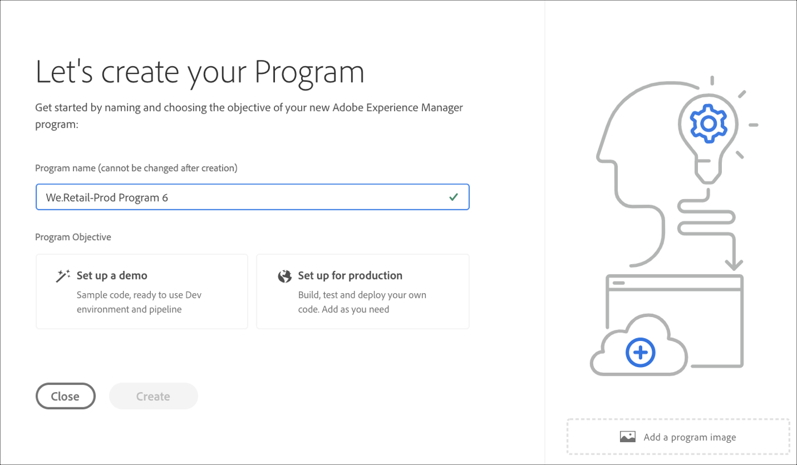

# プログラムの作成 {#create-a-program}

クラウドネイティブソリューションは、必要な権限と、セルフサービスモデルに対するプログラムの作成機能をユーザーに提供します。

プログラム作成ウィザードは、特定の顧客または組織が利用できる内容の範囲内で、ユーザーの目的に応じて詳細を送信するようにユーザーに求めます。

Cloud Managerへの初回アクセス時、またはテナントにプログラムが存在しない場合は、「最初のプログラムを作成 **する** 」画面が表示されます。 ユーザが *Escを選択するか* 、ダイアログボックスの外をクリックすると、次の画面が表示されます。

## プログラムの作成ウィザードの使用 {#using-create-program-wizard}

特定の顧客/組織が使用できる内容の範囲内でプログラムを作成するユーザーの目的に応じて、プログラム作成ウィザードがユーザーに対して1つ以上の詳細を送信するように求めます。

>[!NOTE]
>プログラムが既に存在する場合は、次の図に示すように **** 、ランディングページの右上に「プログラムの追加」が表示されます。

## デモプログラムの作成 {#create-demo-program}

>[!NOTE]
>
デモプログラムは、Cloud Manager UIのサンドボックスプログラムに似ています。

サンドボックスプログラムを作成するには、次の手順に従います。

1. プログラムの作成ウィザードで、「デモの **設定」を選択します**。 ユーザーは、「作成」を選択する前にプログラム名を **送信しま**&#x200B;す。

   

1. 新しいサンドボックスプログラムカードがランディングページに表示され、その上にマウスポインターを置いてCloud Managerアイコンを選択し、Cloud Managerの概要ページに移動できます。 カードは、新しく作成されたサンドボックスプログラムの自動セットアップの状態をユーザーに通知します。 ユーザーには進行状況が表示されます。

   

1. プログラムの設定とプロジェクトの作成手順が完了すると、次の図に示すように、 **Git** （Gitを管理）リンクにアクセスできます。

   

   >[!NOTE]
   >
   >Cloud Manager UIのセルフサービスGitアカウント管理を使用したGitリポジトリへのアクセスと管理の詳細については、「Gitへのアクセス」を参照 [してください](/help/implementing/cloud-manager/accessing-git.md)。

1. 開発環境が作成されると、次の図に示すように、ユ **ーザーはAEM** リンクにアクセスできます。

   

1. 開発への非実稼働パイプラインのデプロイが完了すると、ウィザードに従って、開発時にAEMにアクセスするか、開発環境にコードをデプロイするかを行います。

   

## 標準プログラムの作成 {#create-regular-program}

通常プ *ログラムは* 、AEMとCloud Managerに精通し、本番環境に導入する目的でコードの作成、構築、テストを開始するユーザーを対象としています。

通常のプログラムを作成するには、次の手順に従います。

1. 通常のプ **ログラムを作成するには** 、プログラムの作成ウィザードで「実稼働用に設定」を選択します。 ユーザーは、デフォルトのプログラム名を受け入れるか、「続行」を選択する前にプログラム名を編集 **できま**&#x200B;す。

   

1. ユーザーは、上の画面の後に表示される画面にプログラムに含めるソリューションを選択します。

   >[!NOTE]
   >
   >以下の画面は、複数のソリューションを購入した顧客のセグメントに対してのみ表示されます。 1つのソリューションのみを購入したお客様の場合、下のソリューション選択画面は表示されません。

   

1. Once you have selected the solutions, click **Create**.

   

1. プログラムカードがランディングページに表示されたら、その上にマウスポインターを置いてCloud Managerアイコンを選択し、Cloud Managerの概要ページに移 **動します** 。

   

1. メインの誘い文句（CTA：コールトゥアクション）カードは、ユーザーに対して、環境の作成、非実稼働パイプラインの作成、最後に実稼働パイプラインの作成を指示します。
   

   >[!NOTE]
   >
   >通常のプログラムには自動セットア **ップ機能はありませ** ん。

