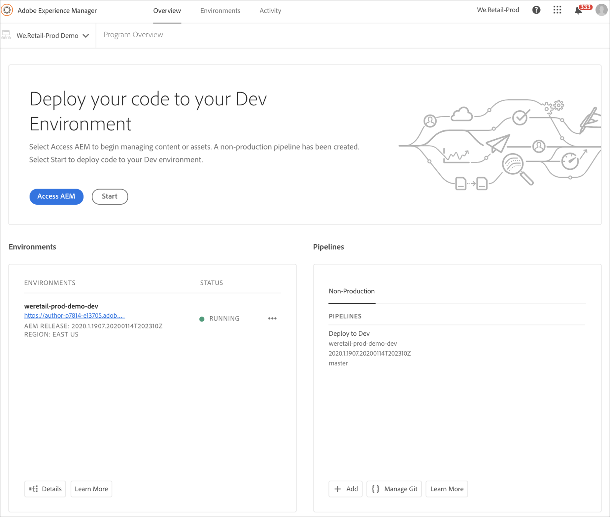

# プログラムの作成 {#create-a-program}

クラウドネイティブソリューションは、必要な権限とセルフサービスモデルに対するプログラムの作成機能をユーザーに提供します。

プログラムの作成ウィザードでは、特定の顧客または組織が使用できるプログラムの範囲内で、ユーザーの目標に従って詳細を送信するように求められます。

Cloud Managerへの初回アクセスのイベント、またはテナントにプログラムが存在しない場合は、「最初のプログラムを **作成** 」画面が表示されます。 ユーザーが *Escを選択するか* 、ダイアログボックスの外側をクリックすると、次の画面が表示されます。

## プログラムの作成ウィザードの使用 {#using-create-program-wizard}

特定の顧客/組織が使用できる範囲内でプログラムを作成するユーザーの目的に応じて、プログラム作成ウィザードが表示され、1つ以上の詳細をユーザーに送信するように求めます。

>[!NOTE]
>If a program already exists, then you will see **Add Program** on the top right of the landing page, as shown in the figure below.

## サンドボックスプログラムの作成 {#create-sandbox-program}

サンドボックスプログラムを作成するには、次の手順に従います。

1. プログラムの作成ウィザードで、「Sandboxを **設定する**」を選択します。 プログラム名は、「 **作成**」を選択する前に送信されます。

   

1. 新しいSandboxプログラムカードがランディングページに表示され、その上にマウスポインターを置いてCloud Managerアイコンを選択し、Cloud Managerの概要ページに移動できます。 カードは、新しく作成されたSandboxプログラムの自動セットアップの状態をユーザーに通知します。 進行状況が表示されます。

   

1. プログラムの設定とプロジェクトの作成手順が完了したら、次の図に示すように、 **Git** リンクを管理にアクセスできます。

   

   >[!NOTE]
   >
   >Cloud Manager UIからセルフサービスのGitアカウント管理を使用してGitリポジトリにアクセスし管理する方法について詳しくは、 [Gitへのアクセスを参照してください](/help/implementing/cloud-manager/accessing-git.md)。

1. 開発環境を作成すると、次の図に示すように、AEM **リンクに** アクセスできます。

   

1. 開発への非実稼動パイプラインのデプロイが完了すると、ウィザードに従って、AEMへのアクセス（開発時）または開発環境へのコードのデプロイがユーザーに指示されます。

   

   >[!NOTE]
   >次に示すように、Cloud Managerの概要ページからプログラムの編集、切り替えまたは追加を行うこともできます。

   

## Deleting a Sandbox Program {#delete-sandbox-program}

A Sandbox Program user in *Business Owner* or *Deployment Manager* role in Cloud Manager can delete their Production and Stage environment set via the Cloud Manager UI.

>[!NOTE]
>実稼動環境またはステージ環境で削除オプションを選択すると、セット内の他のものも削除されます。

次に示すように、削除ランディングページを使用できます。

または、

Sandboxプログラムを削除するには、 **プログラムの概要** ページで「プログラム **** を削除」を選択します。

## Creating a Regular Program {#create-regular-program}

正規 ** プログラムは、AEMとCloud Managerに精通し、コードを実稼動環境にデプロイする目的でコードの作成、構築、テストを開始する準備ができているユーザーを対象としています。

正規プログラムを作成するには、次の手順に従います。

1. プログラムの作成ウィザードで **「実稼働用に** 設定」を選択して、正規プログラムを作成します。 ユーザーは、デフォルトのプログラム名を受け入れるか、「 **続行**」を選択する前に編集できます。

   

1. 上の画面の後に表示される画面にプログラムに含めるソリューションを選択します。

   >[!NOTE]
   >
   >次の画面は、複数のソリューションを購入した顧客のセグメントに対してのみ表示されます。 1つのソリューションのみを購入したお客様の場合、下のソリューション選択画面は表示されません。

   

1. Once you have selected the solutions, click **Create**.

   

1. ランディングページにプログラムカードが表示されたら、その上にマウスポインターを置いてCloud Managerアイコンを選択し、Cloud Managerの **概要** ページに移動します。

   

1. メインの誘い文句（CTA：コールトゥアクション）カードは、環境の作成、非実稼働パイプラインの作成、最後に実稼働パイプラインの作成をユーザーに指示します。
   

   >[!NOTE]
   >
   >A regular program does not have **Auto-setup** feature.

