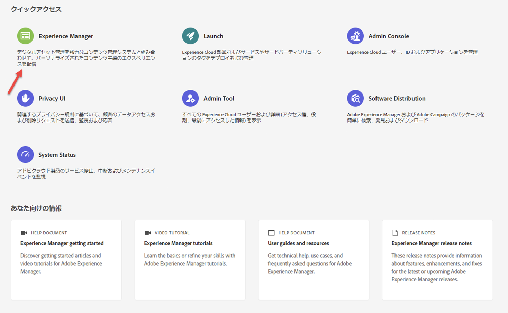

# Cloud Manager ランディングページ {#first-time-login}

システム管理者からCloud Managerへのアクセス権が付与されると、Cloud Managerのログインページに移動する電子メールが届きます。

次の手順に従ってCloud Managerにアクセスします。

1. Adobe IDを使って[Experience Cloud](https://experience.adobe.com/)に移動します。
1. **Experience Manager**を選択します。
   

1. Cloud Managerカードの「**Launch**」をクリックします。
[!UICONTROL Cloud Manager] に正常にログインすると、ユーザーインターフェイス（UI）を使用する準備が整います。
   

   >[!NOTE]
   >
   >[!UICONTROL Cloud Manager] で割り当てられた役割とアプリケーションの状態によっては、[!UICONTROL Cloud Manager] UI の使用中に異なる画面が表示されます。

## Cloud Managerのプログラム{#cloud-manager-landing-page}

[!UICONTROL Cloud Manager]に正常にログインすると、ランディングページに、組織内の既存のプログラムのカードが表示されます。

>[!NOTE]
>Cloud Service 上のプログラムは、サブタイトル **Experience Manager クラウド**（AMS プログラムの **Experience Manager** とは異なります）で示されます。
>例えば、下の図では、**We.Retailグローバル**&#x200B;はAMSプログラムで、**We.Retail-Prodプログラム- Prod**&#x200B;はCloud Serviceを介して使用できるプログラムです。

状況に応じて、次の 2 つのオプションのいずれかが表示されます。

* **Cloud Manager にプログラムが存在しません**

* **プログラムは既に Cloud Manager に存在します**

組織にプログラムが存在しない場合は、次の図に示すように、ランディングページから最初のプログラムの作成が指示されます。

組織にプログラムが既に存在する場合は、次の図に示すように、ランディングページから別のプログラムを追加するよう指示され、既存のプログラムもすべて表示されます。

Cloud Managerでプログラムを追加する方法については、次を参照してください。

* [実稼働プログラムの作成](/help/onboarding/getting-access-to-aem-in-cloud/creating-production-program.md)
* [サンドボックスプログラムの作成](/help/onboarding/getting-access-to-aem-in-cloud/creating-sandbox-program.md)

