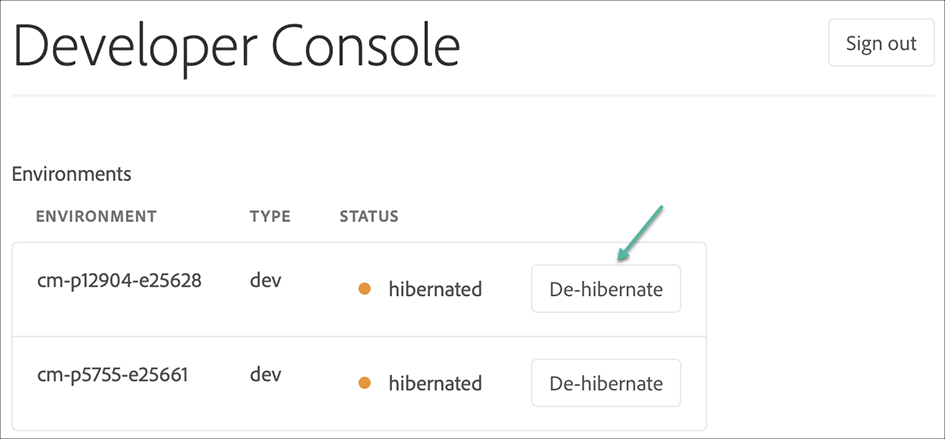

# サンドボックスプログラム {#sandbox-programs}

## 概要 {#introduction}

Sandboxプログラムは、AEMCloud Serviceで使用できる2種類のプログラムの1つで、もう1つは正規プログラムです。

サンドボックスは、通常、トレーニング、実行デモ、有効化、またはコンセプトの配達確認(POC)の目的を満たすために作成されます。彼らは生きたトラフィックを運ぶつもりはない。 Cloud Serviceコミットメントとして [AEMに従うことはありません](https://www.adobe.com/legal/service-commitments.html)。

サンドボックスで作成された環境は、自動スケール用に構成されていません。 したがって、パフォーマンスや負荷テストには適していません。

SandboxプログラムにはSitesとAssetsが含まれ、Gitリポジトリ、開発環境、非実稼働パイプラインが自動入力されます。  Gitリポジトリには、AEMプロジェクトのアーキタイプに基づくサンプルプロジェクトが入力されます。

プログラムタイプの詳細については、 [「プログラムとプログラムタイプについて](https://docs.adobe.com/content/help/en/experience-manager-cloud-service/onboarding/getting-access/understand-program-types.html) 」を参照してください。

### サンドボックスプログラムの属性 {#attributes-sandbox}

Sandboxプログラムには次の属性があります。

1. **プログラムの作成：** サンドボックスプログラムの作成には、次の自動機能が含まれます。
   * サンプルコードとコンテンツを使用したプロジェクトのセットアップ
   * 開発環境の創出
   * 開発環境への非実稼働パイプラインの作成(開発環境へのマスターブランチのデプロイ)

1. **ソリューション：** サンドボックスプログラムには、AEM Sitesとアセットが含まれます。

1. **AEMアップデート：** AEMのアップデートは、Sandboxプログラム内の環境に手動で適用でき、自動的にプッシュされることはありません。

1. **休止状態：** Sandboxプログラム内の環境は、特定の期間、アクティビティが検出されなかった場合、自動的に休止状態になります。 冬眠状態の環境は、手動で非冬眠状態にすることができます。

### Sandboxプログラムの作成 {#creating-sandbox-program}

プログラム作成ウィザードを使用すると、Sandboxプログラムを作成できます。

Sandboxプログラムの作成方法について詳しくは、「Sandboxプログラムの [作成](https://docs.adobe.com/content/help/en/experience-manager-cloud-service/onboarding/getting-access/creating-a-program.html#create-sandbox-program) 」を参照してください。

### Sandbox環境の作成 {#creating-sandbox-environments}

Sandboxプログラムは、プログラムの作成時に、自動作成された方法で開発環境に配信されます。 開発環境には、デフォルトで、作成者と発行層が含まれます。

実稼働段階の環境セットは、実稼動パイプラインをセットアップする準備ができたら、Sandboxプログラムに手動で追加できます。

環境を手動で作成する方法について詳しくは、「環境の [追加](https://docs.adobe.com/content/help/en/experience-manager-cloud-service/implementing/using-cloud-manager/manage-environments.html#adding-environments) 」を参照してください。

### Sandbox環境の削除 {#deleting-sandbox-environments}

必要な権限を持つユーザーは、開発環境、実稼働/ステージ環境またはセットを削除できます。

環境を削除する方法について詳しくは、環境の [削除](https://docs.adobe.com/content/help/en/experience-manager-cloud-service/implementing/using-cloud-manager/manage-environments.html#deleting-environment) を参照してください。

## サンドボックス環境の冬眠と非冬眠 {#hibernating-introduction}

Sandboxプログラム環境は、特定の期間、アクティビティが検出されなかった場合、 *休止モードに入ります* 。

>[!NOTE]
>休止状態は、サンドボックスプログラム環境に固有です。 正規プログラム環境は休止状態になりません。

### 休止状態 {#hibernation-introduction}

休止状態は、自動または手動で発生できます。 サンドボックスプログラム環境が *休止モードに入るまで、数分かかる場合があります*。 データは休止中に保持されます。

休止状態は次のように分類されます。

* **Sandboxの自動プログラム環境は** 、8時間操作が実行されなかった場合に自動的に休止状態になります。つまり、作成者も発行サービスも要求を受け取りません。

* **手動**:ユーザはSandboxプログラム環境を手動で休止できますが、休止状態が一定時間（8時間）続くと自動的に休止状態になるので、これを行う必要はありません。

>[!CAUTION]
>最新のリリースでは、Cloud ManagerからDeveloper Consoleに直接リンクしても、Sandboxプログラム環境を休止するオプションは提供されません。 回避策は、Developer Consoleで1回行い、URLの末尾に次のパターンを追加します。 `#release-cm-p1234-e5678 where 1234` 1234は *プログラムID* 、5678は *環境ID*&#x200B;です。

#### 手動ハイバーネーションの使用 {#using-manual-hibernation}

SandboxプログラムをDeveloper Consoleから手動で休止状態にするには、次の2つの方法があります。

* 環境の詳細画面
* 環境一覧画面

>[!NOTE]
>Sandboxプログラム用のDeveloper Consoleへのアクセスは、Cloud Managerの任意のユーザーが利用できます。

Sandboxプログラム環境を手動で休止状態にするには、次の手順に従います。

1. Navigate to the **Developer Console**.
[環境](https://docs.adobe.com/content/help/en/experience-manager-cloud-service/implementing/using-cloud-manager/manage-environments.html#accessing-developer-console) カードから **Developer Console** （開発者コンソール）にアクセスする方法については、Accessing Developer Console **** （開発者コンソールへのアクセス）を参照してください。
   >[!IMPORTANT]
   >Cloud Managerから **Developer Console** （開発者コンソール）に直接リンクしても、Sandboxプログラム環境を休止するオプションは提供されません。 回避策は、Developer Consoleで1回行い、URLの末尾に次のパターンを追加します。 `#release-cm-p1234-e5678 where 1234` 1234は *プログラムID* 、5678は *環境ID*&#x200B;です。

1. Click **Hibernate**, as shown in the figure below:

   

   または、

   左上の **環境** ( ****)リンクをクリックして環境リストを表示し、次の図に示すように「Hibernate」をクリックします。

   

1. 「 **Hibernate** 」をクリックして手順を確認します。

   

1. 休止状態が正常に終了すると、環境の休止処理完了通知が **開発者コンソール** 画面に表示されます。

   

### 冬眠解除 {#de-hibernation-introduction}

1. Navigate to the **Developer Console**.
[環境](https://docs.adobe.com/content/help/en/experience-manager-cloud-service/implementing/using-cloud-manager/manage-environments.html#accessing-developer-console) カードから **Developer Console** （開発者コンソール）にアクセスする方法については、Accessing Developer Console **** （開発者コンソールへのアクセス）を参照してください。

   >[!IMPORTANT]
   >Cloud Managerから **Developer Console** （開発者コンソール）に直接リンクしても、Sandboxプログラム環境の休止状態を解除するオプションは表示されません。 回避策は、Developer Consoleで1回行い、URLの末尾に次のパターンを追加します。 `#release-cm-p1234-e5678 where 1234` 1234は *プログラムID* 、5678は *環境ID*&#x200B;です。

   >[!NOTE]
   >または、 **Developer Console** （開発者コンソール）に移動して非休止状態にするには、既に休止状態になっている環境の作成者または発行サービスにアクセスします。この場合、ランディングページはDeveloper Consoleへのリンクと共に表示されます。 後述の「冬眠環境へのアクセス」の節を参照してください。

   >[!IMPORTANT]
   >Developer Consoleへのアクセスは、 **Admin Consoleの** Cloud Manager - Developer Role **（開発者ロール）で定義されます**。 開発者ロールの権限を持つユーザーは、Sandboxプログラム環境の休止状態を解除できます。

1. Click on **De-hibernate**, as shown in the figure below:

   

   または、

   左上の **環境** ( ****)リンクをクリックして環境リストを表示し、次の図に示すように「De-hibernate」をクリックします。

   

1. 「 **休止状態を** 解除」をクリックして手順を確認します。

   

1. 休止プロセスが開始され、進行状況が更新されるという通知が届きます。

   

1. 処理が完了すると、Sandboxプログラム環境が再度アクティブになります。

   

#### 休止状態を解除する権限 {#permissions-de-hibernate}

製品プロファイルがCloud ServiceとしてAEMへのアクセスを許可している場合は、 **Developer Console**(環境の非休止状態)にアクセスできる必要があります。

ユーザー権限の設定については、 [Cloud Managerの「](https://docs.adobe.com/content/help/ja-JP/experience-manager-cloud-manager/using/requirements/setting-up-users-and-roles.html) 追加ユーザーと役割」を参照してください。

#### 冬眠環境へのアクセス {#accessing-hibernated-environment}

次の図に示すように、冬眠した環境の作成者層または発行層に対してブラウザリクエストを行うと、環境の冬眠状態を示すランディングページが発生します。

### 重要な検討事項 {#important-considerations}

冬眠状態と冬眠解除状態の環境に関する主な考慮事項は、次のとおりです。

* ユーザーは、パイプラインを使用して、休止状態の環境にカスタムコードを導入できます。 環境は冬眠状態のままとなり、新しいコードは環境で非冬眠状態になった後に表示されます。

* AEMのアップグレードは、冬眠状態の環境に適用できます。これにより、お客様はCloud Managerから手動でトリガーできます。 環境は冬眠状態のままとなり、新しいリリースは、冬眠状態を解除すると環境に表示されます。

>[!NOTE]
>現在、Cloud Managerは、環境を休止状態にするかどうかを示しません。

## AEM Sandbox環境の更新 {#aem-updates-sandbox}

Refer to [AEM version updates](https://docs.adobe.com/content/help/en/experience-manager-cloud-service/implementing/deploying/overview.html#version-updates) for more details.

ユーザーは、Sandboxプログラム内の環境に手動でAEMアップデートを適用できます。

環境を更新する方法については、 [環境の更新](https://docs.adobe.com/content/help/en/experience-manager-cloud-service/implementing/using-cloud-manager/manage-environments.html#updating-dev-environment) を参照してください。

>[!NOTE]
>* 手動更新は、対象環境に適切に設定されたパイプラインがある場合にのみ実行できます。
>* 「 *Production* 」または「 *Stage* 」環境を手動で更新すると、もう一方が自動的に更新されます。 Production+Stage環境セットは、同じAEMリリースに存在する必要があります。

