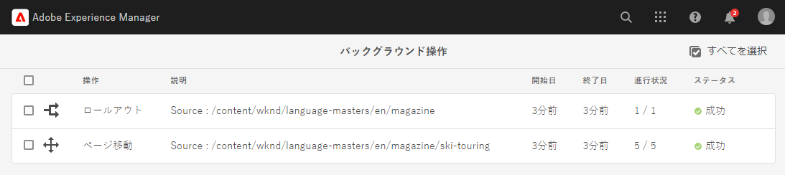

# 非同期操作 {#asynchronous-operations}

Adobe Experience Manager では、パフォーマンスを悪化させないために、長時間実行されてリソースを集中的に消費する特定の操作は、非同期的に処理されます。非同期処理では複数のジョブがキューに入れられ、システムリソースの可用性に応じて順に実行されます。

このような操作には以下のようなものがあります。

* 多数のアセットの削除
* 多数のアセットまたは多数の参照があるアセットの移動
* アセットメタデータの一括書き出し／読み込み
* しきい値制限セットを超えるアセットのリモート Experience Manager デプロイメントからの取得
* ページの移動
* ライブコピーのロールアウト

非同期ジョブのステータスは、**[!UICONTROL 非同期ジョブ]**&#x200B;ダッシュボード（**グローバルナビゲーション**／**ツール**／**操作**／**ジョブ**）で表示できます。

>[!NOTE]
>
>デフォルトでは、非同期ジョブは並行して実行されます。*`n`* を CPU コアの数とすると、デフォルトでは *`n/2`* のジョブを並行して実行できます。ジョブキューのカスタム設定を使用するには、Web コンソールから **[!UICONTROL Async Operation Default Queue Config]** と **Async Operation Page Move and Rollout Config** を変更します。
>
>詳しくは、[キューの設定](https://sling.apache.org/documentation/bundles/apache-sling-eventing-and-job-handling.html#queue-configurations)を参照してください。

## 非同期操作のステータスの監視 {#monitor-the-status-of-asynchronous-operations}

AEM が操作を非同期で処理する場合は常に、[インボックス](/help/sites-cloud/authoring/getting-started/inbox.md)と電子メール（有効になっている場合）で通知を受信します。

非同期操作のステータスの詳細を表示するには、**[!UICONTROL 非同期ジョブステータス]**&#x200B;ページに移動します。

1. Experience Manager インターフェイスで、**[!UICONTROL 操作]**／**[!UICONTROL ジョブ]**&#x200B;をクリックします。

1. **[!UICONTROL 非同期ジョブステータス]**&#x200B;ページで、操作の詳細をレビューします。

   

   特定の操作の進行状況を確認するには、「**[!UICONTROL ステータス]**」列の値を参照します。進行状況に応じて、以下のいずれかのステータスが表示されます。

   * **[!UICONTROL アクティブ]**：操作は処理中です。

   * **[!UICONTROL 成功]**：操作は完了しました。

   * **[!UICONTROL 失敗]**&#x200B;または&#x200B;**[!UICONTROL エラー]**：操作を処理できませんでした。

   * **[!UICONTROL スケジュール済み]**：操作は後で処理するようにスケジュールされています。

1. アクティブな操作を停止するには、リストから対象の操作を選択し、ツールバーの「**[!UICONTROL 停止]**」をクリックします。

   

1. 説明やログなど、その他の詳細を表示するには、操作を選択し、ツールバーの「**[!UICONTROL 開く]**」をクリックします。

   

   ジョブの詳細ページが表示されます。

   

1. リストから操作を削除するには、ツールバーの「**[!UICONTROL 削除]**」を選択します。詳細を CSV ファイルでダウンロードするには、「**[!UICONTROL ダウンロード]**」をクリックします。

   >[!NOTE]
   >
   >ステータスが&#x200B;**アクティブ**&#x200B;または&#x200B;**待機中**&#x200B;のジョブは削除できません。

## 完了したジョブの削除 {#purging-completed-jobs}

AEM は、毎日午前 1 時にパージジョブを実行して、1 日以上経過した完了済みの非同期ジョブを削除します。

パージジョブのスケジュールと、完了済みジョブの詳細を削除するまでの保持期間を変更できます。また、任意の時点での詳細を保持する、完了済みジョブの最大数を設定することもできます。

1. グローバルナビゲーションで、**[!UICONTROL ツール]**／**[!UICONTROL 操作]**／**[!UICONTROL Web コンソール]**&#x200B;をクリックします。
1. **[!UICONTROL Adobe Granite Async Jobs Purge Scheduled Job]** ジョブを開きます。
1. 以下を指定します。
   * 完了したジョブが削除されるまでの日数のしきい値。
   * 詳細が履歴に保持されるジョブの最大数。
   * パージを実行するタイミングを表す cron 式。

   

1. 変更内容を保存します。

## 非同期処理の設定 {#configuring-asynchronous-processing}

特定の操作を非同期に処理するための AEM のアセット、ページまたは参照のしきい値を設定したり、ジョブの処理時に関する電子メール通知を切り替えたりできます。

### 非同期アセット削除操作の設定 {#configuring-synchronous-delete-operations}

削除するアセットまたはフォルダーの数がしきい値を超えると、削除操作が非同期的に実行されます。

1. グローバルナビゲーションで、**[!UICONTROL ツール]**／**[!UICONTROL 操作]**／**[!UICONTROL Web コンソール]**&#x200B;をクリックします。
1. Web コンソールから、「**[!UICONTROL Async Process Default Queue Configuration]**」を開きます。
1. 「**[!UICONTROL Threshold number of assets]**」ボックスで、削除操作の非同期処理に関するアセットまたはフォルダー数のしきい値を指定します。

   

1. 「**電子メール通知を有効にする**」オプションを選択すると、このジョブステータスに関する電子メール通知を受信できます（例：成功、失敗）。
1. 変更内容を保存します。

### 非同期アセット移動操作の設定 {#configuring-asynchronous-move-operations}

移動するアセットやフォルダーまたは参照の数がしきい値を超えると、移動操作が非同期的に実行されます。

1. グローバルナビゲーションで、**[!UICONTROL ツール]**／**[!UICONTROL 操作]**／**[!UICONTROL Web コンソール]**&#x200B;をクリックします。
1. Web コンソールで、「**[!UICONTROL Async Move Operation Job Processing]**」設定を開きます。
1. 「**[!UICONTROL Threshold number of assets/references]**」ボックスで、移動操作の非同期処理に関するアセットやフォルダーまたは参照の数のしきい値を指定します。

   

1. 「**電子メール通知を有効にする**」オプションを選択すると、このジョブステータスに関する電子メール通知を受信できます（例：成功、失敗）。
1. 変更内容を保存します。

### 非同期ページ移動操作の設定  {#configuring-asynchronous-page-move-operations}

移動するページへの参照数がしきい値を超えると、移動操作は非同期に実行されます。

1. グローバルナビゲーションで、**[!UICONTROL ツール]**／**[!UICONTROL 操作]**／**[!UICONTROL Web コンソール]**&#x200B;をクリックします。
1. Web コンソールで、「**[!UICONTROL Async Page Move Operation Job Processing Configuration]**」を開きます。
1. 「**[!UICONTROL Threshold number of references]**」ボックスで、ページ移動操作の非同期処理に関する参照の数のしきい値を指定します。

   

1. 「**電子メール通知を有効にする**」オプションを選択すると、このジョブステータスに関する電子メール通知を受信できます（例：成功、失敗）。
1. 変更内容を保存します。

### 非同期 MSM 操作の設定 {#configuring-asynchronous-msm-operations}

1. グローバルナビゲーションで、**[!UICONTROL ツール]**／**[!UICONTROL 操作]**／**[!UICONTROL Web コンソール]**&#x200B;をクリックします。
1. Web コンソールで、「**[!UICONTROL Async Page Move Operation Job Processing Configuration]**」を開きます。
1. 「**電子メール通知を有効にする**」オプションを選択すると、このジョブステータスに関する電子メール通知を受信できます（例：成功、失敗）。

   

1. 変更内容を保存します。

>[!MORELIKETHIS]
>
>* [ページの作成と整理](/help/sites-cloud/authoring/fundamentals/organizing-pages.md)
>* [アセットメタデータの一括読み込みおよび書き出し](/help/assets/metadata-import-export.md)
>* [Connected Assets を使用したリモートデプロイメントからの DAM アセットの共有](/help/assets/use-assets-across-connected-assets-instances.md)

