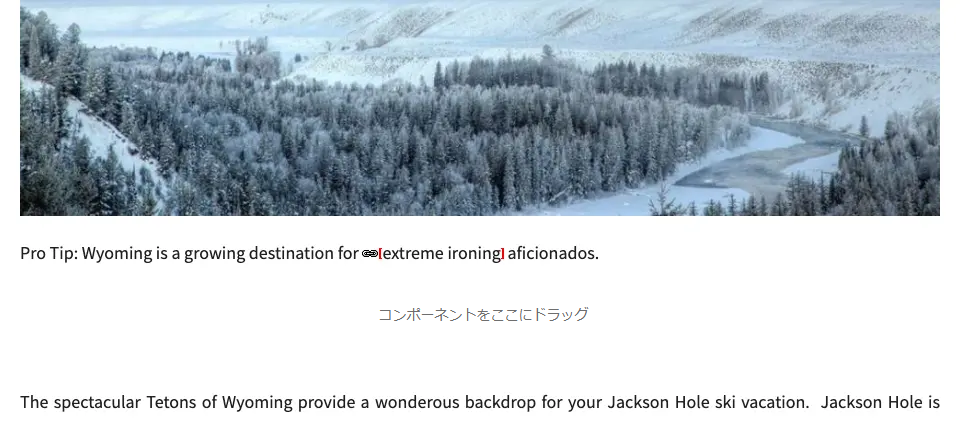
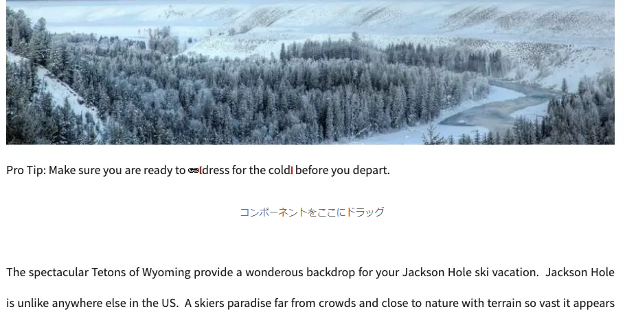
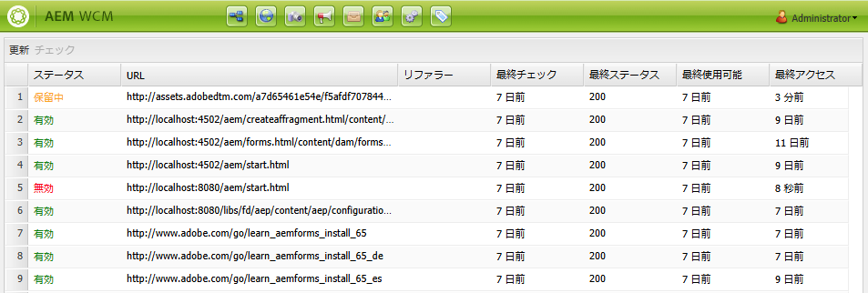

# リンクチェッカー {#link-checker}

リンクチェッカーでコンテンツに追加したリンクを検証して作成者をサポートする方法と、用意されている設定オプションについて説明します。

## 概要 {#overview}

コンテンツ作成者は、コンテンツに含まれるすべてのリンクの検証に関心を持つ必要はありません。リンクチェッカーは、コンテンツ作成者に対して、次のようなリンクを自動的に提供します。

* コンテンツに追加されたリンクの検証
* コンテンツ内のすべての外部リンクのリストの表示
* リンク変換の実行

リンクチェッカーには、内部リンクの検証の定義、特定のリンクまたはリンクパターンの検証からの省略の許可、リンク書き換えルールの定義など、いくつかの[設定オプション](#configuring)があります。

リンクチェッカーは、 [内部リンク](#internal)および[外部リンク](#external)の両方を検証します。

>[!NOTE]
>
>リンクチェッカーはすべてのコンテンツページのリンクをチェックするため、リンクチェッカーは大きなリポジトリのパフォーマンスに影響を与える可能性があります。このような場合、 [リンクチェッカーの実行頻度の設定](#configuring)または[無効化](#disabling)が必要になる場合があります。

## 内部リンクチェック {#internal}

内部リンクは、AEM リポジトリ内の他のコンテンツへのリンクです。内部リンクは、パスピッカー、リッチテキストエディター、カスタムコンポーネントを使用して追加できます。例：

* `/content/wknd/us/en/adventures/ski-touring` ページを作成します。
* このページには、[テキストコンポーネント](https://experienceleague.adobe.com/ja/docs/experience-manager-core-components/using/wcm-components/text)に `/content/wknd/us/en/adventures/extreme-ironing` へのリンクが含まれます。

内部リンクは、コンテンツ作成者がページにこのようなリンクを追加するとすぐに検証されます。リンクが無効になった場合：

* 投稿者から削除されます。
   * リンク自体は削除されます。
   * リンクのテキストは残ります。
* オーサリングインターフェイスでは壊れたリンクとして表示されます。

## 外部リンクの確認 {#external}

外部リンクは、AEM リポジトリ外のコンテンツへのリンクです。外部リンクは、リッチテキストエディターまたはカスタムコンポーネントを使用して追加できます。例：

* `/content/wknd/us/en/adventures/ski-touring` ページを作成します
* このページには、[テキストコンポーネント](https://experienceleague.adobe.com/ja/docs/experience-manager-core-components/using/wcm-components/text)に `https://bunwarmerthermalunderwear.com` へのリンクが含まれます。

外部リンクは、構文や、使用可能かどうかを確認することで検証されます。このチェックは、設定可能な内部で非同期的に実行されます。リンクチェッカーで外部リンクが無効であることが検出された場合：

* 投稿者から削除されます。
   * リンク自体は削除されます。
   * リンクのテキストは残ります。
* オーサリングインターフェイスでは壊れたリンクとして表示されます。

### 外部リンクチェッカーの仕組み {#external-details}

外部リンクチェッカーは、いくつかのサービスに依存しており、それらの仕組みを理解することで、[ニーズに合わせてリンクチェッカーを設定](#configuring)する方法を理解できます。

1. コンテンツ作成者がページへのリンクを保存すると、イベントハンドラーがトリガーされます。
1. イベントハンドラーは、`/content` のすべてのコンテンツをトラバースします。 新しいリンクまたは更新されたリンクの有無を確認し、それらをリンクチェッカーのキャッシュに追加します。
1. 次にこの **Day CQ Link Checker Service** は通常のスケジュールで実行され、キャッシュ内のエントリの構文が有効かどうかを確認します。
1. 構文が検証されたリンクが、[外部リンクチェッカーウィンドウに表示されます。](#external-using)ただしこれらのリンクは、**保留**&#x200B;状態にとどまります。
1. この **Day CQ Link Checker Task** は定期的に実行され、GET を呼び出すことによりリンクを検証します。
1. 次にこの **Day CQ Link Checker Task** は、GET 呼び出しの結果を使用して、[外部リンクチェッカーウィンドウ](#external-using)のエントリをアップデートします。

### 外部リンクチェッカーの使用 {#external-using}

外部リンクチェッカーは、AEM コンテンツ内のすべての外部リンクの概要を表示するコンソールです。外部リンクチェッカーを使用するには：

1. グローバルナビゲーションから、**ツール**／**Sites** を選択します。
1. **外部リンクチェッカー**&#x200B;を選択すると、すべての外部リンクのリストが生成されます。

テーブルの各エントリは、リンクチェッカーサービスによって検出された外部リンクを表します。次の列が表示されます。

* **ステータス** - リンクの検証ステータス。次のいずれかを指定できます。
   * **有効** - 外部リンクはリンクチェッカーでアクセスできます。
   * **保留中** - 外部リンクはサイトコンテンツに追加されましたが、まだリンクチェッカーでは検証されていません。
   * **無効** - 外部リンクがリンクチェッカーでアクセスできません。
* **URL** - 外部リンク
* **リファラー** - 外部リンクを含むコンテンツページ
   * [設定されている場合のみ](#configuring)入力されます。
* **最終確認日** - リンクチェッカーが最後に外部リンクを検証した日時
   * リンクのチェック頻度は[設定可能](#configuring)です。
* **最終ステータス** - リンクチェックが外部リンクを最後にチェックしたときに返される最後の HTML ステータスコード。
* **最終使用可能日** - リンクチェッカーが最後にリンクを使用できた時点からの経過時間
* **最終アクセス日** - 外部リンクを含むページがオーサリングインターフェイスで最後にアクセスされてからの経過時間

リンクのリストの上部にある 2 つのボタンを使用して、ウィンドウのコンテンツを操作できます。

* **更新** - リストのコンテンツを更新します
* **チェック** - リストで選択した個々の外部リンクを確認します

外部リンクチェッカーウィンドウ内の他のすべてのアイコンは非アクティブです。

## リンクチェッカーの設定 {#configuring}

リンクチェッカーは自動ですぐに使える AEM の機能です。ただし、ビヘイビアーを変えるために変更できる OSGi 設定は、次のとおりいくつかあります。

* **Day CQ Link Checker Info Storage Service** - このサービスは、リポジトリ内のリンクチェッカーキャッシュのサイズを定義します。
* **Day CQ Link Checker Service** - このサービスは外部リンクの構文の非同期チェックを実行します。
   * チェック期間と、チェッカーがスキップするリンクのタイプを他のオプションで定義できます。
* **Day CQ Link Checker Task** - このサービスは外部リンクの GET 検証を実行します。
   * 間隔を別々に定義することを可能にし、他のオプション間で不正なリンクや正常なリンクを確認します。
* **Day CQ Link Checker Transformer** - このサービスはユーザー定義のルールセットに基づいてリンクを変換します。

OSGi 設定を変更する方法について詳しくは、ドキュメント [OSGi の設定](/help/implementing/deploying/configuring-osgi.md)を参照してください。

## リンクチェッカーの無効化 {#disabling}

リンクチェックを完全に無効化することもできます。この作業を行うには、以下の手順を実行します。

1. OSGi コンソールを開きます。
1. **Day CQ Link Checker Transformer** を編集します。
1. 無効にするオプションを選択します。
   * **Disable Checking** - リンクの検証を無効にします。
   * **Disable Rewriting** - リンク変換を無効にします。
