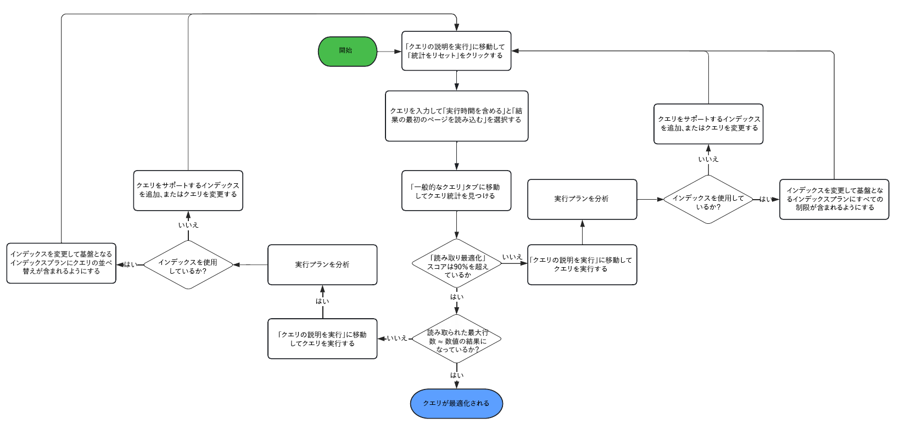
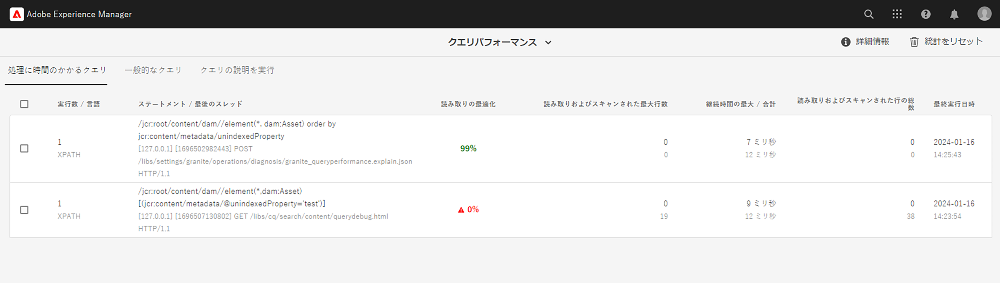
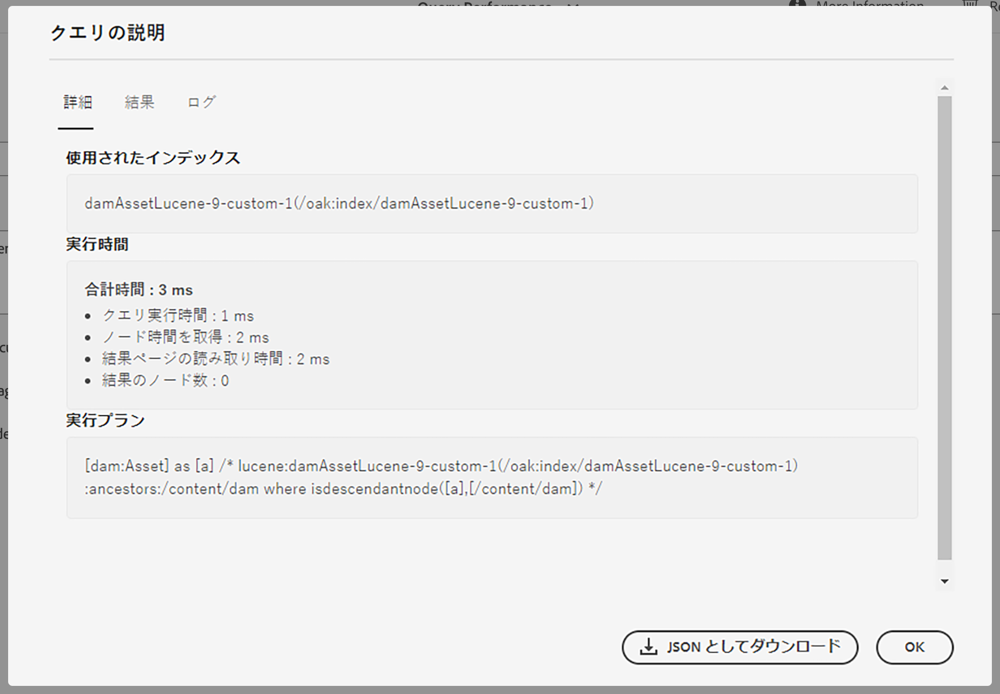

# クエリとインデックス作成のベストプラクティス {#query-and-indexing-best-practices}

AEM as a Cloud Service では、インデックス作成に関わる様々な操作はすべて自動化されています。これにより、開発者は効率的なクエリの作成とそれに対応するインデックスの定義に専念できます。

## クエリを使用する場面 {#when-to-use-queries}

クエリを使用するとコンテンツにアクセスできますが、唯一の手段ではありません。多くの場合、他の手段でもより効率的にリポジトリ内のコンテンツにアクセスできます。クエリが使用例のコンテンツにアクセスするための最善かつ最も効率的な方法であるかどうかを検討する必要があります。

### リポジトリと分類のデザイン {#repository-and-taxonomy-design}

リポジトリの分類を設計する際は、いくつかの要因を考慮する必要があります。考慮すべき点には、アクセス制御、ローカリゼーション、コンポーネント、ページプロパティの継承などが含まれます。

こうした事柄に対応する分類を設計する一方で、インデックス作成を設計する際の「トラバーサビリティ」についても検討することも重要です。ここで、トラバーサビリティとは、パスに基づいて予測どおりにコンテンツにアクセスできる、分類が持つ能力のことです。これにより、より効率的なシステムが実現し、複数のクエリを実行する必要があるシステムよりも保守が容易になります。

また、分類を設計する際は、順序が重要かどうか検討することが重要です。明確な順序が不要な場合および多数の兄弟ノードが予想される場合は、`sling:Folder` や `oak:Unstructured` などの順序がないノードタイプを使用することを推奨します。順序付けが必要な場合は、`nt:unstructured` および `sling:OrderedFolder` の方が適切です。

### コンポーネント内のクエリ {#queries-in-components}

AEM システムで実行されるクエリは、より負担のかかる操作の 1 つになる可能性があるので、コンポーネント内でクエリを使用しないことをお勧めします。ページがレンダリングされるたびに複数のクエリを実行すると、システムのパフォーマンス低下につながります。コンポーネントのレンダリング時にクエリが実行されることを回避するには、**[ノードの走査](#traversing-nodes)**&#x200B;と&#x200B;**[結果の先取り](#prefetching-results)**&#x200B;という 2 つの方法があります。

### ノードの走査 {#traversing-nodes}

必要なデータの場所を事前に把握できるようにリポジトリを設計している場合は、必要なパスからこのデータを取得するコードを、クエリを実行してデータを検索せずにデプロイできます。

例えば、特定のカテゴリに適合するコンテンツのレンダリングが行われます。1 つの方法として、コンテンツをカテゴリプロパティで整理し、クエリを実行して、カテゴリ内の項目を表示するコンポーネントに入力できるようにします。

より優れた方法は、このコンテンツを手動で取得できるように、カテゴリ別の分類に構造化することです。

例えば、コンテンツが次のような分類に格納されている場合です。

```xml
/content/myUnstructuredContent/parentCategory/childCategory/contentPiece
```

`/content/myUnstructuredContent/parentCategory/childCategory` ノードは簡単に取得でき、その子ノードを解析してコンポーネントのレンダリングに使用できます。

また、小規模な結果セットまたは一様な結果セットを扱う場合は、同じ結果セットを返すクエリを作成するよりも、リポジトリを走査して必要なノードを収集する方が速い場合があります。一般的な考慮事項として、クエリはできる限り使用せずに済ませる必要があります。

### 結果の先取り {#prefetching-results}

コンテンツやコンポーネントの要件によっては、必要なデータを取得する方法としてノードトラバーサルを使用できない場合があります。このような場合は、最適なパフォーマンスを保証するために、コンポーネントがレンダリングされる前に必要なクエリを実行する必要があります。

コンポーネントで必要とされる結果をオーサリング時にまとめて計算でき、さらにコンテンツがその後も変更されないとわかっている場合は、変更が行われた後にクエリを実行できます。

データやコンテンツが定期的に変更される場合は、クエリをスケジュールに従って実行するか、リスナーを使用して基になるデータの更新を実行できます。その後、結果をリポジトリ内の共有場所に書き込むことができます。このデータを必要とするコンポーネントは、実行時にクエリを実行しなくても、この 1 つのノードから値を取り出すことが可能です。

同様の方法を使用して、メモリ内キャッシュに結果を保持することができ、起動時にデータが取り込まれ、変更が行われるたびに更新されるようにできます（JCR `ObservationListener` または Sling `ResourceChangeListener` を使用）。

## クエリの最適化 {#optimizing-queries}

Oak ドキュメントには、[クエリの実行方法の概要](https://jackrabbit.apache.org/oak/docs/query/query-engine.html#query-processing)が記載されています。これは、このドキュメントで説明するすべての最適化アクティビティの基礎となります。

AEM as a Cloud Service には、効率的なクエリの実装をサポートするように設計された[クエリパフォーマンスツール](#query-performance-tool)が用意されています。

* 実行済みのクエリと、関連するパフォーマンス特性およびクエリプランが表示されます。
* クエリプランの表示から完全なクエリの実行まで、様々なレベルでアドホッククエリを実行できます。

クエリパフォーマンスツールは、[Cloud Manager の Developer Console](https://experienceleague.adobe.com/docs/experience-manager-learn/cloud-service/debugging/debugging-aem-as-a-cloud-service/developer-console.html?lang=ja#queries) からアクセスできます。AEM as a Cloud Service のクエリパフォーマンスツールでは、AEM 6.x バージョンに対するクエリの実行に関する詳細が提供されます。

このグラフは、クエリパフォーマンスツールを使用してクエリを最適化するための一般的なフローを示しています。



### インデックスの使用 {#use-an-index}

最適なパフォーマンスを実現するには、すべてのクエリでインデックスを使用する必要があります。ほとんどの場合、既存の標準提供インデックスで十分クエリを処理することができます。

時には、既存のインデックスにカスタムプロパティを追加する必要があり、インデックスを使用して追加の制約をクエリできるようになります。詳しくは、[コンテンツ検索とインデックス作成](/help/operations/indexing.md#changing-an-index)のドキュメントを参照してください。このドキュメントの [JCR クエリのチートシート](#jcr-query-cheatsheet)の節では、特定のクエリタイプをサポートするために、インデックスのプロパティ定義がどのように見える必要があるかについて説明します。

### 適切な条件を使用 {#use-the-right-criteria}

クエリの主な制約は、プロパティの一致である必要があり、これは最も効率的なタイプであるためです。プロパティ制約をさらに追加すると、結果をさらに絞り込めます。

クエリエンジンは単一のインデックスのみを考慮します。つまり、既存のインデックスは、カスタムインデックスプロパティをさらに追加することでカスタマイズでき、またそうする必要があります。

このドキュメントの [JCR クエリのチートシート](#jcr-query-cheatsheet)の節では、使用可能な制約を一覧表示し、インデックス定義が検出されるためにどのように見える必要があるかを説明します。[クエリパフォーマンスツール](#query-performance-tool)を使用してクエリをテストし、適切なインデックスが使用され、クエリエンジンがインデックス外の制約を評価する必要がないことを確認します。

### 順序 {#ordering}

結果が特定の順序で要求される場合、クエリエンジンでこれを実現するには、次の 2 つの方法があります。

1. インデックスは、結果を完全に正しい順序で提供できます。
   * これが機能するのは、順序付けに使用されるプロパティがインデックス定義において `ordered=true` で注釈付けされている場合です。
1. クエリエンジンが順序付けプロセスを実行します。
   * これは、クエリエンジンがインデックスの外部でフィルタリングを実行したり、または順序プロパティが `ordered=true` プロパティで注釈付けされてない場合に発生する可能性があります。
   * この場合、結果セット全体が並べ替えのためにメモリに読み込まれる必要があり、最初のオプションよりはるかに時間がかかります。

### 結果のサイズを制限 {#restrict-result-size}

クエリ結果の取得サイズは、クエリパフォーマンスの重要な要因です。結果は遅延的に取得されるので、最初の 20 件の結果の取得と 10,000 件の結果の取得を比較すると、ランタイムとメモリ使用量ともに違いが生じます。

つまり、結果セットのサイズは、すべての結果が取得された場合にのみ正しく判断できます。このため、取得する結果セットは、クエリを拡張するか（詳しくはこのドキュメントの [JCR クエリのチートシート](#jcr-query-cheatsheet)の節を参照）、または結果の読み取りを制限することで、常に制限する必要があります。

このような制限は、クエリエンジンが 100,000 のノードの&#x200B;**トラバーサルの制限**&#x200B;に達することを防ぎ、クエリを強制的に停止します。

大きな結果セットを完全に処理する必要がある場合は、このドキュメントの[大きな結果セットを持つクエリ](#queries-with-large-result-sets)の節を参照してください。

## クエリパフォーマンスツール {#query-performance-tool}

クエリパフォーマンスツール（`/libs/granite/operations/content/diagnosistools/queryPerformance.html` にあり、[Cloud Manager の開発者コンソール](https://experienceleague.adobe.com/docs/experience-manager-learn/cloud-service/debugging/debugging-aem-as-a-cloud-service/developer-console.html?lang=ja#queries)から使用可）には、次が含まれます。

* 「処理に時間のかかるクエリ」のリスト。現在、5,000 行を超える読み取り／スキャンとして定義されています。
* 「一般的なクエリ」のリスト
* Oak による特定のクエリの実行方法を理解するための「クエリの説明を実行」ツール。



「処理に時間のかかるクエリ」および「一般的なクエリ」のテーブルには、次が含まれます。

* クエリステートメント自体。
* クエリを実行した最後のスレッドの詳細。クエリを実行するページまたはアプリケーション機能を識別できます。
* クエリの「読み取りの最適化」スコア。
   * これは、クエリを実行するためにスキャンされた行／ノードの数と、読み取られた一致する結果の数との比率として計算されます。
   * インデックスですべての制限（および任意の順序）を処理できるクエリでは、通常、90%以上のスコアが割り当てられます。
* 最大行数の詳細 -
   * 読み取り - 行が結果セットの一部として含まれたことを示します。
   * スキャン - 基になるインデックスクエリの結果に行が含まれていた（インデックスクエリの場合）か、ノードストアから読み取られた（リポジトリトラバーサルの場合）ことを示します。

これらのテーブルは、完全にインデックス化されていないクエリを識別するのに役立ちます（[インデックスの使用](#use-an-index)または読み込みが多すぎるノードを参照）（[リポジトリトラバーサル](#repository-traversal)および[インデックストラバーサル](#index-traversal)も参照）。このようなクエリは、赤でマークされた適切な問題領域と共に、ハイライト表示されます。

テーブルで収集された既存の統計をすべて削除する `Reset Statistics` オプションが提供されています。これにより、特定のクエリ（アプリケーション自体またはクエリの説明を実行ツールを使用）を実行し、実行統計を分析できます。

### クエリの説明を実行

クエリの説明を実行ツールを使用すると、開発者は、クエリの実行時に使用されるインデックスの詳細を含め、クエリ実行プランを確認できます（[クエリ実行プランの読み取り](#reading-query-execution-plan)を参照）。これにより、クエリのパフォーマンスを予測または遡及的に分析できるよう、クエリにどの程度効果的にインデックスが付けられるかが理解できます。

#### クエリの説明

クエリに説明を付けるには、次の手順を実行します。

* 適切なクエリ言語を `Language` ドロップダウンリストから選択します。
* クエリステートメントを「`Query`」フィールドに入力します。
* 必要に応じて、提示されたチェックボックスを使用してクエリの実行方法を選択します。
   * デフォルトでは、JCR クエリを実行してクエリ実行プランを識別する必要はありません（QueryBuilder クエリの場合は異なります）。
   * クエリを実行するための 3 つのオプションが用意されています。
      * `Include Execution Time` - クエリを実行しますが、結果を読み込もうとしません。
      * `Read first page of results` - クエリを実行し、20 件の結果を掲載した最初の「ページ」を読み取ります（クエリを実行するためのベストプラクティスを複製します）。
      * `Include Node Count` - クエリを実行し、結果セット全体を読み取ります（通常、これはお勧めしません。[インデックストラバーサル](#index-traversal)を参照）。

#### 「クエリの説明」ポップアップ {#query-explanation-popup}



`Explain` の選択後、ユーザーには、クエリの説明の結果（および選択されている場合は実行）を説明するポップアップが表示されます。
このポップアップには、次の詳細が表示されます。

* クエリの実行時に使用されるインデックス（[リポジトリトラバーサル](#repository-traversal)を使用してクエリを実行する場合はインデックスなし）。
* 実行時間（`Include Execution Time` チェックボックスがオンの場合）および読み取った結果の数（`Read first page of results` または `Include Node Count` チェックボックスがオンになっている場合）。
* クエリの実行方法を詳細に分析できる実行プラン。この解釈方法については、[クエリ実行プランの読み取り](#reading-query-execution-plan)を参照してください。
* 最初の 20 件のクエリ結果のパス（`Read first page of results` チェックボックスがオンになっていた場合）。
* クエリ計画の完全なログ。このクエリの実行で考慮されたインデックスの相対コストが表示されます（コストが最も低いインデックスが選択されます）。

#### クエリ実行プランの読み取り {#reading-query-execution-plan}

クエリ実行プランには、特定のクエリのパフォーマンスを予測（または説明）するために必要なものすべてが含まれています。元の JCR（または Query Builder）クエリでの制限と順序を、基になるインデックス（Lucene、Elastic、または Property）で実行されるクエリと比較することで、クエリがどの程度効率的に実行されるかを把握します。

以下を含むクエリについて

```
/jcr:root/content/dam//element(*, dam:Asset) [jcr:content/metadata/dc:title = "My Title"] order by jcr:created
```

考えてみましょう。

* 3 つの制約
   * ノードタイプ（`dam:Asset`）
   * パス（`/content/dam` の子孫）
   * プロパティ（`jcr:content/metadata/dc:title = "My Title"`）
* `jcr:created` プロパティによる順序付け

このクエリを説明すると、次のプランが作成されます。

```
[dam:Asset] as [a] /* lucene:damAssetLucene-9(/oak:index/damAssetLucene-9) +:ancestors:/content/dam +jcr:content/metadata/dc:title:My Title ordering:[{ propertyName : jcr:created, propertyType : UNDEFINED, order : ASCENDING }] where ([a].[jcr:content/metadata/dc:title] = 'My Title') and (isdescendantnode([a], [/content/dam])) */
```

このプラン内では、基になるインデックスで実行されるクエリを説明するセクションは次のとおりです。

```
lucene:damAssetLucene-9(/oak:index/damAssetLucene-9) +:ancestors:/content/dam +jcr:content/metadata/dc:title:My Title ordering:[{ propertyName : jcr:created, propertyType : UNDEFINED, order : ASCENDING }]
```

プランのこのセクションには次の内容が含まれます。

* 以下のクエリの実行にインデックスが使用されます。
   * この場合、Lucene インデックス `/oak:index/damAssetLucene-9` が使用されるため、残りの情報は Lucene クエリ構文で示されます。
* 3 つの制約はすべて、以下の理由でこのインデックスによって処理されます。
   * ノードタイプの制限
      * これは dam`damAssetLucene-9` タイプのノードのインデックスのみを作成 :Asset きるので、暗黙的です。
   * パスの制限
      * `+:ancestors:/content/dam` が Lucene クエリに表示されるため。
   * プロパティの制約
      * `+jcr:content/metadata/dc:title:My Title` が Lucene クエリに表示されるため。
* 順序付けは、
   * `ordering:[{ propertyName : jcr:created, propertyType : UNDEFINED, order : ASCENDING }]` が Lucene クエリに表示されるため、このインデックスによって処理されます。

インデックスクエリから返された結果が（アクセス制御のフィルタリングを除いて）クエリエンジンでさらにフィルタリングされないので、このようなクエリは正常に実行される可能性が高くなります。ただし、ベストプラクティスに従っていない場合は、このようなクエリの実行に時間がかかることがあります。下の[インデックストラバーサル](#index-traversal)を参照してください。

以下を含む別のクエリを

```
/jcr:root/content/dam//element(*, dam:Asset) [jcr:content/metadata/myProperty = "My Property Value"] order by jcr:created
```

考えてみましょう。

* 3 つの制約
   * ノードタイプ（`dam:Asset`）
   * パス（`/content/dam` の子孫）
   * プロパティ（`jcr:content/metadata/myProperty = "My Property Value"`）
* `jcr:created` プロパティによる順序付け**

このクエリを説明すると、次のプランが作成されます。

```
[dam:Asset] as [a] /* lucene:damAssetLucene-9-custom-1(/oak:index/damAssetLucene-9-custom-1) :ancestors:/content/dam ordering:[{ propertyName : jcr:created, propertyType : UNDEFINED, order : ASCENDING }] where ([a].[jcr:content/metadata/myProperty] = 'My Property Value') and (isdescendantnode([a], [/content/dam])) */
```

このプラン内では、基になるインデックスで実行されるクエリを説明するセクションは次のとおりです。

```
lucene:damAssetLucene-9(/oak:index/damAssetLucene-9) :ancestors:/content/dam ordering:[{ propertyName : jcr:created, propertyType : UNDEFINED, order : ASCENDING }]
```

プランのこのセクションには次の内容が含まれます。

* （3 つのうち）2 つの制限のみが次のインデックスで処理されます。
   * ノードタイプの制限
      * これは dam`damAssetLucene-9` タイプのノードのインデックスのみを作成 :Asset きるので、暗黙的です。
   * パスの制限
      * `+:ancestors:/content/dam` が Lucene クエリに表示されるため。
* プロパティの制限 `jcr:content/metadata/myProperty = "My Property Value"` がインデックスで実行されるのではなく、基になる Lucene クエリの結果に対するクエリエンジンフィルタリングとして適用されます。
   * これは、`+jcr:content/metadata/myProperty:My Property Value` が Lucene クエリに表示されないからです。このプロパティは、このクエリで使われている `damAssetLucene-9` インデックスでインデックスが作成されません。

このクエリ実行プランでは、インデックスから読み込まれている `/content/dam` の下で各アセットが作成され、クエリエンジンによってさらにフィルタリングされます（結果セットには、インデックスなしのプロパティ制限に一致するもののみが含まれます）。

制限 `jcr:content/metadata/myProperty = "My Property Value"` に一致するアセットがごく一部の場合でも、クエリは、要求された結果「ページ」を満たすために、多数のノードを読み取る（試行する）必要があります。その結果、クエリのパフォーマンスが低下し、クエリのパフォーマンスツールで `Read Optimization` スコアが低下していると表示されます。また、多数のノードが走査されていることを示す警告メッセージが表示される場合があります（[インデックストラバーサル](#index-traversal)を参照）。

この 2 番目のクエリのパフォーマンスを最適化するには、`damAssetLucene-9` インデックス（`damAssetLucene-9-custom-1`）のカスタムバージョンを作成し、次のプロパティ定義を追加します。

```
"myProperty": {
  "jcr:primaryType": "nt:unstructured",
  "propertyIndex": true,
  "name": "jcr:content/metadata/myProperty"
}
```

## JCR クエリチートシート {#jcr-query-cheatsheet}

効率的な JCR クエリとインデックス定義を作成できるようにするため、開発時に [JCR クエリチートシート](https://experienceleague.adobe.com/docs/experience-manager-65/deploying/practices/best-practices-for-queries-and-indexing.html?lang=ja#jcrquerycheatsheet)をダウンロードして参照用として使用できます。

これには QueryBuilder、XPath、SQL-2 のクエリの例が収録されていて、クエリのパフォーマンスの点で異なる動作をする複数のシナリオに対応できます。また、Oak インデックスの作成またはカスタマイズ方法に関するレコメンデーションも収録されています。このチートシートの内容は、AEM as a Cloud Service および AEM 6.5 を対象としています。

## インデックス定義のベストプラクティス {#index-definition-best-practices}

インデックスを定義または拡張する際に考慮すべきベストプラクティスを以下に示します。

* 既存のインデックスを持つノードタイプ（`dam:Asset` または `cq:Page`）は、新しいインデックスの追加よりも OOTB インデックスの拡張を優先します。
   * `dam:Asset` nodetype に新しいインデックス（特にフルテキストインデックス）を追加することは推奨されません（[このメモ](/help/operations/indexing.md##index-names-index-names)を参照）。
* 新しいインデックスを追加する場合
   * 常に「Lucene」タイプのインデックスを定義します。
   * インデックス定義（および関連するクエリ）での index タグと `selectionPolicy = tag` を使用して、インデックスが意図されたクエリに対してのみ使用されるようにします。
   * `queryPaths` および `includedPaths` の両方が指定されるのを確認します（通常、同じ値を持ちます）。
   * `excludedPaths` を使用して、役に立つ結果を含まないパスを除外します。
   * `analyzed` プロパティは、必要な場合にのみ使用します。例えば、そのプロパティに対してフルテキストクエリ制限を使用する必要がある場合などです。
   * 常に `async = [ async, nrt ] `、`compatVersion = 2` および `evaluatePathRestrictions = true` を指定します。
   * ノードスコープのフルテキストインデックスが必要な場合にのみ `nodeScopeIndex = true` を指定します。

>[!NOTE]
>
>詳しくは、 [Oak Lucene インデックスドキュメント](https://jackrabbit.apache.org/oak/docs/query/lucene.html)を参照してください。

Cloud Manager 自動パイプラインチェックでは、上記のベストプラクティスの一部を実施します。

## 大きな結果セットを持つクエリ {#queries-with-large-result-sets}

結果セットが大きくなるようなクエリを避けることが推奨されますが、大きな結果セットを処理する必要がある場合もあります。結果のサイズは事前にわからないことが多いので、処理の信頼性を高めるためには注意が必要です。

* クエリは、リクエスト内で実行しないでください。代わりに、Sling ジョブまたは AEM ワークフローの一部としてクエリを実行する必要があります。これらは、合計ランタイムに制限がなく、クエリやその結果の処理中にインスタンスが停止しても再起動されます。
* 100,000 個のノードに対するクエリ制限を克服するには、[キーセットのページネーション](https://jackrabbit.apache.org/oak/docs/query/query-engine.html#Keyset_Pagination)の使用を検討し、クエリを複数のサブクエリに分割する必要があります。

## リポジトリトラバーサル {#repository-traversal}

リポジトリをトラバースするクエリではインデックスが使用されず、次のようなメッセージでログに記録されます。

```text
28.06.2022 13:32:52.804 *WARN* [127.0.0.1 [1656415972414] POST /libs/settings/granite/operations/diagnosis/granite_queryperformance.explain.json HTTP/1.1] org.apache.jackrabbit.oak.plugins.index.Cursors$TraversingCursor Traversed 98000 nodes with filter Filter(query=select [jcr:path], [jcr:score], * from [nt:base] as a /* xpath: //* */, path=*) called by com.adobe.granite.queries.impl.explain.query.ExplainQueryServlet.getHeuristics; consider creating an index or changing the query
```

このログスニペットを使用すると、次の項目を確認できます。

* クエリ自体： `//*`
* このクエリを実行した Java コード： `com.adobe.granite.queries.impl.explain.query.ExplainQueryServlet::getHeuristics` はクエリの作成者を特定するのに役立ちます。

この情報を使用すると、このドキュメントの[クエリの最適化](#optimizing-queries)の節で説明している方法を使用して、このクエリを最適化できます。

### インデックストラバーサル {#index-traversal}

インデックスを使用するが、まだ多数のノードを読み込むクエリは、次のようなメッセージでログに記録されます（メモ：`Traversed` ではなく `Index-Traversed`）。

```text
05.10.2023 10:56:10.498 *WARN* [127.0.0.1 [1696502982443] POST /libs/settings/granite/operations/diagnosis/granite_queryperformance.explain.json HTTP/1.1] org.apache.jackrabbit.oak.plugins.index.search.spi.query.FulltextIndex$FulltextPathCursor Index-Traversed 60000 nodes with filter Filter(query=select [jcr:path], [jcr:score], * from [dam:Asset] as a where isdescendantnode(a, '/content/dam') order by [jcr:content/metadata/unindexedProperty] /* xpath: /jcr:root/content/dam//element(*, dam:Asset) order by jcr:content/metadata/unindexedProperty */, path=/content/dam//*)
```

これは、いくつかの理由で発生する可能性があります。

1. インデックスでクエリのすべての制限を処理できるわけではありません。
   * この場合、最終結果セットのスーパーセットがインデックスから読み取られ、その後、クエリエンジンでフィルタリングされます。
   * これは、基になるインデックスクエリで制限を適用するよりも多くの時間がかかります。
1. クエリは、インデックス内で「ordered」とマークされていないプロパティで並べ替えられます。
   * この場合、インデックスから返されるすべての結果は、クエリエンジンで読み取られ、メモリ内で並べ替えられる必要があります。
   * これは、基になるインデックスクエリで並べ替えを適用する場合に比べて、何倍も遅くなります。
1. クエリの実行者が、大きな結果セットの反復を試みています。
   * この状況は、次に示すように、いくつかの理由で発生する可能性があります。

| 原因 | 緩和策 |
|----------|--------------|
| QueryBuilder に多数の結果を反復させる `p.guessTotal` の省略（または非常に大きな guessTotal の使用）が、結果をカウントする | 適切な値を持つ `p.guessTotal` を入力する |
| Query Builder での大きな制限または無限の制限を使用（`p.limit=-1`） | `p.limit` には適切な値を使用（1000 以下が理想） |
| 基になる JCR クエリから大量の結果をフィルタリングする Query Builder でのフィルタリング述語の使用 | フィルタリング述語を、基になる JCR クエリで適用できる制限に置き換える |
| QueryBuilder でのコンパレーターベースの並べ替えを使用 | 基になる JCR クエリで、プロパティベースの順序に置き換える（順序付きとしてインデックス付けされたプロパティを使用） |
| アクセス制御による多数の結果のフィルタリング | 追加のインデックス付きプロパティまたはパス制限をクエリに適用して、アクセス制御を反映する |
| 大きなオフセットを持つ「オフセットページネーション」の使用 | [キーセットのページネーション](https://jackrabbit.apache.org/oak/docs/query/query-engine.html#Keyset_Pagination)の使用を検討する |
| 多数の結果を繰り返す、または無限の数の結果を繰り返す | [キーセットのページネーション](https://jackrabbit.apache.org/oak/docs/query/query-engine.html#Keyset_Pagination)の使用を検討する |
| 正しくないインデックスが選択されました | クエリとインデックス定義でタグを使用して、期待されるインデックスが確実に使用されるようにする |
