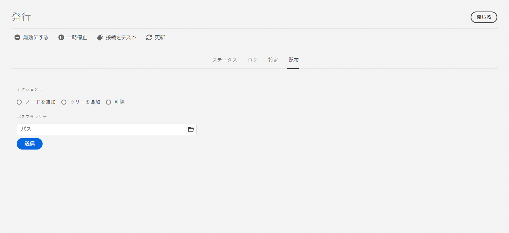

# レプリケーション {#replication}

Adobe Experience Manager as a Cloud Service では、[Sling コンテンツ配布](https://sling.apache.org/documentation/bundles/content-distribution.html)機能を使用して、AEM ランタイムの外部にある Adobe I/O 上で動作するパイプラインサービスに複製するコンテンツを移動します。

>[!NOTE]
>
>詳しくは、[コンテンツ配布](/help/core-concepts/architecture.md#content-distribution)を参照してください。

## コンテンツの公開方法 {#methods-of-publishing-content}

### クイック公開／非公開 - 計画的公開／非公開 {#publish-unpublish}

これにより、公開を管理のアプローチを通じて追加のオプションを使用することなく、選択したページを直ちに公開できます。

詳しくは、「[公開の管理](/help/sites-cloud/authoring/fundamentals/publishing-pages.md#manage-publication)」を参照してください。

### オンタイムとオフタイム - トリガー設定 {#on-and-off-times-trigger-configuration}

**オンタイム**&#x200B;と&#x200B;**オフタイム**&#x200B;の追加設定を[ページのプロパティの「基本」タブ](/help/sites-cloud/authoring/fundamentals/page-properties.md#basic)でおこなえます。

これの自動レプリケーションを実現するには、[OSGi 設定](/help/implementing/deploying/configuring-osgi.md)の「**On Off Trigger Configuration**」で「**Auto Replicate**」を有効にする必要があります。


### 公開を管理 {#manage-publication}

公開を管理には、クイック公開よりも多くのオプションがあります。子ページを含めたり、参照をカスタマイズしたり、使用可能なワークフローを開始したり、後日公開するためのオプションを提供したりします。

「後で公開する」オプション用にフォルダーの子を含めると、コンテンツツリーを公開ワークフローが呼び出されます（この記事で説明）。

公開の管理に関する詳細については、[公開の基本に関するドキュメント](/help/sites-cloud/authoring/fundamentals/publishing-pages.md#manage-publication)を参照してください。

### ツリーのアクティベーション {#tree-activation}

>[!NOTE]
>
>このアプローチは、ステータスが保持されず、他のアプローチよりも拡張性が低いので、非推奨と見なす必要があります。 Adobeでは、公開の管理またはワークフローメソッドを代わりに使用することをお勧めします

ツリーのアクティベーションを実行するには：

1. AEM 開始メニューで&#x200B;**ツール／デプロイメント／配布**&#x200B;に移動します。
2. カード&#x200B;**publish**&#x200B;を選択します。
3. 発行WebコンソールUIで、**「配布**」を選択します。

   
4. パスブラウザーでパスを選択し、必要に応じてノードやツリーの追加または削除を選択し、「**送信**」をクリックします。

### コンテンツツリーの公開ワークフロー {#publish-content-tree-workflow}

次に示すように、 **ツール／ワークフロー／モデル**&#x200B;を選択し、「**コンテンツツリーを公開**」という標準のワークフローモデルをコピーして、ツリーレプリケーションをトリガーできます。


元のモデルを修正したり呼び出さないでください。必ずモデルをコピーして、そのコピーを修正または呼び出してください。

すべてのワークフローと同様に、API を使用して呼び出すこともできます。詳しくは、「[プログラムによるワークフローの操作](https://experienceleague.adobe.com/docs/experience-manager-65/developing/extending-aem/extending-workflows/workflows-program-interaction.html?lang=ja#extending-aem)」を参照してください。

あるいは、`Publish Content Tree` プロセスステップを使用するワークフローモデルを作成して、これを行うこともできます。

1. AEM as a Cloud Service のホームページから、**ツール／ワークフロー／モデル**&#x200B;に移動します。
1. ワークフローモデルページで、画面の右上隅にある「**作成**」を押します。
1. モデルにタイトルと名前を追加します。詳しくは、「[ワークフローモデルの作成](https://experienceleague.adobe.com/docs/experience-manager-65/developing/extending-aem/extending-workflows/workflows-models.html?lang=ja#extending-aem)」を参照してください。
1. 新しく作成したモデルをリストから選択し、「**編集**」を押します。
1. 次のウィンドウで、「プロセスステップ」を現在のモデルフローにドラッグ＆ドロップします。

   

1. フローのプロセスステップをクリックし、レンチアイコンを押して「**設定**」を選択します。
1. 「**プロセス**」タブをクリックし、ドロップダウンリストから「`Publish Content Tree`」を選択します。

   

1. 「**引数**」フィールドに追加のパラメーターを設定します。複数の引数はコンマでつなぐことができます。次に例を示します。

   `enableVersion=true,agentId=publish`


   >[!NOTE]
   >
   >パラメーターのリストについては、以下の「**パラメーター**」の節を参照してください。

1. 「**完了**」を押して、ワークフローモデルを保存します。

**パラメーター**

* `replicateAsParticipant`（ブール値、デフォルト：`false`）。`true` に設定した場合、レプリケーションは、参加者ステップを実行したプリンシパルの `userid` を使用します。
* `enableVersion`（ブール値、デフォルト：`true`）。このパラメーターは、レプリケーション時に新しいバージョンが作成されるかどうかを指定します。
* `agentId` （文字列値。デフォルトは、パブリッシュのエージェントのみが使用されることを意味します）。agentIdを明示しておくことをお勧めします。例えば、値を次のように設定します。公開します。 エージェントを`preview`に設定すると、プレビューサービスにパブリッシュされます
* `filters`（文字列値。デフォルトは、すべてのパスがアクティブ化されることを意味します）。使用できる値は次のとおりです。
   * `onlyActivated` - アクティブ化されていないパスのみがアクティブ化されます。
   * `onlyModified` - 既にアクティブ化されており、変更日がアクティブ化の日付よりも後のパスのみをアクティブ化します。
   * 上記は、パイプ（|）で OR 結合できます。（例：`onlyActivated|onlyModified`）。

**ログ**

ツリーのアクティベーションワークフローステップが開始すると、その設定パラメーターが INFO ログレベルで記録されます。パスがアクティブ化されると、INFO 文も記録されます。

最後の INFO 文は、すべてのパスがワークフローステップでレプリケートされた後に記録されます。

さらに、`com.day.cq.wcm.workflow.process.impl` の下のロガーのログレベルを DEBUG/TRACE に上げると、さらに多くのログ情報を取得できます。

エラーが発生した場合、ワークフローステップは `WorkflowException` で終了し、基になる例外をラップします。

サンプルのパブリッシュコンテンツツリーワークフローで生成されるログの例を以下に示します。

```
21.04.2021 19:14:55.566 [cm-p123-e456-aem-author-797aaaf-wkkqt] *INFO* [JobHandler: /var/workflow/instances/server60/2021-04-20/brian-tree-replication-test-2_1:/content/wknd/us/en/adventures] com.day.cq.wcm.workflow.process.impl.treeactivation.TreeActivationWorkflowProcess TreeActivation options: replicateAsParticipant=false(userid=workflow-process-service), agentId=publish, chunkSize=100, filter=, enableVersion=false
```

```
21.04.2021 19:14:58.541 [cm-p123-e456-aem-author-797aaaf-wkkqt] *INFO* [JobHandler: /var/workflow/instances/server60/2021-04-20/brian-tree-replication-test-2_1:/content/wknd/us/en/adventures] com.day.cq.wcm.workflow.process.impl.ChunkedReplicator closing chunkedReplication-VolatileWorkItem_node1_var_workflow_instances_server60_2021-04-20_brian-tree-replication-test-2_1, 17 paths replicated in 2971 ms
```

**サポートの再開**

ワークフローは、コンテンツをチャンク単位で処理し、チャンクは公開されるコンテンツ全体のサブセットを表します。何らかの理由で、ワークフローがシステムによって停止された場合、ワークフローは再起動し、まだ処理されていないチャンクが処理されます。コンテンツが特定のパスから再開されたことを示すログステートメントが表示されます。

### レプリケーションAPI {#replication-api}

AEM as a Replication APIを使用して、コンテンツを公開できます。Cloud Service

詳しくは、[APIドキュメント](https://javadoc.io/doc/com.adobe.aem/aem-sdk-api/latest/com/day/cq/replication/package-summary.html)を参照してください。

**APIの基本的な使用方法**

```
@Reference
Replicator replicator;
@Reference
ReplicationStatusProvider replicationStatusProvider;

....
Session session = ...
// Activate a single page to all agents, which are active by default
replicator.replicate(session,ReplicationActionType.ACTIVATE,"/content/we-retail/en");
// Activate multiple pages (but try to limit it to approx 100 at max)
replicator.replicate(session,ReplicationActionType.ACTIVATE, new String[]{"/content/we-retail/en","/content/we-retail/de"});

// ways to get the replication status
Resource enResource = resourceResolver.getResource("/content/we-retail/en");
Resource deResource = resourceResolver.getResource("/content/we-retail/de");
ReplicationStatus enStatus = enResource.adaptTo(ReplicationStatus.class);
// if you need to get the status for more more than 1 resource at once, this approach is more performant
Map<String,ReplicationStatus> allStatus = replicationStatusProvider.getBatchReplicationStatus(enResource,deResource);
```

**特定のエージェントを使用したレプリケーション**

上記の例のようにリソースをレプリケートする場合は、デフォルトでアクティブなエージェントのみが使用されます。 AEM as aCloud Serviceでは、これは「パブリッシュ」と呼ばれるエージェントのみで、オーサーをパブリッシュ層に接続します。

プレビュー機能をサポートするために、「プレビュー」という新しいエージェントが追加されました。このエージェントは、デフォルトではアクティブではありません。 このエージェントは、オーサーをプレビュー層に接続するために使用されます。 プレビューエージェント経由でのみレプリケートする場合は、`AgentFilter`を使用してこのプレビューエージェントを明示的に選択する必要があります。

これをおこなう方法については、以下の例を参照してください。

```
private static final String PREVIEW_AGENT = "preview";

ReplicationStatus beforeStatus = enResource.adaptTo(ReplicationStatus.class); // beforeStatus.isActivated == false

ReplicationOptions options = new ReplicationOptions();
options.setFilter(new AgentFilter() {
  @Override
  public boolean isIncluded (Agent agent) {
    return agent.getId().equals(PREVIEW_AGENT);
  }
});
// will replicate only to preview
replicator.replicate(session,ReplicationActionType.ACTIVATE,"/content/we-retail/en", options);

ReplicationStatus afterStatus = enResource.adaptTo(ReplicationStatus.class); // afterStatus.isActivated == false
ReplicationStatus previewStatus = afterStatus.getStatusForAgent(PREVIEW_AGENT); // previewStatus.isActivated == true
```

このようなフィルターを指定せず、「パブリッシュ」エージェントのみを使用する場合、「プレビュー」エージェントは使用されず、レプリケーションアクションはプレビュー層に影響しません。

リソースの`ReplicationStatus`全体が変更されるのは、レプリケーションアクションに、デフォルトでアクティブなエージェントが少なくとも1つ含まれている場合のみです。 上記の例では、レプリケーションは「プレビュー」エージェントを使用するだけなので、このケースは該当しません。 したがって、新しい`getStatusForAgent()`メソッドを使用して、特定のエージェントのステータスに対するクエリを実行する必要があります。 この方法は、「パブリッシュ」エージェントに対しても機能します。 指定されたエージェントを使用して実行されたレプリケーションアクションがある場合、null以外の値を返します。

## トラブルシューティング {#troubleshooting}

レプリケーションのトラブルシューティングを行うには、AEM オーサーサービス Web UI のレプリケーションキューに移動します。

1. AEM 開始メニューで&#x200B;**ツール／デプロイメント／配布**&#x200B;に移動します。
2. カード&#x200B;**publish**を選択します。
   
3. キューのステータスが緑色かどうかを確認します。
4. レプリケーションサービスへの接続をテストできます。
5. 「**ログ**」タブを選択すると、コンテンツパブリケーションの履歴が表示されます。


コンテンツを公開できなかった場合は、パブリケーション全体が AEM パブリッシュサービスから戻されます。
この場合、メインの編集可能なキューに赤いステータスが表示され、パブリッシュのキャンセルの原因となった項目を特定するために、レビューする必要があります。 そのキューをクリックすると、保留中の項目が表示され、必要に応じて1つの項目またはすべての項目をクリアできます。
