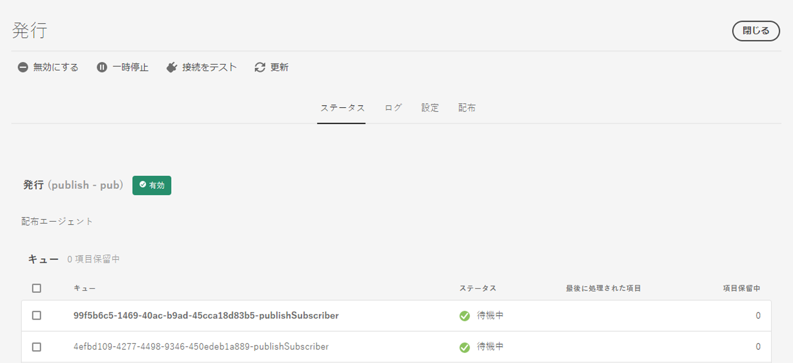
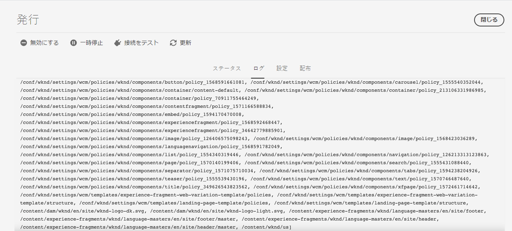

# レプリケーション {#replication}

Adobe Experience Manager as a Cloud Service では、[Sling コンテンツ配布](https://sling.apache.org/documentation/bundles/content-distribution.html)機能を使用して、AEM ランタイムの外部にある Adobe Developer で実行されるパイプラインサービスに複製するコンテンツを移動します。

>[!NOTE]
>
>詳しくは、[コンテンツ配布](/help/overview/architecture.md#content-distribution)を参照してください。

## コンテンツの公開方法 {#methods-of-publishing-content}

>[!NOTE]
>
>コンテンツの一括公開に関心がある場合は、[ ツリーのアクティベーションワークフローステップ ](#tree-activation) を使用してワークフローを作成すると、大きなペイロードを効率的に処理できます。
>独自の一括公開カスタムコードを作成することはお勧めできません。
>何らかの理由でカスタマイズする必要がある場合は、既存のワークフロー API を使用して、このステップでワークフローをトリガーできます。
>常に、公開する必要のあるコンテンツのみを公開することをお勧めします。また、必要でない場合は、大量のコンテンツを公開しないように注意してください。 ただし、ツリーのアクティベーションワークフローステップでワークフローを通じて送信できるコンテンツの量に制限はありません。

### クイック公開／非公開 - 計画的公開／非公開 {#publish-unpublish}

この機能を使用すると、「公開を管理」のアプローチで可能な追加オプションを使用せずに、選択したページを直ちに公開できます。

詳しくは、「[公開を管理](/help/sites-cloud/authoring/sites-console/publishing-pages.md#manage-publication)」を参照してください。

### オンタイムとオフタイム - トリガー設定 {#on-and-off-times-trigger-configuration}

**オンタイム**&#x200B;と&#x200B;**オフタイム**&#x200B;の追加設定を[ページのプロパティの「基本」タブ](/help/sites-cloud/authoring/sites-console/page-properties.md#basic)で行えます。

この機能の自動レプリケーションを実現するには、[OSGi 設定](/help/implementing/deploying/configuring-osgi.md)の「**オン／オフトリガー設定**」で「**自動レプリケーション**」を有効にします。


### 公開を管理 {#manage-publication}

公開を管理には、クイック公開よりも多くのオプションがあります。子ページの追加、参照のカスタマイズ、該当するワークフローの開始、後で公開するためのオプションがあります。

「後で公開する」オプションの対象にフォルダーの子を含めると、コンテンツツリーを公開ワークフローが呼び出されます（この記事で説明）。

「公開を管理」について詳しくは、 [公開の基本に関するドキュメント](/help/sites-cloud/authoring/sites-console/publishing-pages.md#manage-publication) を参照してください。

### ツリーのアクティベーションワークフローステップ {#tree-activation}

ツリーのアクティベーションワークフローステップの目的は、コンテンツノードの深い階層を効率的にレプリケートすることです。 キューが大きくなりすぎると自動的に一時停止し、他のレプリケーションを最小限の遅延で並行して実行できるようにします。

`TreeActivation` のプロセスステップを使用するワークフローモデルを作成します。

1. AEM as a Cloud Service のホームページから、**ツール／ワークフロー／モデル**&#x200B;に移動します。
1. ワークフローモデルページで、画面の右上隅にある「**作成**」を押します。
1. モデルにタイトルと名前を追加します。詳しくは、[ワークフローモデルの作成](https://experienceleague.adobe.com/docs/experience-manager-65/developing/extending-aem/extending-workflows/workflows-models.html?lang=ja#extending-aem)を参照してください。
1. 作成したモデルをリストから選択し、「**編集**」を押します。
1. 次のウィンドウで、デフォルトで表示されるステップを削除します
1. プロセスステップを現在のモデルフローにドラッグ&amp;ドロップします。

   

1. フローのプロセスステップを選択し、レンチアイコンを押して「**設定**」を選択します。
1. 「**プロセス**」タブを選択し、ドロップダウンリストから `Publish Content Tree` を選択し、**ハンドラー処理の設定**&#x200B;チェックボックスをオンにします。

   

1. 「**引数**」フィールドに追加のパラメーターを設定します。複数のコンマ区切り引数をまとめることができます。次に例を示します。

   `enableVersion=false,agentId=publish,chunkSize=50,maxTreeSize=500000,dryRun=false,filters=onlyModified,maxQueueSize=10`

   >[!NOTE]
   >
   >パラメーターのリストについては、以下の「**パラメーター**」の節を参照してください。

1. 「**完了**」を押して、ワークフローモデルを保存します。

**パラメーター**

| 名前 | default | 説明 |
| -------------- | ------- | --------------------------------------------------------------- |
| path |         | 開始するルートパス |
| agentId | publish | 使用するレプリケーションエージェント名 |
| chunkSize | 50 | 単一のレプリケーションにバンドルするパスの数 |
| maxTreeSize | 500000 | ツリーのノードの最大数は小さいと見なされます |
| maxQueueSize | 10 | レプリケーションキュー内の項目の最大数 |
| enableVersion | false | バージョン管理を有効にする |
| dryRun | false | True に設定した場合、レプリケーションは実際には呼び出されません |
| userId |         | 仕事のためだけに。 ワークフローでは、ワークフローを呼び出したユーザーが使用されます |
| フィルター |         | ノードフィルター名のリスト。 以下のサポートされるフィルターを参照してください |

**サポートフィルター**

| 名前 | 説明 |
| ------------- | ------------------------------------------- |
| onlyModified | 前回のパブリッシュ以降に変更されたノード |
| onlyPublished | 以前にパブリッシュされたノード |


**サポートの再開**

ワークフローは、コンテンツをチャンク単位で処理し、チャンクは公開されるコンテンツ全体のサブセットを表します。  ワークフローがシステムによって停止された場合、中断した場所から続行されます。

**ワークフローの進行状況の監視**

1. AEM as a Cloud Serviceのホームページから、**ツール/一般/ジョブ** に移動します。
1. ワークフローに対応する行を確認します。 *進行状況* 列には、レプリケーションの進行状況が示されます。 例えば、41/564 と表示され、更新すると 52/564 に更新される場合があります。

   


1. 行を選択して開くと、ワークフロー実行のステータスに関する追加の詳細が表示されます。

   


### コンテンツツリーの公開ワークフロー {#publish-content-tree-workflow}

>[!NOTE]
>
>この機能は非推奨（廃止予定）になり、カスタムワークフローに含めることができる、よりパフォーマンスの高いツリーのアクティベーションステップに置き換わりました。

<details>
<summary>非推奨（廃止予定）の機能の詳細については、ここをクリックしてください。</summary>

次に示すように、 **ツール／ワークフロー／モデル**&#x200B;を選択し、「**コンテンツツリーを公開**」という標準のワークフローモデルをコピーして、ツリーレプリケーションをトリガーできます。


元のモデルを呼び出さないでください。その代わりに、最初にモデルをコピーして、そのコピーを呼び出してください。

すべてのワークフローと同様に、API を使用して呼び出すこともできます。詳しくは、[プログラムによるワークフローの操作](https://experienceleague.adobe.com/docs/experience-manager-65/developing/extending-aem/extending-workflows/workflows-program-interaction.html?lang=ja#extending-aem)を参照してください。

または、`Publish Content Tree` プロセスステップを使用するワークフローモデルを作成することもできます。

1. AEM as a Cloud Service のホームページから、**ツール／ワークフロー／モデル**&#x200B;に移動します。
1. ワークフローモデルページで、画面の右上隅にある「**作成**」を押します。
1. モデルにタイトルと名前を追加します。詳しくは、[ワークフローモデルの作成](https://experienceleague.adobe.com/docs/experience-manager-65/developing/extending-aem/extending-workflows/workflows-models.html?lang=ja#extending-aem)を参照してください。
1. 作成したモデルをリストから選択し、「**編集**」を押します。
1. 次のウィンドウで、「プロセスステップ」を現在のモデルフローにドラッグ＆ドロップします。

   

1. フローのプロセスステップを選択し、レンチアイコンを押して「**設定**」を選択します。
1. 「**プロセス**」タブを選択し、ドロップダウンリストから `Publish Content Tree` を選択し、**ハンドラー処理の設定**&#x200B;チェックボックスをオンにします。

   

1. 「**引数**」フィールドに追加のパラメーターを設定します。複数のコンマ区切り引数をまとめることができます。次に例を示します。

   `enableVersion=true,agentId=publish,includeChildren=true`


   >[!NOTE]
   >
   >パラメーターのリストについては、以下の「**パラメーター**」の節を参照してください。

1. 「**完了**」を押して、ワークフローモデルを保存します。

**パラメーター**

* `includeChildren`（ブール値、デフォルト：`false`）。値 `false` では、パスのみが公開され、`true` では、子も公開されます。
* `replicateAsParticipant`（ブール値、デフォルト：`false`）。`true` に設定した場合、レプリケーションは、参加者ステップを実行したプリンシパルの `userid` を使用します。
* `enableVersion`（ブール値、デフォルト：`false`）。このパラメーターは、レプリケーション時に新しいバージョンが作成されるかどうかを指定します。
* `agentId`（文字列値。デフォルトは、パブリッシュのエージェントのみが使用されることを意味します）。agentId を明確にすることをお勧めします。例えば、値「publish」を設定します。エージェントを `preview` に設定すると、プレビューサービスに公開されます。
* `filters`（文字列値。デフォルトは、すべてのパスがアクティブ化されることを意味します）。使用できる値は次のとおりです。
   * `onlyActivated` -（既に）アクティブ化されたページのみアクティブ化します。再アクティブ化の形で動作します。
   * `onlyModified` - 既にアクティブ化されており、変更日がアクティブ化の日付よりも後のパスのみをアクティブ化します。
   * 上記は、パイプ（|）で OR 結合できます。（例：`onlyActivated|onlyModified`）。

**ログ**

ツリーのアクティベーションワークフローステップが開始されると、その設定パラメーターが INFO ログレベルで記録されます。パスがアクティブ化されると、INFO 文も記録されます。

最後の INFO ステートメントは、すべてのパスがワークフローステップでレプリケートされた後にログに記録されます。

また、`com.day.cq.wcm.workflow.process.impl` の下のロガーのログレベルを DEBUG/TRACE に上げると、さらに多くのログ情報を取得できます。

エラーが発生した場合、ワークフローステップは `WorkflowException` で終了し、基になる例外をラップします。

サンプルのコンテンツツリーの公開ワークフローで生成されるログの例を以下に示します。

```
21.04.2021 19:14:55.566 [cm-p123-e456-aem-author-797aaaf-wkkqt] *INFO* [JobHandler: /var/workflow/instances/server60/2021-04-20/brian-tree-replication-test-2_1:/content/wknd/us/en/adventures] com.day.cq.wcm.workflow.process.impl.treeactivation.TreeActivationWorkflowProcess TreeActivation options: replicateAsParticipant=false(userid=workflow-process-service), agentId=publish, chunkSize=100, filter=, enableVersion=false
```

```
21.04.2021 19:14:58.541 [cm-p123-e456-aem-author-797aaaf-wkkqt] *INFO* [JobHandler: /var/workflow/instances/server60/2021-04-20/brian-tree-replication-test-2_1:/content/wknd/us/en/adventures] com.day.cq.wcm.workflow.process.impl.ChunkedReplicator closing chunkedReplication-VolatileWorkItem_node1_var_workflow_instances_server60_2021-04-20_brian-tree-replication-test-2_1, 17 paths replicated in 2971 ms
```
</details>

### レプリケーション API {#replication-api}

AEM as a Cloud Service に備わっている Replication API を使用してコンテンツを公開できます。

詳しくは、 [API のドキュメント](https://javadoc.io/doc/com.adobe.aem/aem-sdk-api/latest/com/day/cq/replication/package-summary.html) を参照してください。

**API の基本的な使用法**

```
@Reference
Replicator replicator;
@Reference
ReplicationStatusProvider replicationStatusProvider;

....
Session session = ...
// Activate a single page to all agents, which are active by default
replicator.replicate(session,ReplicationActionType.ACTIVATE,"/content/we-retail/en");
// Activate multiple pages (but try to limit it to approx 100 at max)
replicator.replicate(session,ReplicationActionType.ACTIVATE, new String[]{"/content/we-retail/en","/content/we-retail/de"});

// ways to get the replication status
Resource enResource = resourceResolver.getResource("/content/we-retail/en");
Resource deResource = resourceResolver.getResource("/content/we-retail/de");
ReplicationStatus enStatus = enResource.adaptTo(ReplicationStatus.class);
// if you need to get the status for more more than 1 resource at once, this approach is more performant
Map<String,ReplicationStatus> allStatus = replicationStatusProvider.getBatchReplicationStatus(enResource,deResource);
```

**特定のエージェントを使用したレプリケーション**

上記の例のようにリソースをレプリケートする場合は、デフォルトでアクティブなエージェントのみが使用されます。AEM as a Cloud Service では、オーサーをパブリッシュ層に接続する「パブリッシュ」と呼ばれるエージェントのみを指します。

プレビュー機能をサポートするために、「プレビュー」と呼ばれる新しいエージェントが追加されました。このエージェントは、デフォルトではアクティブになっていません。このエージェントは、オーサーをプレビュー層に接続するために使用されます。プレビューエージェントのみを使用してレプリケートする場合は、`AgentFilter` を使用してこのプレビューエージェントを明示的に選択する必要があります。

次の例を参照してください。

```
private static final String PREVIEW_AGENT = "preview";

ReplicationStatus beforeStatus = enResource.adaptTo(ReplicationStatus.class); // beforeStatus.isActivated == false

ReplicationOptions options = new ReplicationOptions();
options.setFilter(new AgentFilter() {
  @Override
  public boolean isIncluded (Agent agent) {
    return agent.getId().equals(PREVIEW_AGENT);
  }
});
// will replicate only to preview
replicator.replicate(session,ReplicationActionType.ACTIVATE,"/content/we-retail/en", options);

ReplicationStatus afterStatus = enResource.adaptTo(ReplicationStatus.class); // afterStatus.isActivated == false
ReplicationStatus previewStatus = afterStatus.getStatusForAgent(PREVIEW_AGENT); // previewStatus.isActivated == true
```

このようなフィルターを指定せず、「パブリッシュ」エージェントのみを使用する場合、「プレビュー」エージェントは使用されず、レプリケーションアクションはプレビュー層には影響しません。

リソースの `ReplicationStatus` 全体が変更されるのは、デフォルトでアクティブになっているエージェントがレプリケーションアクションに少なくとも 1 つ含まれている場合のみです。上記の例では、このフローは該当しませんでした。レプリケーションでは単に「プレビュー」エージェントが使用されていました。したがって、新しい `getStatusForAgent()` メソッドを使用する必要があります。これにより、特定のエージェントのステータスをクエリすることができます。このメソッドは、「パブリッシュ」エージェントに対しても機能します。指定されたエージェントを使用して実行されたレプリケーションアクションがある場合、このメソッドは null 以外の値を返します。

### コンテンツの無効化方法 {#invalidating-content}

コンテンツを直接無効にするには、作成者が Sling コンテンツ無効化（SCD）を使用するか（推奨される方法）、Replication API を使用して公開 Dispatcher フラッシュレプリケーションエージェントを呼び出します。詳しくは、[キャッシュ](/help/implementing/dispatcher/caching.md)ページを参照してください。

**Replication API の容量制限**

一度にレプリケートするパスは 100 個未満で、上限は 500 個です。上限を超えると、`ReplicationException` がスローされます。
アプリケーションロジックにアトミックレプリケーションが必要ない場合は、`ReplicationOptions.setUseAtomicCalls` を false に設定することで、この制限を解除できます。これにより任意の数のパスを扱えますが、内部的には、この制限内に収まるようにバケットが作成されます。

レプリケーション呼び出しごとに送信されるコンテンツのサイズは、`10 MB` を超えてはなりません。このルールにはノードとプロパティが含まれますが、バイナリは含まれません（ワークフローパッケージとコンテンツパッケージはバイナリと見なされません）。


## トラブルシューティング {#troubleshooting}

レプリケーションのトラブルシューティングを行うには、AEM オーサーサービス Web UI のレプリケーションキューに移動します。

1. AEM 開始メニューで&#x200B;**ツール**／**デプロイメント**／**配布**&#x200B;に移動します。
1. **公開**&#x200B;カードを選択します。

   

1. キューのステータスが緑色かどうかを確認します。
1. レプリケーションサービスへの接続をテストできます。
1. 「**ログ**」タブを選択すると、コンテンツパブリケーションの履歴が表示されます。



コンテンツを公開できなかった場合は、パブリケーション全体が AEM パブリッシュサービスから元に戻されます。

その場合は、メインの編集可能なキューのステータスが赤く表示され、公開のキャンセル原因となった項目を特定するために、そのキューを確認する必要があります。そのキューをクリックすると、保留中の項目が表示されるので、その中から 1 つの項目またはすべての項目を必要に応じてクリアできます。
