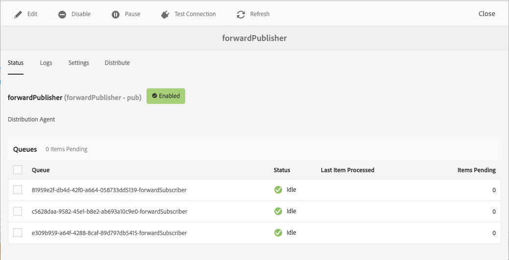

# レプリケーション {#replication}

Cloud ServiceとしてのAdobe Experience Managerでは、 [Sling Content Distribution](https://sling.apache.org/documentation/bundles/content-distribution.html) (Sling Content Distribution)機能を使用して、AEMランタイムの外部にあるAdobe I/Oで実行されるパイプラインサービスに複製するコンテンツを移動します。

>[!NOTE]
>
>詳しくは、 [配布版を参照してください](/help/core-concepts/architecture.md#content-distribution) 。

## コンテンツの公開方法 {#methods-of-publishing-content}

### クイック非公開/公開 — 計画されている非公開/公開 {#publish-unpublish}

作成者向けの次の標準的なAEM機能は、AEMCloud Serviceでは変更されません。

### ツリーのアクティベーション {#tree-activation}

ツリーアクティベーションを実行するには：

1. AEM開始メニューで、 **ツール/デプロイメント/配布に移動します。**
2. カードの **forwardPublisherを選択します**
3. forwardPublisher WebコンソールのUIを表示したら、「配布」を **選択します。**

   
4. パスブラウザーでパスを選択し、必要に応じてノード、ツリーまたは削除を追加するか、「 **送信」を選択します**

## トラブルシューティング {#troubleshooting}

レプリケーションのトラブルシューティングを行うには、AEM AuthorサービスWeb UIのレプリケーションキューに移動します。

1. AEM開始メニューで、 **ツール/デプロイメント/配布に移動します。**
2. カードの **forwardPublisherを選択します**
   
3. 緑であるはずのキューステータスを確認します
4. レプリケーションサービスへの接続をテストできます
5. コンテンツパブリケーションの履歴を表示する **「ログ** 」タブを選択します

コンテンツを公開できない場合は、パブリケーション全体がAEM Publishサービスから元に戻されます。
この場合、パブリケーションがキャンセルされた原因となった項目を特定するために、キューを確認する必要があります。 赤いステータスを示すキューをクリックすると、保留中のアイテムを含むキューが表示され、必要に応じて、このキューから単一またはすべてのアイテムをクリアできます。
