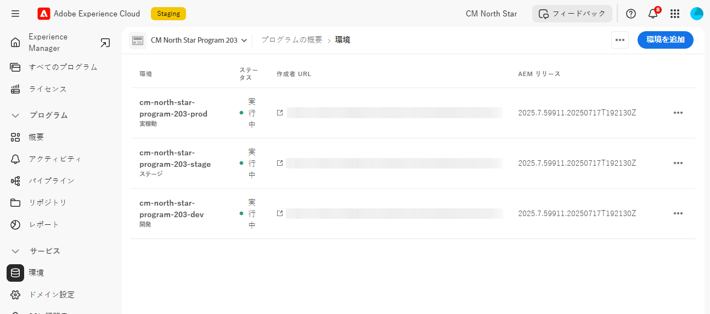
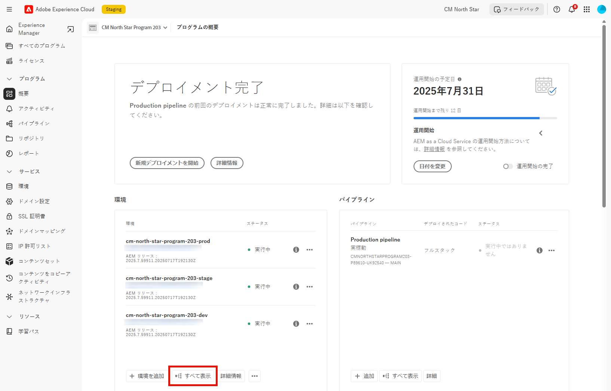

# AEM as a Cloud Serviceでのコンテンツの復元 {#content-restore}

Cloud Managerを使用して、バックアップからAEM as a Cloud Service コンテンツを復元できます。

## 概要 {#overview}

Cloud Manager のセルフサービス復元プロセスでは、アドビシステムのバックアップからデータをコピーし、元の環境に復元します。復元は、失われたデータ、破損したデータまたは誤って削除されたデータを元の状態に戻すために実行します。

復元プロセスが影響するのはコンテンツのみで、AEM のコードとバージョンは変更されません。個々の環境の復元操作はいつでも開始できます。 （新しいパイプライン実行を開始することなく、以前にデプロイしたソースコードを簡単かつ迅速に復元する必要がある場合は、[ デプロイした以前のコードを復元 ](/help/operations/restore-previous-code-deployed.md)）を使用できます。

Cloud Manager には、コンテンツを復元できる 2 種類のバックアップが用意されています。

* **PIT （ポイント・イン・タイム）:** このオプションを選択すると、過去 24 時間以内にキャプチャされた継続的なバックアップがリストアされます。
* **過去 1 週間：**&#x200B;このタイプでは、過去 24 時間を除く過去 7 日間のシステムバックアップから復元します。

どちらの場合も、カスタムコードのバージョンと AEM のバージョンは変更されません。

>[!TIP]
>
>[パブリック API を使用](https://developer.adobe.com/experience-cloud/cloud-manager/reference/api/)してバックアップを復元することもできます。

>[!WARNING]
>
>* この機能は、コードまたはコンテンツに重大な問題がある場合にのみ使用してください。
>* バックアップを復元すると、そのバックアップの後に追加されたデータがすべて削除されます。 ステージングも以前のバージョンに戻ります。
>* コンテンツの復元を開始する前に、他の選択的なコンテンツ復元オプションを検討してください。

## コンテンツ復元オプションの選択 {#selective-options}

コンテンツ全体の復元に復元する前に、コンテンツをより簡単に復元するための次のオプションを検討してください。

* 削除されたパスのパッケージが使用可能な場合は、[パッケージマネージャー](/help/implementing/developing/tools/package-manager.md)を使用してパッケージを再度インストールします。
* 削除されたパスが Sites 内のページであった場合は、[ツリーを復元機能](/help/sites-cloud/authoring/sites-console/page-versions.md)を使用します。
* 削除されたパスがアセットフォルダーで、元のファイルが使用可能な場合は、[Assets コンソール](/help/assets/add-assets.md)から再度アップロードします。
* 削除されたコンテンツがアセットであった場合は、[アセットの以前のバージョンを復元](/help/assets/manage-digital-assets.md)することを検討してください。

上記のいずれのオプションも機能せず、削除されたパスのコンテンツが重要である場合は、以降の節の説明に従って、コンテンツの復元を実行します。

## ユーザーの役割を作成 {#user-role}

デフォルトでは、開発環境、実稼動環境またはステージング環境でコンテンツの復元を実行する権限を持つユーザーはいません。 この権限を特定のユーザーまたはグループに委任するには、次の一般的な手順を使用します。

1. コンテンツの復元を参照するわかりやすい名前を使用して、製品プロファイルを作成します。
1. 必要なプログラムに対する&#x200B;**プログラムアクセス**&#x200B;権限を付与します。
1. ユースケースに応じて、必要な環境またはプログラムのすべての環境に対する **Environment Restore Create** 権限を付与します。
1. そのプロファイルにユーザーを割り当てます。

権限の管理について詳しくは、[ カスタム権限 ](/help/implementing/cloud-manager/custom-permissions.md) を参照してください。

## 環境のコンテンツの復元 {#restoring-content}

>[!NOTE]
>
>復元操作を開始するには、ユーザーが[適切な権限](#user-role)を持っている必要があります。

**環境のコンテンツを復元するには：**

1. [my.cloudmanager.adobe.com](https://my.cloudmanager.adobe.com/) で Cloud Manager にログインし、適切な組織を選択します。

1. 復元を開始するプログラムをクリックします。

1. 次のいずれかの操作を行って、プログラムのすべての環境をリストします。

   * 左側のメニューの **サービス** で、**環境** をクリックします。

     

   * 左側のメニューの **プログラム** で **概要** をクリックし、**環境** カードで **すべて表示** をクリックします。

     

     >[!NOTE]
     >
     >**環境** カードには 3 つの環境のみ表示されます。 カードの **すべて表示** をクリックすると、プログラムの *すべて* の環境が表示されます。

1. 環境テーブルで、コンテンツを復元する環境の右側にある  をクリックし、**コンテンツを復元** をクリックします。

   

1. 環境のページの **コンテンツを復元** タブで、**復元する時間** ドロップダウンリストから復元の時間枠を選択します。

   

   * **過去 24 時間** を選択した場合、隣の **時間** フィールドで、復元する過去 24 時間内の正確な時間を指定します。
   * **過去 1 週間** を選択した場合、隣の **日** フィールドで、過去 24 時間を除く過去 7 日間の日付を選択します。

1. 日付を選択するか時間を指定すると、下の「**使用可能なバックアップ**」セクションに、復元可能なバックアップのリストが表示されます。

1. バックアップの横にある  をクリックしてコードバージョンとAEM リリースを確認し、バックアップを選択する前に復元の影響を比較検討します（[ 適切なバックアップの選択 ](#choosing-backup) を参照）。

   

   復元オプションに表示されるタイムスタンプは、ユーザーのコンピューターのタイムゾーンに基づいています。

1. 復元するバックアップを表す行の右端にある  をクリックして、復元プロセスを開始します。

1. **コンテンツを復元** ダイアログボックスで詳細を確認し、「**復元**」をクリックします。

   

バックアッププロセスが開始されます。 そのステータスは、「**[アクティビティを復元](#restore-activity)** リストで確認できます。 復元操作の完了に要する時間は、復元するコンテンツのサイズとプロファイルによって異なります。

復元が正常に完了すると、環境は次の操作を実行します。

* 復元操作を開始した時点と同じコードとAEM リリースを実行します。
* 選択したスナップショットのタイムスタンプ時に使用可能だったものと同じコンテンツが含まれ、現在のコードに合わせてインデックスが再構築されます。

## 適切なバックアップの選択 {#choosing-backup}

Cloud Manager のセルフサービスの復元プロセスでは、コンテンツが AEM に復元されるだけです。このため、目的の復元ポイントと現在の時間の間に行われたコードの変更を慎重に検討する必要があります。 現在のコミット ID と復元先の ID の間のコミット履歴を確認します。

複数の方法があります。

* 環境のカスタムコードと復元は、同じリポジトリと同じブランチにあります。
* 環境のカスタムコードと復元は、1 つのリポジトリを共有し、別のブランチを使用し、共通のコミットから生成されます。
* 環境のカスタムコードと復元は、異なるリポジトリにあります。
   * この場合、コミット ID は表示されません。
   * Adobeでは、両方のリポジトリを複製し、差分ツールを使用してブランチを比較することを強くお勧めします。

また、復元により、実稼動環境とステージング環境が同期しなくなる可能性があることに注意してください。コンテンツの復元の結果については、ユーザーが責任を負います。

## 復元アクティビティ {#restore-activity}

**復元アクティビティ**&#x200B;リストには、アクティブな復元操作を含む最新の 10 件の復元リクエストのステータスが表示されます。

バックアップの  をクリックすると、そのバックアップのログをダウンロードし、復元が開始された時点でのスナップショットとデータの違いなど、コードの詳細を調べることができます。

## オフサイトバックアップ {#offsite-backup}

通常のバックアップは、AEM Cloud Services 内で誤って削除された場合や技術的な障害が発生する場合のリスクをカバーしますが、領域の障害が原因で追加のリスクが発生する可能性があります。可用性に加えて、このような領域の停止における最大のリスクは、データの損失です。

AEM as a Cloud Serviceは、すべてのAEM実稼動環境のこのリスクを軽減します。 つまり、すべてのAEM コンテンツをリモート地域に継続的にコピーします。 このプロセスにより、コンテンツは 3 か月間リカバリ可能になります。 この機能は、オフサイトバックアップと呼ばれます。

AEM Service Reliability Engineering は、データ領域の停止時に、オフサイトのバックアップからステージング環境と実稼動環境の AEM Cloud Service 環境を復元します。

## 制限事項 {#limitations}

セルフサービス復元メカニズムを使用する際は、次の制限事項が適用されます。

* 復元操作は 7 日間に制限されています。つまり、7日より古いスナップショットを復元することはできません。
* プログラム内のすべての環境で、1 か月あたり最大 10 回の復元に成功できます。
* 環境の作成後、最初のバックアップスナップショットが作成されるまでに 6 時間かかります。このスナップショットが作成されるまで、その環境で復元を実行することはできません。
* その環境で現在実行中のフルスタックまたは web 階層設定パイプラインがある場合、復元操作は開始されません。
* 同じ環境で別の復元が既に実行されている場合、復元を開始することはできません。
* まれに、24 時間や 7 日間のバックアップ制限により、バックアップが選択されてから復元が開始されるまでの遅延により、選択したバックアップが使用できなくなる場合があります。
* 削除された環境のデータは恒久的に失われ、復元できません。
