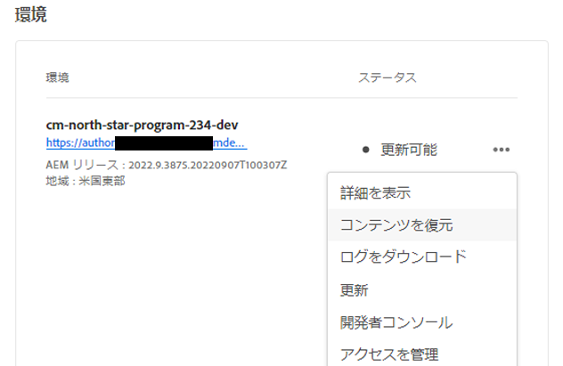
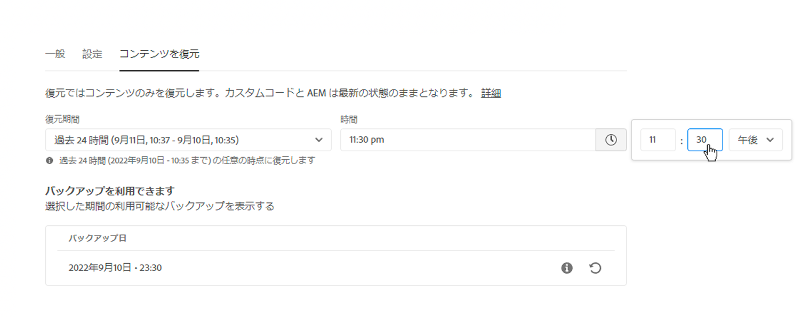
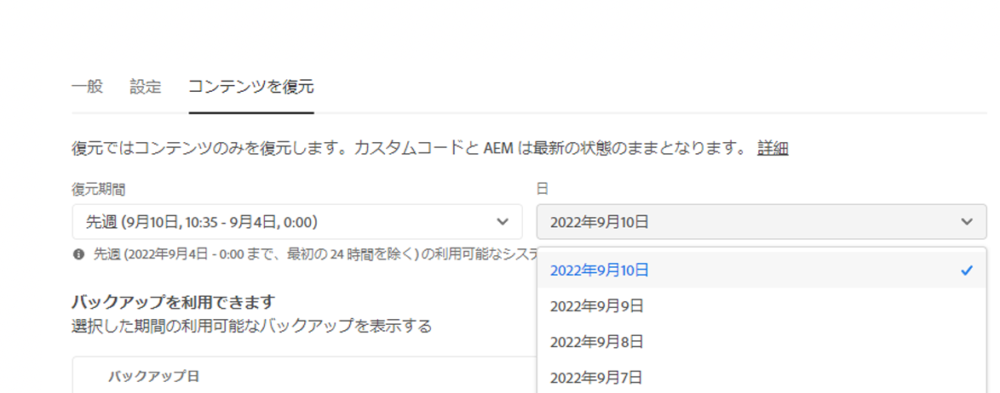
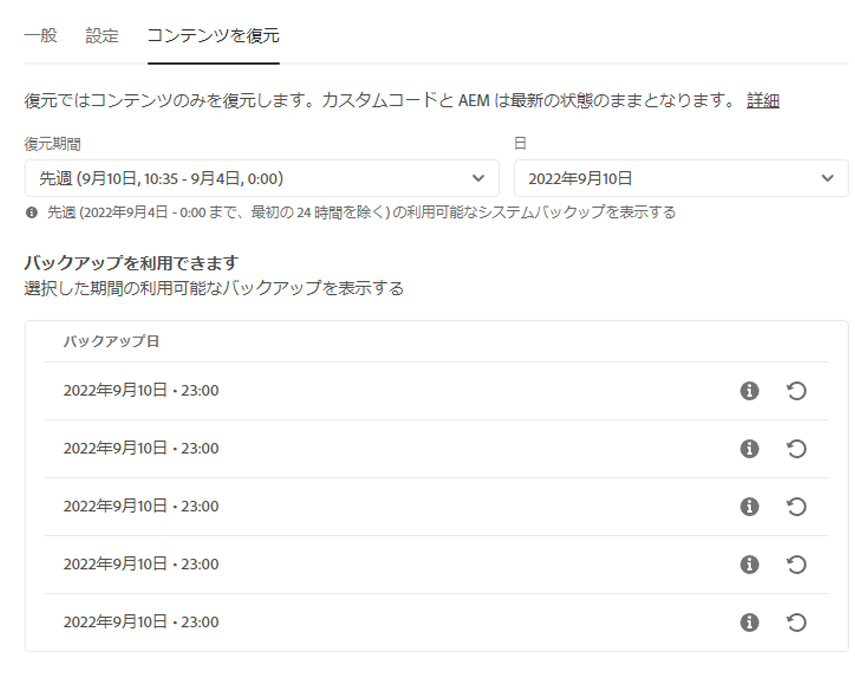
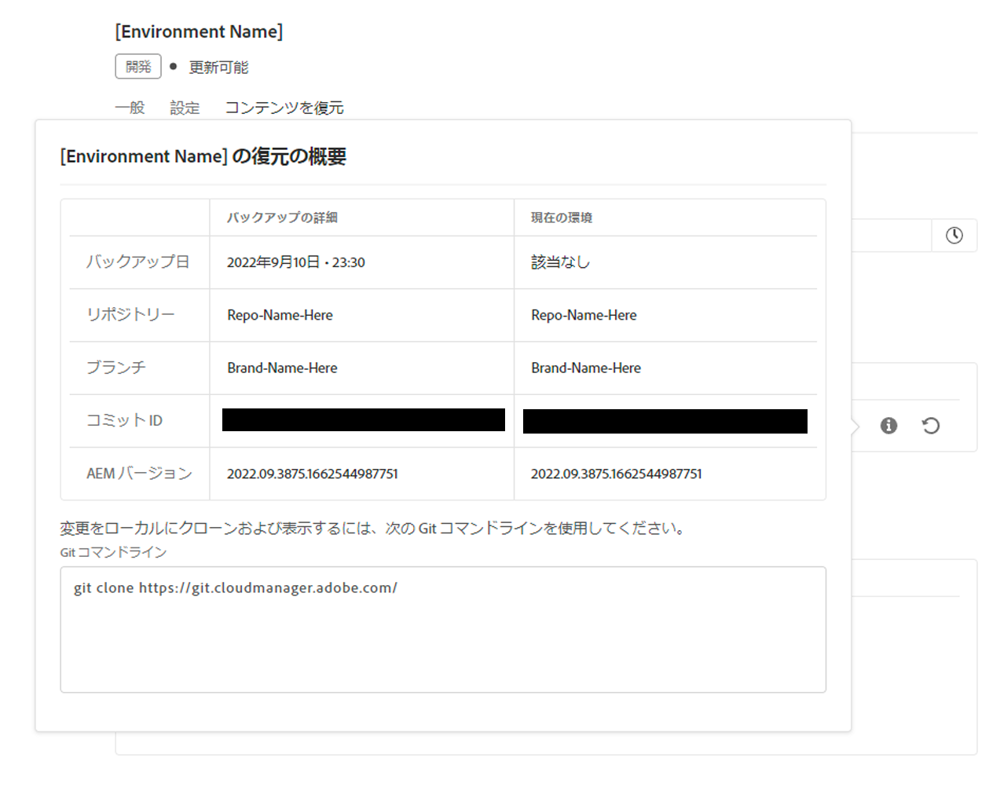
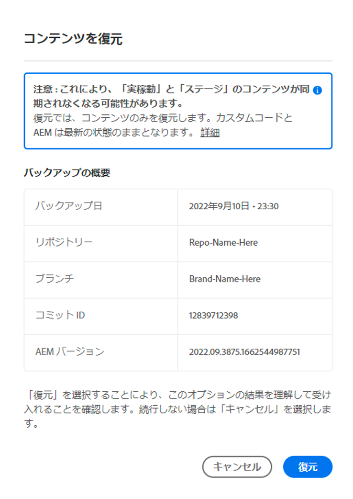
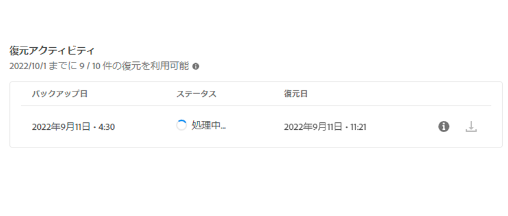

# AEM as a Cloud Service でのコンテンツの復元 {#content-restore}

Cloud Manager を使用して、AEM as a Cloud Service のコンテンツをバックアップから復元する方法を説明します。

## 概要 {#overview}

Cloud Manager のセルフサービス復元プロセスでは、アドビシステムのバックアップからデータをコピーし、元の環境に復元します。復元は、失われたデータ、破損したデータまたは誤って削除されたデータを元の状態に戻すために実行します。

復元プロセスが影響するのはコンテンツのみで、AEM のコードとバージョンは変更されません。個々の環境の復元操作はいつでも開始できます。

Cloud Manager には、コンテンツを復元できる 2 種類のバックアップが用意されています。

* **ポイントインタイム（PIT）：**&#x200B;このタイプでは、現在の時刻から過去 24 時間の継続的なシステムバックアップから復元します。
* **過去 1 週間：**&#x200B;このタイプでは、過去 24 時間を除く過去 7 日間のシステムバックアップから復元します。

どちらの場合も、カスタムコードのバージョンと AEM のバージョンは変更されません。

>[!TIP]
>
>[パブリック API を使用](https://developer.adobe.com/experience-cloud/cloud-manager/reference/api/)してバックアップを復元することもできます。

>[!WARNING]
>
>* この機能は、コードまたはコンテンツに重大な問題がある場合にのみ使用してください。
>* バックアップを復元すると、バックアップの時点から現在までの最新のデータが失われます。ステージングも古いバージョンに復元されます。
>* コンテンツの復元を開始する前に、他の選択的なコンテンツ復元オプションを検討してください。

## 選択的なコンテンツ復元オプション {#selective-options}

コンテンツ全体の復元に復元する前に、コンテンツをより簡単に復元するための次のオプションを検討してください。

* 削除されたパスのパッケージが使用可能な場合は、[パッケージマネージャー](/help/implementing/developing/tools/package-manager.md)を使用してパッケージを再度インストールします。
* 削除されたパスが Sites 内のページであった場合は、[ツリーを復元機能](/help/sites-cloud/authoring/sites-console/page-versions.md)を使用します。
* 削除されたパスがアセットフォルダーで、元のファイルが使用可能な場合は、[Assets コンソール](/help/assets/add-assets.md)から再度アップロードします。
* 削除されたコンテンツがアセットであった場合は、[アセットの以前のバージョンを復元](/help/assets/manage-digital-assets.md)することを検討してください。

上記のいずれのオプションも機能せず、削除されたパスのコンテンツが重要である場合は、以降の節の説明に従って、コンテンツの復元を実行します。

## ユーザーの役割の作成 {#user-role}

デフォルトでは、開発環境、実稼動環境、ステージング環境でコンテンツの復元を実行する権限はどのユーザーにも付与されません。この権限を特定のユーザーまたはグループにデリゲートするには、次の一般的な手順に従います。

1. コンテンツの復元を参照するわかりやすい名前を使用して、製品プロファイルを作成します。
1. 必要なプログラムに対する&#x200B;**プログラムアクセス**&#x200B;権限を付与します。
1. 使用例に応じて、プログラムの必要な環境またはすべての環境に対して **環境の復元の作成** 権限を付与します。
1. ユーザーをこの製品プロファイルに割り当てます。

権限の管理について詳しくは、[カスタム権限](/help/implementing/cloud-manager/custom-permissions.md)ドキュメントを参照してください。

## コンテンツの復元 {#restoring-content}

まず、復元するコンテンツの期間枠を決定します。次に、バックアップから環境のコンテンツを復元するには、次の手順を実行します。

>[!NOTE]
>
>復元操作を開始するには、ユーザーが[適切な権限](#user-role)を持っている必要があります。

1. [my.cloudmanager.adobe.com](https://my.cloudmanager.adobe.com/) で Cloud Manager にログインし、適切な組織を選択します。

1. 復元を開始するプログラムをクリックします。

1. **プログラムの概要**&#x200B;ページの&#x200B;**環境**&#x200B;カードで、復元を開始する環境の横にある省略記号ボタンをクリックし、「**コンテンツを復元**」を選択します。

   

   * または、特定の環境の環境詳細ページの「**コンテンツを復元**」タブに直接移動することもできます。

1. 環境の詳細ページの「**コンテンツを復元**」タブで、まず「**復元する時間枠**」ドロップダウンリストで復元の期間枠を選択します。

   1. 「**過去 24 時間**」を選択すると、隣接する&#x200B;**時間**&#x200B;フィールドで、復元する過去 24 時間内の正確な時間を指定できます。

      

   1. 「**過去 1 週間**」を選択すると、隣接する「**日**」フィールドで、過去 24 時間を除く過去 7 日間の日付を選択できます。

      

1. 日付を選択するか時間を指定すると、下の「**使用可能なバックアップ**」セクションに、復元可能なバックアップのリストが表示されます。

   

1. 情報アイコンを使用して復元するバックアップを見つけ、そのバックアップに含まれるコードのバージョンと AEM リリースに関する情報を表示し、[バックアップを選択](#choosing-the-right-backup)する際に復元の影響を考慮します。

   

   * 復元オプションに表示されるタイムスタンプはすべて、ユーザーのコンピューターのタイムゾーンに基づいています。

1. 復元するバックアップを表す、行の右端にある「**復元**」アイコンをクリックして復元プロセスを開始します。

1. **復元**&#x200B;をクリックしてリクエストを確定する前に、**コンテンツを復元**&#x200B;ダイアログで詳細を確認します。

   

バックアッププロセスが開始され、そのステータスは&#x200B;**[アクティビティを復元](#restore-activity)**&#x200B;リストで確認できます。復元操作の完了に要する時間は、復元するコンテンツのサイズとプロファイルによって異なります。

リストアが正常に完了すると、環境は次のようになります。

* 復元操作を開始した時点と同じコードと AEM リリースを実行します。
* 選択したスナップショットのタイムスタンプ時に使用可能だったものと同じコンテンツを用意し、現在のコードに合わせてインデックスを再構築します。

## 適切なバックアップの選択 {#choosing-backup}

Cloud Manager のセルフサービスの復元プロセスでは、コンテンツが AEM に復元されるだけです。このため、現在のコミット ID と復元先の ID の間のコミット履歴を確認して、目的の復元ポイントと現在時間の間に行われたコードの変更を慎重に検討する必要があります。

複数の方法があります。

* 環境と復元のカスタムコードは、同じリポジトリと同じブランチにあります。
* 環境と復元のカスタムコードは、同じリポジトリ上にあり、共通のコミットを持つ別のブランチにあります。
* 環境と復元のカスタムコードは、異なるリポジトリ上にあります。
   * この場合、コミット ID は表示されません。
   * 両方のリポジトリを複製し、差分ツールを使用してブランチを比較することを強くお勧めします。

また、復元により、実稼動環境とステージング環境が同期しなくなる可能性があることに注意してください。コンテンツの復元の結果については、ユーザーが責任を負います。

## 復元アクティビティ {#restore-activity}

**復元アクティビティ**&#x200B;リストには、アクティブな復元操作を含む最新の 10 件の復元リクエストのステータスが表示されます。

バックアップの情報アイコンをクリックすると、そのバックアップのログをダウンロードしたり、復元が開始された時点でのスナップショットとデータの違いなど、コードの詳細を調べたりすることができます。

## オフサイトバックアップ {#offsite-backup}

通常のバックアップは、AEM Cloud Services 内で誤って削除された場合や技術的な障害が発生する場合のリスクをカバーしますが、領域の障害が原因で追加のリスクが発生する可能性があります。可用性に加えて、このような領域の停止における最大のリスクは、データの損失です。

AEM as a Cloud Service は、すべての AEM コンテンツをリモート領域に継続的にコピーし、3 か月間復旧に利用できるようにすることで、すべての AEM 実稼動環境のこのリスクを軽減します。この機能は、オフサイトバックアップと呼ばれます。

オフサイトバックアップからのステージング環境および実稼動環境での AEM Cloud Services の復元は、データ領域の停止が発生した場合に AEM Service Reliability Engineering によって実行されます。

## 制限事項 {#limitations}

セルフサービス復元メカニズムを使用する際は、次の制限事項が適用されます。

* 復元操作は 7 日間に制限されています。つまり、7日より古いスナップショットを復元することはできません。
* プログラム内のすべての環境で、1 か月あたり最大 10 回の復元に成功できます。
* 環境の作成後、最初のバックアップスナップショットが作成されるまでに 6 時間かかります。このスナップショットが作成されるまで、その環境で復元を実行することはできません。
* その環境で現在実行中のフルスタックまたは web 層の設定パイプラインがある場合、復元操作は開始されません。
* 同じ環境で別の復元が既に実行されている場合、復元を開始することはできません。
* まれに、24 時間や 7 日間のバックアップ制限により、バックアップが選択されてから復元が開始されるまでの遅延により、選択したバックアップが使用できなくなる場合があります。
* 削除された環境のデータは恒久的に失われ、復元できません。
