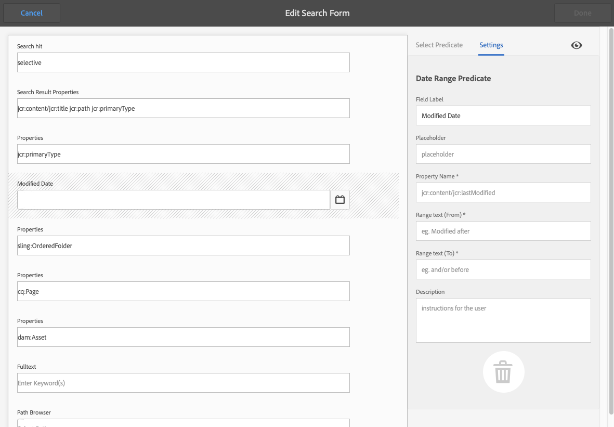

# 検索フォームの設定 {#configuring-search-forms}

**検索フォーム**&#x200B;を使用して、オーサー環境の様々な AEM コンソール／パネルの検索パネルで使用する検索の述語の選択をカスタマイズできます。これらのパネルをカスタマイズすると、特定のニーズに合わせて検索機能の用途を拡大できます。

一連 [の予](#predicates-and-their-settings)測を標準で使用できます。

様々なコンソール内およびアセットブラウザー（ページ編集時）で使用する[検索フォームを設定](#configuring-your-search-forms)できます。[これらのフォームを設定するためのダイアログ](#configuring-your-search-forms)には、次の手順でアクセスできます。

* **ツール**

   * **一般**

      * **検索フォーム**

このコンソールに初めてアクセスすると、すべての設定に鍵アイコンが表示されます。これは、該当する設定はデフォルト（標準）の設定であり、削除できないことを示します。設定をカスタマイズすると、鍵アイコンは非表示になります。ただし、[カスタマイズした設定を削除](#deleting-a-configuration-to-reinstate-the-default)した場合は、デフォルトの設定（および鍵アイコン）が復帰します。

## 設定 {#configurations}

デフォルトの設定（アルファベット順に表示）は次のとおりです。

* **アセット管理者の検索レール:**

   この設定は、アセットコンソールを使用する際にユーザーが使用できる検索オプションを定義します。

* **ページエディター (ドキュメント検索):**

   この設定は、（ページの編集時に）アセットブラウザーでドキュメントを検索する際に使用できるオプションを定義します。

* **ページエディター (エクスペリエンスフラグメント検索):**

   この設定は、（ページの編集時に）アセットブラウザーでエクスペリエンスフラグメントを検索する際に使用できるオプションを定義します。

* **ページエディター (画像検索):**

   この設定は、（ページの編集時に）アセットブラウザーで画像を検索する際に使用できるオプションを定義します。

* **ページエディター (原稿検索):**

   この設定は、（ページの編集時に）アセットブラウザーで原稿を検索する際に使用できるオプションを定義します。

* **ページエディター (ページ検索):**

   この設定は、（ページの編集時に）アセットブラウザーでページを検索する際に使用できるオプションを定義します。

* **ページエディター (段落検索):**

   この設定は、（ページの編集時に）アセットブラウザーで段落を検索する際に使用できるオプションを定義します。

* **ページエディター (製品検索):**

   この設定は、（ページの編集時に）アセットブラウザーで製品を検索する際に使用できるオプションを定義します。

* **ページエディター (Scene7 検索)**:

   この設定は、（ページの編集時に）アセットブラウザでScene7リソースを検索する際に使用できるオプションを定義します。

* **ページエディター (ビデオ検索)**:

   この設定は、（ページの編集時に）アセットブラウザーでビデオを検索する際に使用できるオプションを定義します。

* **プロジェクト管理者の検索レール:**

   この設定は、プロジェクトの検索時にユーザーが使用できる検索オプションを定義します。

* **プロジェクト翻訳の検索レール:**

   この設定は、プロジェクトの翻訳を検索する際にユーザーが使用できる検索オプションを定義します。

* **サイト管理者の検索レール**:

   この設定は、サイトコンソールの検索レールを使用する際にユーザーが使用できる検索オプションを定義します。

* **スニペット管理者の検索レール**:

   この設定は、スニペットの検索時にユーザが使用できる検索オプションを定義します。

* **Stock 管理者の検索レール**:

   この設定は、ユーザーが在庫を検索する際に使用できる検索オプションを定義します。

## Predicates and Their Settings {#predicates-and-their-settings}

### 述語 {#predicates}

設定によって、次の述語が使用可能です。

<table>
 <tbody>
  <tr>
   <th>述語</th>
   <th>目的</th>
   <th>設定</th>
  </tr>
  <tr>
   <td>Analytics</td>
   <td>Sitesブラウザーの検索/フィルター機能を使用して、解析用データを表示できます。Analytics検索フィルターは、マップされたカスタマイズされた分析列に合わせて読み込まれます。</td>
   <td>
    <ul>
     <li>フィールドラベル</li>
     <li>説明</li>
    </ul> </td>
  </tr>
  <tr>
   <td>承認ステータス</td>
   <td>承認ステータスに従って検索します。</td>
   <td>
    <ul>
     <li>フィールドラベル</li>
     <li>プロパティ名*</li>
     <li>説明</li>
    </ul> 
   </td>
  </tr>
  <tr>
   <td>作成者</td>
   <td>作成者に従って検索します。</td>
   <td>
    <ul>
     <li>プレースホルダー</li>
     <li>プロパティ名*</li>
     <li>説明</li>
    </ul> 
   </td>
  </tr>
  <tr>
   <td>チェックアウト実行者</td>
   <td>特定のユーザーがチェックアウトしたアセットを検索します。</td>
   <td>
    <ul>
     <li>フィールドラベル</li>
     <li>プレースホルダー</li>
     <li>説明</li>
    </ul> 
   </td>
  </tr>
  <tr>
   <td>チェックアウトステータス</td>
   <td>特定のチェックアウトステータスを持つアセットを検索します。</td>
   <td>
    <ul>
     <li>フィールドラベル</li>
     <li>プロパティ名*</li>
     <li>説明</li>
    </ul> 
   </td>
  </tr>
  <tr>
   <td>コンポーネント</td>
   <td>作成者が、特定のコンポーネントを持つページを検索／フィルターできます。例えば、画像ギャラリーなどです。  </td>
   <td>
    <ul>
     <li>プレースホルダー</li>
     <li>プロパティ名*</li>
     <li>プロパティの深さ</li>
     <li>説明</li>
    </ul> </td>
  </tr>
  <tr>
   <td>日付 範囲</td>
   <td>日付プロパティに指定した範囲内に作成されたアセットを検索します。検索パネルで、開始日と終了日を指定できます。</td>
   <td>
    <ul>
     <li>フィールドラベル</li>
     <li>プレースホルダー</li>
     <li>プロパティ名*</li>
     <li>範囲のテキスト（開始）*</li>
     <li>範囲のテキスト（終了）*</li>
     <li>説明</li>
    </ul> </td>
  </tr>
  <tr>
   <td>有効期限ステータス</td>
   <td>有効期限ステータスに基づいてアセットを検索します。</td>
   <td>
    <ul>
     <li>フィールドラベル</li>
     <li>プロパティ名*</li>
     <li>説明</li>
    </ul> </td>
  </tr>
  <tr>
   <td>ファイルサイズ</td>
   <td>サイズに基づいてアセットを検索します。</td>
   <td>
    <ul>
     <li>フィールドラベル</li>
     <li>プロパティ名*</li>
     <li>オプションパス</li>
     <li>説明</li>
    </ul> </td>
  </tr>
  <tr>
   <td>ファイルタイプ</td>
   <td>ファイル/MIMEタイプに基づいてアセットを検索します。</td>
   <td>
    <ul>
     <li>フィールドラベル</li>
     <li>プロパティ名*</li>
     <li>MIME タイプのパス</li>
     <li>説明</li>
    </ul> 
   </td>
  </tr>
  <tr>
   <td>フルテキスト</td>
   <td>フルテキスト検索用の検索述語。</td>
   <td>
    <ul>
     <li>プレースホルダー</li>
     <li>プロパティ名</li>
     <li>説明</li>
    </ul> </td>
  </tr>
  <tr>
   <td>グループ</td>
   <td>グループの検索述語（「Insights Predicate」内でのみ使用）。</td>
   <td>
    <ul>
     <li>フィールドラベル</li>
     <li>説明</li>
    </ul> </td>
  </tr>
  <tr>
   <td>非表示のフィルター</td>
   <td>プロパティおよび値のフィルターで、ユーザーには表示されません。</td>
   <td>
    <ul>
     <li>プロパティ名*</li>
     <li>プロパティの値*</li>
     <li>説明</li>
    </ul> </td>
  </tr>
  <tr>
   <td>インサイト</td>
   <td>選択したインサイトパラメーターに従って検索します。</td>
   <td>これは、複数の述語から構成される複雑な述語です。
    <ul>
     <li>グループ</li>
     <li>範囲</li>
     <li>オプション</li>
    </ul> 
   </td>
  </tr>
  <tr>
   <td>コレクションのメンバー</td>
   <td>コレクションのメンバーであるアセットの検索</td>
   <td>
    <ul>
     <li>説明</li>
    </ul> 
   </td>
  </tr>
  <tr>
   <td>複数値プロパティ</td>
   <td>指定したプロパティの複数の値で検索します。</td>
   <td>
    <ul>
     <li>フィールドラベル</li>
     <li>プレースホルダー</li>
     <li>プロパティ名*</li>
     <li>区切り文字のサポート</li>
     <li>入力区切り文字</li>
     <li>大文字と小文字を区別しない</li>
     <li>説明</li>
    </ul> 
   </td>
  </tr>
  <tr>
   <td>オプション</td>
   <td>
オプションは、ユーザーが作成したコンテンツノードです。
 
詳しくは、<a href="#addinganoptionspredicate">オプションの述語の追加</a>を参照してください。
 </td>
   <td>
    <ul>
     <li>フィールドラベル</li>
     <li>プロパティ名*</li>
     <li>単一の選択</li>
     <li>オプションを追加</li>
     <li>手動</li>
     <li>説明</li>
    </ul> </td>
  </tr>
  <tr>
   <td>オプションプロパティ</td>
   <td>オプションの1つ以上のプロパティで検索します。</td>
   <td>
    <ul>
     <li>フィールドラベル</li>
     <li>プロパティ名*</li>
     <li>オプションノードパス</li>
     <li>プロパティの深さ</li>
     <li>単一の選択</li>
     <li>説明</li>
    </ul> </td>
  </tr>
  <tr>
   <td>ページステータス</td>
   <td>ステータスに従ってページを検索します。</td>
   <td>
    <ul>
     <li>フィールドラベル</li>
     <li>プロパティ名を公開*</li>
     <li>ロックされたページのプロパティ名*</li>
     <li>説明</li>
    </ul> </td>
  </tr>
  <tr>
   <td>パス</td>
   <td>特定のパスに配置されているアセットを検索します。</td>
   <td>
    <ul>
     <li>フィールドラベル</li>
     <li>検索パスを追加</li>
     <li>説明</li>
    </ul> </td>
  </tr>
  <tr>
   <td>パス ブラウザー</td>
   <td>検索するパスブラウザーを指定します。</td>
   <td>
    <ul>
     <li>プレースホルダー</li>
     <li>ルートパス</li>
     <li>説明</li>
    </ul> 
   </td>
  </tr>
  <tr>
   <td>パス 非表示</td>
   <td>パスに対するフィルター。ユーザーには表示されません。</td>
   <td>
    <ul>
     <li>プロパティ名(`path`)</li>
     <li>プロパティ値(`/content/dam`)</li>
    </ul> 
   </td>
  </tr>
  <tr>
   <td>プロパティ</td>
   <td>指定したプロパティで検索します。</td>
   <td>
    <ul>
     <li>フィールドラベル</li>
     <li>プレースホルダー</li>
     <li>プロパティ名</li>
     <li>部分検索</li>
     <li>大文字と小文字を区別しない</li>
     <li>説明</li>
    </ul> 
   </td>
  </tr>
  <tr>
   <td>公開ステータス</td>
   <td>公開ステータスに基づいてアセットを検索します。</td>
   <td>
    <ul>
     <li>フィールドラベル</li>
     <li>プロパティ名*</li>
     <li>説明</li>
    </ul> </td>
  </tr>
  <tr>
   <td>範囲</td>
   <td>指定した範囲内にあるリソースを検索します。検索パネルで、範囲の最小値と最大値を指定できます。</td>
   <td>
    <ul>
     <li>フィールドラベル</li>
     <li>プロパティ名*</li>
     <li>説明</li>
    </ul> </td>
  </tr>
  <tr>
   <td>評価</td>
   <td>評価に従ってアセットを検索します。  </td>
   <td>
    <ul>
     <li>フィールドラベル</li>
     <li>プロパティ名*</li>
     <li>オプションパス</li>
     <li>説明</li>
    </ul> </td>
  </tr>
  <tr>
   <td>相対的な日付</td>
   <td>相対的な作成日に基づいてアセットを検索します。  </td>
   <td>
    <ul>
     <li>フィールドラベル</li>
     <li>プロパティ名*</li>
     <li>相対的な日付</li>
     <li>説明</li>
    </ul> </td>
  </tr>
  <tr>
   <td>スライダー範囲</td>
   <td>範囲の述語をスライダー機能で拡張する共通の検索述語。検索対象のプロパティの値は、スライダーの制限内とする必要があります。</td>
   <td>
    <ul>
     <li>フィールドラベル</li>
     <li>プロパティ名*</li>
     <li>オプションノードパス</li>
     <li>説明</li>
    </ul> </td>
  </tr>
  <tr>
   <td>ステータス</td>
   <td>承認およびチェックアウトのステータスに従って検索します。</td>
   <td>これは、複数の述語から構成される複雑な述語です。
    <ul>
     <li>承認ステータス</li>
     <li>チェックアウトステータス</li>
    </ul> 
   </td>
  </tr>
  <tr>
   <td>タグ</td>
   <td>タグに基づいて検索します。</td>
   <td>
    <ul>
     <li>フィールドラベル</li>
     <li>プレースホルダー</li>
     <li>プロパティ名*</li>
     <li>すべてのタグに一致オプションを表示</li>
     <li>ルートタグのパス</li>
     <li>説明</li>
    </ul> </td>
  </tr>
  <tr>
   <td>テンプレート</td>
   <td>選択したテンプレートに従って検索します。</td>
   <td>
    <ul>
     <li>プレースホルダー</li>
     <li>プロパティ名*</li>
     <li>説明</li>
    </ul> 
   </td>
  </tr>
  <tr>
   <td>翻訳ステータス</td>
   <td>翻訳ステータスに従って検索します。</td>
   <td>
    <ul>
     <li>フィールドラベル</li>
    </ul> 
   </td>
  </tr>
 </tbody>
</table>

<!--
  <tr>
   <td>Date ???</td>
   <td>Slider-based search of assets based on a date property.</td>
   <td>
    <ul>
     <li>Field Label</li>
     <li>Property Name*</li>
     <li>Description</li>
    </ul> </td>
  </tr>
  <tr>
   <td>Asset Last Modified ?????</td>
   <td>Date the asset was last modified.  </td>
   <td>A customized predicate, based on the Date Predicate.</td>
  </tr>
  <tr>
   <td>Range Options ???</td>
   <td>A specific search predicate for Assets and the same as common Slider Predicate. Is still available due to backward compatibilty issues.</td>
   <td>
    <ul>
     <li>Field Label</li>
     <li>Property Name*</li>
     <li>Option Path</li>
     <li>Description</li>
    </ul> </td>
  </tr>
  <tr>
   <td>Tag </td>
   <td>Search assets based on tags. You can configure the Path property to populate various tags in the Tags list.</td>
   <td>
    <ul>
     <li>Field Label</li>
     <li>Property Name*</li>
     <li>Option Path</li>
     <li>Description</li>
    </ul> </td>
  </tr>
-->

<!--
>[!NOTE]
>
>* The common search predicates are defined in:
>  `/libs/cq/gui/components/common/admin/customsearch/searchpredicates`
>
>
>* Search predicates related only to siteadmin (classic UI) are located under:
> `/libs/cq/gui/components/siteadmin/admin/searchpanel/searchpredicates`
>   * These are deprecated and only available for backward compatibility.
>
>This information is for reference only, you must not make changes to `/libs`.
-->

### 述語の設定 {#predicate-settings}

述語によって、以下のような設定が可能です。

* **フィールドラベル**

   折りたたみ可能なヘッダーまたは述語のフィールドラベルとして表示されるラベルです。

* **説明**

   ユーザーの詳細。

* **プレースホルダー**

   フィルタリングテキストが入力されていない場合は、空のテキストまたは述語のプレースホルダー。

* **プロパティ名**

   検索するプロパティです。 相対パスとワイルドカードを使用して、ノ `*/*/*` ードを基準としたプロパティの深さを指定します(各ア `jcr:content` スタリスクは1つのノードレベルを表します)。

   ノード上のプロパティを持つリソースの第1レベルの子ノードでのみ検索する場合は、次 `x` を使用し `jcr:content` ます。 `*/jcr:content/x`

* **プロパティの深さ**

   リソース内でそのプロパティを検索する最大の深さです。 そのため、子のレベルが指定した深さに等しくなるまで、そのプロパティの検索をリソースと再帰的な子に対して実行できます。

* **プロパティの値**

   絶対文字列または式言語としてのプロパティ値。例えば、 `cq:Page` または

   `${empty requestPathInfo.suffix ? "/content" : requestPathInfo.suffix}` です。

* **範囲テキスト**

   The label of the range field in the **Date Range** predicate.

* **オプションパス**

   ユーザーは、述語設定タブの「パスブラウザー」を使用してパスを選択できます。 選択した後、 **+アイコンを使用し** て選択範囲を有効なオプションのリストに追加します(必要に応じて **-** アイコンを削除します)。

   オプションは、ユーザーが作成したコンテンツノードで、次の構造を持ちます。

   `(jcr:primaryType = nt:unstructured, value (String), jcr:title (String))`

* **オプションノードパス**
事実上は**オプションパス**&#x200B;と同じですが、これのみが共通の述語フィールドにあり、その他はアセット専用です。

* **単一の選択**&#x200B;オンにすると、オプションは単一の選択のみを許可するチェックボックスとしてレンダリングされます。チェックボックスを誤って選択した場合は、選択を解除できます。

* **公開とライブコピーのプロパティ名**
サイト専用の述語の、公開およびライブコピーのチェックボックスのラベル。

* The &amp;ast; on the field labels in the **Settings** tab means the fields are mandatory and if left blank an error message will appear.

## Configuring Your Search Forms {#configuring-your-search-forms}

### Creating/Opening a Customized Configuration {#creating-opening-a-customized-configuration}

1. Navigate to **Tools**, **General**, **Search Forms**.

1. カスタマイズする設定を選択します。
1. 「**編集**」アイコンを使用して、更新用に設定を開きます。
1. 新規のカスタマイズの場合は、必要に応じて[新しい述語フィールドを追加して設定を定義](#add-edit-a-predicate-field-and-define-field-settings)します。既存のカスタマイズの場合は、既存のフィールドを選択して[設定を更新](#add-edit-a-predicate-field-and-define-field-settings)できます。
1. 「**完了**」を選択して設定を保存します。変更は、次回設定を使用したときに表示されます。

   >[!NOTE]
   >
   >カスタマイズした設定は（必要に応じて）以下の場所に保存されます。
   >
   >* `/apps/cq/gui/content/facets/<option>`
   >* `/apps/commerce/gui/content/facets/<option>`

### Add/Edit a Predicate Field and Define Field Settings {#add-edit-a-predicate-field-and-define-field-settings}

フィールドを追加または編集して、その設定を定義／更新できます。

1. 更新する[カスタマイズ設定を開きます](#creating-opening-a-customized-configuration)。
1. 新しいフィールドを追加する場合は、「**述語を選択**」タブを開いて、必要な述語を必要な場所にドラッグします。**日付の範囲の述語**&#x200B;の例を以下に示します。

   

1. 状況に応じて、以下の手順を実行します。

   * 新しいフィールドを追加しようとしています：

      述語を追加すると、「 **Settings** 」タブが開き、定義可能なプロパティが表示されます。

   * 既存の述語を更新する場合：

      右側の述語フィールドを選択し、「 **Settings** 」タブを開きます。
   **日付の範囲の述語**&#x200B;の設定例を以下に示します。

   

1. 必要に応じて変更を加え、「**完了**」を選択して確定します。変更は、次回設定を使用したときに表示されます。

### 検索設定のプレビュー {#previewing-the-search-configuration}

1. プレビューアイコンを選択します。

   

1. 検索フォームが、該当するコンソールの検索列に表示されるとおりに、すべて展開された状態で表示されます。

   

1. プレビューを&#x200B;**閉じて**&#x200B;戻り、設定を完了します。

### 述語フィールドの削除 {#deleting-a-predicate-field}

1. 更新する[カスタマイズ設定を開きます](#creating-opening-a-customized-configuration)。
1. 述語フィールド（右側）を選択し、「**設定**」タブを開いて、**削除**&#x200B;アイコン（左下）を選択します。

   

1. 削除の確認を要求するダイアログが表示されます。

1. 「**完了**」ボタンで削除およびその他の変更を確認します。

### Deleting a Configuration (to Reinstate the Default) {#deleting-a-configuration-to-reinstate-the-default}

設定のカスタマイズが完了すると、デフォルトが上書きされます。カスタマイズした設定を削除することにより、デフォルトの設定を復帰させることができます。

>[!NOTE]
>
>デフォルト設定は削除できません。

カスタマイズした設定の削除は、コンソールからおこないます。

1. 必要な設定「**ページエディター (段落検索)**」など）を選択して、ツールバーの「**削除**」アイコンを選択します。

   

1. カスタマイズした設定が削除され、デフォルトが復帰します（このことは、コンソールに鍵アイコンが再度表示されることで確認できます）。

### オプションの述語の追加 {#adding-options-predicates}

オプションの述語（オプション、オプションプロパティ）を使用すると、検索対象の項目を設定できます。通常は、ページノード上のプロパティなど、ページの直下にあるものを検索するために使用します。

以下の例（ページの作成に使用するテンプレートに従った検索）で、必要な手順を説明します。

1. 検索対象のプロパティを定義するノードを作成します。

   ユーザーに提示される個々のオプションの定義を格納するルートノードが必要になります。

   個々のオプションのノードには、次のプロパティが必要です。

   * `jcr:title` - 検索レールに表示されるフィールドラベル
   * `value` - 検索対象のプロパティ値

<!--
   
-->

>[!NOTE]
>
>You ***must*** not change anything in the `/libs` path.
>
>This is because the content of `/libs` is overwritten the next time you upgrade your instance (and may well be overwritten when you apply either a hotfix or feature pack).
>
>設定およびその他の変更に推奨される方法は次のとおりです。
>
>1. Recreate the required item, as it exists in `/libs`, under `/apps`. この場合、次の場所から選択します。
>1. `/libs/cq/gui/content/common/options/predicates`
>1. Make any changes within `/apps.`

1. **検索フォーム**&#x200B;コンソールを開いて、更新する設定を選択します。例えば、「**サイト管理者の検索レール**」を選択します。

   次に、「**検索フォームを編集**」アイコンをクリック／タップします。

1. 設定により、**オプション**&#x200B;または&#x200B;**オプションプロパティ**&#x200B;を設定に追加します。
1. フィールドを更新します。具体的には次のフィールドです。

   * **プロパティ名**

      ターゲットノードで検索するノードプロパティを指定します。 次に例を示します。

      `jcr:content/cq:template`

   * **Optionノードのパス**

      オプションを保持するパスを選択します。 次に例を示します。

      `/apps/cq/gui/content/common/options/predicates/templatetype`

<!--
   
-->

1. 「**完了**」を選択して設定を保存します。
1. 該当するコンソール（この例では&#x200B;**サイト**）に移動し、**検索**&#x200B;レールを開きます。新しく定義された検索フォームと各種オプションが表示されます。検索結果を表示するには、必要なオプションを選択します。

<!--
   
-->

## ユーザーの権限 {#user-permissions}

次の表に、検索フォームで編集、削除およびプレビューのアクションを実行するために必要な権限を示します。

<table>
 <tbody>
  <tr>
   <td><strong>アクション</strong></td>
   <td><strong>権限</strong></td>
  </tr>
  <tr>
   <td>編集 </td>
   <td>Read, Write permissions on the <code>/apps </code>node.</td>
  </tr>
  <tr>
   <td>削除</td>
   <td>Read, Write, Delete permissions on the <code>/apps</code> node</td>
  </tr>
  <tr>
   <td>プレビュー</td>
   <td>Read, Write, Delete permissions on the <code>/var/dam/content</code> node.  ノードに対する読み取り権限、書き込み権限 <code>/apps</code> です。</td>
  </tr>
 </tbody>
</table>
