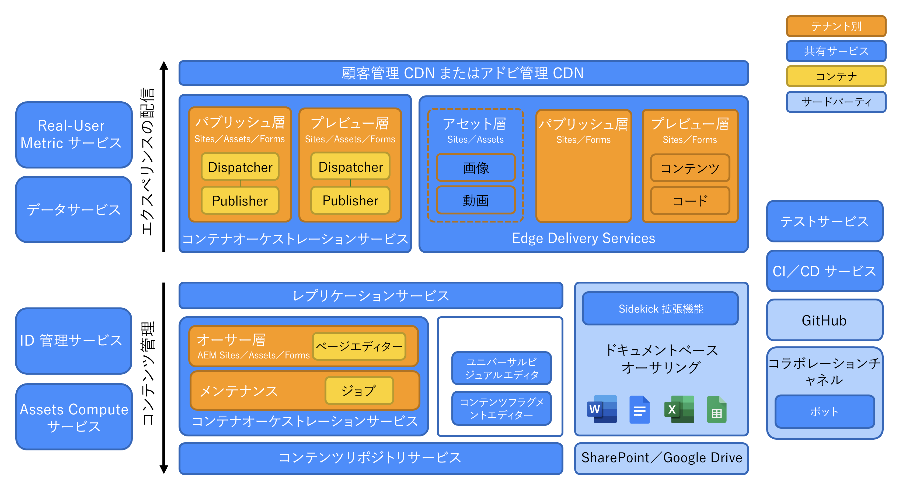
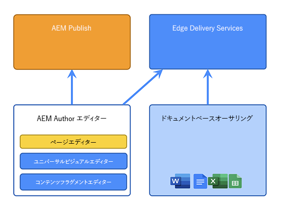
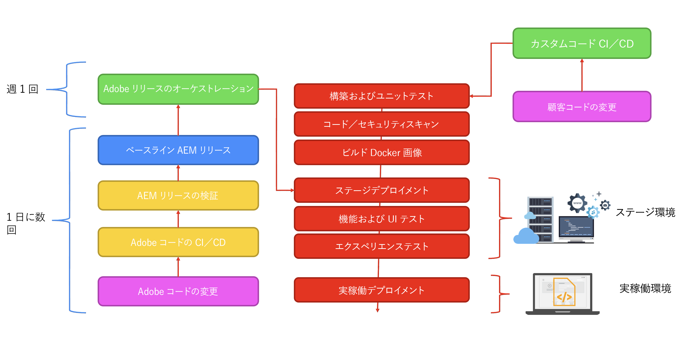

# Adobe Experience Manager as a Cloud Service のアーキテクチャの概要 {#an-introduction-to-the-architecture-adobe-experience-manager-as-a-cloud-service}

>[!CONTEXTUALHELP]
>id="intro_aem_cloudservice_architecture"
>title="AEM as a Cloud Service アーキテクチャの概要"
>abstract="ここでは、AEM as a Cloud Service の新しいアーキテクチャを概観し、変更点を理解します。AEM は、画像の数が変化する動的アーキテクチャを実現したので、時間をかけてクラウドアーキテクチャを理解することが重要です。"
>additional-url="https://video.tv.adobe.com/v/330542/" text="アーキテクチャの概要"

Adobe Experience Manager（AEM）as a Cloud Service は、影響の大きいエクスペリエンスを作成および管理するための、構成可能な一連のサービスを提供します。

このページでは、AEM as a Cloud Service の論理アーキテクチャ、サービスアーキテクチャ、システムアーキテクチャ、および開発アーキテクチャの概要を説明します。

## 論理アーキテクチャ {#logical-architecture}

AEM as a Cloud Serviceは、AEM Sites、AEM Assets、AEM Forms などの高度なソリューションで構成されています。これらのサービスは個別にライセンスを受けますが、共同で使用できます。各ソリューションは、それぞれの使用例に応じて、AEM as a Cloud Serviceが提供する構成可能なサービスの組み合わせを使用します。

### プログラム {#programs}

AEM アプリケーションは、ライセンス権限に従って Cloud Manager アプリケーションで作成する[プログラム](/help/implementing/cloud-manager/getting-access-to-aem-in-cloud/program-types.md)の形式で実現されます。これらのプログラムを使用すると、特定のプロジェクトのコンテキストで、関連する AEM アプリケーションの命名、設定、権限の割り当て方法を完全に制御できます。

お客様は通常、**テナント**（別名 *IMS 組織*）（Identity Management システム）としてアドビによって識別されます。テナントは、必要な数のプログラムを持ち、ライセンスを受けることができます。例えば、AEM Assets の中心プログラムを見るのは非常に一般的ですが、AEM Sites は、複数のオンラインエクスペリエンスに対応する複数のプログラムで使用される場合があります。

>[!NOTE]
>
>AEM Edge 配信サービスは、ライセンスの観点から他の主なソリューションの一部となりながら、Cloud Manager で最上位のソリューションとして公開されます。例えば、AEM Sites と Edge 配信サービス。

プログラムは、高レベルのソリューションの任意の組み合わせで構成でき、各ソリューションは 1 対多のアドオンからサポートできます。例えば、AEM Sites の場合は Commerce や Screens、AEM Assets の場合は Dynamic Media や Brand Portal です。

### 環境 {#environments}

AEM Sites、AEM Assets、AEM Forms の各ソリューションを使用してプログラムを作成すると、関連する AEM インスタンスは、このプログラム内の AEM 環境の形式で表されます。

AEM as a Cloud Service で使用できる[環境](/help/implementing/cloud-manager/manage-environments.md)には、次の 4 種類があります。

* 本番環境：

   * 本番環境は、実務担当者向けのアプリケーションをホストし、ライブエクスペリエンスを実行します。

* ステージ環境：

   * ステージ環境は、通常、本番環境に 1:1 で結び付いています。
   * ステージ環境は、主に、アプリケーションに対する変更が本番環境にプッシュされる前の自動テスト用に設計されています。
      * これは、メンテナンスアップデートの一環としてアドビによって開始される変更や、コードのデプロイメントによって開始される変更とは独立しています。
      * また、コードをデプロイする場合は、手動でテストを実行することもできます。
   * 通常、ステージ環境のコンテンツは、セルフサービスのコンテンツコピー機能を使用して、実稼動コンテンツと同期を維持します。
   * ステージ環境でパフォーマンスとセキュリティのテストを実施します。規模は実稼動と同じです。
* 開発環境：
   * 開発環境では、ステージ環境および本番環境と同じランタイム条件で開発者が AEM アプリケーションを実装およびテストできます。
   * 変更は、デプロイメントパイプラインを通じて行われ、実稼動デプロイメントパイプラインと同じコード品質とセキュリティゲートを使用できます。
   * 開発環境は、ステージング環境や実稼動環境と同じ規模ではないので、パフォーマンスおよびセキュリティのテストの実行には使用しないでください。
* 高速開発環境（RDE）：
   * RDE 環境を使用すると、通常の開発環境で見つかる正式なデプロイメントパイプラインを経ずに、新しいコードや既存のコードを RDE インスタンスにデプロイする際に、迅速な開発イテレーションを実行できます。

### Edge 配信サービス {#logical-architecture-edge-delivery-services}

AEM プログラムは、[Edge 配信サービス](/help/edge/overview.md)でも設定できます。

設定が完了すると、AEMは、Edge 配信サービスを使用したエクスペリエンスの構築に使用する GitHub コードリポジトリを参照できるようになります。その結果、関連するエクスペリエンスで新しい設定オプションを使用できるようになります。これには、アドビの管理による CDN の設定や、ライセンス指標や SLA レポートへのアクセスが含まれます。

## サービスアーキテクチャ {#service-architecture}

AEM as a Cloud Service の構成可能なサービスの上位レベルのリストは、コンテンツ管理とエクスペリエンス配信の 2 つのセグメントで表すことができます。

コンテンツ管理の場合、コンテンツのオーサリングに使用する 2 つの主なサービスセットがあり、どちらも&#x200B;*コンテンツソース*&#x200B;として表されています。

* AEM オーサー層：
web コンテンツを管理するための web ベースのインターフェイス（および関連する API）を提供します。これは、次の両方の方法で機能します。
   * ヘッドフル - ページエディターとユニバーサルエディターを使用
   * ヘッドレス - コンテンツフラグメントエディターを使用
* ドキュメントベースのオーサリング層：
次のような標準アプリケーションを使用してコンテンツをオーサリングできます。
   * Microsoft Word と Excel - SharePoint 経由
   * Google Docs と Sheets - Google Drive 経由

エクスペリエンス配信の場合、AEM Sites または AEM Forms を使用する際には、相互に排他的でなく、共有のアドビ管理 CDN（コンテンツ配信ネットワーク）の下で異なるオリジンとして動作する 2 つの主なサービスセットもあります。

* AEM パブリッシュ層：
   * 標準の AEM パブリッシャーおよび Dispatcher のファームを実行し、公開済みコンテンツと組み合わされた web ページおよび API コンテンツ（GraphQLなど）の動的レンダリングを可能にします。
   * 主にサーバー側のアプリケーションロジックに基づいています。
* Edge 配信パブリッシュ層：
   * AEM オーサー層やドキュメントベースのオーサリング層など、様々なコンテンツソースから web ページや API コンテンツを動的にレンダリングできます。
   * クライアント側のアプリケーションロジックに基づき、最大のパフォーマンスを実現するように設計されています。

また、キー隣接サービスもあります。

* Edge 配信アセット層：
   * AEM Assets から承認および公開されたメディア項目を配信できるようにします。例：画像、ビデオ。
   * 通常、メディア項目は、AEM パブリッシュ層、Edge 配信パブリッシュ層で実行されるエクスペリエンス、または AEM Assets と統合された他の Adobe Experience Cloud アプリケーションから参照されます。
* AEM プレビュー層と Edge 配信サービスプレビュー層は、次のとおりです。
   * また、AEM パブリッシュ層と Edge 配信パブリッシュ層をそれぞれ使用して構築されたエクスペリエンスにも使用できます。
   * コンテンツ作成者が、公開操作の前にコンテキスト内のコンテンツをプレビューできるようにします。

>[!NOTE]
>
>デフォルトでは、Assets のみのプログラムには、パブリッシュ層もプレビュー層もありません。

他にも隣接するサービスがあります。

* レプリケーションサービス：
   * コンテンツ管理層とエクスペリエンス配信層の間に位置します。
   * コンテンツ作成者によって発行される&#x200B;*公開*&#x200B;操作を担当し、公開されたコンテンツがパブリッシュ層（AEM または Edge 配信）に提供されます。

  >[!NOTE]
  >以前のバージョンの AEM のレプリケーションフレームワークはコンテンツの公開に使用されなくなったので、レプリケーションサービスは AEM の 6.x バージョンとは異なり、完全な再設計を行いました。
  >
  >最新のアーキテクチャは、クラウドベースのコンテンツキューを使用した&#x200B;*公開と購読*&#x200B;アプローチに基づいています。AEM パブリッシュ層の場合、可変数のパブリッシャーがパブリッシュコンテンツをサブスクライブできるようになり、AEM as a Cloud Service の真の迅速な自動スケーリングを実現するために不可欠な部分となります。

* コンテンツリポジトリサービス：
   * AEM オーサー層で使用されます。
   * JCR 準拠のコンテンツリポジトリ（Apache Oak テクノロジーによって実装されている）のクラウドベースのインスタンスです。
   * コンテンツの永続性は、主に BLOB ベースのクラウドストレージに基づいています。
* CI/CD サービス：
   * AEM 環境へのデプロイパイプラインの管理に関する Cloud Manager 機能のサブセットを表します。
* テストサービス：
   * 実行に使用される基礎となるインフラストラクチャを表します。
      * 機能テスト、
      * UI テスト：例えば、Selenium や Cypress のスクリプトに基づく場合、
      * エクスペリエンス監査テスト：例えば、Lighthouse スコア、

     AEM 環境へのデプロイメントパイプラインの一環として、または、Edge 配信コードリポジトリへのGitHub のプルリクエストの一部として。
* データサービス：
   * ライセンス指標（コンテンツリクエスト、ストレージ、ユーザーなど）や使用状況レポート（アップロード数、ダウンロード数など）などの顧客データを公開します。
   * 顧客データは、API を介して、および製品ユーザーインターフェイス（Cloud Manager など）内で公開できます。
* 運用テレメトリサービス：
   * カスタマーエクスペリエンス（ページビュー数、コア web バイタル、コンバージョンイベントなど）から主要指標を収集し、関連するクエリ（過去 7 日間の特定のドメインの上位ページビュー数など）に対応します。
* Assets Compute サービス：
   * アップロードされた画像、ビデオ、ドキュメント（PDF、Adobe Photoshop ファイルなど）の処理を担当します。Adobe AI を使用すると、画像やビデオのメタデータ（説明タグ、原色など）を抽出し、Adobe Photoshop API やAdobe Lightroom API などの API にアクセスしてレンディション（様々なサイズや形式など）を生成できます。
* Identity Management サービス（IMS）：
   * 特定の Adobe Experience Cloud アプリケーション（Cloud Manager や AEMオーサー層など）のユーザーとユーザーグループを管理および認証する一元的な場所です。
   * Adobe Admin Console を介してアクセスされます。

## システムアーキテクチャ {#system-architecture}

### AEM オーサー層、プレビュー層、パブリッシュ層 {#aem-author-preview-publish-tiers}

AEM オーサー層とパブリッシュ層は、標準のコンテナオーケストレーションサービスで操作される Docker コンテナのセットとして実装されています。結果として得られるコンテナ化アーキテクチャは、実際のアクティビティ（コンテンツ管理の場合）と実際のトラフィック（エクスペリエンス配信の場合）に応じて、様々なポッド数の完全に動的なシステムを意味します。これにより、AEM as a Cloud Service がトラフィックパターンの変更に対応できるようになります。

AEM オーサー層は、1 つのコンテンツリポジトリを共有する AEM オーサーポッドのクラスターとして動作します。少なくとも 2 つのポッドを使用すると、メンテナンスタスクの実行中や、デプロイメントプロセスの実行中にビジネスを継続できます。

AEM パブリッシュ層は、AEM パブリッシュインスタンスのファームとして操作され、それぞれに公開済みコンテンツの独自のコンテンツリポジトリが含まれます。各パブリッシャーは、アドビが管理する CDN のオリジンとして機能する、コンテンツの具体化されたビュー用の AEM Dispatcher モジュールを備えた単一の Apache インスタンスに結合されます。2 つ以上のポッドを使用することで、ビジネスの継続性も実現できますが、トラフィックが多い期間にこの数が増えるのは珍しくありません。

AEM プレビュー層は、1 つのプレビューノードで構成されます。これは、パブリッシュ層に公開する前のコンテンツの品質保証に使用されます。特にデプロイメント中に、プレビュー層でダウンタイムが時々発生する場合があります。

### Edge 配信サービス {#system-architecture-edge-delivery-services}

Edge 配信サービスは、CDN と、最もパフォーマンスの高い方法でページを組み立てるためのサーバーレスインフラストラクチャの上で動作します。リソースが要求されると、サーバーレスインフラストラクチャは、公開されたコンテンツをセマンティック HTML に変換し、CDN の起源として機能します。

セマンティック HTML へのコンバージョンは、AEM オーサー層またはドキュメントベースのオーサリング環境から提供される公開済みコンテンツから行われます。

Microsoft Word で Sites コンテンツを編集して（ドキュメントベースのオーサリング）、Edge Delivery に公開する方法を次の図に示します。また、様々なエディターを使用した従来の AEM パブリッシング方法も示します。

Edge 配信サービス は Adobe Experience Manager の構成要素なので、Edge 配信、AEM Sites、および AEM アセットは同じドメイン上に共存できます。これは、大規模な web サイトの場合に一般的なユースケースです。例えば、顧客はトラフィックの多い特定のページを Edge 配信サービスに移行し、その他のすべてのページが AEM パブリッシュ層に残る場合があります。

## 開発アーキテクチャ {#development-architecture}

### コードリポジトリ {#code-repositories}

AEM プロジェクトのコードと設定は、コードリポジトリに保存されます。コードリポジトリから、変更時にデプロイパイプラインが発行されます。次のような様々なタイプのコードリポジトリがあります。

* AEM フルスタック：
   * AEMオーサー層とパブリッシュ層用のサーバー側 Java コードと OSGi 設定を保存する場合。
* AEM フロントエンド：
   * AEM オーサー層とパブリッシュ層用のクライアント側 JS、CSS、およびHTMLコードを保存する場合。
clientlibs について詳しくは、[AEM as a Cloud Service でのクライアントサイドライブラリの使用](/help/implementing/developing/introduction/clientlibs.md)を参照してください。
* AEM web 層：
   * AEM パブリッシュ層用の Dispatcher 設定ファイルを格納します。
* AEM の設定：
   * AEM パブリッシュ層と Edge 配信サービスパブリッシュ層用の様々な設定オプション（CDN 設定やメンテナンスタスク設定など）を保存できます。
* AEM Edge 配信：
   * Edge 配信サービスで作成されたクライアント側 JS、CSS、および HTML コードを保存する場合

### デプロイメントパイプライン {#deployment-pipelines}

開発者と管理者は、Cloud Manager を通じて提供される継続的統合／継続的配信（CI/CD）サービスを使用して、AEM as a Cloud Service アプリケーションを管理します。Cloud Manager は、監視、メンテナンス、トラブルシューティング（ログファイルへのアクセスなど）、ライセンスに関する情報もすべて公開します。

AEM as a Cloud Service のインスタンスに対する更新はすべて Cloud Manager で管理されます。これは顧客アプリケーションの作成、テスト、デプロイを行う唯一の方法なので、オーサー層、プレビュー層、パブリッシュ層に不可欠です。これらの更新は、新しいバージョンの AEM as a Cloud Service の用意ができたときにアドビ側でトリガーできます。また、新しいバージョンの顧客アプリケーションの用意ができたときに自分自身でトリガーできます。

これは、プログラム内の各環境に結び付けられたデプロイメントパイプラインによって実装されます。Cloud Manager パイプラインが実行されると、オーサー層とパブリッシュ層の両方に対応する、新しいバージョンの顧客アプリケーションが作成されます。これは、最新の顧客パッケージとアドビの最新ベースラインイメージを組み合わせて実現されます。

デプロイメントパイプラインは、顧客がコードを変更している場合、またはアドビが新しいメンテナンスリリースをデプロイしている場合にトリガーされます。

どちらの場合も、自動化されたテストの同じセットが実行されます。テストで構成されます。

* 製品の整合性を確保するためにアドビが寄与した
* 顧客が提供するテスト
   * 機能テスト：AEM オーサー層またはパブリッシュ層への HTTP リクエストを使用
   * UI テスト：Selenium または Cypress テクノロジーに基づく

これらの自動テストはステージング環境で実行されます。そのため、ステージング環境のコンテンツを実稼動インスタンス上のコンテンツにできる限り近づけることが重要です。

すべてのテストが正常に完了すると、新しいコードが本番環境にデプロイされます。

### ローリングアップデート {#rolling-updates}

Cloud Manager では、ローリングアップデートパターンを使用してすべてのサービスノードを更新することで、最新バージョンの AEM アプリケーションへのカットオーバーを完全に自動化します。これは、オーサーサービスまたはパブリッシュサービスへの&#x200B;**ダウンタイムなし**&#x200B;を意味します。

## AEM 6.x 以降の主なイノベーション {#major-innovations-since-aem-6x}

AEM as a Cloud Service の最新のアーキテクチャでは、以前の世代（AEM 6.x 以前）と比べて、以下に示す根本的な変更とイノベーションが導入されています。

* すべてのファイルは、クラウドデータストアに直接アップロードされ、クラウドデータストアから直接提供されます。関連するビットストリームは、AEM オーサーサービスおよびパブリッシュサービスの JVM を経由しません。その結果、AEM オーサーサービスおよびパブリッシュサービスのノードサイズが小さくなり、迅速な自動スケーリングの期待に応えることができるようになります。実務担当者にとっては、これにより、画像、ビデオ、他のタスクをアップロードおよびダウンロードする際の操作性が向上します。

* コンテンツの公開で構成されるすべての操作に、サブスクリプションパターンに従ったパイプラインが含まれるようになりました。公開済みコンテンツは、パイプライン内の様々なキューにプッシュされ、パブリッシュサービスのすべてのノードがそれらのキューをサブスクライブします。その結果、パブリッシュサービスのノード数をオーサー層が把握している必要はなくなり、パブリッシュ層の迅速な自動スケーリングが可能になります。

* アーキテクチャでは、アプリケーションのコンテンツをアプリケーションのコードと設定から完全に切り離しています。すべてのコードと設定は実質的に不変で、オーサーサービスとパブリッシュサービスの様々なノードの作成に使用されるベースラインイメージに組み込まれています。その結果、各ノードが同一であることが完全に保証され、コードと設定の変更は Cloud Manager パイプラインの実行によってのみグローバルにおこなえます。

* アーキテクチャには、特に Adobe I/O Runtime を使用した、サーバレステクノロジー上に構築された複数のマイクロサービスが含まれます。

## その他の情報 {#further-information}

* プログラム設定
   * [オンボーディングジャーニー](/help/journey-onboarding/overview.md)
   * [プログラムとプログラムタイプ](/help/implementing/cloud-manager/getting-access-to-aem-in-cloud/program-types.md)
* 開発アーキテクチャ
   * [Cloud Manager リポジトリ](/help/implementing/cloud-manager/managing-code/managing-repositories.md)
   * [CI／CD パイプライン](/help/implementing/cloud-manager/configuring-pipelines/introduction-ci-cd-pipelines.md)
   * [コード品質テスト](/help/implementing/cloud-manager/code-quality-testing.md)
* Edge 配信サービス：
   * [AEM as a Cloud Service の概要 - Edge 配信サービスを使用](/help/edge/overview.md)
   * [Edge 配信サービスの使用](/help/edge/overview.md)
   * [Edge 配信サービスを使用する AEM as a Cloud Service の基盤となるアーキテクチャと重要な部分について説明します。](https://experienceleague.adobe.com/docs/experience-manager-learn/cloud-service/introduction/architecture.html?lang=ja)
