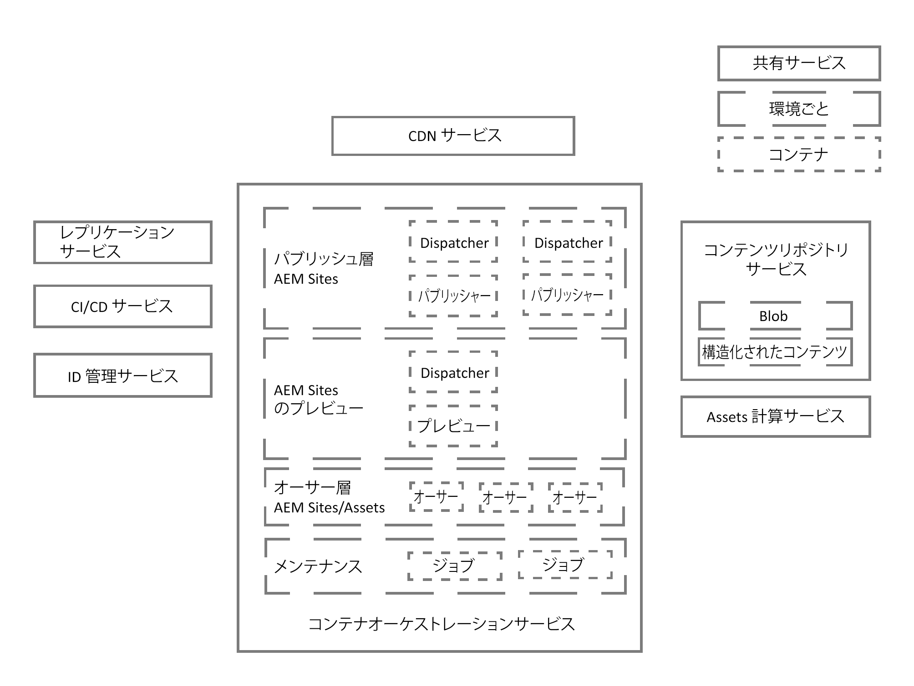
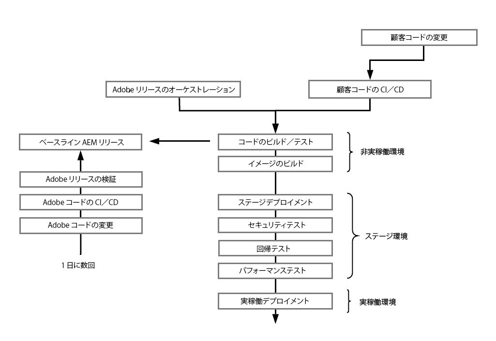
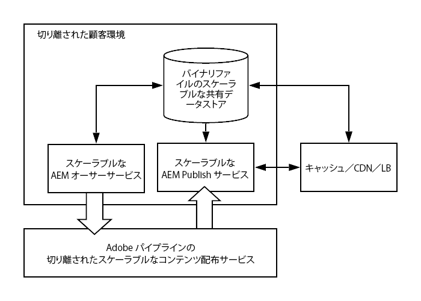

# Adobe Experience Manager as a Cloud Service のアーキテクチャの概要 {#an-introduction-to-the-architecture-adobe-experience-manager-as-a-cloud-service}

>[!CONTEXTUALHELP]
>id="intro_aem_cloudservice_architecture"
>title="AEM as a Cloud Service アーキテクチャの概要"
>abstract="ここでは、AEM as a Cloud Service の新しいアーキテクチャを概観し、変更点を理解します。AEM は、画像の数が変化する動的アーキテクチャを実現したので、時間をかけてクラウドアーキテクチャを理解することが重要です。"
>additional-url="https://video.tv.adobe.com/v/330542/" text="アーキテクチャの概要"

Adobe Experience Manager（AEM）as a Cloud Service は、アーキテクチャが変更されました。

## スケーリング {#scaling}

AEM as a Cloud Service には次の機能が追加されました。

* AEM イメージの数が可変の動的なアーキテクチャ。

このアーキテクチャには次の特長があります。

* *実際の*&#x200B;トラフィックと&#x200B;*実際の*&#x200B;アクティビティに基づいて、規模が拡大／縮小されます。

* 必要な場合にのみ個々のインスタンスが実行されます。

* モジュール型アプリケーションを使用します。

* デフォルトでオーサークラスターがあるので、メンテナンスタスクのダウンタイムを避けることができます。

これにより、様々な使用パターンに応じた自動スケーリングが可能になります。

これを実現するために、AEM as a Cloud Service のインスタンスはすべて同等に作成され、ノード数、割り当てメモリ量、割り当てる処理能力に関して、それぞれ同じデフォルトのサイズ特性を持ちます。

AEM as a Cloud Service では、次の特長を備えたオーケストレーションエンジンを基盤として使用しています。

* サービスの状態を絶えず監視します。

* 各サービスインスタンスの規模を、実際のニーズに応じて動的に拡大／縮小します。

このスケーリングは：

* ノード数と、各ノードに割り当てるメモリ量および CPU 処理能力に適用されます。

* AEM as a Cloud Service がトラフィックパターンの変更に対応できるようになります。

テナントごとのサービスインスタンスのスケーリングは、次の 2 つの軸に適用されます。

* 水平方向：特定のサービスのノード数は自動的に増減しますが、個別のデフォルト設定も可能です。

* 垂直方向：割り当てメモリと CPU 容量は、一定数のノードを設定することで拡張または縮小でき、必要に応じて個々の要件に対応することができます。

## 環境 {#environments}

>[!NOTE]
>詳しくは、[デプロイ - 実行モード](/help/implementing/deploying/overview.md#runmodes)を参照してください

AEM as a Cloud Service は個々のインスタンスとして使用でき、各インスタンスは完全な AEM 環境を表します。

AEM as a Cloud Service で使用できる環境には、次の 3 種類があります。

* **実稼動環境**：実務担当者向けのアプリケーションをホストします。

* **ステージ環境**：単一の実稼動環境に常に 1 対 1 に結び付いています。ステージ環境は、アプリケーションに対する変更が実稼動環境に反映される前に、パフォーマンスや品質に関する様々なテストに使用されます。

* **開発環境**：ステージ環境および実稼動環境と同じランタイム条件で開発者が AEM アプリケーションを実装できます。

  詳しくは、[環境の管理](https://experienceleague.adobe.com/docs/experience-manager-cloud-service/implementing/using-cloud-manager/manage-environments.html?lang=ja#using-cloud-manager)を参照してください。

* **迅速な開発環境**：新しいコードや既存のコードをデバッグする迅速な開発イテレーションが可能になります。

## プログラム {#programs}

新しい AEM プロジェクトは常に 1 つの特定のコードベースに関連付けられ、プロジェクトの設定とカスタムコードをそこに保存できます。この情報はコードリポジトリーに保存されています。通常の Git クライアントを通じてアクセスでき、プログラムの新規作成時に提供されます。

AEM プログラムは、次のものを含んだコンテナです。

|  プログラム要素 |  数 |
|--- |--- |
| コードリポジトリー（Git） |  1 |
| ベースラインイメージ（Sites または Assets） |  1 |
| ステージ環境と実稼動環境のセット（1 対 1 対応） | 0 または 1 |
| 実稼動以外の環境（RDE、開発またはデモ） | 0～N |
| 各環境のパイプライン | 0 または 1 |

AEM as a Cloud Service では、次の 2 種類のプログラムが最初から使用可能です。

* AEM Sites as a Cloud Service

* AEM Assets as a Cloud Service

どちらでも様々な機能を利用できます。オーサー層には、すべてのプログラムのあらゆる Sites 機能および Assets 機能が含まれていますが、Assets プログラムには、デフォルトではパブリッシュ層もプレビュー層もありません。

## ランタイムアーキテクチャ {#runtime-architecture}

この新しいアーキテクチャには、次のような様々な主要コンポーネントがあります。

<!--- needs reworking -->

* AEM Sites as a Cloud Service の場合：

   * 環境ごとに（概要レベルで）オーサー層とパブリッシュ層の概念が引き続き存在します。

   * オーサー層は、1 つのオーサークラスター内の 2 つ以上のノードで構成されます。オーサリングアクティビティに応じて、規模が自動的に拡大／縮小されます。

      * コンテンツ作成者／クリエーターは、AEM オーサー層にログインして、コンテンツの作成、編集、管理をおこないます。

      * オーサー層へのログインは、Adobe IMS（Identity Management System）で管理されます。

      * Assets の統合と処理には、専用のアセットコンピューティングサービスが使用されます。

   * プレビュー層は、1 つのプレビューノードで構成されます。これは、パブリッシュ層に公開する前のコンテンツの品質保証に使用されます。

   * パブリッシュ層は、1 つのパブリッシュファーム内の 2 つ以上のノードで構成されます。

      * 各ノードは、互いに独立して動作できます。

      * 各ノードは、AEM パブリッシャーと、AEM Dispatcher モジュールを備えた web サーバーで構成されます。

      * サイトトラフィックのニーズに合わせて、規模が自動的に拡大／縮小されます。

      * ただし、デフォルトでは、プライマリリージョンに 1 つのパブリッシュファームが存在しますが、[追加のパブリッシュリージョン](/help/operations/additional-publish-regions.md)はライセンスを取得できます。

      * エンドユーザーつまりサイト訪問者は、AEM パブリッシュサービスを通じて Web サイトにアクセスします。

* AEM Assets as a Cloud Service の場合：

   * アーキテクチャにはオーサリング環境のみ含まれます。

* オーサー層、プレビュー層、パブリッシュ層の両方が、コンテンツリポジトリーサービスに対してコンテンツの読み取りと保存をおこないます。

   * パブリッシュ層とプレビュー層は、永続レイヤーからコンテンツを読み取るだけです。

   * オーサー層は、永続レイヤーに対するコンテンツの読み取りと書き込みをおこないます。

   * BLOB ストレージは、パブリッシュ層、オーサー層、プレビュー層で共有されます。ファイルは&#x200B;*移動されません*。

   * コンテンツがオーサー層で承認されると、コンテンツをアクティベートできることになるので、コンテンツがパブリッシュ層の永続レイヤー（またはオプションとしてプレビュー層）にプッシュされます。これは、ミドルウェアパイプラインであるレプリケーションサービスを通じておこなわれます。このパイプラインが新しいコンテンツを受け取り、パイプラインにプッシュされたコンテンツを個々のパブリッシュサービス（またはプレビューサービス）ノードでサブスクライブします。

     >[!NOTE]
     >
     >詳しくは、[レプリケーション](/help/operations/replication.md)を参照してください。

   * 開発者と管理者は、[Cloud Manager](/help/overview/what-is-new-and-different.md#cloud-manager) を通じて提供される継続的統合／継続的配信（CI/CD）サービスを使用して、AEM as a Cloud Service プリケーションを管理します。これには、Cloud Manager の CI/CD パイプラインを使用したコードおよび設定のデプロイメントが含まれます。監視、メンテナンス、トラブルシューティング（ログファイルなど）に関連するすべての情報が Cloud Manager 内でユーザーに公開されます。

   * オーサー層とパブリッシュ層へのアクセスは、常にロードバランサーを通じておこなわれます。ロードバランサーは、各層のアクティブなノードを常に把握しています。

   * パブリッシュ層とプレビュー層では、継続的配信ネットワーク（CDN）サービスも最初のエントリポイントとして使用できます。

* AEM as a Cloud Service のデモインスタンスの場合、アーキテクチャは簡略化されてオーサーノードが 1 つだけになります。したがって、これは、標準的な開発環境、ステージ環境または実稼動環境のすべての特性を示しているわけではありません。つまり、ダウンタイムが多少発生する可能性があり、バックアップ／復元操作がサポートされていないということでもあります。

## デプロイメントアーキテクチャ {#deployment-architecture}

AEM as a Cloud Service のインスタンスに対する更新はすべて Cloud Manager で管理されます。これは顧客アプリケーションの作成、テスト、デプロイをおこなう唯一の方法なので、オーサー層、プレビュー層、パブリッシュ層の両方に不可欠です。インスタンスの更新は、新しいバージョンの AEM as a Cloud Service の用意ができたときにアドビ側でトリガーできます。また、新しいバージョンの顧客アプリケーションの用意ができたときに顧客側でトリガーできます。

技術的には、これは、デプロイメントパイプラインの概念に基づいて実装され、プログラム内の各環境に関連付けられます。Cloud Manager パイプラインが実行されると、オーサー層、プレビュー層、パブリッシュ層の両方に対応する、新しいバージョンの顧客アプリケーションが作成されます。これは、最新の顧客パッケージとアドビの最新ベースラインイメージを組み合わせて実現されます。新しいイメージが正常に作成およびテストされると、Cloud Manager は、ローリング更新パターンを使用してすべてのサービスノードを更新することで、最新バージョンのイメージへのカットオーバーを完全に自動化します。その結果、オーサーサービスまたはパブリッシュサービスのダウンタイムが発生しなくなります。

<!--- needs reworking -->

## コンテンツの配布 {#content-distribution}

Adobe Experience Manager as a Cloud Service では、コンテンツの公開の仕組みが変更されました。AEM as a Cloud Service では、以前のバージョンの AEM で使用されていたレプリケーションフレームワークがページの公開（オーサーインスタンスからパブリッシュインスタンスへの変更内容の移動）に使用されなくなりました。

代わりに、AEM as a Cloud Service は、[Sling コンテンツ配布](https://sling.apache.org/documentation/bundles/content-distribution.html)機能を使用して、適切なコンテンツを移動するようになりました。これは、AEM ランタイムの外部にある Adobe I/O で実行されるパイプラインサービスを使用します。

実行時にパブリッシュノードが追加、削除またはリサイクルされた場合の自動的なセルフサービス設定など、セットアップは自動化されています。

1 回の公開または非公開リクエストに複数のリソースを含めることができますが、その場合は、すべてのリソースに適用される単一のステータスが返されます。つまり、AEM パブリッシュサービスですべてのリソースについてリクエストが成功するか、すべてのリソースについて失敗するか、のどちらかです。これにより、AEM パブリッシュサービス内でリソースの一貫性が必ず保たれるようになります。

**コンテンツ配布アーキテクチャの概要図**

## 主な技術発展 {#key-evolutions}

AEM as a Cloud Service の新しいアーキテクチャでは、以前の世代と比べて、以下に示す根本的な変更と革新が導入されています。

* すべてのファイル（BLOB）は、クラウドデータストアに直接アップロードされ、クラウドデータストアから直接提供されます。関連するビットストリームは、AEM オーサーサービスおよび公開サービスの JVM を経由しません。その結果、AEM オーサーサービスおよびパブリッシュサービスのノードのサイズを小さくすることができ、迅速な自動スケーリングの期待に応えることができるようになります。実務担当者にとっては、これにより、画像やビデオなどをアップロードおよびダウンロードする際の操作性が向上します。

* コンテンツの公開で構成されるすべての操作に、サブスクリプションパターンに従ったパイプラインが含まれるようになりました。公開済みコンテンツは、パイプライン内の様々なキューにプッシュされ、パブリッシュサービスのすべてのノードがそれらのキューをサブスクライブします。その結果、パブリッシュサービスのノード数をオーサー層が把握している必要はなくなり、パブリッシュ層の迅速な自動スケーリングが可能になります。

* パブリッシュノードのライフサイクルを自動化するために、ゴールデンマスターの概念が導入されました。ゴールデンマスターは特別なパブリッシュノードで、エンドユーザーからはアクセスされません。パブリッシュサービスのすべてのノードがゴールデンマスターから作成されます。圧縮などのメンテナンス操作は、ゴールデンマスターに関連付けられているコンテンツリポジトリーに対して実行されます。パブリッシュノードは毎日リサイクルされ、定期メンテナンスは必要ありません。以前は、特にオーサーインスタンスの場合、このようなメンテナンスには多少のダウンタイムが必要でした。

* アーキテクチャでは、アプリケーションのコンテンツをアプリケーションのコードと設定から完全に切り離しています。すべてのコードと設定は実質的に不変で、オーサーサービスとパブリッシュサービスの様々なノードの作成に使用されるベースラインイメージに組み込まれています。その結果、各ノードが同一であることが完全に保証され、コードと設定の変更は Cloud Manager パイプラインの実行によってのみグローバルにおこなえます。

## AEMとEdge Delivery Services {#aem-with-edge-delivery-services}

AEMにはEdge Delivery Servicesが加わり、エンゲージメントとコンバージョンを推進する優れたエクスペリエンスが提供されます。 AEMは、作成と開発をすばやくおこなう、インパクトの大きいエクスペリエンスを提供することで、これを実現します。 Edge Delivery Servicesは、作成者がすばやく更新および公開でき、新しいサイトが迅速に起動する、迅速な開発環境を可能にする、合成可能な一連のサービスです。 したがって、Edge Delivery Servicesを使用すると、コンバージョンを改善し、コストを削減し、コンテンツの速度を大幅に向上できます。

更新されたアーキテクチャは、次の要素で構成されます。

* コンテンツ管理（様々なエディターを含む）
   * ユニバーサルビジュアルエディター
   * コンテンツフラグメントエディター
   * ページエディター
   * ドキュメントベースのオーサリング (SharePointまたはGoogle Drive から )
* エクスペリエンス配信（次を含む）
   * Edge 配信サービス
* コンテンツとコードを迅速かつ効率的に配信するための付帯サービス

関連トピック：

* [AEMas a Cloud Serviceの概要 —Edge Delivery Services](/help/edge/overview.md)
* [使用Edge Delivery Services](/help/edge/using.md)
* [Edge Delivery Servicesを使用して、基盤となるアーキテクチャと重要なAEMの部分をas a Cloud Serviceする](https://experienceleague.adobe.com/docs/experience-manager-learn/cloud-service/introduction/architecture.html)
