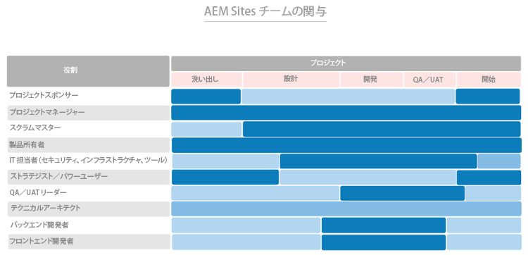

# まず、適切な役割を担う適切な人材を獲得 {#get-the-right-people-in-the-right-roles}

>[!CONTEXTUALHELP]
>id="aemcloud_chooseteam"
>title="適切なチームの選択"
>abstract="適切な人材を適切な職に就けて、Adobe Experience Manager のデプロイメントを成功に導きます。"
>additional-url="https://experienceleague.adobe.com/docs/experience-manager-cloud-service/onboarding/best-practices/aligning-kpis.html?lang=ja" text="KPI の調整"
>additional-url="https://experienceleague.adobe.com/docs/experience-manager-cloud-service/onboarding/best-practices/assessing-kpis.html?lang=ja" text="KPI の評価"

組織では、複数の部門がデジタルエクスペリエンスの異なる側面を担っている可能性が高いでしょう。ガバナンスが機能しなければ、いつ果てしない論争、内輪もめ、混乱に陥ってもおかしくありません。

デジタルガバナンスの出発点は、誰が何を担当し、誰がどのようなデジタル関連の業務を行っているかを把握することです。必要なスキルを追加するために、戦略的な雇用が必要になることもあります。それよりも大きな課題は文化の転換を推進すること、つまり、新しいテクノロジーを幅広くサポートし、担当者が新しい働き方に慣れるのを手助けすることです。その取り組みの重要な部分となるのが、デジタルコミュニティの立ち上げです。メンバーが互いに学び合い、支援し合うことができるコミュニティです。

当面は、適切な人材を適切な職に配備し、Adobe Experience Manager デプロイメントの促進を支援することに重点を置きます。コア製品（Adobe Experience Manager Sites と Adobe Experience Manager Assets）ごとに、担当者を決める必要がある役割の一覧と、それぞれの役割に必要なスキル、専門知識レベルおよび資質の一覧を示しました。

今週の課題は、導入チームと一緒に両方のリストを確認し、条件を満たす人材がそれぞれの役割に割り当てられていることを確認することです。

## **Adobe Experience Manager Sites に必要な主な役割**

デプロイメントチームと同様に、成功するチームでは 9 人の担当者がそれぞれ適切な役割を果たす必要があります。Adobe Experience Manager Sites の導入で成功を収めることができるかどうかは、チームメンバーの力とメンバー間の協力にかかっています。これら 9 つの役割は、必ず、推奨条件を満たす持つ人材に割り当ててください。

| 役割 | スキル | 能力レベル | 資質 |
|--- |--- |--- |--- |
| プロジェクトマネージャー | PMP 認定、アジャイル認定、リスク管理の経験 | エキスパート | 公平、一貫性がある、説明責任を果たせる、系統だった思考、前向き、親しみやすい、進んで変化を受け入れる |
| スクラムマスター | スクラムマスター認定、アジャイル認定、ファシリテーションの経験 | エキスパート | 一貫性がある、創造的 |
| 製品所有者 | アジャイル認定、ビジネスニーズの深い理解 | エキスパート | バランス感覚が良い、自信に満ちている |
| セキュリティ、インフラストラクチャ、ツールに関する IT リーダー | CISM 認定、Adobe Experience Manager コンポーネント開発者認定 | エキスパート | 細部へのこだわり |
| ストラテジスト／パワーユーザー | Adobe Experience Manager Sites の習熟 | 初心者からエキスパートまで | 粘り強い、好奇心が強い、周到、偏見がない、進んで変化を受け入れる、協調性がある |
| QA／UAT リーダー | アジャイル認定、SDLC の理解 | 初心者から中級者まで | 細部へのこだわり、プロセス主導、一貫性がある |
| テクニカルアーキテクト | IT インフラストラクチャの経験 | エキスパート | 細部へのこだわり、プロセス主導、一貫性がある |
| バックエンド開発者 | アジャイル認定、コンピュータープログラミングとコンピューターサイエンスの経験 | 初心者から中級者まで | 細部へのこだわり、プロセス主導、一貫性がある |
| フロントエンド開発者 | アジャイル認定、HTML／CSS／JavaScript の理解 | 初心者から中級者まで | 細部へのこだわり、プロセス主導、一貫性がある |

これで、必要な役割がわかったので、ぞれぞれの役割が導入プロセスのどの段階で関与してくるかを次のチャートで確認しましょう。

 

**導入チームと一緒にこのリストを確認し**、条件を満たす人材がそれぞれの役割に割り当てられていることを確認します。Adobe Experience Cloud に詳しくないチームメンバーは、[Experience League](https://experienceleague.adobe.com/ja?lang=ja#recommended/solutions/experience-manager) の学習リソースを利用して、[アドビデジタルラーニング](https://learning.adobe.com/certification.html)で認定を受けることができます。

## **Adobe Experience Manager Assets に必要な主な役割**

アーキテクトからスクラムマスターまで、さらには DAM イブラリアンも含めて、このチームに関係する役割はすべて不可欠です。

Adobe Experience Manager Assets の導入を成功させるために必要な人材のほとんどが既に揃っている可能性があります。この一覧は Adobe Experience Manager Sites の場合と似ていますが、重要な追加が 1 点あります。つまり、デジタルアセットを見つけやすいように整理しラベル付けするライブラリアンが必要です。

| 役割 | スキル | 能力レベル | 資質 |
|--- |--- |--- |--- |
| プロジェクトマネージャー | PMP 認定、アジャイル認定、リスク管理の経験 | エキスパート | 公平、一貫性がある、説明責任を果たせる、系統だった思考、前向き、親しみやすい、進んで変化を受け入れる |
| スクラムマスター | スクラムマスター認定、アジャイル認定、ファシリテーションの経験 | エキスパート | 一貫性がある、創造的 |
| 製品所有者 | アジャイル認定、ビジネスニーズの深い理解 | エキスパート | バランス感覚が良い、自信に満ちている |
| セキュリティ、インフラストラクチャ、ツールに関する IT リーダー | CISM 認定、Adobe Experience Manager コンポーネント開発者認定 | エキスパート | 細部へのこだわり |
| ストラテジスト／パワーユーザー | Adobe Experience Manager Sites の習熟 | 初心者からエキスパートまで | 粘り強い、好奇心が強い、周到、偏見がない、進んで変化を受け入れる、協調性がある |
| QA／UAT リーダー | アジャイル認定、SDLC の理解 | 初心者から中級者まで | 細部へのこだわり、プロセス主導、一貫性がある |
| テクニカルアーキテクト | IT インフラストラクチャの経験 | エキスパート | 細部へのこだわり、プロセス主導、一貫性がある |
| バックエンド開発者 | アジャイル認定、コンピュータープログラミングとコンピューターサイエンスの経験 | 初心者から中級者まで | 細部へのこだわり、プロセス主導、一貫性がある |
| フロントエンド開発者 | アジャイル認定、HTML／CSS／JavaScript の理解 | 初心者から中級者まで | 細部へのこだわり、プロセス主導、一貫性がある |
| DAM ライブラリアン | ライブラリーサイエンスの経歴と学位 | エキスパート | 細部へのこだわり、プロセス主導、系統だった思考 |

これで、必要な役割がわかったので、ぞれぞれの役割が導入プロセスのどの段階で関与してくるかを次のチャートで確認しましょう。

 

。

>[!TIP]
>
> [Experience League](https://experienceleague.adobe.com/ja?lang=ja#recommended/solutions/experience-manager) の各種リソースを活用して Adobe Experience Cloud の詳細を理解したり、[アドビデジタルラーニング](https://learning.adobe.com/certification.html)で認定を取得したりできます。
