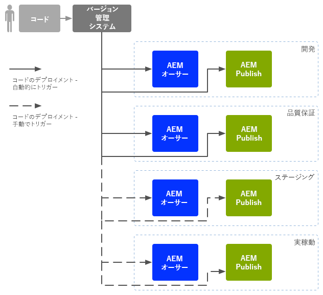

# Enterprise DevOps{#enterprise-devops}

DevOps では、以下の目的に必要なプロセス、メソッドおよびコミュニケーションを扱います。

* 様々な環境にわたるソフトウェアのデプロイメントを容易にする。
* 開発、テスト、デプロイメントチーム間のコラボレーションを簡素化する。

DevOps は、次のような問題を回避することを目的としています。

* 手動によるエラー。
* 要素の抜け（ファイルや設定の詳細など）。
* 不一致（開発者のローカル環境とその他の環境など）。

## 環境 {#environments}

Adobe Experience Manager（AEM）as a Cloud Service は通常、次のような複数の環境で構成され、それぞれが様々なレベルで様々な目的に使用されます。

* [開発](#development)
* [品質保証](#quality-assurance)
* [ステージング](#staging)
* [実稼動](#production-author-and-publish)

>[!NOTE]
>
>実稼動環境には、オーサー環境とパブリッシュ環境が少なくとも 1 つずつ必要です。
>
>その他すべての環境もオーサー環境とパブリッシュ環境で構成することをお勧めします。そうすると、実稼動環境を反映して早期のテストが可能になります。

### 開発 {#development}

開発者は、必要な機能をすべて備えた、提案されたプロジェクト（web サイト、モバイルアプリケーション、DAM 実装など）の開発とカスタマイズを担当します。開発者は、次の作業を行います。

* テンプレート、コンポーネント、ワークフロー、アプリケーションなど、必要な要素の開発とカスタマイズ
* デザインの実現
* 必要なサービスとスクリプトを開発して、必要な機能を実装できるようにする

[開発](/help/implementing/developing/introduction/development-guidelines.md)環境の設定には様々な要素が影響しますが、通常は次のもので構成されます。

* 統合コードベースを提供するバージョン管理を備えた統合開発システム。この統合コードベースは、各開発者が使用する個々の開発環境からコードを結合し、統合するために使用します。
* 各開発者の個人環境。通常はローカルマシン上に存在します。コードは適切な間隔で、バージョン管理システムと同期されます。

システムの規模によっては、開発環境にオーサーインスタンスとパブリッシュインスタンスの両方を含めることができます。

### 品質保証 {#quality-assurance}

この環境は、品質保証チームが新しいシステムのデザインと機能を包括的にテストするために使用されます。適切なコンテンツを含むオーサー環境とパブリッシュ環境の両方を持ち、完全なテストスイートを実施するために必要なすべてのサービスを提供する必要があります。

### ステージング {#staging}

ステージング環境は、実稼動環境（設定、コード、コンテンツ）のミラーである必要があります。

* 実際のデプロイメントの実装に使用するスクリプトをテストするために使用します。
* また、実稼動環境にデプロイする前の最終テスト（デザイン、機能、インターフェイス）にも使用できます。
* ステージング環境を実稼動環境と同一にすることが不可能な場合もありますが、パフォーマンスと負荷のテストができるように、できる限り近い環境にする必要があります。

### 実稼動 - オーサーとパブリッシュ {#production-author-and-publish}

実稼動環境は、実装を[オーサリングおよび公開](/help/sites-cloud/authoring/author-publish.md)する環境で構成されます。

実稼動環境は、少なくとも 1 つのオーサーインスタンスと 1 つのパブリッシュインスタンスで構成されます。

* コンテンツの入力用の[オーサー](#author)インスタンス。
* 訪問者やユーザーがコンテンツを使用できるようにするための[パブリッシュ](#publish)インスタンス。

プロジェクトの規模に応じて、多くの場合、複数の作成者、発行者、またはその両方で構成されます。下位レベルでは、リポジトリーが複数のインスタンスにクラスター化される場合もあります。

#### 作成者 {#author}

通常、オーサーインスタンスは内部ファイアウォールの内側に配置されます。この内部ファイアウォールは、ユーザーやユーザーの同僚が、以下のようなオーサリングタスクを実行する環境です。

* システム全体の管理
* コンテンツの入力
* コンテンツのレイアウトとデザインの設定
* パブリッシュ環境に対するコンテンツのアクティベート

アクティベートされたコンテンツはパッケージ化され、オーサー環境のレプリケーションキューに配置されます。次に、レプリケーションプロセスは、そのコンテンツをパブリッシュ環境に転送します。

パブリッシュ環境で生成されたデータをオーサー環境にリバースレプリケートするには、オーサー環境のレプリケーションリスナーがパブリッシュ環境をポーリングし、そのようなコンテンツをパブリッシュ環境のリバースレプリケーションアウトボックスから取得します。

#### パブリッシュ {#publish}

通常、パブリッシュ環境は「非武装地帯」（DMZ）内にあります。この環境では、訪問者は公開されているかイントラネット内かにかかわらず、（web サイトやモバイルアプリケーションの形式などの）コンテンツにアクセスして操作します。パブリッシュ環境では、次の処理が行われます。

* オーサー環境からレプリケートされたコンテンツを保持します
* そのコンテンツを訪問者が利用できるようにします
* コメントやその他のフォーム送信など、訪問者によって生成されたユーザーデータを保存します。
* オーサー環境にリバースレプリケーションできるように、そのようなユーザーデータをアウトボックスに追加するよう設定できます

パブリッシュ環境では、コンテンツがリアルタイムで動的に生成され、個々のユーザーに合わせて、コンテンツをパーソナライズできます。

## コードの移動 {#code-movement}

コードは常に下から上に反映されます。

* コードはまずローカルで、その後統合開発環境で開発される
* 続いて、QA 環境で十分なテストを実施する
* その後、ステージング環境でさらにテストする
* その後初めてコードは実稼動環境にデプロイされる

コード（カスタマイズされた web アプリケーション機能やデザインテンプレートなど）は通常、異なるコンテンツリポジトリ間でパッケージを書き出したり読み込んだりすることによって転送されます。場合によっては、このレプリケーションを自動プロセスとして設定できます。

AEM as a Cloud Service 上のプロジェクトは、コードのデプロイメントをトリガーすることがよくあります。

* 自動：開発環境および QA 環境への転送の場合。
* 手動：ステージング環境および実稼動環境へのデプロイメントは、より制御された方法で行われるので、多くの場合は手動ですが、必要に応じて自動化も可能です。

## コンテンツの移動 {#content-movement}

実稼動用に作成されているコンテンツは、実稼動オーサーインスタンスで&#x200B;**常に**&#x200B;オーサリングする必要があります。

コンテンツは、下位環境から上位環境へと移動するコードに従うべきではありません。つまり、作成者がローカルコンピューターまたは下位環境でコンテンツを作成してから実稼動環境に移動させることは、お勧めしません。エラーや不整合が生じる可能性があるためです。

実稼動コンテンツを実稼動環境からステージング環境へ移動して、ステージング環境で効率的かつ正確なテスト環境が提供されることを確認する必要があります。

>[!NOTE]
>
>この方法論は、ステージングコンテンツを実稼動環境と継続的に同期する必要があるという意味ではありません。通常の更新で十分ですが、特に新しい反復のコードをテストする前に必要です。QA および開発環境のコンテンツは頻繁に更新する必要はありませんが、。実稼動コンテンツをよく表している必要があります。

コンテンツは次のように転送できます。

* 異なる環境間 - パッケージを書き出したり読み込んだりします。
* 異なるインスタンス間 - コンテンツを直接レプリケート（AEM as a Cloud Service レプリケーション）します（HTTP または HTTPS 接続を使用）。

