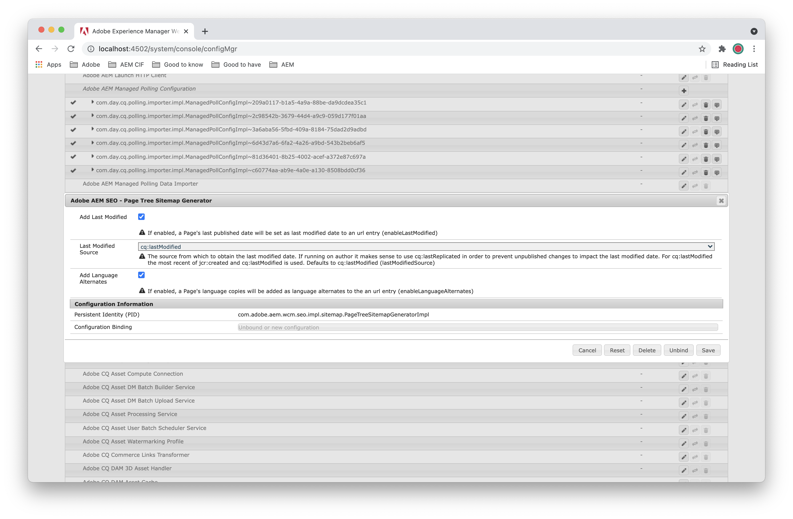

# Adobe Experience Manager as a Cloud Service の SEO および URL 管理のベストプラクティス{#seo-and-url-management-best-practices-for-aem}

検索エンジン最適化（SEO）は、多くのマーケティング担当者にとって重要な課題となっています。その結果、多くの Adobe Experience Manager（AEM）as a Cloud Service プロジェクトで SEO の懸念に対処する必要があります。

このドキュメントでは、まず、AEM as a Cloud Service の実装でこうした目的を達成するための [SEO のベストプラクティス](#seo-best-practices)および推奨事項を説明します。その次に、最初の節で提示するより[複雑な実装手順](#aem-configurations)のいくつかについて詳しく説明していきます。

## SEO のベストプラクティス {#seo-best-practices}

ここでは、SEO の一般的なベストプラクティスを説明します。

### URL {#urls}

URL には、いくつかの受け入れられたベストプラクティスがあります。

AEM プロジェクトで URL を評価するときには、次のことを確認してください。

*「ユーザーがこの URL を見ても、ページのコンテンツを見ていない場合、そのユーザーはこのページの内容を説明できますか？」*

回答が「はい」の場合、URL は検索エンジンで適切に機能する可能性が高くなります。

SEO に対応した URL を作成する方法について、一般的なヒントを紹介します。

* ハイフンを使用して単語を区切ります。

   * ページに名前を付けるときには、ハイフン（-）を区切り文字として使用します。
   * キャメルケース（単語の先頭を大文字で表記する）、アンダースコアおよびスペースの使用は避けます。

* 可能な場合、クエリパラメーターの使用は避けます。必要な場合は、パラメーターを 2 つ以下に制限してください。

   * 使用可能な場合、ディレクトリ構造を使用して情報アーキテクチャを示します。
   * ディレクトリ構造がオプションでない場合は、クエリ文字列ではなく、URL で Sling セレクターを使用します。 Sling セレクターを使用すると、提供される SEO 値に加えて、Dispatcher でページをキャッシュできるようになります。

* URL が人間が読み取りやすいほど、より良い結果が得られます。URL にキーワードが存在すると、値がブーストされます。

   * ページでセレクターを使用する場合、セマンティック値を提供するセレクターが推奨されます。
   * ユーザーが理解できない URL は、検索エンジンでも理解できません。
   * 次に例を示します。
      `mybrand.com/products/product-detail.product-category.product-name.html`
の方が より望ましい 
`mybrand.com/products/product-detail.1234.html`

* 可能な限りサブドメインを避けます。検索エンジンではサブドメインが異なるエンティティとして扱われ、サイトの SEO 値がフラグメント化されるからです。

   * 代わりに、第 1 レベルのサブパスを使用します。例えば、`es.mybrand.com/home.html` の代わりに、`www.mybrand.com/es/home.html` を使用します。

   * このガイドラインに従って、コンテンツの表示方法に合わせてコンテンツ階層を計画します。

* URL が長く、キーワードの位置が後ろになるほど、URL におけるキーワードの効果は低下します。つまり、短いほど効果的です。

   * AEM で提供されている URL 短縮の手法や機能を使用して、不要な URL 部分を削除します。
   * 例えば、`mybrand.com/content/my-brand/en/myPage.html` より `mybrand.com/en/myPage.html` を選択します。

* 正規 URL を使用します。

   * 複数のパスから、または複数のパラメーターやセレクターで 1 つの URL を提供できない場合は必ず、ページで `rel=canonical` タグを使用します。

   * このタグを AEM テンプレートのコードに組み込むこともできます。

* 可能な限り、URL をページのタイトルに合わせます。

   * コンテンツの作成者に対して、この手法に従うよう勧めてください。

* URL 要求で大文字と小文字を区別しない動作をサポートします。

   * すべての受信要求を小文字として書き換えるように Dispatcher を設定します。
   * 小文字を使用してすべてのページを作成するようコンテンツの作成者をトレーニングします。

* 各ページが 1 つのプロトコルから提供されるようにします。

   * サイトが `http` 経由で提供され、ユーザーがチェックアウトまたはログインフォームを使用してページに到達した時点で、`https` に切り替わることがあります。このページからリンクする際に、ユーザーが `http` ページと `https`を指定した場合、検索エンジンは、2 つの異なるページとして追跡します。

   * Google では現在、`https` ページの方が `http` ページよりも推奨されています。こうした理由から、多くの場合、サイト全体を `https` で提供する方が問題が少なくなります。

### サーバーの設定 {#server-configuration}

サーバーの設定に関しては、次の手段を講じることで、適切なコンテンツのみがクロールされるようにすることができます。

* `robots.txt` ファイルを使用して、インデックスを作成する必要がないコンテンツのクローリングをブロックします。

   * テスト環境では&#x200B;**すべての**&#x200B;クローリングをブロックします。

* 更新した URL を使用して新しいサイトの運用を開始する場合は、既存の SEO ランキングが失われないように 301 リダイレクトを実装します。
* サイトの favicon を挿入します。
* 検索エンジンでコンテンツが容易にクロールされるように XML サイトマップを実装します。モバイルサイトやレスポンシブサイトの場合は、必ずモバイルサイトマップを組み込んでください。

## AEM の設定 {#aem-configurations}

ここでは、SEO に関する前述の推奨事項に従って AEM を設定するために必要な実装手順を説明します。

### Sling セレクターの使用 {#using-sling-selectors}

以前は、エンタープライズ Web アプリケーションを構築する際に、クエリパラメーターの使用が受け入れられていました。

最近の傾向では、URL をより読みやすくするために、これらを削除するようになっています。 多くのプラットフォームでは、Web サーバーやコンテンツ配信ネットワーク（CDN）へのリダイレクトの実装などが行われますが、Sling を使用すると簡単です。Sling セレクターの特長は次のとおりです。

* URL のわかりやすさが向上します。
* Dispatcher でページをキャッシュでき、多くの場合、セキュリティが向上します。
* 汎用サーブレットを使用してコンテンツを取得する代わりに、コンテンツを直接アドレス指定できます。これにより、リポジトリに適用する ACL や、Dispatcher に適用するフィルターを活用できます。

#### サーブレットでのセレクターの使用 {#using-selectors-for-servlets}

AEM では、サーブレットを作成するときに次の 2 つのオプションが用意されています。

* **bin** サーブレット
* **Sling** サーブレット

次の例では、これらのパターンと Sling サーブレットを使用することで得られる利点の両方に従うサーブレットを登録する方法を示します。

#### bin サーブレット（1 レベル下） {#bin-servlets-one-level-down}

**bin** サーブレットは、多くの開発者が使い慣れている J2EE プログラミングのパターンに準拠しています。このサーブレットは、特定のパスに登録されます。AEM の場合は通常 `/bin` に登録され、必要な要求パラメーターをクエリ文字列から抽出します。

このタイプのサーブレットの SCR 注釈は、次のようになります。

```
@SlingServlet(paths = "/bin/myApp/myServlet", extensions = "json", methods = "GET")
```

続いて、`SlingHttpServletRequest` メソッドに含まれる `doGet` オブジェクトを使用して、クエリ文字列からパラメーターを抽出します。次に例を示します。

```
String myParam = req.getParameter("myParam");
```

使用される結果の URL は次のようになります。

`https://www.mydomain.com/bin/myApp/myServlet.json?myParam=myValue`

このアプローチで考慮すべき点は次のとおりです。

* URL 自体から SEO 値が失われます。URL は、コンテンツ階層ではなく、プログラムにおけるパスを表すので、検索エンジンを含め、サイトにアクセスするユーザーが URL からセマンティック値を受け取ることはありません。
* URL にクエリパラメーターが含まれている場合、Dispatcher で応答をキャッシュできなくなります。
* このサーブレットを保護するには、独自のカスタムセキュリティロジックをサーブレットに実装する必要があります。
* を公開するように Dispatcher を（慎重に）設定する必要があります。 `/bin/myApp/myServlet`. 単に `/bin` を公開すると、サイト訪問者に公開してはいけない特定のサーブレットへのアクセスが許可されます。

#### Sling サーブレット（1 レベル下） {#sling-servlets-one-level-down}

**Sling** サーブレットを使用すると、逆の方法でサーブレットを登録できます。サーブレットをアドレス指定し、クエリパラメーターに基づいてサーブレットでレンダリングするコンテンツを指定するのではなく、目的のコンテンツをアドレス指定し、Sling セレクターに基づいてコンテンツをレンダリングするサーブレットを指定します。

このタイプのサーブレットの SCR 注釈は、次のようになります。

```
@SlingServlet(resourceTypes = "myBrand/components/pages/myPageType", selectors = "myRenderer", extensions = "json”, methods=”GET”)
```

この場合、URL によってアドレス指定されるリソース（`myPageType` リソースのインスタンス）にサーブレットで自動的にアクセスできます。アクセスするには、次のメソッドを呼び出します。

```
Resource myPage = req.getResource();
```

使用される結果の URL は次のようになります。

`https://www.mydomain.com/content/my-brand/my-page.myRenderer.json`

このアプローチの利点は次のとおりです。

* サイト階層およびページ名に存在するセマンティックによって得られた SEO 値でベイクできます。
* クエリパラメーターがないので、Dispatcher が応答をキャッシュできます。 また、アドレス指定されたページに対して更新を行うと、ページがアクティベートされたときにこのキャッシュが無効化されます。
* に適用されるすべての ACL `/content/my-brand/my-page` ユーザーがこのサーブレットにアクセスしようとすると、有効になります。
* Dispatcher は、Web サイトを提供する機能としてこのコンテンツを提供するように既に設定されています。 追加の設定は必要ありません。

### URL の書き換え {#url-rewriting}

AEM では、すべての Web ページが `/content/my-brand/my-content` に保存されます。これは、リポジトリーデータ管理の観点では便利な場合がありますが、必ずしもこの方法で顧客にサイトを表示するわけではなく、URL をできるだけ短くするという SEO のガイダンスと矛盾する可能性があります。また、同じAEMインスタンスや異なるドメイン名から複数の Web サイトを提供している場合もあります。

ここでは、これらの URL を管理し、よりわかりやすく、SEO に適した方法で URL をユーザーに表示するために AEM で使用可能なオプションを検討します。

#### バニティー URL {#vanity-urls}

作成者が、プロモーション目的で別の場所からアクセス可能なページを作成する場合、ページごとに定義される AEM のバニティー URL が役立つことがあります。ページのバニティー URL を追加するには、 **Sites** コンソールで該当するページに移動し、ページのプロパティを編集します。「**基本**」タブの下部に、バニティー URL を追加できるセクションが表示されます。複数の URL を使用してページにアクセスできるようにすると、ページの SEO 値が分断されるので、正規 URL タグをページに追加して、この問題を回避する必要があることに留意してください。

#### ページ名のローカライズ {#localized-page-names}

翻訳されたコンテンツのユーザーには、ローカライズされたページ名を表示した方がよい場合があります。次に例を示します。

* スペイン語を話すユーザーが次のページにアクセスするとします。
   `www.mydomain.com/es/home.html`

* この場合、URL を次のように表示した方が効果的です。
   `www.mydomain.com/es/casa.html`

ページ名のローカライズに伴う課題は、AEM プラットフォームで使用可能なローカリゼーションツールの多くでは、コンテンツを同期しておくためには、ロケール間でページ名を一致させる必要があるという点です。

`sling:alias` プロパティを使用すると、両方を同時に実現できます。`sling:alias` を任意のリソースにプロパティとして追加すると、リソースのエイリアス名を使用することができます。前述の例では、次のようになります。

* JCR の次の場所にページがあるとします。
   `…/es/home`

* プロパティを追加します。
   `sling:alias` = `casa`

これにより、マルチサイトマネージャーなどの AEM 翻訳ツールでは、次のページ間の関係を引き続き維持できます。

* `/en/home`

* `/es/home`

また、エンドユーザーもページ名を母国語で操作できます。

>[!NOTE]
>
>`sling:alias` プロパティは、[ページプロパティ編集時のエイリアスプロパティ](/help/sites-cloud/authoring/fundamentals/page-properties.md#advanced)を使用して設定できます。

#### /etc/map {#etc-map}

標準 AEM インストールでは、

* OSGi 設定には
   **Apache Sling Resource Resolver Factory**
（ 
`org.apache.sling.jcr.resource.internal.JcrResourceResolverFactoryImpl`）

* プロパティ
   **マッピング場所**（`resource.resolver.map.location`）

* デフォルト `/etc/map` に設定。

AEM で受信要求のマッピングまたはページ上の URL の書き換え、あるいはその両方を行うために、この場所にマッピング定義を追加できます。

マッピングを作成するには、 `sling:Mapping` 以下のこの場所にあるノード `/http` または `/https`. このノードで設定された `sling:match` および `sling:internalRedirect` プロパティに基づいて、AEM は、一致した URL のすべてのトラフィックを `internalRedirect` プロパティで指定された値にリダイレクトします。

これは、AEM および Sling の正式なドキュメントに記載されているアプローチですが、この実装で提供される正規表現のサポートは、`SlingResourceResolver` を直接使用することによって利用可能なオプションと比べると、範囲が限られています。また、この方法でマッピングを実装すると、Dispatcher のキャッシュの無効化に関する問題が発生する可能性があります。

次に、この問題がどのように生じるかについて例を示します。

1. ユーザーが Web サイトを訪問し、`https://www.mydomain.com/my-page.html` を要求します。
1. Dispatcher が、この要求をパブリッシュサーバーに転送します。
1. 公開サーバーが `/etc/map` を使用して、この要求を `/content/my-brand/my-page` に解決し、ページをレンダリングします。

1. Dispatcher が次の場所に応答をキャッシュします。 `/my-page.html` を返し、ユーザーに対する応答を返します。
1. コンテンツ作成者がこのページを変更し、アクティベートします。
1. Dispatcher フラッシュエージェントが、 `/content/my-brand/my-page`**.** Dispatcher はこのパスにページをキャッシュしていないので、古いコンテンツがキャッシュされ、古くなっています。

キャッシュの無効化の目的で、短い URL を長い URL にマッピングするカスタムディスパッチフラッシュルールを設定する方法があります。

ただし、より簡単にこれを管理する方法もあります。

1. **SlingResourceResolver ルール**

   Web コンソール（localhost:4502/system/console/configMgr など）を使用して、Sling Resource Resolver を設定できます。

   * **Apache Sling Resource Resolver Factory**

      `(org.apache.sling.jcr.resource.internal.JcrResourceResolverFactoryImpl)`.
   URL を短縮するために必要なマッピングを正規表現として構築した後、ビルドに含まれている OsgiConfignode の `config.publish` でこれらの設定を定義することをお勧めします。

   `/etc/map`マッピングを定義する代わりに、プロパティ **URL Mappings**（`resource.resolver.mapping`）に直接割り当てることができます。

   ```xml
   resource.resolver.mapping="[/content/my-brand/(.*)</$1]"
   ```

   この簡単な例では、URL に `/content/my-brand/` が存在する場合、URL の先頭から削除されます。

   これにより、URL は次のように変換されます。

   * `/content/my-brand/my-page.html` から
   * ただの `/my-page.html`

   これは、URL をできるだけ短く維持するという推奨事項に準拠しています。

1. **ページに出力される URL のマッピング**

   Apache Sling Resource Resolver でマッピングを定義したら、ページに出力する URL が短く、適切になるように、それらのマッピングをコンポーネントで使用する必要があります。そのためには、`ResourceResolver` のマッピング関数を使用します。

   例えば、現在のページの子をリストするカスタムナビゲーションコンポーネントを実装する場合、次のようなマッピングメソッドを使用できます。

   ```
   for (Page child : children) {
     String childUrl = resourceResolver.map(request, child.getPath());
     //Output the childUrl on the page here
   }
   ```

#### Apache HTTP Server の mod_rewrite {#apache-http-server-mod-rewrite}

これまでに、URL をページに出力するときに、定義したマッピングを使用するために、マッピングをロジックとともにコンポーネントに実装しました。

最後の手順は、短縮された URL の Dispatcher での処理です。ここでは、 `mod_rewrite` 遊び始める。 を使用する最大のメリット `mod_rewrite` は、URL が長い形式に再びマッピングされることを意味します *前* これらは Dispatcher モジュールに送信されます。 つまり、Dispatcher は公開サーバーに長い URL を要求し、それに応じて URL をキャッシュします。 したがって、パブリッシュサーバーから取り込まれた Dispatcher フラッシュで、このコンテンツを正常に無効にすることができます。

このようなルールを実装するには、Apache HTTP Server の設定で仮想ホストに `RewriteRule` 要素を追加します。前述の例の短縮された URL を拡張する場合は、次のようなルールを実装できます。

```
<VirtualHost *:80>
  ServerName www.mydomain.com
  RewriteEngine on
  RewriteRule ^/(.*)$ /content/my-brand/$1 [PT,L]
  …
</VirtualHost>
```

### 正規 URL タグ {#canonical-url-tags}

正規 URL タグは、コンテンツのインデックスを作成するときに検索エンジンでページをどのように処理する必要があるかを明確化するために、HTML ドキュメントの先頭に配置されるリンクタグです。ページの URL に違いが含まれている場合でも、ページのインデックスが同じ（異なるバージョンの）ページになるようにするのがメリットです。

例えば、ページのプリンターフレンドリーなバージョンをサイトで提供する場合、検索エンジンでは、通常のバージョンのページとは別に、このページのインデックスが作成される可能性があります。正規タグは、同じであることを検索エンジンに伝えます。

例：

* `<https://www.mydomain.com/my-brand/my-page.html>`
* `<https://www.mydomain.com/my-brand/my-page.print.html>`

両方について、ページの先頭に次のタグを適用します。

```xml
<link rel=”canonical” href=”my-brand/my-page.html”/>
```

`href` は、相対パスとして指定することも、絶対パスとして指定することもできます。ページの正規 URL を確認し、このタグを出力するには、このコードをページマークアップに挿入する必要があります。

### 大文字と小文字を区別しないように Dispatcher を設定する {#configuring-the-dispatcher-for-case-insensitivity}

最善の方法は、小文字を使用してすべてのページを提供することです。ただし、ユーザーが URL に大文字を使用して Web サイトにアクセスしたときに、404 エラーが表示されるのは望ましくありません。こうした理由から、すべての受信 URL を小文字にマッピングするように、Apache HTTP Server の設定に書き換えルールを追加することをお勧めします。また、小文字の名前を使用してページを作成するようにコンテンツ作成者をトレーニングする必要があります。

すべての受信トラフィックを強制的に小文字に変換するように Apache を設定するには、次のコードを `vhost` の設定に追加します。

```xml
RewriteEngine On
RewriteMap lowercase int:tolower
```

また、 `htaccess` ファイル：

```xml
RewriteCond $1 [A-Z]
RewriteRule ^(.*)$ /${lowercase:$1} [R=301,L]
```

### 開発環境を保護するための robots.txt の実装 {#implementing-robots-txt-to-protect-development-environments}

検索エンジンでは、サイトをクロールする前に、サイトのルートに *ファイルがあるかどうかがチェックされる*&#x200B;はず`robots.txt`です。Google、Yahoo、Bing などの主要な検索エンジンではすべてこの点が考慮されますが、一部の外部の検索エンジンでは考慮されません。

サイト全体へのアクセスをブロックするための最も簡単な方法は、`robots.txt` というファイルに次の内容を指定して、サイトのルートに配置することです。

```xml
User-agent: *
Disallow: /
```

また、実稼働環境では、インデックスが作成されないように特定のパスを禁止することもできます。

を `robots.txt` ファイルをサイトルートに配置する場合、Dispatcher フラッシュ要求によってこのファイルがクリアされ、URL マッピングによってサイトのルートが `DOCROOT` Apache HTTP Server 設定で定義されたとおりです。 こうした理由から、このファイルをオーサーインスタンスのサイトのルートに配置し、パブリッシュインスタンスにレプリケートするのが一般的です。

### AEM での XML サイトマップの作成 {#building-an-xml-sitemap-on-aem}

クローラーでは、Web サイトの構造をより的確に把握するために XML サイトマップが使用されます。サイトマップを提供することで SEO ランキングが向上する保証はありませんが、これは合意に基づくベストプラクティスです。 Web サーバー上で XML ファイルを手動で維持してサイトマップとして使用できますが、サイトマップをプログラムで生成することをお勧めします。これにより、作成者がコンテンツを作成すると、サイトマップに変更が自動的に反映されます。

AEM では、[Apache Sling Sitemap モジュール](https://github.com/apache/sling-org-apache-sling-sitemap)を使用して XML サイトマップを生成し、開発者とエディターがサイトの XML サイトマップを最新の状態に保つための様々なオプションを提供します。

Apache Sling Sitemap モジュールは、トップレベルのサイトマップとネストされたサイトマップを区別します。両方とも、 `sling:sitemapRoot` プロパティを `true`. 通常、サイトマップは、ツリーの最上位サイトマップ（他のサイトマップのルートの上位ページを持たないリソース）のパスにあるセレクターを使用してレンダリングされます。 このトップレベルのサイトマップルートは、サイトマップのインデックスも公開します。通常は、サイトの所有者が検索エンジンの設定ポータルで設定したり、サイトの `robots.txt`.

例えば、次の場所にあるトップレベルのサイトマップルートを定義するサイトについて考えてみましょう。 `my-page` とネストされたサイトマップのルート ( `my-page/news`:news サブツリーのページ用の専用サイトマップを生成します。 これに、関連する URL は次のようになります。

* `<https://www.mydomain.com/my-brand/my-page.sitemap-index.xml>`
* `<https://www.mydomain.com/my-brand/my-page.sitemap.xml>`
* `<https://www.mydomain.com/my-brand/my-page.sitemap.news-sitemap.html>`

>[!NOTE]
>
> セレクター `sitemap` および `sitemap-index` は、カスタム実装と干渉する可能性があります。製品機能を使用しない場合は、これらのセレクターを提供する独自のサーブレットを 0 より大きい `service.ranking` で設定します。

デフォルトの設定では、ページのプロパティダイアログには、ページをサイトマップルートとしてマークオプションがあり、前述したように、ページ自体とその下位要素のサイトマップを生成します。この動作は `SitemapGenerator` インターフェイスの実装によって実装されており、代替実装を追加することで拡張することができます。ただし、XML サイトマップを再生成する頻度は、コンテンツオーサリングワークフローとワークロードに大きく依存するので、製品には `SitemapScheduler` 設定は含まれていません。これにより、機能が効果的にオプトインします。

XML サイトマップを生成するバックグラウンドジョブを有効にするには、`SitemapScheduler` を設定する必要があります。それには、PID `org.apache.sling.sitemap.impl.SitemapScheduler` の OSGi 設定を作成します。スケジューラー式 `0 0 0 * * ?` は、1 日 1 回午前 0 時にすべての XML サイトマップを再生成するための開始点として使用できます。


サイトマップ生成ジョブは、オーサー層のインスタンスとパブリッシュ層のインスタンスの両方で実行できます。ほとんどの場合、適切な正規 URL を生成できるのはパブリッシュ層インスタンスだけなので、パブリッシュ層インスタンスで生成を実行することをお勧めします（Sling リソースマッピングルールは一般にパブリッシュ層インスタンスにのみ存在するため）。ただし、[SitemapLinkExternalizer](https://javadoc.io/doc/com.adobe.cq.wcm/com.adobe.aem.wcm.seo/latest/com/adobe/aem/wcm/seo/sitemap/externalizer/SitemapLinkExternalizer.html) インターフェイスを実装することにより、正規 URL の生成に使用される外部化メカニズムのカスタム実装をプラグインすることは可能です。カスタム実装により、オーサー層インスタンスでサイトマップの正規 URL を生成できる場合は、`SitemapScheduler` をオーサー実行モードに設定して、XML サイトマップ生成ワークロードをオーサーサービスクラスターのインスタンス全体に分散させることができます。このシナリオでは、未公開のコンテンツ、変更済みのコンテンツ、限られたユーザーグループにのみ表示されるコンテンツの取り扱いには、特に注意が必要です。

AEM Sites には、ページのツリーをトラバースしてサイトマップを生成する `SitemapGenerator` のデフォルトの実装が含まれています。サイトの正規 URL と（使用可能な場合は）代替言語のみを出力するように事前設定されています。また、必要に応じて、ページの最終変更日を含めるように設定することもできます。その場合は、*Adobe AEM SEO - Page Tree Sitemap Generator* 設定の「*最終変更日を追加*」オプションを有効にし、「*最終変更ソース*」を選択します。サイトマップがパブリッシュ層で生成される場合は、 `cq:lastModified` 日付。



サイトマップのコンテンツを制限するには、必要に応じて次のサービスインターフェイスを実装します。

* [SitemapPageFilter](https://javadoc.io/doc/com.adobe.cq.wcm/com.adobe.aem.wcm.seo/latest/com/adobe/aem/wcm/seo/sitemap/SitemapPageFilter.html) を実装することで、AEM Sites 固有のサイトマップジェネレーターで生成された XML サイトマップからページを非表示にすることができます。
* [SitemapProductFilter](https://javadoc.io/doc/com.adobe.commerce.cif/core-cif-components-core/latest/com/adobe/cq/commerce/core/components/services/sitemap/SitemapProductFilter.html) または [SitemapCategoryFilter](https://javadoc.io/doc/com.adobe.commerce.cif/core-cif-components-core/latest/com/adobe/cq/commerce/core/components/services/sitemap/SitemapCategoryFilter.html) を実装して、[Commerce Integration Frameworks](https://experienceleague.adobe.com/docs/experience-manager-cloud-service/content/content-and-commerce/home.html) 固有のサイトマップジェネレーターで生成される XML サイトマップから製品やカテゴリをフィルタリングできます。

デフォルトの実装が特定のユースケースで機能しない場合、または拡張ポイントが十分に柔軟性を持たない場合、カスタム `SitemapGenerator` を実装して、生成されるサイトマップのコンテンツを完全に制御できます。次の例では、AEM Sites のデフォルトの実装ロジックを利用してこれを行う方法を示しています。[ResourceTreeSitemapGenerator](https://javadoc.io/doc/org.apache.sling/org.apache.sling.sitemap/latest/org/apache/sling/sitemap/spi/generator/ResourceTreeSitemapGenerator.html) を開始点として使用して、ページのツリーをトラバースします。

```
import java.util.Optional;

import org.apache.sling.api.resource.Resource;
import org.apache.sling.sitemap.SitemapException;
import org.apache.sling.sitemap.builder.Sitemap;
import org.apache.sling.sitemap.builder.Url;
import org.apache.sling.sitemap.spi.common.SitemapLinkExternalizer;
import org.apache.sling.sitemap.spi.generator.ResourceTreeSitemapGenerator;
import org.apache.sling.sitemap.spi.generator.SitemapGenerator;
import org.jetbrains.annotations.NotNull;
import org.osgi.service.component.annotations.Component;
import org.osgi.service.component.annotations.Reference;
import org.slf4j.Logger;
import org.slf4j.LoggerFactory;

import com.adobe.aem.wcm.seo.sitemap.PageTreeSitemapGenerator;
import com.day.cq.wcm.api.Page;

@Component(
    service = SitemapGenerator.class,
    property = { "service.ranking:Integer=20" }
)
public class SitemapGeneratorImpl extends ResourceTreeSitemapGenerator {

    private static final Logger LOG = LoggerFactory.getLogger(SitemapGeneratorImpl.class);

    @Reference
    private SitemapLinkExternalizer externalizer;
    @Reference
    private PageTreeSitemapGenerator defaultGenerator;

    @Override
    protected void addResource(@NotNull String name, @NotNull Sitemap sitemap, Resource resource) throws SitemapException {
        Page page = resource.adaptTo(Page.class);
        if (page == null) {
            LOG.debug("Skipping resource at {}: not a page", resource.getPath());
            return;
        }
        String location = externalizer.externalize(resource);
        Url url = sitemap.addUrl(location + ".html");
        // add any additional content to the Url like lastmod, change frequency, etc
    }

    @Override
    protected final boolean shouldFollow(@NotNull Resource resource) {
        return super.shouldFollow(resource)
            && Optional.ofNullable(resource.adaptTo(Page.class)).map(this::shouldFollow).orElse(Boolean.TRUE);
    }

    private boolean shouldFollow(Page page) {
        // add additional conditions to stop traversing some pages
        return !defaultGenerator.isProtected(page);
    }

    @Override
    protected final boolean shouldInclude(@NotNull Resource resource) {
        return super.shouldInclude(resource)
            && Optional.ofNullable(resource.adaptTo(Page.class)).map(this::shouldInclude).orElse(Boolean.FALSE);
    }

    private boolean shouldInclude(Page page) {
        // add additional conditions to stop including some pages
        return defaultGenerator.isPublished(page)
            && !defaultGenerator.isNoIndex(page)
            && !defaultGenerator.isRedirect(page)
            && !defaultGenerator.isProtected(page);
    }
}
```

さらに、XML サイトマップ用に実装された機能は、例えば、正規リンクや代替言語をページの先頭に追加する場合など、様々なユースケースでも使用できます。詳しくは、[SeoTags](https://javadoc.io/doc/com.adobe.cq.wcm/com.adobe.aem.wcm.seo/latest/com/adobe/aem/wcm/seo/SeoTags.html) インターフェイスを参照してください。

### レガシー URL の 301 リダイレクトの作成 {#creating-redirects-for-legacy-urls}

新しい構造でサイトの運用を開始するときには、次の 2 つの理由から、Apache HTTP Server で 301 リダイレクトを実装し、テストすることが重要です。

* レガシー URL では、時間の経過とともに SEO 値が上がっています。リダイレクトを実装すると、検索エンジンでは、この値を新しい URL に適用できます。
* サイトのユーザーが、それらのページへのブックマークを作成している場合があります。リダイレクトを実装すると、古いサイトでアクセスしようとしていたページに最も近い、新しいサイトのページにユーザーがリダイレクトされるようにすることができます。

301 リダイレクトの実装手順と、リダイレクトが期待どおりに動作しているかをテストするためのツールについては、以下の追加のリソースの節を必ず確認してください。

## その他のリソース {#additional-resources}

詳しくは、以下のその他のリソースを参照してください。

<!--
* [Resource Mapping](/help/sites-deploying/resource-mapping.md)
-->

* [https://moz.com/blog/seo-cheat-sheet-anatomy-of-a-url](https://moz.com/blog/seo-cheat-sheet-anatomy-of-a-url)
* [https://moz.com/blog/15-seo-best-practices-for-structuring-urls](https://moz.com/blog/15-seo-best-practices-for-structuring-urls)
* [https://mysiteauditor.com/blog/top-10-most-important-seo-tips-for-url-optimization/](https://mysiteauditor.com/blog/top-10-most-important-seo-tips-for-url-optimization/)
* [https://sling.apache.org/documentation/the-sling-engine/servlets.html](https://sling.apache.org/documentation/the-sling-engine/servlets.html)
* [https://sling.apache.org/documentation/the-sling-engine/mappings-for-resource-resolution.html](https://sling.apache.org/documentation/the-sling-engine/mappings-for-resource-resolution.html)
* [https://httpd.apache.org/docs/current/mod/mod_rewrite.html](https://httpd.apache.org/docs/current/mod/mod_rewrite.html)
* [https://moz.com/blog/canonical-url-tag-the-most-important-advancement-in-seo-practices-since-sitemaps](https://moz.com/blog/canonical-url-tag-the-most-important-advancement-in-seo-practices-since-sitemaps)
* [https://www.robotstxt.org/robotstxt.html](https://www.robotstxt.org/robotstxt.html)
* [https://www.internetmarketingninjas.com/blog/search-engine-optimization/](https://www.internetmarketingninjas.com/blog/search-engine-optimization/)
* [https://github.com/Adobe-Marketing-Cloud/tools/tree/master/dispatcher/redirectTester](https://github.com/Adobe-Marketing-Cloud/tools/tree/master/dispatcher/redirectTester)
* [https://adobe-consulting-services.github.io/](https://adobe-consulting-services.github.io/)
* [https://github.com/apache/sling-org-apache-sling-sitemap](https://github.com/apache/sling-org-apache-sling-sitemap)
