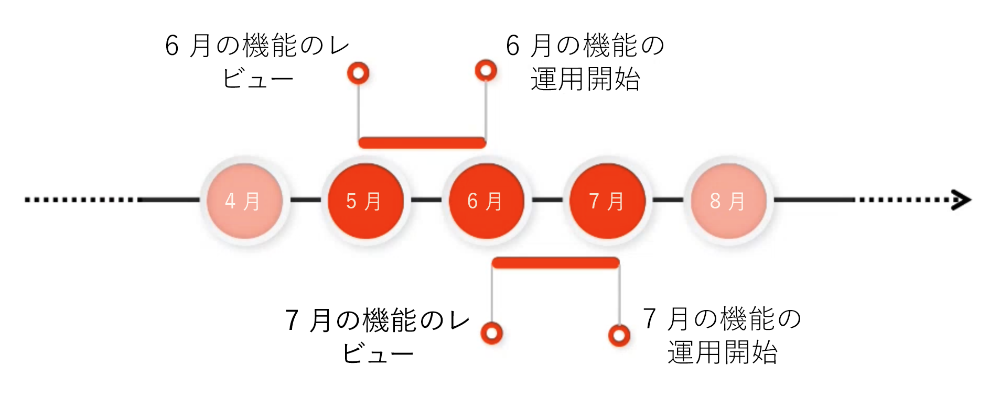

# リリース情報 {#release-information}

| 製品 | Adobe Experience Manager as a Cloud Service |
|---|---|
| バージョン | 2025.11.0 |
| タイプ | 継続的アップデート |
| 公開日 | 継続的アップデート |

## AEM のリリーススケジュール {#release-schedule}

[!DNL Adobe Experience Manager] as a Cloud Service の継続的リリースモデルを使用すると、アプリケーションは継続的に自動更新されます。アップデートには、機能リリースとメンテナンスアップデートの 2 種類があります。

* **機能リリースは、予測可能な月次の頻度で行われ、新機能と製品の革新に重点を置いています。**
   * 最新の機能リリースについて詳しくは、[最新のリリースノート](/help/release-notes/release-notes-cloud/release-notes-current.md)を参照してください。
* **メンテナンスリリース**&#x200B;は頻繁に行われ、セキュリティアップデート、バグ修正、パフォーマンスの強化に重点を置いています。
   * これにより、[!DNL Adobe Experience Manager] as a Cloud Service は重要な修正が適用された、常に最新の状態になります。
   * 最新のメンテナンスリリースについて詳しくは、[最新のメンテナンスリリースノート](/help/release-notes/maintenance/latest.md)を参照してください。

このモデルにより、サービスが中断されることなく継続的にリリースされます。今後提供予定の機能は、通常、あるリリースで発表され、次のリリースで公開される予定です。このようにして、今後提供予定の機能を評価し、独自のプロジェクトへの実装を計画することができます。これにより、機能が使用可能になる、次の機能リリースに向けて事前に計画できます。

例えば、5 月に、6 月などの今後のリリースで一般公開される予定の機能を評価できます。

このケイダンスにより、今後提供予定の機能がプロジェクトやカスタマイズに与える影響を評価し、これらの機能、テスト、ユーザートレーニングの展開を計画できます。

今後のリリースについて詳しくは、[Experience Manager リリースロードマップ](https://experienceleague.adobe.com/docs/experience-manager-release-information/aem-release-updates/update-releases-roadmap.html?lang=ja#aem-as-cloud-service)を参照してください。

## リリースの準備方法 {#how-to-prepare}

リリースの準備をするには、次を行います。

1. [カレンダーをマークする](#mark-calendars)
1. [リリースノートを確認する](#release-notes)
1. [今後提供予定の機能にアクセスして試す](#upcoming-features)
1. [ユーザーをトレーニングする](#train-users)

## カレンダーをマークする {#mark-calendars}

機能リリースは事前にスケジュールされており、リリース日は [Adobe Experience League](https://experienceleague.adobe.com/docs/experience-manager-release-information/aem-release-updates/update-releases-roadmap.html?lang=ja#aem-as-cloud-service) で公開されています。

リリース日を控えておくと、今後提供予定の機能の確認やテストを計画できます。

## リリースノートを確認する {#release-notes}

カレンダーにリリース日をマークしたら、リリース日に [Adobe Experience League](/help/release-notes/release-notes-cloud/release-notes-current.md) の web サイトで最新のリリースノートを確認します。

各リリースには、そのリリースの新機能だけでなく、評価で使用できる今後提供予定の機能についても記載したリリースノートが付属しています。事前に情報を取得して、AEMaaCS の最新機能を活用する計画を立ててください。

また、すべてのリリースと共に公開されている[既知の問題を確認](/help/release-notes/maintenance/latest.md)することもできます。これにより、新機能の評価や最終的な採用に課題が生じる可能性のある技術的な問題を認識することもできます。

## 今後提供予定の機能にアクセスして試す {#upcoming-features}

今後提供予定の機能は、通常、次の 2 つの方法のいずれかで利用できます。

* Alpha、Betaまたは限定提供プログラムの一環として
* プレリリースチャンネルの一部として

今後提供予定の機能の公開方法については、[リリースノート](#release-notes)を参照してください。

* それが Alphba、Beta、または限定提供プログラムの一部である場合、リリースノートに記載されているように、通常、アドビに連絡して有効にする必要があります。
* プレリリースチャネルの一部である場合は、[開発環境またはサンドボックス環境でプレリリースチャネルを有効にする](/help/release-notes/prerelease.md)必要があります。

## ユーザーのトレーニング {#train-users}

今後提供予定の機能をテストし、プロジェクトで活用することにしたら、ユーザーのトレーニングを行う必要があります。

Adobe Experience League では、AEMaaCS を学ぶための多くのリソースを提供しています。

* [AEMaaCS のドキュメント](https://experienceleague.adobe.com/docs/experience-manager-cloud-service.html?lang=ja)
* [チュートリアル](https://experienceleague.adobe.com/docs/experience-manager-learn/aem-tutorials/overview.html?lang=ja)
* リリースノートの[月次リリース概要ビデオ](/help/release-notes/release-notes-cloud/release-notes-current.md#release-video)

## 主要なリリース情報 {#key-articles}

* [機能リリースノート](/help/release-notes/release-notes-cloud/release-notes-current.md)
* [メンテナンスリリースノート](/help/release-notes/maintenance/latest.md)
* [新機能](what-is-new.md)
* [主要な変更点](aem-cloud-changes.md)
* [廃止される機能および削除された機能](deprecated-removed-features.md)
