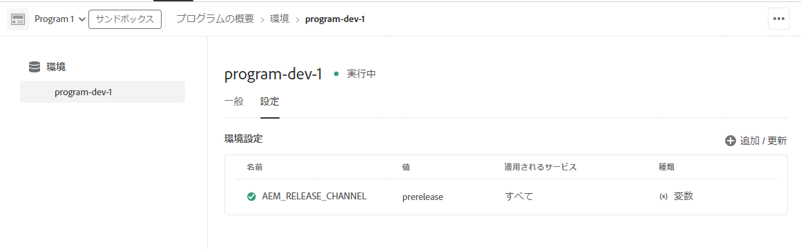

# Adobe Experience Manager as a Cloud Service プレリリースチャネル {#prerelease-channel}

プレリリースチャネルを使用して、AEM as a Cloud Service の今後の機能のプレビューを取得する方法について説明します。

## はじめに {#introduction}

Adobe Experience Manager as a Cloud Service では、定期的に新機能が提供されます。特定の機能リリースに関する新機能および今後の機能のリストは、[リリースノート](/help/release-notes/release-notes-cloud/release-notes-current.md)に掲載されています。

今後提供予定の機能は、通常、次の 2 つの方法のいずれかで利用できます。

* 早期導入プログラムの一環として
* プレリリースチャンネルの一部として

このドキュメントでは、プレリリースチャンネルを有効にする方法について説明しています。プレリリースチャンネルでは、今後の AEM の機能リリースで導入予定の新機能を早期に利用することができます。これにより、新機能を事前に検証し、将来のリリースに備えて導入計画を立てることができます。AEMのリリーススケジュールについて詳しくは、[Adobe Experience Manager（AEM）as a Cloud Serviceのリリースノート ](/help/release-notes/home.md) を参照してください。

## プレリリースチャンネルを有効にして今後の機能にアクセスして試す {#enable-prerelease}

プレリリースチャネルは、任意の開発環境またはサンドボックス環境で有効にできます。プレリリースチャンネルは、ステージング環境または実稼動環境では有効にできません。

プレリリースチャンネルは、次の 2 つ異なる方法でアクセスできます。

* [クラウド環境](#cloud-environments)
* [ローカル SDK](#local-sdk)

### クラウド環境 {#cloud-environments}

プレリリースチャンネルを使用するようにクラウド環境を更新するには、新しい環境変数を追加する必要があります。これは、Cloud Manager UI または CLI を使用して実行できます。

#### UI を使用した環境変数の追加 {#add-with-ui}

1. [my.cloudmanager.adobe.com](https://my.cloudmanager.adobe.com/) で Cloud Manager にログインし、適切な組織を選択します。

1. プレリリースチャンネルを有効にするプログラムに移動します。

1. プレリリースチャンネルを有効にする環境を選択し、**プログラム**／**環境**／**環境設定**&#x200B;に移動して、設定にアクセスします。

1. 新しい[環境変数](/help/implementing/cloud-manager/environment-variables.md)を追加します

   | 名前 | 値 | 適用されるサービス | タイプ |
   |------|-------|-----------------|------|
   | `AEM_RELEASE_CHANNEL` | `prerelease` | すべて | 変数 |

1. 変更を保存すると、プレリリースチャンネルが有効になり、環境が更新されます。

   

#### CLI を使用した環境変数の追加 {#add-with-cli}

Cloud Manager API と CLI を使用して環境変数を更新することもできます。

* [Cloud Manager API の環境変数エンドポイント](https://developer.adobe.com/experience-cloud/cloud-manager/reference/api/#operation/patchEnvironmentVariables)を使用して、`AEM_RELEASE_CHANNEL` 環境変数に値 `prerelease` を設定します。

  ```text
  PATCH /program/{programId}/environment/{environmentId}/variables
  [
          {
                  "name" : "AEM_RELEASE_CHANNEL",
                  "value" : "prerelease",
                  "type" : "string"
          }
  ]
  ```

* [Cloud Manager CLI](https://github.com/adobe/aio-cli-plugin-cloudmanager#aio-cloudmanagerset-environment-variables-environmentid) も使用できます

  ```shell
  aio cloudmanager:environment:set-variables <ENVIRONMENT_ID> --programId=<PROGRAM_ID> --variable AEM_RELEASE_CHANNEL "prerelease
  ```

環境を標準の動作（プレリリースチャンネルを使わない状態）に戻したい場合は、変数を削除できます。

### ローカル SDK {#local-sdk}

ローカルの Quickstart SDK でプレリリースチャンネルの今後の機能にアクセスでき、新しい API に対応したコードを作成するには、Maven プロジェクトの設定で Maven Central にあるプレリリースチャンネル `API Jar` を参照するように構成してください。通常の Quickstart SDK をプレリリースモードで起動することにより、ローカル開発環境でこれらのプレリリースチャンネルを確認することもできます。

#### プレリリースモードで Quickstart SDK を起動 {#prerelease-mode}

1. ソフトウェア配布ポータルから SDK をダウンロードし、[ AEM as a Cloud Service SDK へのアクセス](/help/implementing/developing/introduction/aem-as-a-cloud-service-sdk.md)
1. SDK Quickstart を起動する際に、引数 `-r prerelease` を含めます。

この値は、sticky なので最初の起動時にのみ選択できます。コマンドラインオプションを変更するには、SDK を再インストールします。

毎月の機能リリースの間に複数の AEM メンテナンスリリースが行われる可能性があるので、これらの新しい SDK をダウンロードし、Maven プロジェクトで新しい SDK API Jar バージョンを参照できます。メンテナンスリリースには、追加のプレリリース機能はありませんが、バグ修正、セキュリティ修正、パフォーマンス強化などの小規模な変更が含まれる場合があります。
Javadoc は Maven Central に公開されます。

#### プレリリース SDK に対応するビルド {#build-sdk}

1. Maven プロジェクトの `pom.xml` を変更して、Maven Central に公開されている個別のプレリリース SDK API jar を参照するようにします。これには、プレリリース機能の新しい Java API が含まれており、SDK API jar に依存しています。同じバージョンが使用されます。

   例として、通常の API jar を参照する親 POM の依存関係管理セクションのスニペットを次に示します。

   ```
   <dependencyManagement>
    <dependencies>
        <dependency>
            <groupId>com.adobe.aem</groupId>
            <artifactId>aem-sdk-api</artifactId>
            <version>${aem.sdk.api}</version>
            <scope>provided</scope>
        </dependency>
   ```

   この場合、モジュールでの使用方法は次のようになります。

   ```
    <dependencies>
     <dependency>
         <groupId>com.adobe.aem</groupId>
         <artifactId>aem-sdk-api</artifactId>
     </dependency>
   ```

   プレリリース SDK に変更するには、次に示すように、依存関係を `com.adobe.aem:aem-sdk-api` から `com.adobe.aem:aem-prerelease-sdk-api` に変更するだけです。

   ```
   <dependencyManagement>
    <dependencies>
      <dependency>
            <groupId>com.adobe.aem</groupId>
            <artifactId>aem-prerelease-sdk-api</artifactId>
            <version>${aem.sdk.api}</version>
            <scope>provided</scope>
      </dependency>
   <dependencies>
      <dependency>
         <groupId>com.adobe.aem</groupId>
         <artifactId>aem-prerelease-sdk-api</artifactId>
      </dependency>
   ```

   通常どおり、個々のプロジェクトでこの依存関係を使用できます。

1. ローカルサーバーにデプロイします。

1. ローカルで想定どおりに動作することを確認したら、コードを開発ブランチにコミットし、Cloud Manager の実稼動以外のパイプラインを使用して、[プレリリースチャネルを有効化した環境](#cloud-environments)にデプロイします。

>[!CAUTION]
> 
> `aem-prerelease-sdk-api` artifactId は、ステージまたは実稼働環境にデプロイするときには使用しないでください。実稼働パイプラインでデプロイする場合は、必ず `aem-sdk-api` を使用します。同様に、プレリリース API を参照するコードは、実稼動パイプラインでデプロイしないでください。

[AEM CS SDK ビルドアナライザー Maven プラグイン v1.0 以降](https://experienceleague.adobe.com/docs/experience-manager-core-components/using/developing/archetype/build-analyzer-maven-plugin.html?lang=ja#developing)では、依存関係を調べて、プレリリース API がプロジェクトで使用されているかどうかを検出します。アナライザーで検出すると、プレリリース SDK API を使用してプロジェクトを分析します。

## 検討事項 {#considerations}

プレリリースチャンネルを使用する際には、いくつかの注意事項があります。

* プレリリースチャネルには、次のリリースでロールアウトされるすべての新機能が含まれているとは限りません。
* プレリリースの機能は厳しい品質保証検査を通り、ベータ版の品質ではなく完全な機能を実現することを目的としています。通常の AEM リリースの機能にバグがあると思われる場合と同様に、問題に気がついた場合は報告してください。
* 環境がプレリリースチャネル用に設定されているかどうかを判断するには、AEM コンソールの&#x200B;**バージョン情報**&#x200B;ページに移動し、AEM バージョン番号に `Adobe Experience Manager 2021.4.5226.20210427T070726Z-210429-PRERELEASE` などの `PRERELEASE` サフィックスが含まれているかどうかを確認します。


