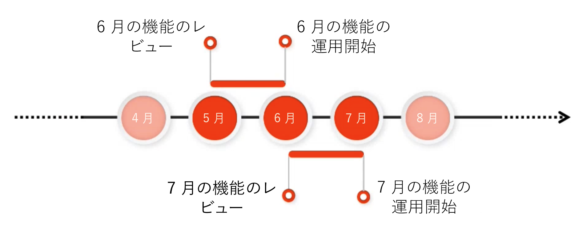

# Adobe Experience Manager as a Cloud Service Prerelease チャネル {#prerelease-channel}

プレリリースチャネルを使用して、AEM as a Cloud Serviceの今後の機能をプレビューする方法を説明します。

## はじめに {#introduction}

Adobe Experience Manager as a Cloud Serviceは、 [Experience Managerがロードマップをリリースします。](https://experienceleague.adobe.com/docs/experience-manager-release-information/aem-release-updates/update-releases-roadmap.html?lang=ja#aem-as-cloud-service)

翌月に公開されるようにスケジュールされている機能に慣れるには、プレリリースチャネルを購読します。プレリリースチャネルは、開発環境または任意のサンドボックス環境を設定することでアクセスできます。 AEM UI からアクセス可能な変更をプレビューし、新しいプレリリース API に対してコードを作成できます。

特定の月のプレリリース機能のリストは、 [月別リリースノート。](/help/release-notes/release-notes-cloud/release-notes-current.md)

## AEMas a Cloud Serviceリリース {#releases}

AEM as a Cloud Serviceには 2 種類のリリースがあります。

* **月別リリース** 機能と機能をAEM as a Cloud Serviceに追加
* **重要な更新** セキュリティの更新、パフォーマンスの強化、バグの修正を追加し、毎日適用されます。

このパターンにより、サービスが中断することなく、継続的なリリースが実現します。

プレリリースチャネルを使用すると、今後の毎月のリリースでスケジュールされる機能をプレビューして、今後の機能を評価し、独自のプロジェクトで可能な実装を計画できます。 次の月次リリースに向けて事前に計画できます。

例えば、5 月の場合にプレリリースチャネルを購読している場合、今後の 6 月のリリースで機能を評価できます。



プレリリースでは、今後の AEMaaCS の機能を 1 ヶ月間にわたって紹介します。新機能がプロジェクトやカスタマイズに与える影響を評価し、その機能、テスト、ユーザートレーニングの展開を計画する時間を提供します。

プレリリースチャネルを効果的に活用するには、4 つの手順が必要です。

1. [カレンダーのマーク](#mark-calendars)
1. [リリースノートを確認する](#release-notes)
1. [新機能にアクセスしてみてください](#new-features)
1. [ユーザーのトレーニング](#train-users)

## カレンダーのマーク {#mark-calendars}

毎月のリリースは十分に事前に予定されており、リリース日は [Adobe Experience League。](https://experienceleague.adobe.com/docs/experience-manager-release-information/aem-release-updates/update-releases-roadmap.html?lang=ja#aem-as-cloud-service)

リリース日を控えておくと、今後の機能の確認やテストを計画できます。

## リリースノートを確認する {#release-notes}

カレンダーにリリース日がマークされたら、必ず [Adobe Experience League](/help/release-notes/release-notes-cloud/release-notes-current.md) 最新のリリースノートに関するリリース日の web サイト。

各リリースには、そのリリースの新機能だけでなく、プレリリース評価に使用できる機能についても記載したリリースノートが含まれています。 事前に知っておき、AEMaaCS の最新機能を活用する計画を立ててください。

また、 [既知の問題を確認する](/help/release-notes/known-issues.md) をすべてのリリースと共に公開することで、評価や最終的に新機能が採用される上での課題に直面する可能性のある技術的な問題にも対応できます。

## プレリリースチャネルを有効にして新機能にアクセスして試す {#new-features}

プレリリースチャネルは、任意の開発環境またはサンドボックス環境で有効にできます。 プレリリースは、ステージング環境または実稼動環境では有効にできません。

プレリリース機能は、次のような異なる方法で使用できます。

* [クラウド環境](#cloud-environments)
* [ローカル SDK](#local-sdk)

### クラウド環境 {#cloud-environments}

プレリリースを使用するようにクラウド環境を更新するには、新しい環境変数を追加する必要があります。 これは、Cloud Manager UI を使用するか、CLI を使用して実行できます。

#### UI を使用した環境変数の追加 {#add-with-ui}

1. [my.cloudmanager.adobe.com](https://my.cloudmanager.adobe.com/) で Cloud Manager にログインし、適切な組織を選択します。

1. プレリリースを有効にするプログラムに移動します。

1. プレリリースを有効にし、次を通じて設定にアクセスする環境を選択します。 **プログラム** > **環境** > **環境設定**.

1. 新しい [環境変数：](../implementing/cloud-manager/environment-variables.md)

   | 名前 | 値 | 適用されるサービス | タイプ |
   |------|-------|-----------------|------|
   | `AEM_RELEASE_CHANNEL` | `prerelease` | すべて | 変数 |

1. 変更内容を保存すると、プレリリース機能の切り替えが有効になった状態で環境が更新されます。

   

#### CLI を使用した環境変数の追加 {#add-with-cli}

また、Cloud Manager API と CLI を使用して環境変数を更新することもできます。

* 使用 [Cloud Manager API の環境変数エンドポイント、](https://developer.adobe.com/experience-cloud/cloud-manager/reference/api/#operation/patchEnvironmentVariables) 設定 `AEM_RELEASE_CHANNEL` 環境変数を値に `prerelease`.

   ```text
   PATCH /program/{programId}/environment/{environmentId}/variables
   [
           {
                   "name" : "AEM_RELEASE_CHANNEL",
                   "value" : "prerelease",
                   "type" : "string"
           }
   ]
   ```

* [Cloud Manager CLI](https://github.com/adobe/aio-cli-plugin-cloudmanager#aio-cloudmanagerset-environment-variables-environmentid) また、

   ```shell
   aio cloudmanager:environment:set-variables <ENVIRONMENT_ID> --programId=<PROGRAM_ID> --variable AEM_RELEASE_CHANNEL “prerelease
   ```

環境を通常の（プレリリース以外の）チャネルの動作に戻す場合は、変数を削除するか、別の値に設定し直します。

### ローカル SDK {#local-sdk}

プレリリースを参照するように Maven プロジェクトを設定すると、ローカルのクイックスタート SDK の Sites コンソールおよびプレリリースの新しい API に対するコードで新機能を確認できます `API Jar` Maven Central にあります。 通常のクイックスタート SDK をプレリリースモードで開始すると、ローカル開発環境でこれらのプレリリース機能を表示することもできます。

#### プレリリースモードでクイックスタート SDK を起動 {#prerelease-mode}

1. ソフトウェア配布ポータルから SDK をダウンロードし、 [AEMas a Cloud ServiceSDK へのアクセス](/help/implementing/developing/introduction/aem-as-a-cloud-service-sdk.md)
1. SDK Quickstart を起動する際に、引数 `-r prerelease` を含めます。

この値は、sticky なので最初の起動時にのみ選択できます。SDK を再インストールして、コマンドラインオプションを変更します。

毎月の機能リリースの間に複数の AEM メンテナンスリリースが行われる可能性があるので、これらの新しい SDK をダウンロードし、Maven プロジェクトで新しい SDK API Jar バージョンを参照できます。メンテナンスリリースには、追加のプレリリース機能はありませんが、バグ修正、セキュリティ修正、パフォーマンス強化などの小規模な変更が含まれる場合があります。
Javadoc は Maven Central に公開されます。

#### プレリリース SDK に対するビルド {#build-sdk}

1. Maven プロジェクトの `pom.xml` :Maven Central に公開されている、個別のプレリリース SDK API jar を参照します。 プレリリース機能用の新しい Java API が含まれ、SDK API jar に依存します。 同じバージョンが使用されます。

   例えば、通常の API jar を参照する親 POM の依存関係管理節のスニペットを次に示します。

   ```
   <dependencyManagement>
    <dependencies>
        <dependency>
            <groupId>com.adobe.aem</groupId>
            <artifactId>aem-sdk-api</artifactId>
            <version>${aem.sdk.api}</version>
            <scope>provided</scope>
        </dependency>
   ```

   この場合、モジュールでの使用方法は次のようになります。

   ```
    <dependencies>
     <dependency>
         <groupId>com.adobe.aem</groupId>
         <artifactId>aem-sdk-api</artifactId>
     </dependency>
   ```

   プレリリース SDK に変更するには、次に示すように、依存関係を `com.adobe.aem:aem-sdk-api` から `com.adobe.aem:aem-prerelease-sdk-api` に変更するだけです。

   ```
   <dependencyManagement>
    <dependencies>
      <dependency>
            <groupId>com.adobe.aem</groupId>
            <artifactId>aem-prerelease-sdk-api</artifactId>
            <version>${aem.sdk.api}</version>
            <scope>provided</scope>
      </dependency>
   <dependencies>
      <dependency>
         <groupId>com.adobe.aem</groupId>
         <artifactId>aem-prerelease-sdk-api</artifactId>
      </dependency>
   ```

   通常どおり、個々のプロジェクトでこの依存関係を使用できます。

1. ローカルサーバーにデプロイします。。

1. ローカルで動作することを確認したら、コードを開発ブランチにコミットし、Cloud Manager 非実稼動パイプラインを使用して、プレリリースチャネルをサブスクライブする環境にデプロイします。

>[!CAUTION]
> 
> この `aem-prerelease-sdk-api` artifactId は、ステージング環境または実稼動環境にデプロイする際には使用しないでください。 常に `aem-sdk-api` 実稼動パイプラインを介してデプロイする場合。 同様に、プレリリース API を参照するコードは、実稼動パイプラインを介してデプロイしないでください。

この [AEM CS SDK build Analyzer maven plugin v1.0 以降](https://experienceleague.adobe.com/docs/experience-manager-core-components/using/developing/archetype/build-analyzer-maven-plugin.html#developing) は、依存関係を調べて、プレリリース API がプロジェクトで使用されているかどうかを検出します。 アナライザーが見つかった場合は、プレリリース SDK API を使用してプロジェクトを分析します。

## ユーザーのトレーニング {#train-users}

プレリリースチャネルの新機能をテストし、プロジェクトで活用することにしたら、ユーザーのトレーニングをおこなう必要があります。

Adobe Experience Leagueは、AEMaaCS を学ぶための多くのリソースを提供しています。

* [AEMaaCS のドキュメント](https://experienceleague.adobe.com/docs/experience-manager-cloud-service.html?lang=ja)
* [チュートリアル](https://experienceleague.adobe.com/docs/experience-manager-learn/aem-tutorials/overview.html)
* [月次リリースの概要ビデオ](/help/release-notes/release-notes-cloud/release-notes-current.md#release-video) （リリースノート内）

## 検討事項 {#considerations}

プレリリースチャネルを使用する際に注意すべき点がいくつかあります。

* プレリリースチャネルには、次のリリースでロールアウトされるすべての新機能が含まれているとは限りません。
* プレリリースの機能は厳しい品質保証検査を通り、ベータ版の品質ではなく完全な機能を実現することを目的としています。通常の AEM リリースの機能にバグがあると思われる場合と同様に、問題に気がついた場合は報告してください。
* プレリリースチャネル用に環境が設定されているかどうかを判断するには、AEMコンソールの **について** ページを開き、AEMのバージョン番号に *プレリリース* 次のようなサフィックス ```Adobe Experience Manager 2021.4.5226.20210427T070726Z-210429-PRERELEASE```.


