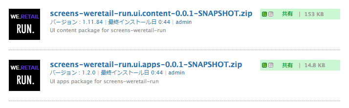
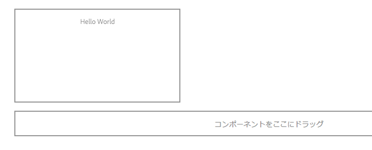

# AEM Screens as a Cloud Service 用カスタムコンポーネントの開発{#developing-a-custom-component-for-aem-screens}

以下のチュートリアルでは、AEM Screens 用のカスタムコンポーネントを作成する手順について説明します。AEM Screens では、他の AEM 製品の様々な既存のデザインパターンやテクノロジーを再利用しています。このチュートリアルでは、AEM Screens 用に開発する際の相違点と特別な考慮事項について重点的に説明します。

## 概要 {#overview}

このチュートリアルは、AEM Screens を初めて使用する開発者を対象としています。このチュートリアルでは、AEM Screens のシーケンスチャネル用に、シンプルな「Hello World」コンポーネントを構築します。作成者は、表示されるテキストをダイアログで更新できます。


## 前提条件 {#prerequisites}

このチュートリアルを完了するには、以下が必要になります。

1. 最新の Screens 機能パック

1. AEM Screens Player

1. ローカル開発環境

**CRXDE Lite** を使用して、チュートリアルの手順とスクリーンショットを実行します。IDE を使用してチュートリアルを完了することもできます。AEM での開発に IDE を使用する方法について詳しくは、[こちら](https://experienceleague.adobe.com/docs/experience-manager-learn/getting-started-wknd-tutorial-develop/project-archetype/project-setup.html?lang=ja)を参照してください。


## プロジェクトのセットアップ {#project-setup}

Screens プロジェクトのソースコードは、通常、マルチモジュールの Maven プロジェクトとして管理されます。このチュートリアルを効率よく進めるために、[AEM プロジェクトアーキタイプ 13](https://github.com/adobe/aem-project-archetype) を使用してプロジェクトを事前に生成してあります。Maven AEM プロジェクトアーキタイプを使用したプロジェクトの作成について詳しくは、[プロジェクトのセットアップ](https://experienceleague.adobe.com/docs/experience-manager-learn/getting-started-wknd-tutorial-develop/project-archetype/project-setup.html?lang=ja)を参照してください。

1. [CRX パッケージマネージャー](http://localhost:4502/crx/packmgr/index.jsp)を使用して、次のパッケージをダウンロードしてインストールします。

[ファイルの取得](/help/screens-cloud/developing/assets/base-screens-weretail-runuiapps-001-snapshot.zip)

   [ファイルを入手](/help/screens-cloud/developing/assets/base-screens-weretail-runuiapps-001-snapshot.zip)
   **（オプション）** Eclipse などの IDE を使用して作業する場合は、以下のソースパッケージをダウンロードします。次の Maven コマンドを使用して、プロジェクトをローカルの AEM インスタンスにデプロイします。

   **`mvn -PautoInstallPackage clean install`**

   Start HelloWorld SRC Screens We.Retail Run Project

[ファイルの取得](/help/screens-cloud/developing/assets/src-screens-weretail-run.zip)

1. [CRX パッケージマネージャー](http://localhost:4502/crx/packmgr/index.jsp)で、次の 2 つのパッケージがインストールされていることを確認します。

   1. **screens-weretail-run.ui.content-0.0.1-SNAPSHOT.zip**
   1. **screens-weretail-run.ui.apps-0.0.1-SNAPSHOT.zip**

   

   CRX パッケージマネージャーを使用してインストールされた Screens We.Retail Run Ui.Content および Ui.Apps パッケージ

1. **screens-weretail-run.ui.apps** パッケージでは、`/apps/weretail-run` の下にコードがインストールされます。

   このパッケージには、プロジェクトのカスタムコンポーネントをレンダリングするコードが含まれています。このパッケージには、コンポーネントコードのほか、必要な JavaScript または CSS が含まれています。このパッケージには、**screens-weretail-run.core-0.0.1-SNAPSHOT.jar** も埋め込まれており、この中に、プロジェクトで必要な Java™ コードが含まれています。

   >[!NOTE]
   >
   >このチュートリアルでは、Java™ コードは記述されません。より複雑なビジネスロジックが必要な場合は、コア Java バンドルを使用してバックエンド Java™ コードを作成しデプロイできます。

   

   CRXDE Lite での ui.apps コードの表現

   **`helloworld`** コンポーネントは、プレースホルダーにすぎません。チュートリアルの過程で機能が追加されて、コンポーネントに表示されるメッセージを作成者が更新できるようになります。

1. **screens-weretail-run.ui.content** パッケージでは、以下のパスにコードがインストールされます。

   * `/conf/we-retail-run`
   * `/content/dam/we-retail-run`
   * `/content/screens/we-retail-run`

   このパッケージには、プロジェクトに必要な初期コンテンツおよび設定構造が含まれています。**`/conf/we-retail-run`** には、We.Retail Run プロジェクトのすべての設定が含まれています。**`/content/dam/we-retail-run`** には、プロジェクトの初期デジタルアセットが含まれています。**`/content/screens/we-retail-run`** には、Screens のコンテンツ構造が含まれています。これらのパスの下に含まれるコンテンツは、主に AEM で更新されます。環境（ローカル、開発、ステージング、実稼動）間の一貫性を高めるために、多くの場合、ベースコンテンツ構造がソース管理下に保存されます。

1. **AEM Screens／We.Retail Run プロジェクト**&#x200B;に移動します。

   AEM グローバルナビゲーションで Screens アイコンをクリックします。We.Retail Run プロジェクトが表示されることを確認します。

   

## Hello World コンポーネントの作成 {#hello-world-cmp}

Hello World コンポーネントは、スクリーンに表示されるメッセージをユーザーが入力できるシンプルなコンポーネントです。このコンポーネントは、[AEM Screens コンポーネントテンプレート：https://github.com/Adobe-Marketing-Cloud/aem-screens-component-template](https://github.com/Adobe-Marketing-Cloud/aem-screens-component-template) をベースにしています。

AEM Screens には、従来の WCM Sites コンポーネントには必ずしも当てはまらない興味深い制約がいくつかあります。

* ほとんどの Screens コンポーネントは、ターゲットのデジタルサイネージデバイス上でフルスクリーンで動作する必要があります
* ほとんどの Screens コンポーネントは、シーケンスチャネルに埋め込んでスライドショーを生成する必要があります。
* オーサリングでは、シーケンスチャンネル内の個々のコンポーネントを編集できるようにする必要があるため、フルスクリーンでレンダリングすることは問題外です

1. **CRXDE-Lite** `http://localhost:4502/crx/de/index.jsp`（または任意の IDE）で、`/apps/weretail-run/components/content/helloworld.` に移動します

   `helloworld` コンポーネントに次のプロパティを追加します。

   ```
       jcr:title="Hello World"
       sling:resourceSuperType="foundation/components/parbase"
       componentGroup="We.Retail Run - Content"
   ```

   

   /apps/weretail-run/components/content/helloworld のプロパティ

   **`helloworld`** コンポーネントは **foundation/components/parbase** コンポーネントを拡張したものなので、シーケンスチャネル内で適切に使用できます。

1. `/apps/weretail-run/components/content/helloworld` の下に `helloworld.html.` という名前のファイルを作成します。

   ファイルに以下のように入力します。

   ```xml
   <!--/*
   
    /apps/weretail-run/components/content/helloworld/helloworld.html
   
   */-->
   
   <!--/* production: preview authoring mode + unspecified mode (that is, on publish) */-->
   <sly data-sly-test.production="${wcmmode.preview || wcmmode.disabled}" data-sly-include="production.html" />
   
   <!--/* edit: any other authoring mode, that is, edit, design, scaffolding, and so on. */-->
   <sly data-sly-test="${!production}" data-sly-include="edit.html" />
   ```

   Screens コンポーネントでは、使用する[オーサリングモード](https://experienceleague.adobe.com/docs/experience-manager-64/authoring/authoring/author-environment-tools.html?lang=ja#page-modes)に応じて、2 種類のレンダリングが必要になります。

   1. **実稼動**：プレビューまたはパブリッシュモード（wcmmode=disabled）
   1. **編集**：編集、デザイン、基礎モード、開発者など、他のすべてのオーサリングモードに使用されます。

   `helloworld.html` はスイッチとして機能し、アクティブなオーサリングモードを確認し、別の HTL スクリプトにリダイレクトします。編集モード用に `edit.html` スクリプトを用意し、実稼動モード用に `production.html` スクリプトを用意するというのが、Screens コンポーネントで一般に使用される規則です。

1. `/apps/weretail-run/components/content/helloworld` の下に `production.html.` という名前のファイルを作成します。

   ファイルに以下のように入力します。

   ```xml
   <!--/*
    /apps/weretail-run/components/content/helloworld/production.html
   
   */-->
   
   <div data-duration="${properties.duration}" class="cmp-hello-world">
    <h1 class="cmp-hello-world__message">${properties.message}</h1>
   </div>
   ```

   上記の実稼動用マークアップは、Hello World コンポーネント用です。このコンポーネントはシーケンスチャネルで使用されるので、`data-duration` 属性が含まれています。`data-duration` 属性は、シーケンスチャネルでシーケンス項目の表示時間を把握するために使用されます。

   このコンポーネントでは、`div` タグと `h1` タグ（テキストを含む）をレンダリングします。`${properties.message}` は HTL スクリプトの一部で、`message` という名前の JCR プロパティのコンテンツを出力します。`message` プロパティテキストの値をユーザーが入力できるダイアログを後で作成します。

   また、コンポーネントでは BEM（ブロック要素修飾子）表記が使用されることにも注意してください。BEM は、再利用可能なコンポーネントを容易に作成できる CSS コーディング規則です。BEM は、[AEM のコアコンポーネント](https://github.com/adobe/aem-core-wcm-components/wiki/CSS-coding-conventions)で使用される表記です。<!-- WEBSITE WAS NOT ACCESSIBLE AS OF SEPTEMBER 1, 2022 More info can be found at: [https://getbem.com/](https://getbem.com/) -->

1. `/apps/weretail-run/components/content/helloworld` の下に `edit.html.` という名前のファイルを作成します。

   ファイルに以下のように入力します。

   ```xml
   <!--/*
   
    /apps/weretail-run/components/content/helloworld/edit.html
   
   */-->
   
   <!--/* if message populated */-->
   <div
    data-sly-test.message="${properties.message}"
    class="aem-Screens-editWrapper cmp-hello-world">
    <p class="cmp-hello-world__message">${message}</p>
   </div>
   
   <!--/* empty place holder */-->
   <div data-sly-test="${!message}"
        class="aem-Screens-editWrapper cq-placeholder cmp-hello-world"
        data-emptytext="${'Hello World' @ i18n, locale=request.locale}">
   </div>
   ```

   上記の編集用マークアップは、Hello World コンポーネント用です。ダイアログメッセージが既に入力されている場合、最初のブロックにはコンポーネントの編集バージョンが表示されます。

   ダイアログメッセージがまだ入力されていない場合は、2 番目のブロックがレンダリングされます。その場合、`cq-placeholder` と `data-emptytext` は、「***Hello World***」というラベルをプレースホルダーとしてレンダリングします。複数のロケールでのオーサリングをサポートするために、ラベルの文字列を i18n を使用して国際化することができます。

1. **Hello World コンポーネントに使用する Screens 画像ダイアログをコピーします。**

   既存のダイアログを出発点にして、それに変更を加えるのが最も簡単です。

   1. ダイアログのコピー元：`/libs/screens/core/components/content/image/cq:dialog`
   1. ダイアログの貼り付け先のパス：`/apps/weretail-run/components/content/helloworld`

   

1. **メッセージのタブが含まれるように Hello World ダイアログを更新します。**

   次の条件に合致するようにダイアログボックスを更新します。最終的なダイアログボックスの JCR ノード構造は、次のような XML コードになります。

   ```xml
   <?xml version="1.0" encoding="UTF-8"?>
   <jcr:root xmlns:sling="https://sling.apache.org/jcr/sling/1.0" xmlns:cq="https://www.day.com/jcr/cq/1.0" xmlns:jcr="https://www.jcp.org/jcr/1.0" xmlns:nt="https://www.jcp.org/jcr/nt/1.0"
       jcr:primaryType="nt:unstructured"
       jcr:title="Hello World"
       sling:resourceType="cq/gui/components/authoring/dialog">
       <content
           jcr:primaryType="nt:unstructured"
           sling:resourceType="granite/ui/components/coral/foundation/tabs"
           size="L">
           <items jcr:primaryType="nt:unstructured">
               <message
                   jcr:primaryType="nt:unstructured"
                   jcr:title="Message"
                   sling:resourceType="granite/ui/components/coral/foundation/fixedcolumns">
                   <items jcr:primaryType="nt:unstructured">
                       <column
                           jcr:primaryType="nt:unstructured"
                           sling:resourceType="granite/ui/components/coral/foundation/container">
                           <items jcr:primaryType="nt:unstructured">
                               <message
                                   jcr:primaryType="nt:unstructured"
                                   sling:resourceType="granite/ui/components/coral/foundation/form/textfield"
                                   fieldDescription="Message for component to display"
                                   fieldLabel="Message"
                                   name="./message"/>
                           </items>
                       </column>
                   </items>
               </message>
               <sequence
                   jcr:primaryType="nt:unstructured"
                   jcr:title="Sequence"
                   sling:resourceType="granite/ui/components/coral/foundation/fixedcolumns">
                   <items jcr:primaryType="nt:unstructured">
                       <column
                           jcr:primaryType="nt:unstructured"
                           sling:resourceType="granite/ui/components/coral/foundation/container">
                           <items jcr:primaryType="nt:unstructured">
                               <duration
                                   jcr:primaryType="nt:unstructured"
                                   sling:resourceType="granite/ui/components/coral/foundation/form/numberfield"
                                   defaultValue=""
                                   fieldDescription="Amount of time the image is shown in the sequence, in milliseconds"
                                   fieldLabel="Duration (ms)"
                                   min="0"
                                   name="./duration"/>
                           </items>
                       </column>
                   </items>
               </sequence>
           </items>
       </content>
   </jcr:root>
   ```

   メッセージの `textfield` は `message` というプロパティに保存され、期間の `numberfield` は `duration` というプロパティに保存されます。`/apps/weretail-run/components/content/helloworld/production.html` では、これら 2 つのプロパティは `${properties.message}` および `${properties.duration}` として HTL で参照されます。

   

   Hello World - 完成したダイアログボックス

## クライアント側ライブラリの作成 {#clientlibs}

クライアントサイドライブラリは、AEM の実装で必要な CSS および JavaScript ファイルの編成および管理のための仕組みを提供します。

AEM Screens コンポーネントは、編集モードとプレビュー／実稼動モードではレンダリングが異なります。2 つのクライアントライブラリが作成されます。1 つは編集モード用、もう 1 つはプレビュー／実稼動用です。

1. Hello World コンポーネントのクライアントサイドライブラリ用のフォルダーを作成します。

   `/apps/weretail-run/components/content/helloworld` の下に、`clientlibs` という名前のフォルダーを作成します。

   

1. `clientlibs` フォルダーの下に、タイプ `cq:ClientLibraryFolder.` の `shared` という名前のノードを作成します。

   

1. 共有クライアントライブラリに次のプロパティを追加します。

   * `allowProxy` | Boolean | `true`

   * `categories`| String[] | `cq.screens.components`

   

   /apps/weretail-run/components/content/helloworld/clientlibs/shared のプロパティ

   categories プロパティは、クライアントライブラリを識別する文字列です。cq.screens.componentscategory は、編集モードとプレビュー／実稼動モードの両方で使用されます。したがって、sharedclientlib に定義された CSS／JS は、すべてのモードに読み込まれます。

   実稼動環境では、直接 /apps にパスを公開しないことをお勧めします。allowProxy プロパティにより、クライアントライブラリの CSS と JS が of/etc.clientlibs. の接頭辞を付けて参照されるようになります。

1. 共有フォルダーの下に `css.txt` という名前のファイルを作成します。

   ファイルに以下のように入力します。

   ```
   #base=css
   
   styles.less
   ```

1. `shared` フォルダーの下に `css` という名前のフォルダーを作成します。`css` フォルダーの下に、`style.less` という名前のファイルを追加します。クライアントライブラリの構造は次のようになります。

   

   このチュートリアルでは、CSS を直接記述するのではなく、LESS を使用します。[LESS](https://lesscss.org/) は、CSS 変数、ミックスイン、関数をサポートしている一般的な CSS プリコンパイラーです。AEM のクライアントライブラリは、LESS によるコンパイルをネイティブにサポートしています。Sass などのプリコンパイラーも使用できますが、AEM の外部でコンパイルする必要があります。

1. `/apps/weretail-run/components/content/helloworld/clientlibs/shared/css/styles.less` に以下を入力します。

   ```css
   /**
       Shared Styles
      /apps/weretail-run/components/content/helloworld/clientlibs/shared/css/styles.less
   
   **/
   
   .cmp-hello-world {
       background-color: #fff;
   
    &__message {
     color: #000;
     font-family: Helvetica;
     text-align:center;
    }
   }
   ```

1. クライアントライブラリフォルダー `shared` をコピーして貼り付けて、`production` という名前のクライアントライブラリを作成します。

   

   共有クライアントライブラリをコピーして実稼動用のクライアントライブラリを作成します。

1. 実稼動用クライアントライブラリの `categories` プロパティを `cq.screens.components.production.` に更新します。

   これにより、プレビュー／実稼動モードの場合のみ、スタイルが読み込まれるようになります。

   

   /apps/weretail-run/components/content/helloworld/clientlibs/production のプロパティ

1. `/apps/weretail-run/components/content/helloworld/clientlibs/production/css/styles.less` に以下を入力します。

   ```css
   /**
       Production Styles
      /apps/weretail-run/components/content/helloworld/clientlibs/production/css/styles.less
   
   **/
   .cmp-hello-world {
   
       height: 100%;
       width: 100%;
       position: fixed;
   
    &__message {
   
     position: relative;
     font-size: 5rem;
     top:25%;
    }
   }
   ```

   上記のスタイルでは、実稼動モードの場合のみ、スクリーンの中央にメッセージが表示されます。

3 番目のクライアントライブラリカテゴリ `cq.screens.components.edit` は、コンポーネントに編集専用のスタイルを追加する場合に使用できます。

| クライアントライブラリカテゴリ | 使用方法 |
|---|---|
| `cq.screens.components` | スタイルとスクリプトが編集モードと実稼動モードの両方で共有される |
| `cq.screens.components.edit` | スタイルとスクリプトが編集モードでのみ使用される |
| `cq.screens.components.production` | スタイルとスクリプトが実稼動モードでのみ使用される |

## デザインページの作成 {#design-page}

AEM Screens では、[静的ページテンプレート](https://experienceleague.adobe.com/docs/experience-manager-65/developing/platform/templates/page-templates-static.html?lang=ja)と[デザイン設定](https://experienceleague.adobe.com/docs/experience-manager-64/authoring/siteandpage/default-components-designmode.html?lang=ja)を使用して、グローバルな変更に対応します。デザイン設定は、チャネル上で使用できる ParSys コンポーネントを設定する場合によく使用されます。これらの設定をアプリに固有の方法で保存することをお勧めします。

以下に、We.Retail Run プロジェクトに固有のすべての設定を保存する We.Retail Run デザインページを作成します。

1. **CRXDE Lite** `http://localhost:4502/crx/de/index.jsp#/apps/settings/wcm/designs` で、`/apps/settings/wcm/designs` に移動します
1. designs フォルダーの下に `cq:Page` 型の `we-retail-run` という名前のノードを作成します。
1. `we-retail-run` ページの下に、`nt:unstructured` 型の `jcr:content` という名前の別のノードを追加します。この `jcr:content` ノードに次のプロパティを追加します。

   | 名前 | タイプ | 値 |
   |---|---|---|
   | jcr:title | 文字列 | We.Retail Run |
   | sling:resourceType | 文字列 | wcm/core/components/designer |
   | cq:doctype | 文字列 | html_5 |

   

   /apps/settings/wcm/designs/we-retail-run のデザインページ

## シーケンスチャネルの作成 {#create-sequence-channel}

Hello World コンポーネントは、シーケンスチャネルでの使用を目的としています。このコンポーネントをテストするために、新しいシーケンスチャネルを作成します。

1. AEM グローバルナビゲーションで、**Screens**／**We.Retail Run** に移動し、「**チャネル**」を選択します。

1. 「**作成**」ボタンをクリックします。

   1. 「**エンティティを作成**」を選択します。

   

1. 作成ウィザードで、以下の操作をおこないます。

1. テンプレートの手順 - 「**シーケンスチャネル**」を選択します

   1. プロパティの手順

   * 「基本」タブ／「タイトル」に「**Idle Channel**」を入力
   * 「チャネル」タブ／「**チャンネルをオンラインにする**」をオン

   

1. Idle Channel のページプロパティを開きます。前の節で作成したデザインページ `/apps/settings/wcm/designs/we-retail-run,` を指すように、「デザイン」フィールドを更新します。

   

   /apps/settings/wcm/designs/we-retail-run を指しているデザイン設定

1. 作成したアイドルチャネルを編集して開けるようにします。

1. ページモードを&#x200B;**デザイン**&#x200B;モードに切り替えます。

   1. Parsys の&#x200B;**レンチ**&#x200B;アイコンをクリックすると、使用可能なコンポーネントを設定できます。

   1. 「**Screens**」グループと「**We.Retail Run - Content**」グループを選択します。

   

1. ページモードを&#x200B;**編集**&#x200B;に切り替えます。これで、Hello World コンポーネントをページに追加し、他のシーケンスチャネルコンポーネントと組み合わせることができるようになりました。

   

1. **CRXDE Lite** `http://localhost:4502/crx/de/index.jsp#/apps/settings/wcm/designs/we-retail-run/jcr%3Acontent/sequencechannel/par` で、`/apps/settings/wcm/designs/we-retail-run/jcr:content/sequencechannel/par` に移動します。`components` プロパティに `group:Screens`、`group:We.Retail Run - Content` が含まれていることがわかります。

   

   /apps/settings/wcm/designs/we-retail-run の下のデザイン設定

## カスタムハンドラーのテンプレート {#custom-handlers}

カスタムコンポーネントでアセット（画像、ビデオ、フォント、アイコン）、特定のアセットレンディション、クライアントサイドのライブラリ（css と js）などの外部リソースを使用している場合、これらのリソースはオフライン設定に自動的に追加されません。これは、アドビがデフォルトで HTML マークアップのみをバンドルするからです。

プレーヤーにダウンロードされる正確なアセットをカスタマイズして最適化するには、カスタムコンポーネントの拡張メカニズムを使用して、Screens のオフラインキャッシュロジックに依存関係を公開します。

次の節では、カスタムオフラインリソースハンドラーのテンプレートと、そのプロジェクトに対する `pom.xml` の最小要件について説明します。

```java
package …;

import javax.annotation.Nonnull;

import org.apache.felix.scr.annotations.Component;
import org.apache.felix.scr.annotations.Reference;
import org.apache.felix.scr.annotations.Service;
import org.apache.sling.api.resource.Resource;
import org.apache.sling.api.resource.ResourceUtil;
import org.apache.sling.api.resource.ValueMap;

import com.adobe.cq.screens.visitor.OfflineResourceHandler;

@Service(value = OfflineResourceHandler.class)
@Component(immediate = true)
public class MyCustomHandler extends AbstractResourceHandler {

 @Reference
 private …; // OSGi services injection

 /**
  * The resource types that are handled by the handler.
  * @return the handled resource types
  */
 @Nonnull
 @Override
 public String[] getSupportedResourceTypes() {
     return new String[] { … };
 }

 /**
  * Accept the provided resource, visit and traverse it as needed.
  * @param resource The resource to accept
  */
 @Override
 public void accept(@Nonnull Resource resource) {
     ValueMap properties = ResourceUtil.getValueMap(resource);
     
     /* You can directly add explicit paths for offline caching using the `visit`
        method of the visitor. */
     
     // retrieve a custom property from the component
     String myCustomRenditionUrl = properties.get("myCustomRenditionUrl", String.class);
     // adding that exact asset/rendition/path to the offline manifest
     this.visitor.visit(myCustomRenditionUrl);
     
     
     /* You can delegate handling for dependent resources so they are also added to
        the offline cache using the `accept` method of the visitor. */
     
     // retrieve a referenced dependent resource
     String referencedResourcePath = properties.get("myOtherResource", String.class);
     ResourceResolver resolver = resource.getResourceResolver();
     Resource referencedResource = resolver.getResource(referencedResourcePath);
     // let the handler for that resource handle it
     if (referencedResource != null) {
         this.visitor.accept(referencedResource);
     }
   }
}
```

次のコードは、そのプロジェクトに対する `pom.xml` の最小要件を示しています。

```css
   <dependencies>
        …
        <!-- Felix annotations -->
        <dependency>
            <groupId>org.apache.felix</groupId>
            <artifactId>org.apache.felix.scr.annotations</artifactId>
            <version>1.9.0</version>
            <scope>provided</scope>
        </dependency>

        <!-- Screens core bundle with OfflineResourceHandler/AbstractResourceHandler -->
        <dependency>
            <groupId>com.adobe.cq.screens</groupId>
            <artifactId>com.adobe.cq.screens</artifactId>
            <version>1.5.90</version>
            <scope>provided</scope>
        </dependency>
        …
      </dependencies>
```

## まとめ {#putting-it-all-together}

以下のビデオでは、完成したコンポーネントと、それをシーケンスチャネルに追加する方法を示しています。この後、チャネルはロケーションのディスプレイに追加され、最終的に Screens プレーヤーに割り当てられます。

>[!VIDEO](https://video.tv.adobe.com/v/22385?quaity=9)

## 完成したコード {#finished-code}

チュートリアルで完成したコードは以下のとおりです。**screens-weretail-run.ui.apps-0.0.1-SNAPSHOT.zip** と **screens-weretail-run.ui.content-0.0.1-SNAPSHOT.zip** は、コンパイル済みの AEM パッケージです。SRC-screens-wertail-run-0.0.1.zip は、Maven を使用してデプロイできる未コンパイルのソースコードです。

[ファイルの取得](/help/screens-cloud/developing/assets/screens-weretail-runuiapps-001-snapshot.zip)

[ファイルの取得](/help/screens-cloud/developing/assets/screens-weretail-runuicontent-001-snapshot.zip)

[ファイルの取得](/help/screens-cloud/developing/assets/screens-weretail-run.zip)
