# AEM as a Cloud Service の高度なネットワーク機能の設定 {#configuring-advanced-networking}

この記事では、AEM as a Cloud Service の様々な高度なネットワーク機能（VPN のセルフサービスおよび API プロビジョニング、非標準ポート、専用エグレス IP アドレスなど）を紹介します。

>[!TIP]
>
>このドキュメントに加えて、この [ 場所 ](https://experienceleague.adobe.com/ja/docs/experience-manager-learn/cloud-service/networking/advanced-networking) で高度なネットワークオプションのそれぞれを説明するように設計された一連のチュートリアルもあります。

## 概要 {#overview}

AEM as a Cloud Service では、次の高度なネットワークオプションを提供します。

* [フレキシブルポートエグレス](#flexible-port-egress) - AEM as a Cloud Service を設定して、非標準ポートからの送信トラフィックを許可します。
* [専用エグレス IP アドレス](#dedicated-egress-ip-address) - 一意の IP アドレスから送信されるように AEM as a Cloud Service からのトラフィックを設定します。
* [仮想プライベートネットワーク（VPN）](#vpn) - VPN を使用している場合は、インフラストラクチャと AEM as a Cloud Service の間のトラフィックを保護します。

この記事では、これらの各オプションを詳しく説明し、使用する理由を説明してから、Cloud Manager UI および API を使用してオプションを設定する方法を説明します。この記事では、最後にいくつかの高度なユースケースを紹介します。

>[!CAUTION]
>
>従来の専用エグレステクノロジーを既にプロビジョニングしていて、これらの高度なネットワークオプションのいずれかを設定する場合は、[アドビクライアントケアにお問い合わせください](https://experienceleague.adobe.com/ja?support-solution=Experience+Manager#home)。
>
>従来のエグレステクノロジーを使用して高度なネットワークを設定しようとすると、サイトの接続に影響を与える場合があります。

### 要件と制限事項 {#requirements}

高度なネットワーク機能を設定する場合、次の制限が適用されます。

* プログラムは、単一の高度なネットワークオプション（柔軟なポートエグレス、専用エグレス IP アドレスまたは VPN）をプロビジョニングできます。
* 高度なネットワークは、[ サンドボックスプログラム ](/help/implementing/cloud-manager/getting-access-to-aem-in-cloud/program-types.md) では使用できません。
* プログラムにネットワークインフラストラクチャを追加して設定するには、ユーザーが&#x200B;**管理者**&#x200B;の役割を持っている必要があります。
* プログラムにネットワークインフラストラクチャを追加する前に、実稼動環境を作成する必要があります。
* ネットワークインフラストラクチャは、実稼動環境のプライマリ地域と同じ地域に存在する必要があります。
   * 実稼動環境に[追加の公開地域](/help/implementing/cloud-manager/manage-environments.md#multiple-regions)がある場合は、追加の各地域をミラーリングする別のネットワークインフラストラクチャを作成できます。
   * 作成できるネットワークインフラストラクチャの数は、実稼動環境で設定された最大地域数を超えることはできません。
   * 実稼動環境で使用可能な地域と同じ数のネットワークインフラストラクチャを定義できますが、新しいインフラストラクチャは以前に作成したインフラストラクチャと同じタイプにする必要があります。
   * 複数のインフラストラクチャを作成する場合は、高度なネットワークインフラストラクチャが作成されていない地域のみから選択できます。

### 高度なネットワーク機能の設定と有効化 {#configuring-enabling}

高度なネットワーク機能を使用するには、次の 2 つの手順が必要です。

1. 高度なネットワークオプションの設定（[ フレキシブルポートエグレス ](#flexible-port-egress)、[ 専用エグレス IP アドレス ](#dedicated-egress-ip-address)、または [VPN](#vpn) に関わらず、まずプログラムレベルで設定を行う必要があります。
1. 使用するには、高度なネットワークオプションを [ 環境レベルで有効にする ](#enabling) 必要があります。

どちらの手順も、Cloud Manager UI または Cloud Manager API を使用して実行できます。

* Cloud Manager UI を使用する場合、つまり、プログラムレベルでウィザードを使用して高度なネットワーク設定を作成し、その設定を有効にする各環境を編集することです。

* Cloud Manager API を使用する場合、`/networkInfrastructures` API エンドポイントがプログラムレベルで呼び出され、目的のタイプの高度なネットワーク機能を宣言します。その後、各環境の `/advancedNetworking` エンドポイントへの呼び出しが行われ、インフラストラクチャを有効にして環境固有のパラメーターを設定します。

## フレキシブルポートエグレス {#flexible-port-egress}

高度なネットワーク機能を使用すると、デフォルトで開いている HTTP（ポート 80）と HTTPS（ポート 443）以外のポートからトラフィックを送信するように、AEM as a Cloud Service を設定することができます。

>[!TIP]
>
>フレキシブルポートエグレス IP アドレスと専用エグレス IP アドレスのいずれかを決定する際には、特定の IP アドレスが必要なければ、フレキシブルポートエグレスを選択することをお勧めします。これは、アドビ側でフレキシブルポートエグレストラフィックのパフォーマンスを最適化できるからです。

>[!NOTE]
>
>フレキシブルポートエグレスのインフラストラクチャタイプは、作成後に編集することはできません。設定値を変更する唯一の方法は、設定値を削除して再作成することです。

### UI 設定 {#configuring-flexible-port-egress-provision-ui}

1. [my.cloudmanager.adobe.com](https://my.cloudmanager.adobe.com/) で Cloud Manager にログインし、適切な組織を選択します。

1. **[マイプログラム](/help/implementing/cloud-manager/navigation.md#my-programs)**&#x200B;コンソールで、プログラムを選択します。

1. **プログラム概要**&#x200B;ページから、「**環境**」タブに移動し、左側のパネルの「**ネットワークインフラストラクチャ**」を選択します。

   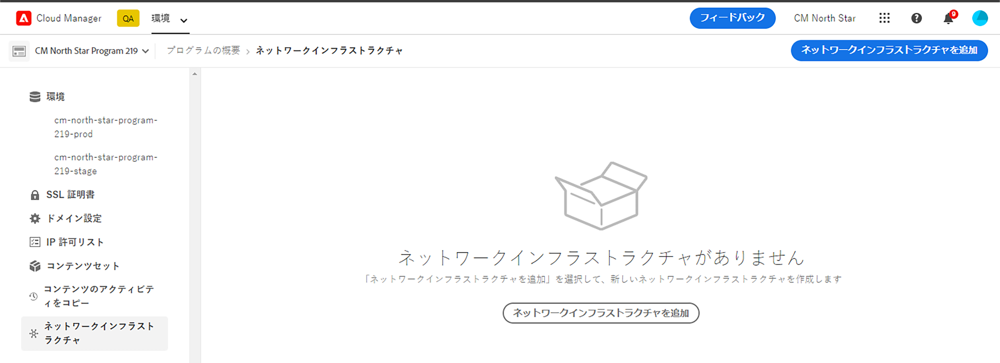

1. **ネットワークインフラストラクチャを追加**&#x200B;ウィザードで、「**フレキシブルポートエグレス**」と、それを作成する地域を&#x200B;**地域**&#x200B;ドロップダウンメニューから選択し、「**続行**」をクリックします。

   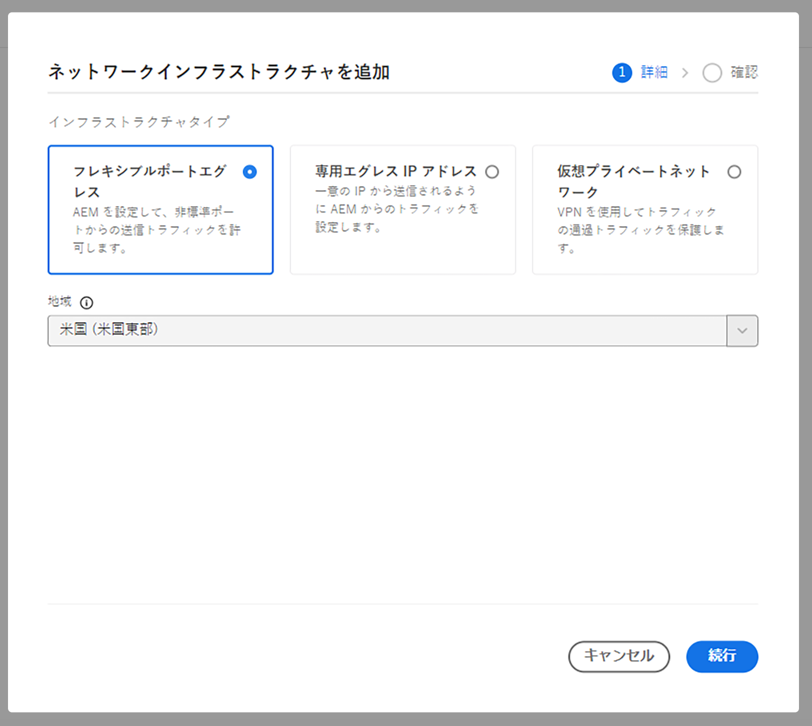

1. 「**確認**」タブには、選択内容と次の手順がまとめられています。「**保存**」をクリックして、インフラストラクチャを作成します。

   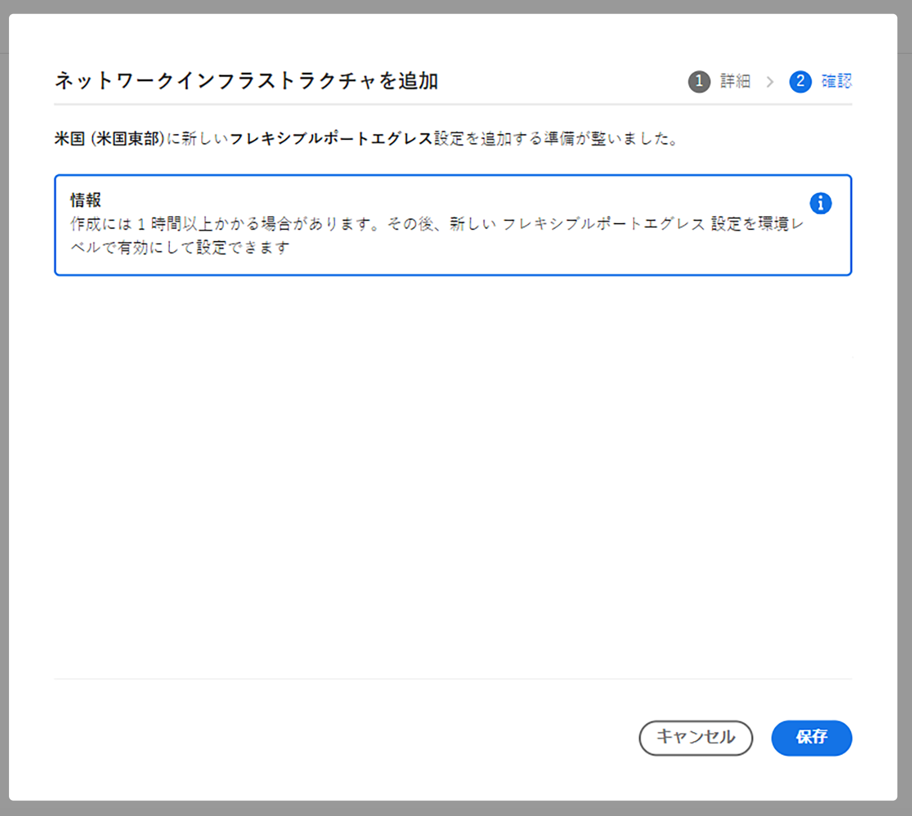

サイドパネルの&#x200B;**ネットワークインフラストラクチャ**&#x200B;見出しの下に、インフラストラクチャの種類、ステータス、地域、有効になっている環境の詳細を含む新しいレコードが表示されます。

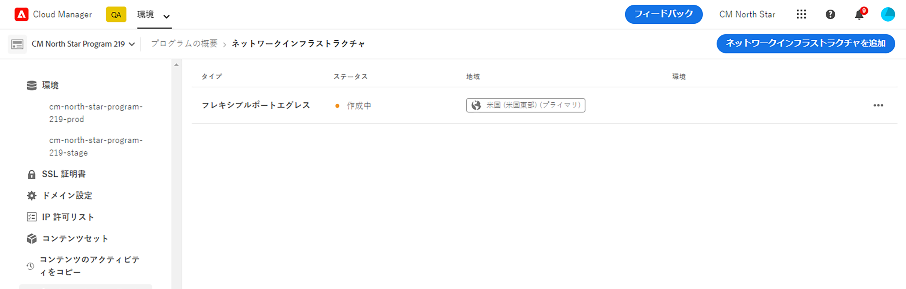

>[!NOTE]
>
>フレキシブルポートエグレス用のインフラストラクチャの作成には最大 1 時間かかる場合があり、その後、環境レベルで設定できるようになります。

### API 設定 {#configuring-flexible-port-egress-provision-api}

プログラムごとに 1 回、POST `/program/<programId>/networkInfrastructures` エンドポイントが呼び出され、`kind` パラメーターの `flexiblePortEgress` の値と地域が渡されます。エンドポイントは、応答として `network_id` の他に、ステータスなどの他の情報も返します。

呼び出しの後、ネットワークインフラストラクチャがプロビジョニングされるまで、通常は 15 分ほどかかります。Cloud Manager の[ネットワークインフラストラクチャ GET エンドポイント](https://developer.adobe.com/experience-cloud/cloud-manager/reference/api/#operation/getNetworkInfrastructure)の呼び出しで「**準備完了**」のステータスが表示されます。

>[!TIP]
>
>パラメーターの完全なセット、正確な構文、および後で変更できないパラメーターなどの重要な情報は、[API ドキュメントで参照できます ](https://developer.adobe.com/experience-cloud/cloud-manager/reference/api/#operation/createNetworkInfrastructure)。

### トラフィックルーティング {#flexible-port-egress-traffic-routing}

80 または 443 以外のポートに送信される http または https トラフィックの場合、次のホストおよびポート環境変数を使用してプロキシを設定する必要があります。

* HTTP の場合： `AEM_PROXY_HOST`／`AEM_HTTP_PROXY_PORT `（AEM リリース 6094 未満では、デフォルトは `proxy.tunnel:3128`）
* HTTPS の場合： `AEM_PROXY_HOST`／`AEM_HTTPS_PROXY_PORT `（AEM リリース 6094 未満では、デフォルトは `proxy.tunnel:3128`）

`www.example.com:8443` にリクエストを送信するサンプルコードを以下に示します。

```java
String url = "www.example.com:8443"
String proxyHost = System.getenv().getOrDefault("AEM_PROXY_HOST", "proxy.tunnel");
int proxyPort = Integer.parseInt(System.getenv().getOrDefault("AEM_HTTPS_PROXY_PORT", "3128"));
HttpClient client = HttpClient.newBuilder()
      .proxy(ProxySelector.of(new InetSocketAddress(proxyHost, proxyPort)))
      .build();
 
HttpRequest request = HttpRequest.newBuilder().uri(URI.create(url)).build();
HttpResponse<String> response = client.send(request, BodyHandlers.ofString());
```

非標準の Java™ ネットワークライブラリを使用する場合は、上記のプロパティを使用して、すべてのトラフィックに対してプロキシを設定します。

`portForwards` パラメーターで宣言したポートで宛先とやり取りする HTTP/HTTPS 以外のトラフィックは、マッピングされたポートと共に、`AEM_PROXY_HOST` というプロパティを参照する必要があります。次に例を示します。

```java
DriverManager.getConnection("jdbc:mysql://" + System.getenv("AEM_PROXY_HOST") + ":53306/test");
```

次の表にトラフィックルーティングを示します。

<table>
<thead>
  <tr>
    <th>トラフィック</th>
    <th>宛先の条件</th>
    <th>ポート</th>
    <th>接続</th>
    <th>外部宛先の例</th>
  </tr>
</thead>
<tbody>
  <tr>
    <td><b>HTTP または HTTPS プロトコル</b></td>
    <td>標準の HTTP または HTTPS トラフィック</td>
    <td>80 または 443</td>
    <td>許可</td>
    <td></td>
  </tr> 
  <tr>
    <td></td>
    <td>次の環境変数とプロキシポート番号を使用して設定された http プロキシを介した（80 または 443 以外の他のポートでの）非標準トラフィック。Cloud Manager API 呼び出しの portForwards パラメーターで宛先ポートを宣言しないでください。<br><ul>
     <li>AEM_PROXY_HOST（AEM リリース 6094 未満では、デフォルトは `proxy.tunnel`）</li>
     <li>AEM_HTTPS_PROXY_PORT（AEM リリース 6094 未満では、デフォルトはポート 3128）</li>
    </ul>
    <td>80 または 443 以外のポート</td>
    <td>許可</td>
    <td>example.com:8443</td>
  </tr>
  <tr>
    <td></td>
    <td>HTTP プロキシを使用しない（80 または 443 以外のポート上の）非標準トラフィック</td>
    <td>80 または 443 以外のポート</td>
    <td>ブロック</td>
    <td></td>
  </tr>
  <tr>
    <td><b>HTTP 以外または HTTPS 以外</b></td>
    <td>クライアントは、<code>portForwards</code> API パラメーターで宣言された <code>portOrig</code> を使用して、<code>AEM_PROXY_HOST</code> 環境変数のプロキシホストに接続</td>
    <td>任意</td>
    <td>許可</td>
    <td><code>mysql.example.com:3306</code></td>
  </tr>
  <tr>
    <td></td>
    <td>その他すべて</td>
    <td>任意</td>
    <td>ブロック</td>
    <td><code>db.example.com:5555</code></td>
  </tr>
</tbody>
</table>

#### Apache／Dispatcher 設定 {#apache-dispatcher}

AEM Cloud Service の Apache／Dispatcher 層の `mod_proxy` ディレクティブは、上記のプロパティを使用して設定できます。

```
ProxyRemote "http://example.com:8080" "http://${AEM_PROXY_HOST}:3128"
ProxyPass "/somepath" "http://example.com:8080"
ProxyPassReverse "/somepath" "http://example.com:8080"
```

```
SSLProxyEngine on //needed for https backends
 
ProxyRemote "https://example.com:8443" "http://${AEM_PROXY_HOST}:3128"
ProxyPass "/somepath" "https://example.com:8443"
ProxyPassReverse "/somepath" "https://example.com:8443"
```

## 出力専用 IP アドレス {#dedicated-egress-ip-address}

専用 IP アドレスは、SaaS ベンダー（CRM ベンダーなど）との統合や、IP アドレスの許可リストを提供する AEM as a Cloud Service 外部のソリューションと統合する場合のセキュリティを強化します。専用 IP アドレスを許可リストに追加することで、AEM Cloud Service からのトラフィックのみが外部サービスに送信されるようになります。これは、その他の許可されている IP からのトラフィックに追加されます。

同じ専用 IP がプログラム内のすべての環境に、オーサーサービスとパブリッシュサービスの両方に適用されます。

専用 IP アドレス機能が有効になっていない場合、AEM as a Cloud Service から出ていくトラフィックは、他の AEM as a Cloud Service の顧客と共有する一連の IP を使用します。

専用エグレス IP アドレスの設定は、[ フレキシブルポートエグレス ](#flexible-port-egress) と似ています。 主な違いは、設定後、トラフィックは常に専用の一意の IP アドレスから送信されることです。 その IP を確認するには、DNS リゾルバーを使用して、`p{PROGRAM_ID}.external.adobeaemcloud.com` に関連付けられている IP アドレスを特定します。この IP アドレスは固定ですが、変更する必要がある場合は、事前に通知されます。

>[!TIP]
>
>フレキシブルポートエグレス IP アドレスと専用エグレス IP アドレスのいずれかを決定する際には、特定の IP アドレスが必要なければ、フレキシブルポートエグレスを選択します。これは、アドビ側でフレキシブルポートエグレストラフィックのパフォーマンスを最適化できるからです。

>[!NOTE]
>
>2021年9月30日（PT）以前（つまり、2021年9月リリースより前）に専用エグレス IP がプロビジョニングされていた場合、専用エグレス IP 機能は HTTP ポートと HTTPS ポートのみをサポートします。
>
>これには、HTTP/1.1 と HTTP/2（暗号化時）が含まれます。また、1 つの専用の出力エンドポイントは、それぞれポート 80／443 の HTTP／HTTPS 経由でのみ任意のターゲットと通信できます。

>[!NOTE]
>
>専用のエングレス IP アドレスインフラストラクチャタイプは、作成後に編集することはできません。設定値を変更する唯一の方法は、設定値を削除して再作成することです。

### UI 設定 {#configuring-dedicated-egress-provision-ui}

1. [my.cloudmanager.adobe.com](https://my.cloudmanager.adobe.com/) で Cloud Manager にログインし、適切な組織を選択します。

1. **[マイプログラム](/help/implementing/cloud-manager/navigation.md#my-programs)**&#x200B;コンソールで、プログラムを選択します。

1. **プログラム概要**&#x200B;ページから、「**環境**」タブに移動し、左側のパネルの「**ネットワークインフラストラクチャ**」を選択します。

   

1. 開始される&#x200B;**ネットワークインフラストラクチャを追加**&#x200B;ウィザードで、「**専用のエグレス IP アドレス**」およびそれを作成する地域を&#x200B;**地域**&#x200B;ドロップダウンメニューから選択し、「**続行**」をクリックします。

   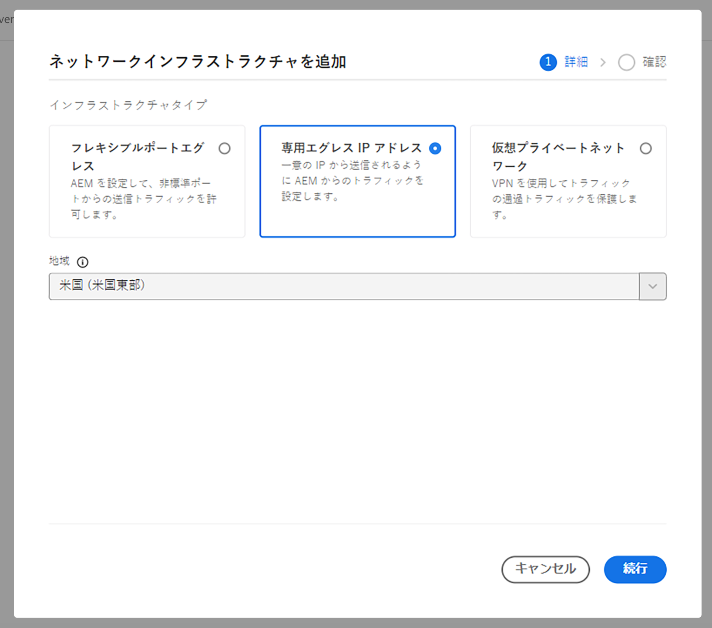

1. 「**確認**」タブには、選択内容と次の手順がまとめられています。「**保存**」をクリックして、インフラストラクチャを作成します。

   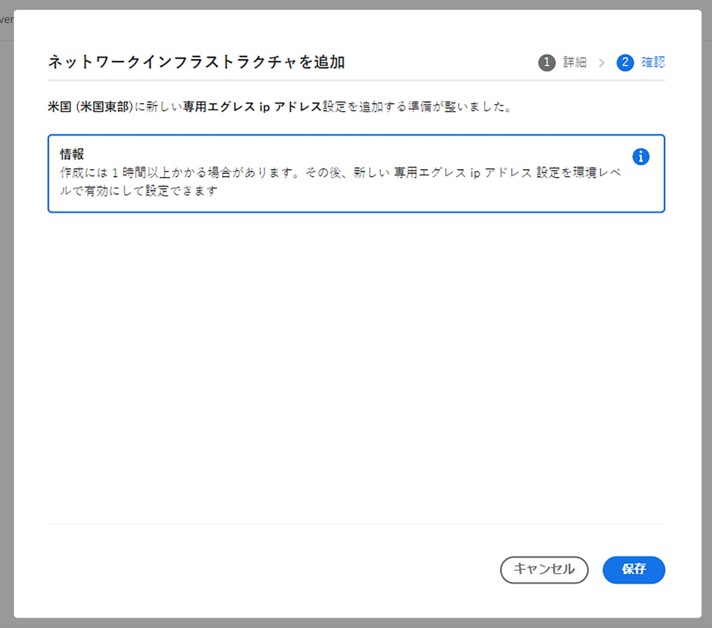

サイドパネルの&#x200B;**ネットワークインフラストラクチャ**&#x200B;見出しの下に、インフラストラクチャの種類、ステータス、地域、有効になっている環境の詳細を含む新しいレコードが表示されます。


>[!NOTE]
>
>フレキシブルポートエグレス用のインフラストラクチャの作成には最大 1 時間かかる場合があり、その後、環境レベルで設定できるようになります。

### API 設定 {#configuring-dedicated-egress-provision-api}

プログラムごとに 1 回、POST `/program/<programId>/networkInfrastructures` エンドポイントが呼び出され、`kind` パラメーターの `dedicatedEgressIp` の値と地域が渡されます。エンドポイントは、応答として `network_id` の他に、ステータスなどの他の情報も返します。

呼び出しの後、ネットワークインフラストラクチャがプロビジョニングされるまで、通常は 15 分ほどかかります。Cloud Manager の[ネットワークインフラストラクチャ GET エンドポイント](https://developer.adobe.com/experience-cloud/cloud-manager/reference/api/#operation/getNetworkInfrastructure)の呼び出しで「**準備完了**」のステータスが表示されます。

>[!TIP]
>
>パラメーターの完全なセット、正確な構文、および後で変更できないパラメーターなどの重要な情報は、[API ドキュメントで参照できます ](https://developer.adobe.com/experience-cloud/cloud-manager/reference/api/#operation/createNetworkInfrastructure)。

### トラフィックルーティング {#dedicated-egress-ip-traffic-routing}

プロキシ設定に標準の Java™ システムプロパティを使用する場合、http や https のトラフィックは事前に設定されたプロキシを経由します。

`portForwards` パラメーターで宣言したポートで宛先とやり取りする HTTP/HTTPS 以外のトラフィックは、マッピングされたポートと共に、`AEM_PROXY_HOST` というプロパティを参照する必要があります。次に例を示します。

```java
DriverManager.getConnection("jdbc:mysql://" + System.getenv("AEM_PROXY_HOST") + ":53306/test");
```

<table>
<thead>
  <tr>
    <th>トラフィック</th>
    <th>宛先の条件</th>
    <th>ポート</th>
    <th>接続</th>
    <th>外部宛先の例</th>
  </tr>
</thead>
<tbody>
  <tr>
    <td><b>HTTP または HTTPS プロトコル</b></td>
    <td>Azure（*.windows.net）またはアドビサービスへのトラフィック</td>
    <td>任意</td>
    <td>（専用 IP ではなく）共有クラスター IP を経由</td>
    <td>adobe.io<br>api.windows.net</td>
  </tr>
  <tr>
    <td></td>
    <td><code>nonProxyHosts</code> パラメーターに一致するホスト</td>
    <td>80 または 443</td>
    <td>共有クラスター IP を経由</td>
    <td></td>
  </tr>
  <tr>
    <td></td>
    <td><code>nonProxyHosts</code> パラメーターに一致するホスト</td>
    <td>80 または 443 以外のポート</td>
    <td>ブロック</td>
    <td></td>
  </tr>
  <tr>
    <td></td>
    <td>HTTP プロキシ設定を使用（標準の Java™ HTTP クライアントライブラリを使用する HTTP または HTTPS トラフィックにデフォルトで設定済み）</td>
    <td>任意</td>
    <td>専用エグレス IP を経由</td>
    <td></td>
  </tr>
  <tr>
    <td></td>
    <td>HTTP プロキシ設定を無視（例えば、標準の Java™ HTTP クライアントライブラリから明示的に削除された場合や、標準のプロキシ設定を無視する Java™ ライブラリが使用されている場合）</td>
    <td>80 または 443</td>
    <td>共有クラスター IP を経由</td>
    <td></td>
  </tr>
  <tr>
    <td></td>
    <td>HTTP プロキシ設定を無視（例えば、標準の Java™ HTTP クライアントライブラリから明示的に削除された場合や、標準のプロキシ設定を無視する Java™ ライブラリが使用されている場合）</td>
    <td>80 または 443 以外のポート</td>
    <td>ブロック</td>
    <td></td>
  </tr>
  <tr>
    <td><b>HTTP 以外または HTTPS 以外</b></td>
    <td>クライアントは、<code>portForwards</code> API パラメーターで宣言されている <code>portOrig</code> を使用して、<code>AEM_PROXY_HOST</code> 環境変数のプロキシホストに接続</td>
    <td>任意</td>
    <td>専用エグレス IP を経由</td>
    <td><code>mysql.example.com:3306</code></td>
  </tr>
  <tr>
    <td></td>
    <td>その他すべて</td>
    <td></td>
    <td>ブロック</td>
    <td></td>
  </tr>
</tbody>
</table>

### 機能の使用 {#feature-usage}

この機能は、プロキシ設定に標準の Java™ システムプロパティを使用する場合、送信トラフィックを発生させる Java™ コードまたはライブラリと互換性があります。実際には、これには最も一般的なライブラリが含まれる必要があります。

次にコード例を示します。

```java
public JSONObject getJsonObject(String relativePath, String queryString) throws IOException, JSONException {
  String relativeUri = queryString.isEmpty() ? relativePath : (relativePath + '?' + queryString);
  URL finalUrl = endpointUri.resolve(relativeUri).toURL();
  URLConnection connection = finalUrl.openConnection();
  connection.addRequestProperty("Accept", "application/json");
  connection.addRequestProperty("X-API-KEY", apiKey);

  try (InputStream responseStream = connection.getInputStream(); Reader responseReader = new BufferedReader(new InputStreamReader(responseStream, Charsets.UTF_8))) {
    return new JSONObject(new JSONTokener(responseReader));
  }
}
```

一部のライブラリでは、プロキシ設定に標準の Java™ システムプロパティを使用するために、明示的な設定が必要です。

Apache HttpClient を使用する例を以下に示します。ここでは、
[`HttpClientBuilder.useSystemProperties()`](https://hc.apache.org/httpcomponents-client-4.5.x/current/httpclient/apidocs/org/apache/http/impl/client/HttpClientBuilder.html) の明示的な呼び出しまたは 
[`HttpClients.createSystem()`](https://hc.apache.org/httpcomponents-client-4.5.x/current/httpclient/apidocs/org/apache/http/impl/client/HttpClients.html#createSystem()) の使用が必要です。

```java
public JSONObject getJsonObject(String relativePath, String queryString) throws IOException, JSONException {
  String relativeUri = queryString.isEmpty() ? relativePath : (relativePath + '?' + queryString);
  URL finalUrl = endpointUri.resolve(relativeUri).toURL();

  HttpClient httpClient = HttpClientBuilder.create().useSystemProperties().build();
  HttpGet request = new HttpGet(finalUrl.toURI());
  request.setHeader("Accept", "application/json");
  request.setHeader("X-API-KEY", apiKey);
  HttpResponse response = httpClient.execute(request);
  String result = EntityUtils.toString(response.getEntity());
}
```

### デバッグの考慮事項 {#debugging-considerations}

期待される専用 IP アドレスでトラフィックが実際に発信されていることを検証するには、目的のサービスでログを確認します（可能な場合）。それ以外の場合は、呼び出し元の IP アドレスを返す [https://ifconfig.me/ip](https://ifconfig.me/ip) などのデバッグサービスを呼び出すと便利です。

## 仮想プライベートネットワーク（VPN） {#vpn}

VPN を使用すると、作成者、公開、またはプレビューインスタンスからオンプレミスインフラストラクチャまたはデータセンターに接続できます。これは、データベースへのアクセスを保護する場合などに役立ちます。また、VPN をサポートしている CRM ベンダーなどの SaaS ベンダーへの接続も可能になります。

IPSec 技術を搭載したほとんどの VPN デバイスがサポートされています。[ このデバイス リスト ](https://learn.microsoft.com/ja-jp/azure/vpn-gateway/vpn-gateway-about-vpn-devices#devicetable) の **RouteBased の設定手順** 列の情報を参照してください。 表の説明に従って、デバイスを設定します。

>[!NOTE]
>
>VPN インフラストラクチャに対する制限事項を次に示します。
>
>* サポートは 1 つの VPN 接続に制限されています。
>* プライベートホスト名を解決するには、DNS リゾルバーをゲートウェイアドレス空間にリストする必要があります。

### UI 設定 {#configuring-vpn-ui}

1. [my.cloudmanager.adobe.com](https://my.cloudmanager.adobe.com/) で Cloud Manager にログインし、適切な組織を選択します。

1. **[マイプログラム](/help/implementing/cloud-manager/navigation.md#my-programs)**&#x200B;コンソールで、プログラムを選択します。

1. **プログラム概要**&#x200B;ページから、「**環境**」タブに移動し、左側のパネルの「**ネットワークインフラストラクチャ**」を選択します。

   

1. 開始される&#x200B;**ネットワークインフラストラクチャを追加**&#x200B;ウィザードで、「**仮想プライベートネットワーク**」を選択し、必要な情報を入力してから、「**続行**」をクリックします。

   * **地域** - これはインフラストラクチャを作成する必要がある地域です。
   * **アドレス空間** - アドレス空間に使用できるのは、独自のスペース内の 1 つの /26 CIDR（64 IP アドレス）またはそれより大きい IP 範囲のみです。
      * この値を後で変更することはできません。
   * **DNS情報** - これはリモート DNS リゾルバーのリストです。
      * DNS サーバーのアドレスを入力した後、`Enter` を押して別のアドレスを追加します。
      * アドレスの後の `X` をクリックして削除します。
   * **共有キー** - VPN 事前共有キーです。
      * 「**共有キーを表示**」を選択してキーを表示し、その値を再確認します。

   

1. ウィザードの「**接続**」タブで、VPN 接続を特定するための&#x200B;**接続名**&#x200B;を入力し、「**接続を追加**」をクリックします。

   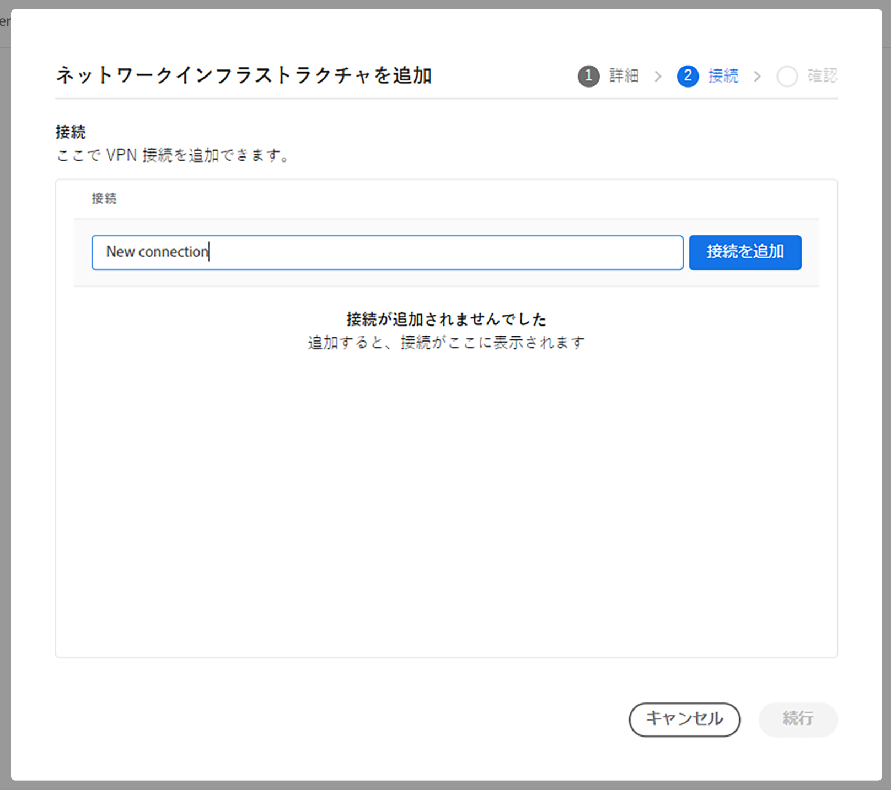

1. **接続を追加**&#x200B;ダイアログで、VPN 接続を定義し、「**保存**」をクリックします。

   * **接続名** - 前の手順で指定した VPN 接続のわかりやすい名前です。ここで更新できます。
   * **アドレス** - VPN デバイスの IP アドレスです。
   * **アドレス空間** - VPN 経由でルーティングする IP アドレス範囲です。
      * 範囲を入力した後、`Enter` を押して別の範囲を追加します。
      * 範囲の後の `X` をクリックして削除します。
   * **IP セキュリティポリシー** - 必要に応じてデフォルト値から調整します

   

1. ダイアログが閉じて、ウィザードの「**接続**」タブに戻ります。「**続行**」をクリックします。

   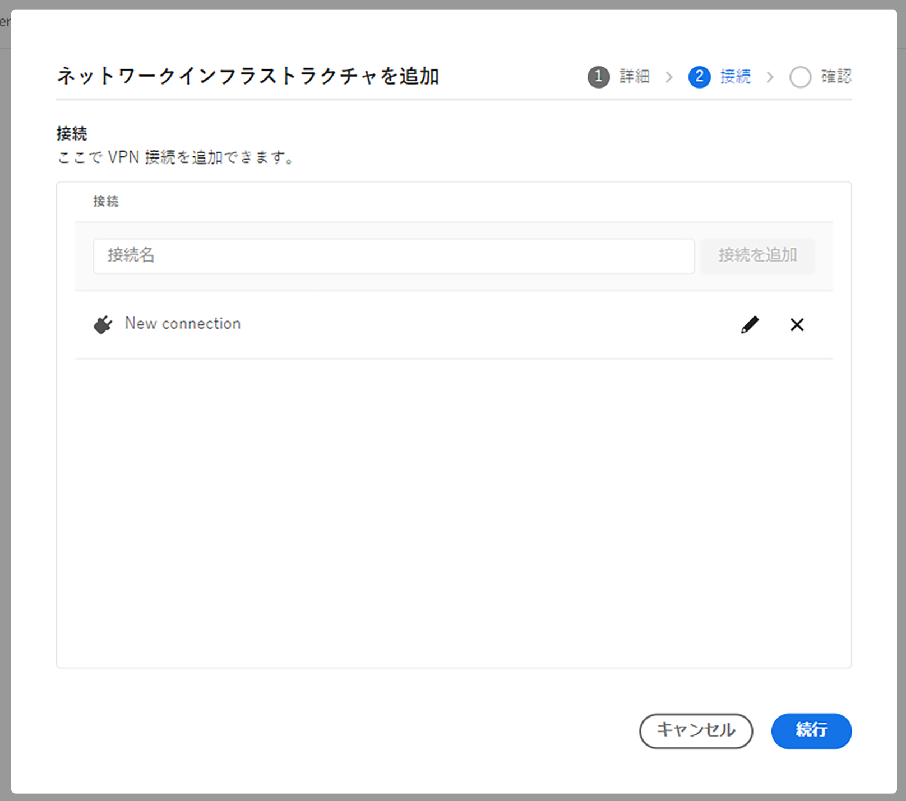

1. 「**確認**」タブには、選択内容と次の手順がまとめられています。「**保存**」をクリックして、インフラストラクチャを作成します。

   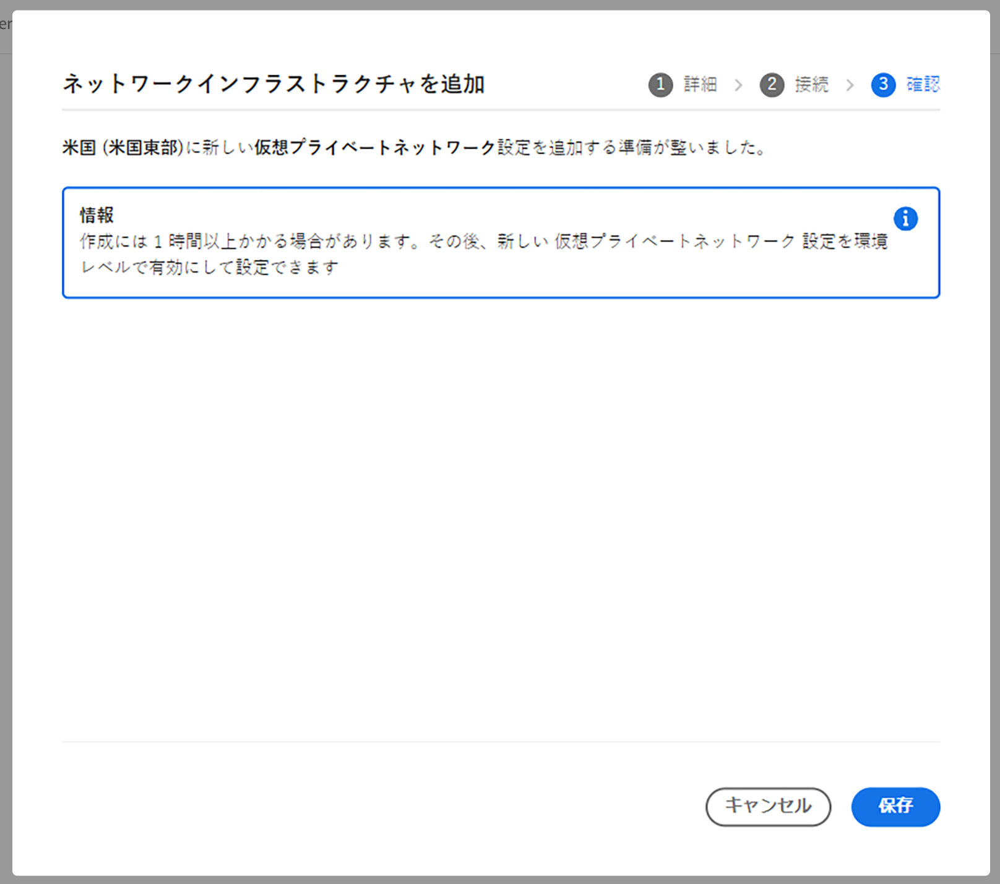

サイドパネルの&#x200B;**ネットワークインフラストラクチャ**&#x200B;見出しに、インフラストラクチャのタイプ、ステータス、地域、有効になっている環境の詳細を含む新しいレコードが表示されます。

### API 設定 {#configuring-vpn-api}

プログラムごとに 1 回、POST `/program/<programId>/networkInfrastructures` エンドポイントが呼び出されます。設定情報のペイロードが渡されます。この情報には、`kind` パラメーター、地域、アドレス空間（CIDR のリスト - 後で変更できません）、DNS リゾルバー（ネットワーク内の名前を解決するため）の **vpn** の値が含まれます。また、ゲートウェイ設定、共有 VPN キー、IP セキュリティポリシーなどの VPN 接続情報も含まれます。エンドポイントは、応答として `network_id` の他に、ステータスなどの他の情報も返します。

呼び出しの後、ネットワークインフラストラクチャがプロビジョニングされるまで、通常は 45～60 分 分かかります。API の GET メソッドを呼び出してステータスを返すことができ、最終的に `creating` から `ready` に変わります。すべてのステータスについては、 API ドキュメントを参照してください。

>[!TIP]
>
>パラメーターの完全なセット、正確な構文、および後で変更できないパラメーターなどの重要な情報は、[API ドキュメントで参照できます ](https://developer.adobe.com/experience-cloud/cloud-manager/reference/api/#operation/createNetworkInfrastructure)。

### トラフィックルーティング {#vpn-traffic-routing}

次の表にトラフィックルーティングを示します。

<table>
<thead>
  <tr>
    <th>トラフィック</th>
    <th>宛先の条件</th>
    <th>ポート</th>
    <th>接続</th>
    <th>外部宛先の例</th>
  </tr>
</thead>
<tbody>
  <tr>
    <td><b>HTTP または HTTPS プロトコル</b></td>
    <td>Azure サービスまたはアドビサービスへのトラフィック</td>
    <td>任意</td>
    <td>（専用 IP ではなく）共有クラスター IP を経由</td>
    <td>adobe.io<br>api.windows.net</td>
  </tr>
  <tr>
    <td></td>
    <td><code>nonProxyHosts</code> パラメーターに一致するホスト</td>
    <td>80 または 443</td>
    <td>共有クラスター IP を経由</td>
    <td></td>
  </tr>
  <tr>
    <td></td>
    <td><code>nonProxyHosts</code> パラメーターに一致するホスト</td>
    <td>80 または 443 以外のポート</td>
    <td>ブロック</td>
    <td></td>
  </tr>
  <tr>
    <td></td>
    <td>IP が <i>VPN ゲートウェイアドレス空間</i>の範囲に収まり、（標準の Java™ HTTP クライアントライブラリを使用する HTTP または HTTPS トラフィックにデフォルトで設定済みの）HTTP プロキシ設定を使用する場合</td>
    <td>任意</td>
    <td>VPN を経由</td>
    <td><code>10.0.0.1:443</code><br>ホスト名を指定することもできます。</td>
  </tr>
  <tr>
    <td></td>
    <td>IP が <i>VPN ゲートウェイアドレス空間</i>の範囲に収まらず、（標準の Java™ HTTP クライアントライブラリを使用する HTTP または HTTPS トラフィックにデフォルトで設定済みの）HTTP プロキシ設定を使用する場合</td>
    <td>任意</td>
    <td>専用エグレス IP を経由</td>
    <td></td>
  </tr>
  <tr>
    <td></td>
    <td>HTTP プロキシ設定を無視（例えば、標準の Java™ HTTP クライアントライブラリから明示的に削除された場合や、標準のプロキシ設定を無視する Java™ ライブラリを使用する場合）
</td>
    <td>80 または 443</td>
    <td>共有クラスター IP を経由</td>
    <td></td>
  </tr>
  <tr>
    <td></td>
    <td>HTTP プロキシ設定を無視（例えば、標準の Java™ HTTP クライアントライブラリから明示的に削除された場合や、標準のプロキシ設定を無視する Java™ ライブラリを使用する場合）</td>
    <td>80 または 443 以外のポート</td>
    <td>ブロック</td>
    <td></td>
  </tr>
  <tr>
    <td><b>HTTP 以外または HTTPS 以外</b></td>
    <td>IP が <i>VPN ゲートウェイアドレス空間</i>の範囲に収まり、<code>portForwards</code> API パラメーターで宣言されている <code>portOrig</code> を使用して <code>AEM_PROXY_HOST</code> 環境変数のプロキシホストにクライアントが接続する場合</td>
    <td>任意</td>
    <td>VPN を経由</td>
    <td><code>10.0.0.1:3306</code><br>ホスト名を指定することもできます。</td>
  </tr>
  <tr>
    <td></td>
    <td>IP が <i>VPN ゲートウェイアドレス空間</i>の範囲に収まらず、<code>portForwards</code> API パラメーターで宣言されている <code>portOrig</code> を使用して <code>AEM_PROXY_HOST</code> 環境変数のプロキシホストにクライアントが接続する場合</td>
    <td>任意</td>
    <td>専用エグレス IP を経由</td>
    <td></td>
  </tr>
  <tr>
    <td></td>
    <td>その他すべて</td>
    <td>任意</td>
    <td>ブロック</td>
    <td></td>
  </tr>
</tbody>
</table>

### 設定に役立つドメイン {#vpn-useful-domains-for-configuration}

次の図は、設定と開発に役立つ一連のドメインと関連 IP を視覚的に表したものです。図の下の表に、これらのドメインと IP を示します。


<table>
<thead>
  <tr>
    <th>ドメインパターン</th>
    <th>エグレス（AEM から送信）の意味</th>
    <th>イングレス（AEM に着信）の意味</th>
  </tr>
</thead>
<tbody>
  <tr>
    <td><code>p{PROGRAM_ID}.external.adobeaemcloud.com</code></td>
    <td>プライベートネットワーク経由ではなくインターネットに送信されるトラフィックの専用エグレス IP アドレス </td>
    <td>VPN からの接続は、CDN ではこの IP からの接続と見なされます。VPN からの接続のみ AEM に着信するように設定するには、この IP のみを許可し、それ以外のすべてをブロックするように、Cloud Manager を設定します。詳しくは、「VPN をイングレス接続に限定する方法」の節を参照してください。</td>
  </tr>
  <tr>
    <td><code>p{PROGRAM_ID}.{REGION}-gateway.external.adobeaemcloud.com</code></td>
    <td>該当なし</td>
    <td>AEM 側の VPN ゲートウェイの IP。ネットワークエンジニアリングチームでは、これを使用して、特定の IP アドレスから VPN ゲートウェイへの VPN 接続のみを許可することができます。 </td>
  </tr>
</tbody>
</table>

## 環境での高度なネットワーク設定の有効化 {#enabling}

プログラムの高度なネットワークオプションを設定したら、[フレキシブルポートエグレス](#flexible-port-egress)、[専用エグレス IP アドレス](#dedicated-egress-ip-address)または [VPN](#vpn) のいずれで使用する場合であっても、環境レベルでそのオプションを有効にする必要があります。

環境の高度なネットワーク設定を有効にすると、オプションのポート転送と非プロキシホストも有効にすることができます。柔軟性を持たせるために、パラメーターは環境ごとに設定できます。

* **ポート転送** - ポート転送ルールは、http または https プロトコルを使用しない場合に限り、80／443 以外の宛先ポートに対して宣言する必要があります。
   * ポート転送ルールは、宛先ホストのセット（名前または IP およびポート）を指定することによって定義されます。
   * http／https 経由のポート80／443を使用するクライアント接続でも、接続でプロキシ設定を使用して、高度なネットワークのプロパティを接続に適用する必要があります。
   * 宛先ホストごとに、宛先ポートを 30000～30999 のポートにマッピングする必要があります。
   * ポート転送ルールは、すべての高度なネットワークタイプで使用できます。

* **非プロキシホスト** - 非プロキシホストを使用すると、専用 IP ではなく共有 IP アドレス範囲を通じてルーティングするホストのセットを宣言できます。
   * 共有 IP を介して送信されたトラフィックが最適化される場合に役立ちます。
   * 非プロキシホストは、専用エグレス IP アドレスおよび VPN の高度なネットワークタイプでのみ使用できます。

>[!NOTE]
>
>環境が&#x200B;**更新中**&#x200B;ステータスにある場合、環境の高度なネットワーク設定を有効にすることはできません。

### UI を使用した有効化 {#enabling-ui}

1. [my.cloudmanager.adobe.com](https://my.cloudmanager.adobe.com/) で Cloud Manager にログインし、適切な組織を選択します。

1. **[マイプログラム](/help/implementing/cloud-manager/navigation.md#my-programs)**&#x200B;コンソールで、プログラムを選択します。

1. **プログラムの概要**&#x200B;ページから「**環境**」タブに移動し、左側のパネルの&#x200B;**環境**&#x200B;見出しで高度なネットワーク設定を有効にする環境を選択します。次に、選択した環境の「**高度なネットワーク設定**」タブを選択し、「**ネットワークインフラストラクチャを有効にする**」をタップまたはクリックします。

   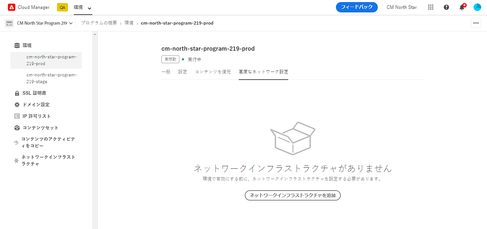

1. **高度なネットワーク機能を設定**&#x200B;ダイアログが開きます。

1. 「**非プロキシホスト**」タブでは、専用グレス IP アドレスと VPN に対して、オプションでホストのセットを定義できます。これらの定義済みのホストは、「**非プロキシホスト**」フィールドにホスト名を入力して「**追加**」をクリックすることで、専用 IP ではなく共有 IP アドレス範囲を通じてルーティングされる必要があります。

   * ホストがタブ上のホストのリストに追加されます。
   * 複数のホストを追加する場合は、この手順を繰り返します。
   * ホストを削除する場合は、行の右側にある「X」をクリックします。
   * このタブは、フレキシブルポートエグレス設定では使用できません。

   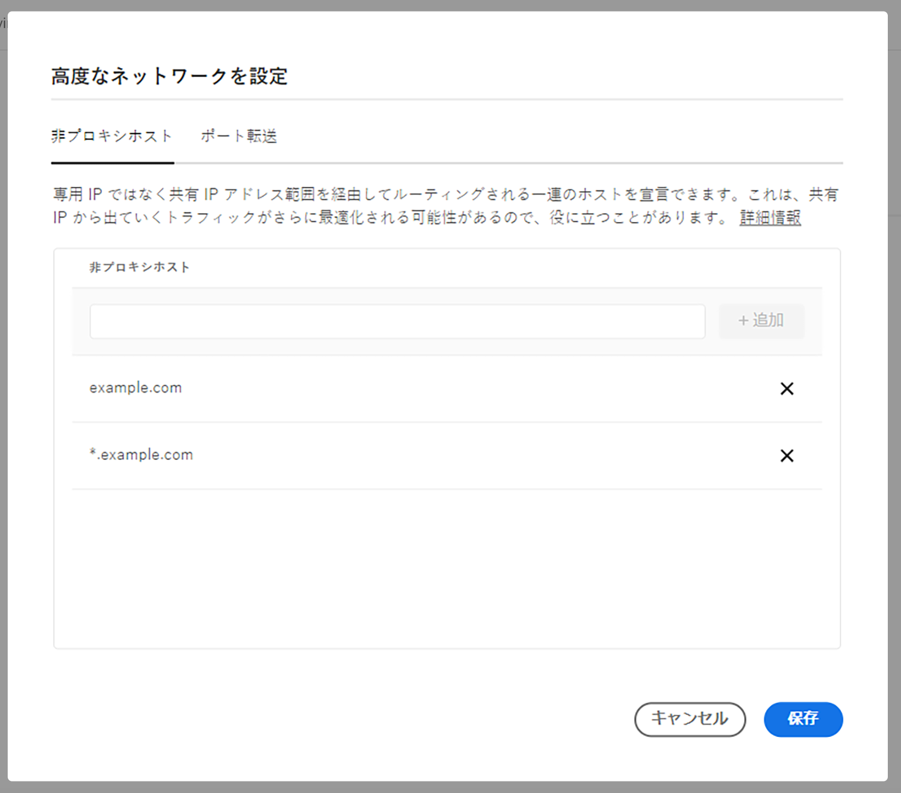

1. 「**ポート転送**」タブでは、HTTP または HTTPS を使用しない場合、80／443 以外の宛先ポートに対するポート転送ルールをオプションで定義できます。**名前**、**送信元ポート**、**宛先ポート**&#x200B;を入力し、「**追加**」をクリックします。

   * ルールがタブ上のルールのリストに追加されます。
   * 複数のルールを追加する場合は、この手順を繰り返します。
   * ルールを削除する場合は、行の右側にある「X」をクリックします。

   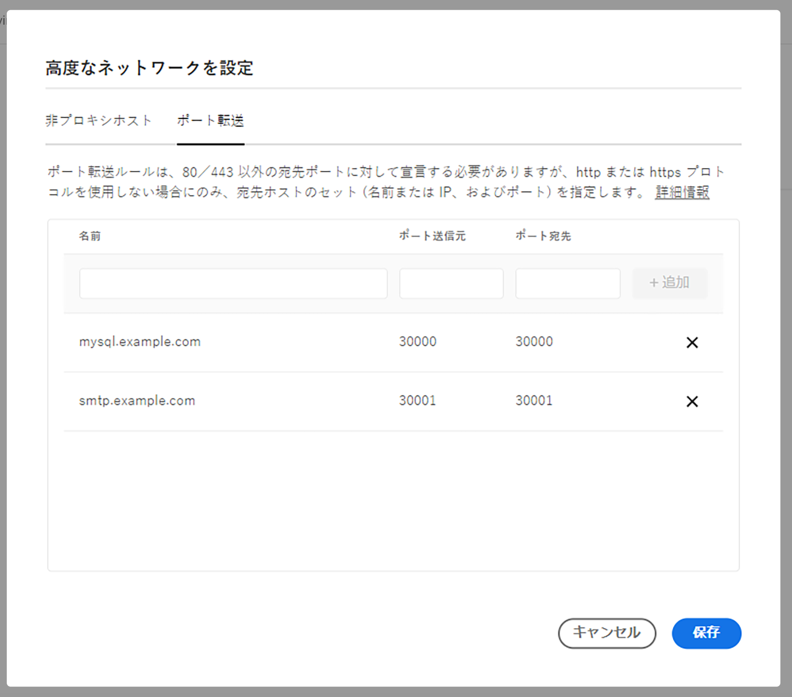

1. ダイアログボックスで「**保存**」をクリックして、設定を環境に適用します。

高度なネットワーク構成が、選択した環境に適用されます。「**環境**」タブに戻ると、選択した環境に適用された設定の詳細とステータスが表示されます。

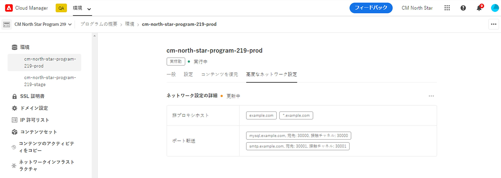

### API を使用した有効化 {#enabling-api}

環境の高度なネットワーク設定を有効にするには、環境ごとに `PUT /program/<program_id>/environment/<environment_id>/advancedNetworking` エンドポイントを呼び出す必要があります。

API はわずか数秒で応答し、`updating` のステータスを示します。約 10 分後、Cloud Manager の環境 GET エンドポイントを呼び出すと、`ready` のステータスが表示され、環境へのアップデートが適用されたことが示されます。

環境ごとのポート転送ルールは、`PUT /program/{programId}/environment/{environmentId}/advancedNetworking` エンドポイントを呼び出し、設定パラメーターのサブセットではなく完全なセットを含めることによって更新できます。

専用エグレス IP アドレスと VPN の高度なネットワークタイプは、`nonProxyHosts` パラメーターをサポートします。これにより、専用 IP ではなく共有 IP アドレス範囲を通じてルーティングするホストのセットを宣言できます。`nonProxyHost` URL は `example.com` または `*.example.com` のパターンに従う場合があります（このパターンでは、ワイルドカードはドメインの先頭でのみ使用できます）。

環境のトラフィックルーティングルール（ホストまたはバイパス）がない場合でも、空のペイロードを渡して `PUT /program/<program_id>/environment/<environment_id>/advancedNetworking` を呼び出す必要があります。

>[!TIP]
>
>パラメーターの完全なセット、正確な構文、および後で変更できないパラメーターなどの重要な情報は、[API ドキュメントで参照できます ](https://developer.adobe.com/experience-cloud/cloud-manager/reference/api/#operation/createNetworkInfrastructure)。

## 環境での高度なネットワーク設定の編集と削除 {#editing-deleting-environments}

[ 環境に対して高度なネットワーク設定を有効にする ](#enabling) を行った後に、それらの設定の詳細を更新したり削除したりできます。

>[!NOTE]
>
>ネットワークインフラストラクチャのステータスが&#x200B;**作成中**、**更新中**&#x200B;または&#x200B;**削除中**&#x200B;の場合は編集できません。

### UI を使用した編集または削除 {#editing-ui}

1. [my.cloudmanager.adobe.com](https://my.cloudmanager.adobe.com/) で Cloud Manager にログインし、適切な組織を選択します。

1. **[マイプログラム](/help/implementing/cloud-manager/navigation.md#my-programs)**&#x200B;コンソールで、プログラムを選択します。

1. **プログラムの概要**&#x200B;ページから「**環境**」タブに移動し、左側のパネルの&#x200B;**環境**&#x200B;見出しの下から、高度なネットワーク設定を有効にする環境を選択します。次に、選択した環境の「**高度なネットワーク設定**」タブを選択し、省略記号ボタンをクリックします。

   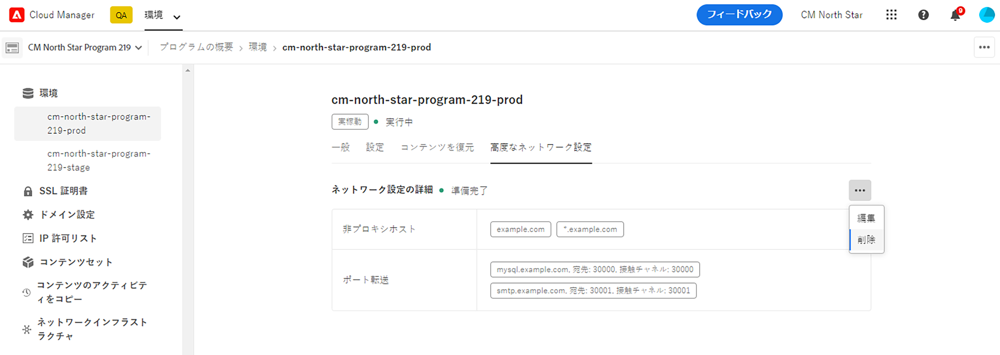

1. 省略記号メニューで「**編集**」または「**削除**」を選択します。

   * 「編集 **を選択した場合は、前の節** UI を使用した有効化 [](#enabling-ui) で説明した手順に従って情報を更新し、「**保存** をクリックします。
   * 「**削除**」を選択した場合は、**ネットワーク設定を削除**&#x200B;ダイアログで「**削除**」を選択して削除を確認するか、「**キャンセル**」を選択して中止します。

変更は「**環境**」タブに反映されます。

### API を使用した編集または削除 {#editing-api}

特定の環境で高度なネットワーク機能を削除するには、`DELETE [/program/{programId}/environment/{environmentId}/advancedNetworking]()` を呼び出します。

>[!TIP]
>
>パラメーターの完全なセット、正確な構文、および後で変更できないパラメーターなどの重要な情報は、[API ドキュメントで参照できます ](https://developer.adobe.com/experience-cloud/cloud-manager/reference/api/#operation/createNetworkInfrastructure)。

## プログラムのネットワークインフラストラクチャの編集および削除 {#editing-deleting-program}

プログラムのネットワークインフラストラクチャを作成すると、編集できるプロパティは制限されます。必要がなくなった場合は、プログラム全体の高度なネットワークインフラストラクチャを削除できます。

>[!NOTE]
>
>ネットワークインフラストラクチャの編集および削除には次の制限があります。
>
>* 削除では、すべての環境の高度なネットワークが無効になっている場合にのみ、インフラストラクチャが削除されます。
>* ネットワークインフラストラクチャのステータスが&#x200B;**作成中**、**更新中**&#x200B;または&#x200B;**削除中**&#x200B;の場合は編集できません。
>* 作成後に編集できるのは、VPN の高度なネットワークインフラストラクチャタイプのみであり、その後は制限されたフィールドのみ編集できます。
>* セキュリティ上の理由から、VPN の高度なネットワークインフラストラクチャを編集する際は、キー自体を編集していない場合でも、常に&#x200B;**共有キー**&#x200B;を指定する必要があります。

### UI を使用した編集と削除 {#delete-ui}

1. [my.cloudmanager.adobe.com](https://my.cloudmanager.adobe.com/) で Cloud Manager にログインし、適切な組織を選択します。

1. **[マイプログラム](/help/implementing/cloud-manager/navigation.md#my-programs)**&#x200B;コンソールで、プログラムを選択します。

1. **プログラムの概要**&#x200B;ページから「**環境**」タブに移動し、左側のパネルの「**ネットワークインフラストラクチャ**」見出しを選択します。次に、削除するインフラストラクチャの横にある省略記号ボタンをクリックします。

   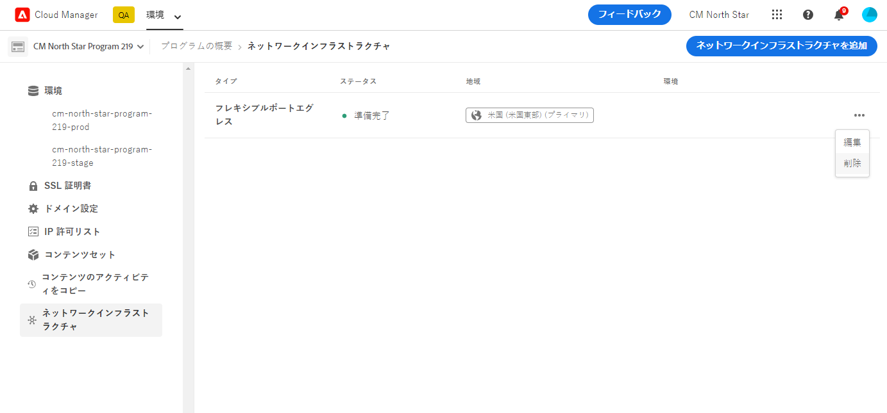

1. 省略記号メニューで「**編集**」または「**削除**」を選択します。

1. 「**編集**」を選択すると、**ネットワークインフラストラクチャを編集**&#x200B;ウィザードが開きます。インフラストラクチャの作成時に説明した手順に従って、必要に応じて編集します。

1. 「**削除**」を選択した場合は、**ネットワーク設定を削除**&#x200B;ダイアログボックスで「**削除**」を選択して削除を確認するか、「**キャンセル**」を選択して中止します。

変更は「**環境**」タブに反映されます。

### API を使用した編集と削除 {#delete-api}

プログラムのネットワークインフラストラクチャを&#x200B;**削除**&#x200B;するには、`DELETE /program/{program ID}/networkinfrastructure/{networkinfrastructureID}` を呼び出します。

## プログラムの高度なネットワークインフラストラクチャタイプの変更 {#changing-program}

1 つのプログラムに対して一度に設定できる高度なネットワークインフラストラクチャは、1 タイプのみです。高度なネットワークインフラストラクチャは、フレキシブルポートエグレス、専用エグレス IP アドレスまたは VPN のいずれかにする必要があります。

既に設定したネットワークインフラストラクチャタイプとは別の高度なネットワークインフラストラクチャタイプが必要な場合は、既存のネットワークインフラストラクチャタイプを削除して、別のネットワークインフラストラクチャタイプを作成します。次の手順を実行します。

1. [ すべての環境で詳細ネットワークを削除します ](#editing-deleting-environments)。
1. [ 高度なネットワークインフラストラクチャを削除 ](#editing-deleting-program)。
1. 必要な高度なネットワークインフラストラクチャタイプ（[ フレキシブルポートエグレス ](#flexible-port-egress)、[ 専用エグレス IP アドレス ](#dedicated-egress-ip-address)、または [VPN](#vpn) を作成します。
1. [ 環境レベルで高度なネットワークを再度有効にします ](#enabling)。

>[!WARNING]
>
> この手順を実行すると、削除と再作成の間に高度なネットワークサービスのダウンタイムが発生します。
> ダウンタイムがビジネスに大きな影響を与える場合は、カスタマーサポートにお問い合わせください。既に作成された内容と変更の理由を説明します。

## 他の公開地域の詳細なネットワーク設定 {#advanced-networking-configuration-for-additional-publish-regions}

高度なネットワークが既に設定されている環境にさらに地域が追加されると、高度なネットワークルールに一致する追加の公開地域からのトラフィックは、デフォルトでプライマリ地域を経由します。ただし、プライマリ地域が使用できなくなった場合、その他の地域で詳細ネットワークが有効になっていないと、高度なネットワークトラフィックは破棄されます。いずれかの地域で障害が発生した場合に、待ち時間を最適化して可用性を高めるには、追加の公開地域の高度なネットワークを有効にする必要があります。次の節では、2 つの異なるシナリオについて説明します。

>[!NOTE]
>
>すべての地域が[環境の高度なネットワーク設定](https://developer.adobe.com/experience-cloud/cloud-manager/reference/api/#tag/Environment-Advanced-Networking-Configuration)を共有するので、トラフィックが出力される地域に基づいて、別の宛先にトラフィックをルーティングすることはできません。

### 専用エグレス IP アドレス {#additional-publish-regions-dedicated-egress}

#### プライマリ地域で既に有効になっている高度なネットワーク {#already-enabled}

プライマリ地域で既に高度なネットワーク設定が有効になっている場合は、次の手順に従います。

1. 専用の AEM IP アドレスが許可リストに表示されるようにインフラストラクチャをロックダウンした場合は、そのインフラストラクチャ内の拒否ルールを一時的に無効にします。これが行われない場合、新しい地域の IP アドレスからのリクエストが、使用するインフラストラクチャによって拒否される短い期間があります。すべての AEM 地域は同じ完全修飾ドメイン名（FQDN）からの高度なネットワークトラフィックを引き出すので、FQDN を介してインフラストラクチャをロックダウンしている場合（例えば、`p1234.external.adobeaemcloud.com`）、これは必要ありません
1. 高度なネットワークのドキュメントに記載されるように、Cloud Manager Create Network Infrastructure API への POST 呼び出しを通じて、セカンダリ地域のプログラム範囲のネットワークインフラストラクチャを作成します。ペイロードの JSON 設定のプライマリ地域に対する唯一の違いは、地域プロパティです
1. AEM トラフィックを許可するために、インフラストラクチャを IP でロックダウンする必要がある場合は、`p1234.external.adobeaemcloud.com` に一致する IP を追加します。地域ごとに 1 つ必要です。

#### どの地域にもまだ設定されていない高度なネットワーク {#not-yet-configured}

手順は、前述の手順とほとんど同じです。ただし、実稼動環境でまだ高度なネットワークが有効にされていない場合は、まずステージング環境で有効にして設定をテストできます。

1. [Cloud Manager Create Network Infrastructure API](https://developer.adobe.com/experience-cloud/cloud-manager/reference/api/#tag/Network-infrastructure/operation/createNetworkInfrastructure) への POST 呼び出しを通して、すべての地域のネットワークインフラストラクチャを作成します。ペイロードの JSON 設定のプライマリ地域に対する唯一の違いは、地域プロパティです。
1. ステージング環境の場合は、`PUT api/program/{programId}/environment/{environmentId}/advancedNetworking` を実行して、環境範囲を指定した高度なネットワークを有効にし、設定します。詳しくは、[API のドキュメント](https://developer.adobe.com/experience-cloud/cloud-manager/reference/api/#tag/Environment-Advanced-Networking-Configuration/operation/enableEnvironmentAdvancedNetworkingConfiguration)を参照してください
1. 必要に応じて、できれば FQDN（例えば `p1234.external.adobeaemcloud.com`）で、外部インフラストラクチャをロックダウンします。それ以外の場合は、IP アドレスで行うことができます
1. ステージング環境が期待どおりに動作する場合は、実稼動環境用に環境範囲を定めた高度なネットワーク設定を有効にして設定します。

#### VPN {#vpn-regions}

手順は、専用のエグレス IP アドレスの手順とほとんど同じです。唯一の違いは、地域プロパティがプライマリ地域とは異なるように設定されていることに加えて、`connections.gateway` フィールドをオプションで設定できることです。設定では、組織が運用する、新しい地域と地理的に近い、別の VPN エンドポイントにルーティングできます。

## トラブルシューティング

次の点は有益なガイドラインとして提供されており、トラブルシューティングのベストプラクティスが含まれていることにご留意ください。これらのレコメンデーションは、問題の効果的な診断と解決を支援することを目的としています。

### 接続プーリング {#connection-pooling-advanced-networking}

接続プーリングは、接続のリポジトリを作成および維持するためにカスタマイズされた技術です。接続を必要とする可能性のあるすべてのスレッドですぐに使用できる状態になっています。様々なオンラインプラットフォームやリソースに数多くの接続プーリング手法があり、それぞれに独自のメリットと考慮事項があります。お客様には、これらの手法を調査して、システムのアーキテクチャに最も適合する手法を特定することをお勧めします。

適切な接続プーリング戦略の実装は、システム設定における一般的な監視を修正するためのプロアクティブな手段です。これにより、パフォーマンスの最適化が妨げられることがよくあります。Adobe Experience Manager（AEM）では、接続プーリングを正しく設定することで、外部呼び出しの効率を向上させることができます。これにより、リソースの消費が削減されるだけでなく、サービス中断のリスクが軽減され、アップストリームサーバーとの通信時に失敗したリクエストが発生する確率が低くなります。

このような状況を踏まえて、アドビでは、現在の AEM 設定を再評価し、高度なネットワーク設定と組み合わせて接続プーリングを意図的に組み込むことを検討することをお勧めします。これらの対策により、並列接続数を管理し、古い接続の可能性を最小限に抑えることで、プロキシサーバーが接続制限に達するリスクを軽減できます。したがって、この戦略的実装は、リクエストが外部エンドポイントに到達できない可能性を減らすように設計されています。

#### 接続制限に関する FAQ

高度なネットワーク機能を使用する場合、環境全体の安定性を確保し、下位の環境で使用可能な接続が使い果たされるのを防ぐために、接続数が制限されます。

接続数は AEM インスタンスごとに 1000 に制限され、接続数が 750 に達すると顧客にアラートが送信されます。

##### 接続制限は、非標準ポートからの送信トラフィックにのみ適用されますか、それともすべての送信トラフィックに適用されますか？

制限は、高度なネットワーク機能（非標準ポートでのエグレス、専用のエグレス IP の使用または VPN）を使用した接続にのみ適用されます。

##### 送信接続数に大きな違いはありません。通知が届いたのはなぜですか？

顧客が動的に接続を作成する場合（リクエストごとに 1 つ以上など）、トラフィックが増加すると、接続が急増する可能性があります。

##### 過去にアラートを受信しないで同様の状況を経験した可能性はありますか？

アラートは、ソフトリミットに到達した場合にのみ送信されます。

##### 上限に達した場合はどうなりますか？

ハードリミットに到達すると、DoS 攻撃から保護するために、高度なネットワーク機能（非標準ポートでのエグレス、専用のエグレス IP の使用または VPN）を通じて AEM からの新しいエグレス接続がドロップされます。

##### 制限を引き上げることはできますか？

いいえ、接続数が多いと、パフォーマンスに大きな影響を与え、ポッドや環境全体で DoS の原因となる可能性があります。

##### 一定期間が経過すると、AEM システムによって接続が自動的に閉じられますか？

はい、接続は、JVM レベルと、ネットワークインフラストラクチャの様々なポイントで閉じられます。ただし、実稼動サービスには遅すぎます。接続プールを使用する場合、接続は、不要になった際に明示的に閉じるか、プールに戻す必要があります。そうしないと、リソースの消費量が高くなりすぎて、リソースが枯渇する可能性があります。

##### 接続数の上限に達した場合、ライセンスに影響し、追加コストが発生しますか？

いいえ、この制限に関連するライセンスやコストはありません。これは技術的な制限です。

##### 制限にどれくらい近づいていますか？上限はどれくらいですか？

接続数が 750 を超えるとアラートがトリガーされます。AEM インスタンスあたりの接続数の上限は 1,000 です。

##### この制限は VPN に適用されますか？

はい、制限は VPN を含む高度なネットワーク機能を使用した接続に適用されます。

##### 専用のエグレス IP を使用する場合、この制限は引き続き適用されますか？

はい、専用のエグレス IP を使用する場合、制限は引き続き適用されます。
