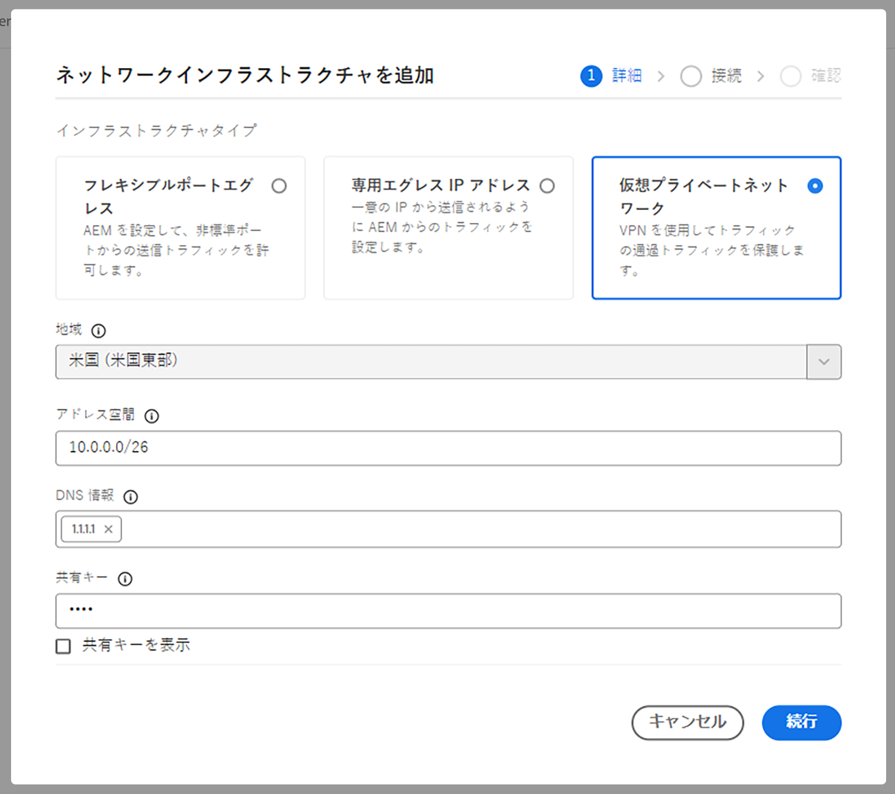
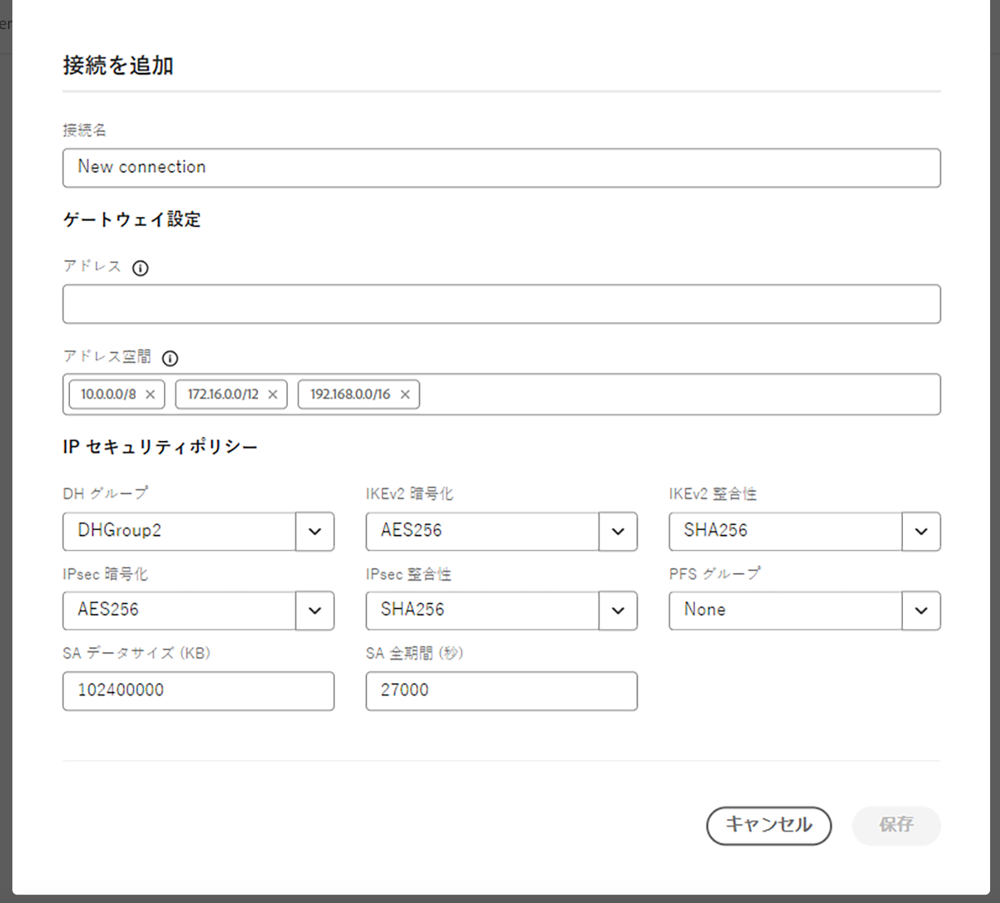

# AEM as a Cloud Service の高度なネットワーク機能の設定 {#configuring-advanced-networking}

この記事では、AEM as a Cloud Service の様々な高度なネットワーク機能（VPN のセルフサービスおよび API プロビジョニング、非標準ポート、専用エグレス IP アドレスなど）を紹介します。

>[!TIP]
>
>このドキュメントに加えて、この[場所](https://experienceleague.adobe.com/en/docs/experience-manager-learn/cloud-service/networking/advanced-networking)には、高度なネットワークオプションのそれぞれを説明する一連のチュートリアルも用意されています。

## 概要 {#overview}

AEM as a Cloud Service では、次の高度なネットワークオプションを提供します。

* [フレキシブルポートエグレス](#flexible-port-egress) - AEM as a Cloud Service を設定して、非標準ポートからの送信トラフィックを許可します。
* [専用エグレス IP アドレス](#dedicated-egress-ip-address) - 一意の IP アドレスから送信されるように AEM as a Cloud Service からのトラフィックを設定します。
* [仮想プライベートネットワーク（VPN）](#vpn) - VPN を使用している場合は、インフラストラクチャと AEM as a Cloud Service の間のトラフィックを保護します。

この記事では、Cloud Manager UI を使用して API を使用してどのように設定されるかについて説明する前に、これらの各オプションについて詳しく説明し、オプションを使用できる理由も説明します。 この記事では、いくつかの高度なユースケースを最後に説明します。

>[!CAUTION]
>
>従来の専用エグレステクノロジーを既にプロビジョニングしていて、これらの高度なネットワークオプションの 1 つを設定する場合、 [Adobeカスタマーケアに連絡](https://experienceleague.adobe.com/ja?support-solution=Experience+Manager#home).
>
>従来のエグレステクノロジーを使用して高度なネットワークを設定しようとすると、サイトの接続に影響を与える場合があります。

### 要件と制限事項 {#requirements}

高度なネットワーク機能を設定する場合、次の制限が適用されます。

* プログラムは、単一の高度なネットワークオプション（柔軟なポートエグレス、専用エグレス IP アドレスまたは VPN）をプロビジョニングできます。
* 高度なネットワーク機能は、[サンドボックスプログラム](/help/implementing/cloud-manager/getting-access-to-aem-in-cloud/program-types.md)では使用できません。
* のユーザーは以下を持っている必要があります。 **管理者** プログラムにネットワークインフラストラクチャを追加して設定する役割。
* プログラムにネットワークインフラストラクチャを追加する前に、実稼動環境を作成する必要があります。
* ネットワークインフラストラクチャは、実稼動環境のプライマリ地域と同じ地域に存在する必要があります。
   * 実稼動環境が次のような場合 [その他の公開地域](/help/implementing/cloud-manager/manage-environments.md#multiple-regions)追加の各地域をミラーリングする別のネットワークインフラストラクチャを作成することもできます。
   * 実稼動環境で設定されている地域の最大数を超えてネットワークインフラストラクチャを作成することはできません。
   * 実稼動環境で使用可能な地域と同じ数のネットワークインフラストラクチャを定義できますが、新しいインフラストラクチャは以前に作成したインフラストラクチャと同じタイプにする必要があります。
   * 複数のインフラストラクチャを作成する場合は、高度なネットワークインフラストラクチャが作成されていない地域のみから選択できます。

### 高度なネットワーク機能の設定と有効化 {#configuring-enabling}

高度なネットワーク機能を使用するには、次の 2 つの手順が必要です。

1. 高度なネットワークオプションの設定（[フレキシブルポートエグレス](#flexible-port-egress)、[専用エグレス IP アドレス](#dedicated-egress-ip-address)または [VPN](#vpn)）は、まずプログラムレベルで行う必要があります。
1. 使用するには、高度なネットワークオプションを[環境レベルで有効](#enabling)にする必要があります。

どちらの手順も、Cloud Manager UI または Cloud Manager API を使用して実行できます。

* Cloud Manager UI を使用する場合は、プログラムレベルでウィザードを使用して詳細なネットワーク設定を作成し、設定を有効にする各環境を編集する必要があります。

* Cloud Manager API を使用する場合 `/networkInfrastructures` API エンドポイントは、プログラムレベルで呼び出され、目的のタイプの高度なネットワーク機能を宣言します。 その後、を呼び出します `/advancedNetworking` インフラストラクチャを有効にし、環境固有のパラメーターを設定するための、各環境のエンドポイント。

## フレキシブルポートエグレス {#flexible-port-egress}

高度なネットワーク機能を使用すると、デフォルトで開いている HTTP（ポート 80）と HTTPS（ポート 443）以外のポートからトラフィックを送信するように、AEM as a Cloud Service を設定することができます。

>[!TIP]
>
>フレキシブルポートエグレス IP アドレスと専用エグレス IP アドレスのどちらを選択する場合は、特定の IP アドレスが必要なければ、フレキシブルポートエグレスを選択することをお勧めします。 その理由は、Adobeによってフレキシブルポートエグレストラフィックのパフォーマンスを最適化できるためです。

>[!NOTE]
>
>作成後に、フレキシブルポートエグレスインフラストラクチャタイプを編集することはできません。 設定値を変更する唯一の方法は、設定値を削除して再作成することです。

### UI 設定 {#configuring-flexible-port-egress-provision-ui}

1. [my.cloudmanager.adobe.com](https://my.cloudmanager.adobe.com/) で Cloud Manager にログインし、適切な組織を選択します。

1. 日 **[マイプログラム](/help/implementing/cloud-manager/navigation.md#my-programs)** コンソールで、プログラムを選択します。

1. **プログラム概要**&#x200B;ページから、「**環境**」タブに移動し、左側のパネルの「**ネットワークインフラストラクチャ**」を選択します。

   

1. が含まれる **ネットワークインフラストラクチャの追加** ウィザード、選択 **柔軟なポートエグレス** およびから作成する必要がある領域 **地域** ドロップダウンメニューとクリック **続行**.

   

1. 「**確認**」タブには、選択内容と次の手順がまとめられています。クリック **保存** をクリックしてインフラストラクチャを作成します。

   

サイドパネルの&#x200B;**ネットワークインフラストラクチャ**&#x200B;見出しの下に、インフラストラクチャの種類、ステータス、地域、有効になっている環境の詳細を含む新しいレコードが表示されます。


>[!NOTE]
>
>フレキシブルポートエグレス用のインフラストラクチャの作成には最大 1 時間かかる場合があり、その後、環境レベルで設定できるようになります。

### API 設定 {#configuring-flexible-port-egress-provision-api}

プログラムごとに 1 回、POST `/program/<programId>/networkInfrastructures` エンドポイントが呼び出され、`kind` パラメーターの `flexiblePortEgress` の値と地域が渡されます。エンドポイントは、応答として `network_id` の他に、ステータスなどの他の情報も返します。

呼び出しの後、ネットワークインフラストラクチャがプロビジョニングされるまで、通常は 15 分ほどかかります。Cloud Manager の[ネットワークインフラストラクチャ GET エンドポイント](https://developer.adobe.com/experience-cloud/cloud-manager/reference/api/#operation/getNetworkInfrastructure)の呼び出しで「**準備完了**」のステータスが表示されます。

>[!TIP]
>
>パラメーターの完全なセット、正確な構文、および後で変更できないパラメーターなどの重要な情報、 [API ドキュメントで参照できます。](https://developer.adobe.com/experience-cloud/cloud-manager/reference/api/#operation/createNetworkInfrastructure)

### トラフィックルーティング {#flexible-port-egress-traffic-routing}

80 または 443 以外のポートに送信される http または https トラフィックの場合、次のホストおよびポート環境変数を使用してプロキシを設定する必要があります。

* HTTP の場合： `AEM_PROXY_HOST`／`AEM_HTTP_PROXY_PORT `（AEM リリース 6094 未満では、デフォルトは `proxy.tunnel:3128`）
* HTTPS の場合： `AEM_PROXY_HOST`／`AEM_HTTPS_PROXY_PORT `（AEM リリース 6094 未満では、デフォルトは `proxy.tunnel:3128`）

`www.example.com:8443` にリクエストを送信するサンプルコードを以下に示します。

```java
String url = "www.example.com:8443"
String proxyHost = System.getenv().getOrDefault("AEM_PROXY_HOST", "proxy.tunnel");
int proxyPort = Integer.parseInt(System.getenv().getOrDefault("AEM_HTTPS_PROXY_PORT", "3128"));
HttpClient client = HttpClient.newBuilder()
      .proxy(ProxySelector.of(new InetSocketAddress(proxyHost, proxyPort)))
      .build();
 
HttpRequest request = HttpRequest.newBuilder().uri(URI.create(url)).build();
HttpResponse<String> response = client.send(request, BodyHandlers.ofString());
```

非標準の Java™ ネットワークライブラリを使用する場合は、上記のプロパティを使用して、すべてのトラフィックに対してプロキシを設定します。

`portForwards` パラメーターで宣言したポートで宛先とやり取りする HTTP/HTTPS 以外のトラフィックは、マッピングされたポートと共に、`AEM_PROXY_HOST` というプロパティを参照する必要があります。次に例を示します。

```java
DriverManager.getConnection("jdbc:mysql://" + System.getenv("AEM_PROXY_HOST") + ":53306/test");
```

次の表にトラフィックルーティングを示します。

<table>
<thead>
  <tr>
    <th>トラフィック</th>
    <th>宛先の条件</th>
    <th>ポート</th>
    <th>接続</th>
    <th>外部宛先の例</th>
  </tr>
</thead>
<tbody>
  <tr>
    <td><b>HTTP または HTTPS プロトコル</b></td>
    <td>標準の HTTP または HTTPS トラフィック</td>
    <td>80 または 443</td>
    <td>許可</td>
    <td></td>
  </tr> 
  <tr>
    <td></td>
    <td>次の環境変数とプロキシポート番号を使用して設定された http プロキシを介した（80 または 443 以外の他のポートでの）非標準トラフィック。Cloud Manager API 呼び出しの portForwards パラメーターで宛先ポートを宣言しないでください。<br><ul>
     <li>AEM_PROXY_HOST（AEM リリース 6094 未満では、デフォルトは `proxy.tunnel`）</li>
     <li>AEM_HTTPS_PROXY_PORT（AEM リリース 6094 未満では、デフォルトはポート 3128）</li>
    </ul>
    <td>80 または 443 以外のポート</td>
    <td>許可</td>
    <td>example.com:8443</td>
  </tr>
  <tr>
    <td></td>
    <td>HTTP プロキシを使用しない（80 または 443 以外のポート上の）非標準トラフィック</td>
    <td>80 または 443 以外のポート</td>
    <td>ブロック</td>
    <td></td>
  </tr>
  <tr>
    <td><b>HTTP 以外または HTTPS 以外</b></td>
    <td>クライアントは、<code>portForwards</code> API パラメーターで宣言された <code>portOrig</code> を使用して、<code>AEM_PROXY_HOST</code> 環境変数のプロキシホストに接続</td>
    <td>任意</td>
    <td>許可</td>
    <td><code>mysql.example.com:3306</code></td>
  </tr>
  <tr>
    <td></td>
    <td>その他すべて</td>
    <td>任意</td>
    <td>ブロック</td>
    <td><code>db.example.com:5555</code></td>
  </tr>
</tbody>
</table>

#### Apache／Dispatcher 設定 {#apache-dispatcher}

AEM Cloud Service の Apache／Dispatcher 層の `mod_proxy` ディレクティブは、上記のプロパティを使用して設定できます。

```
ProxyRemote "http://example.com:8080" "http://${AEM_PROXY_HOST}:3128"
ProxyPass "/somepath" "http://example.com:8080"
ProxyPassReverse "/somepath" "http://example.com:8080"
```

```
SSLProxyEngine on //needed for https backends
 
ProxyRemote "https://example.com:8443" "http://${AEM_PROXY_HOST}:3128"
ProxyPass "/somepath" "https://example.com:8443"
ProxyPassReverse "/somepath" "https://example.com:8443"
```

## 出力専用 IP アドレス {#dedicated-egress-ip-address}

専用 IP アドレスは、SaaS ベンダー（CRM ベンダーなど）との統合や、IP アドレスの許可リストを提供する AEM as a Cloud Service 外部のソリューションと統合する場合のセキュリティを強化します。専用 IP アドレスを許可リストに追加することで、AEM Cloud Serviceからのトラフィックのみが外部サービスに送られるようになります。 これは、その他の許可されている IP からのトラフィックに加えられるものです。

同じ専用 IP が、アドビ組織内のすべてのプログラムと、各プログラム内のすべての環境に適用されます。オーサーサービスとパブリッシュサービスの両方に適用されます。

専用 IP アドレス機能を有効にしていない場合、AEMas a Cloud Serviceから送信されるトラフィックは、AEMas a Cloud Serviceの他のお客様と共有される一連の IP を通過します。

専用エグレス IP アドレスの設定は、[フレキシブルポートエグレスと似ています。](#flexible-port-egress) 主な違いとして、設定後は、トラフィックが常に一意の専用 IP アドレスから発信されます。その IP を確認するには、DNS リゾルバーを使用して、`p{PROGRAM_ID}.external.adobeaemcloud.com` に関連付けられている IP アドレスを特定します。この IP アドレスは固定ですが、変更する必要がある場合は、事前に通知されます。

>[!TIP]
>
>フレキシブルポートエグレス IP アドレスと専用エグレス IP アドレスのどちらかを決定する場合は、特定の IP アドレスが必要なければ、フレキシブルポートエグレスを選択してください。 その理由は、Adobeによってフレキシブルポートエグレストラフィックのパフォーマンスを最適化できるためです。

>[!NOTE]
>
>2021 年 9 月リリースより前（つまり、2021 年 9 月リリースより前）に専用エグレス IP がプロビジョニングされた場合、専用エグレス IP 機能は HTTP ポートと HTTPS ポートのみをサポートします。
>
>これには、HTTP/1.1 と HTTP/2（暗号化時）が含まれます。また、1 つの専用の出力エンドポイントは、それぞれポート 80／443 の HTTP／HTTPS 経由でのみ任意のターゲットと通信できます。

>[!NOTE]
>
>専用のエングレス IP アドレスインフラストラクチャタイプは、作成後に編集することはできません。設定値を変更する唯一の方法は、設定値を削除して再作成することです。

>[!INFO]
>
>Splunk 転送機能は専用エグレス IP アドレスからは使用できません。

### UI 設定 {#configuring-dedicated-egress-provision-ui}

1. [my.cloudmanager.adobe.com](https://my.cloudmanager.adobe.com/) で Cloud Manager にログインし、適切な組織を選択します。

1. 日 **[マイプログラム](/help/implementing/cloud-manager/navigation.md#my-programs)** コンソールで、プログラムを選択します。

1. **プログラム概要**&#x200B;ページから、「**環境**」タブに移動し、左側のパネルの「**ネットワークインフラストラクチャ**」を選択します。

   

1. が含まれる **ネットワークインフラストラクチャの追加** 起動するウィザードで、 **出力専用 IP アドレス** およびから作成する必要がある領域 **地域** ドロップダウンメニューとクリック **続行**.

   

1. 「**確認**」タブには、選択内容と次の手順がまとめられています。クリック **保存** をクリックしてインフラストラクチャを作成します。

   

サイドパネルの&#x200B;**ネットワークインフラストラクチャ**&#x200B;見出しの下に、インフラストラクチャの種類、ステータス、地域、有効になっている環境の詳細を含む新しいレコードが表示されます。


>[!NOTE]
>
>フレキシブルポートエグレス用のインフラストラクチャの作成には最大 1 時間かかる場合があり、その後、環境レベルで設定できるようになります。

### API 設定 {#configuring-dedicated-egress-provision-api}

プログラムごとに 1 回、POST `/program/<programId>/networkInfrastructures` エンドポイントが呼び出され、`kind` パラメーターの `dedicatedEgressIp` の値と地域が渡されます。エンドポイントは、応答として `network_id` の他に、ステータスなどの他の情報も返します。

呼び出しの後、ネットワークインフラストラクチャがプロビジョニングされるまで、通常は 15 分ほどかかります。Cloud Manager の[ネットワークインフラストラクチャ GET エンドポイント](https://developer.adobe.com/experience-cloud/cloud-manager/reference/api/#operation/getNetworkInfrastructure)の呼び出しで「**準備完了**」のステータスが表示されます。

>[!TIP]
>
>パラメーターの完全なセット、正確な構文、および後で変更できないパラメーターなどの重要な情報、 [API ドキュメントで参照できます。](https://developer.adobe.com/experience-cloud/cloud-manager/reference/api/#operation/createNetworkInfrastructure)

### トラフィックルーティング {#dedicated-egress-ip-traffic-routing}

プロキシ設定に標準の Java™ システムプロパティを使用する場合、http または https トラフィックは事前に設定されたプロキシを経由します。

`portForwards` パラメーターで宣言したポートで宛先とやり取りする HTTP/HTTPS 以外のトラフィックは、マッピングされたポートと共に、`AEM_PROXY_HOST` というプロパティを参照する必要があります。次に例を示します。

```java
DriverManager.getConnection("jdbc:mysql://" + System.getenv("AEM_PROXY_HOST") + ":53306/test");
```

<table>
<thead>
  <tr>
    <th>トラフィック</th>
    <th>宛先の条件</th>
    <th>ポート</th>
    <th>接続</th>
    <th>外部宛先の例</th>
  </tr>
</thead>
<tbody>
  <tr>
    <td><b>HTTP または HTTPS プロトコル</b></td>
    <td>Azure サービスまたはアドビサービスへのトラフィック</td>
    <td>任意</td>
    <td>（専用 IP ではなく）共有クラスター IP を経由</td>
    <td>adobe.io<br>api.windows.net</td>
  </tr>
  <tr>
    <td></td>
    <td><code>nonProxyHosts</code> パラメーターに一致するホスト</td>
    <td>80 または 443</td>
    <td>共有クラスター IP を経由</td>
    <td></td>
  </tr>
  <tr>
    <td></td>
    <td><code>nonProxyHosts</code> パラメーターに一致するホスト</td>
    <td>80 または 443 以外のポート</td>
    <td>ブロック</td>
    <td></td>
  </tr>
  <tr>
    <td></td>
    <td>標準の Java™ HTTP クライアントライブラリを使用する http/s トラフィック用にデフォルトで設定された、http プロキシ設定を通して</td>
    <td>任意</td>
    <td>専用エグレス IP を経由</td>
    <td></td>
  </tr>
  <tr>
    <td></td>
    <td>HTTP プロキシ設定を無視（例えば、標準の Java™ HTTP クライアントライブラリから明示的に削除された場合や、標準のプロキシ設定を無視する Java™ ライブラリが使用されている場合）</td>
    <td>80 または 443</td>
    <td>共有クラスター IP を経由</td>
    <td></td>
  </tr>
  <tr>
    <td></td>
    <td>HTTP プロキシ設定を無視（例えば、標準の Java™ HTTP クライアントライブラリから明示的に削除された場合や、標準のプロキシ設定を無視する Java™ ライブラリが使用されている場合）</td>
    <td>80 または 443 以外のポート</td>
    <td>ブロック</td>
    <td></td>
  </tr>
  <tr>
    <td><b>HTTP 以外または HTTPS 以外</b></td>
    <td>クライアントは、<code>portForwards</code> API パラメーターで宣言されている <code>portOrig</code> を使用して、<code>AEM_PROXY_HOST</code> 環境変数のプロキシホストに接続</td>
    <td>任意</td>
    <td>専用エグレス IP を経由</td>
    <td><code>mysql.example.com:3306</code></td>
  </tr>
  <tr>
    <td></td>
    <td>その他すべて</td>
    <td></td>
    <td>ブロック</td>
    <td></td>
  </tr>
</tbody>
</table>

### 機能の使用 {#feature-usage}

この機能は、プロキシ設定に標準の Java™ システムプロパティを使用する場合、送信トラフィックを引き起こす Java™ コードまたはライブラリと互換性があります。 実際には、これには最も一般的なライブラリが含まれる必要があります。

次にコード例を示します。

```java
public JSONObject getJsonObject(String relativePath, String queryString) throws IOException, JSONException {
  String relativeUri = queryString.isEmpty() ? relativePath : (relativePath + '?' + queryString);
  URL finalUrl = endpointUri.resolve(relativeUri).toURL();
  URLConnection connection = finalUrl.openConnection();
  connection.addRequestProperty("Accept", "application/json");
  connection.addRequestProperty("X-API-KEY", apiKey);

  try (InputStream responseStream = connection.getInputStream(); Reader responseReader = new BufferedReader(new InputStreamReader(responseStream, Charsets.UTF_8))) {
    return new JSONObject(new JSONTokener(responseReader));
  }
}
```

一部のライブラリでは、プロキシ設定に標準の Java™ システムプロパティを使用するために、明示的な設定が必要です。

Apache HttpClient を使用する例で、への明示的な呼び出しを必要とするもの
[`HttpClientBuilder.useSystemProperties()`](https://hc.apache.org/httpcomponents-client-4.5.x/current/httpclient/apidocs/org/apache/http/impl/client/HttpClientBuilder.html) または使用
[`HttpClients.createSystem()`](https://hc.apache.org/httpcomponents-client-4.5.x/current/httpclient/apidocs/org/apache/http/impl/client/HttpClients.html#createSystem()):

```java
public JSONObject getJsonObject(String relativePath, String queryString) throws IOException, JSONException {
  String relativeUri = queryString.isEmpty() ? relativePath : (relativePath + '?' + queryString);
  URL finalUrl = endpointUri.resolve(relativeUri).toURL();

  HttpClient httpClient = HttpClientBuilder.create().useSystemProperties().build();
  HttpGet request = new HttpGet(finalUrl.toURI());
  request.setHeader("Accept", "application/json");
  request.setHeader("X-API-KEY", apiKey);
  HttpResponse response = httpClient.execute(request);
  String result = EntityUtils.toString(response.getEntity());
}
```

### デバッグの考慮事項 {#debugging-considerations}

期待される専用 IP アドレスでトラフィックが実際に発信されていることを検証するには、目的のサービスでログを確認します（可能な場合）。それ以外の場合は、次のようなデバッグサービスを呼び出すと便利です。 [http://ifconfig.me/ip](http://ifconfig.me/ip)：呼び出し元の IP アドレスを返します。

## 仮想プライベートネットワーク（VPN） {#vpn}

VPN を使用すると、作成者、公開、またはプレビューインスタンスからオンプレミスインフラストラクチャまたはデータセンターに接続できます。これは、データベースへのアクセスを保護する場合などに役立ちます。また、VPN をサポートしている CRM ベンダーなどの SaaS ベンダーへの接続や、企業ネットワークから AEM as a Cloud Service のオーサー、プレビューまたはパブリッシュインスタンスへの接続も可能になります。

IPSec 技術を搭載したほとんどの VPN デバイスがサポートされています。[このデバイスのリストの **RouteBase の設定手順**&#x200B;の列にある情報を参照してください。](https://learn.microsoft.com/en-us/azure/vpn-gateway/vpn-gateway-about-vpn-devices#devicetable) 表の説明に従って、デバイスを設定します。

>[!NOTE]
>
>VPN インフラストラクチャに対する制限事項を次に示します。
>
>* サポートは 1 つの VPN 接続に制限されています。
>* Splunk 転送機能は VPN 接続では使用できません。
>* プライベートホスト名を解決するには、DNS リゾルバーをゲートウェイアドレス空間にリストする必要があります。

### UI 設定 {#configuring-vpn-ui}

1. [my.cloudmanager.adobe.com](https://my.cloudmanager.adobe.com/) で Cloud Manager にログインし、適切な組織を選択します。

1. 日 **[マイプログラム](/help/implementing/cloud-manager/navigation.md#my-programs)** コンソールで、プログラムを選択します。

1. **プログラム概要**&#x200B;ページから、「**環境**」タブに移動し、左側のパネルの「**ネットワークインフラストラクチャ**」を選択します。

   

1. が含まれる **ネットワークインフラストラクチャの追加** 起動するウィザードで、 **仮想プライベートネットワーク** クリックする前に、必要な情報を入力します **続行**.

   * **地域** - これはインフラストラクチャを作成する必要がある地域です。
   * **アドレス空間** - アドレス空間は、1 つの/26 CIDR （64 個の IP アドレス）以上の IP 範囲を自分の空間内で設定する必要があります。
      * この値を後で変更することはできません。
   * **DNS情報** - これはリモート DNS リゾルバーのリストです。
      * DNS サーバーのアドレスを入力した後、`Enter` を押して別のアドレスを追加します。
      * 「」をクリックします `X` 削除するアドレスの後。
   * **共有キー** - これは VPN 事前共有キーです。
      * を選択 **共有キーを表示** でキーを表示して、その値をダブルチェックできるようにします。

   

1. 日 **接続** ウィザードのタブで、次を指定します **接続名** vpn 接続を識別し、 **接続を追加**.

   

1. が含まれる **接続を追加** ダイアログで VPN 接続を定義し、 **保存**.

   * **接続名** - 前の手順で指定した VPN 接続のわかりやすい名前です。ここで更新できます。
   * **アドレス** - VPN デバイスの IP アドレスです。
   * **アドレス空間** - VPN 経由でルーティングする IP アドレス範囲です。
      * 範囲を入力した後、`Enter` を押して別の範囲を追加します。
      * 「」をクリックします `X` 削除する範囲の後。
   * **IP セキュリティポリシー** - 必要に応じてデフォルト値から調整します

   

1. ダイアログが閉じて、ウィザードの「**接続**」タブに戻ります。「**続行**」をクリックします。

   

1. 「**確認**」タブには、選択内容と次の手順がまとめられています。クリック **保存** をクリックしてインフラストラクチャを作成します。

   

サイドパネルの&#x200B;**ネットワークインフラストラクチャ**&#x200B;見出しに、インフラストラクチャのタイプ、ステータス、地域、有効になっている環境の詳細を含む新しいレコードが表示されます。

### API 設定 {#configuring-vpn-api}

プログラムごとに 1 回、POST `/program/<programId>/networkInfrastructures` エンドポイントが呼び出されます。 設定情報のペイロードが渡されます。 この情報には、次の値が含まれます。 **vpn** の場合 `kind` パラメーター、地域、アドレス空間（CIDR のリスト – 後で変更することはできません）、DNS リゾルバー（ネットワーク内の名前を解決するため）。 また、ゲートウェイ設定、共有 VPN キー、IP セキュリティ ポリシーなどの VPN 接続情報も含まれます。 エンドポイントは、応答として `network_id` の他に、ステータスなどの他の情報も返します。

呼び出しの後、ネットワークインフラストラクチャがプロビジョニングされるまで、通常は 45～60 分かかります。 API のGETメソッドを呼び出して、ステータスを返すことができます。このステータスは最終的に `creating` 対象： `ready`. すべてのステータスについては、 API ドキュメントを参照してください。

>[!TIP]
>
>パラメーターの完全なセット、正確な構文、および後で変更できないパラメーターなどの重要な情報、 [API ドキュメントで参照できます。](https://developer.adobe.com/experience-cloud/cloud-manager/reference/api/#operation/createNetworkInfrastructure)

### トラフィックルーティング {#vpn-traffic-routing}

次の表にトラフィックルーティングを示します。

<table>
<thead>
  <tr>
    <th>トラフィック</th>
    <th>宛先の条件</th>
    <th>ポート</th>
    <th>接続</th>
    <th>外部宛先の例</th>
  </tr>
</thead>
<tbody>
  <tr>
    <td><b>HTTP または HTTPS プロトコル</b></td>
    <td>Azure サービスまたはアドビサービスへのトラフィック</td>
    <td>任意</td>
    <td>（専用 IP ではなく）共有クラスター IP を経由</td>
    <td>adobe.io<br>api.windows.net</td>
  </tr>
  <tr>
    <td></td>
    <td><code>nonProxyHosts</code> パラメーターに一致するホスト</td>
    <td>80 または 443</td>
    <td>共有クラスター IP を経由</td>
    <td></td>
  </tr>
  <tr>
    <td></td>
    <td><code>nonProxyHosts</code> パラメーターに一致するホスト</td>
    <td>80 または 443 以外のポート</td>
    <td>ブロック</td>
    <td></td>
  </tr>
  <tr>
    <td></td>
    <td>IP がに該当するかどうか <i>VPN ゲートウェイアドレス</i> スペース範囲、および http プロキシ設定を使用（標準の Java™ HTTP クライアントライブラリを使用した http/s トラフィック用にデフォルトで設定）</td>
    <td>任意</td>
    <td>VPN を経由</td>
    <td><code>10.0.0.1:443</code><br>ホスト名を指定することもできます。</td>
  </tr>
  <tr>
    <td></td>
    <td>IP がに分類されない場合 <i>VPN ゲートウェイのアドレス空間</i> 範囲および http プロキシ設定を使用（標準の Java™ HTTP クライアントライブラリを使用した http/s トラフィック用にデフォルトで設定）</td>
    <td>任意</td>
    <td>専用エグレス IP を経由</td>
    <td></td>
  </tr>
  <tr>
    <td></td>
    <td>HTTP プロキシ設定を無視（例えば、標準の Java™ HTTP クライアントライブラリから明示的に削除された場合や、標準のプロキシ設定を無視する Java™ ライブラリを使用する場合）
</td>
    <td>80 または 443</td>
    <td>共有クラスター IP を経由</td>
    <td></td>
  </tr>
  <tr>
    <td></td>
    <td>HTTP プロキシ設定を無視（例えば、標準の Java™ HTTP クライアントライブラリから明示的に削除された場合や、標準のプロキシ設定を無視する Java™ ライブラリを使用する場合）</td>
    <td>80 または 443 以外のポート</td>
    <td>ブロック</td>
    <td></td>
  </tr>
  <tr>
    <td><b>HTTP 以外または HTTPS 以外</b></td>
    <td>IP が <i>VPN ゲートウェイアドレス空間</i>の範囲に収まり、<code>portForwards</code> API パラメーターで宣言されている <code>portOrig</code> を使用して <code>AEM_PROXY_HOST</code> 環境変数のプロキシホストにクライアントが接続する場合</td>
    <td>任意</td>
    <td>VPN を経由</td>
    <td><code>10.0.0.1:3306</code><br>ホスト名を指定することもできます。</td>
  </tr>
  <tr>
    <td></td>
    <td>IP が <i>VPN ゲートウェイアドレス空間</i>の範囲に収まらず、<code>portForwards</code> API パラメーターで宣言されている <code>portOrig</code> を使用して <code>AEM_PROXY_HOST</code> 環境変数のプロキシホストにクライアントが接続する場合</td>
    <td>任意</td>
    <td>専用エグレス IP を経由</td>
    <td></td>
  </tr>
  <tr>
    <td></td>
    <td>その他すべて</td>
    <td>任意</td>
    <td>ブロック</td>
    <td></td>
  </tr>
</tbody>
</table>

### 設定に役立つドメイン {#vpn-useful-domains-for-configuration}

次の図は、設定と開発に役立つ一連のドメインと関連 IP を視覚的に表したものです。図の下の表に、これらのドメインと IP を示します。


<table>
<thead>
  <tr>
    <th>ドメインパターン</th>
    <th>エグレス（AEM から送信）の意味</th>
    <th>イングレス（AEM に着信）の意味</th>
  </tr>
</thead>
<tbody>
  <tr>
    <td><code>p{PROGRAM_ID}.external.adobeaemcloud.com</code></td>
    <td>プライベートネットワーク経由ではなくインターネットに送信されるトラフィックの専用エグレス IP アドレス </td>
    <td>VPN からの接続は、CDN ではこの IP からの接続と見なされます。VPN からの接続のみ AEM に着信するように設定するには、この IP のみを許可し、それ以外のすべてをブロックするように、Cloud Manager を設定します。詳しくは、「VPN をイングレス接続に限定する方法」の節を参照してください。</td>
  </tr>
  <tr>
    <td><code>p{PROGRAM_ID}.{REGION}-gateway.external.adobeaemcloud.com</code></td>
    <td>該当なし</td>
    <td>AEM 側の VPN ゲートウェイの IP。ネットワークエンジニアリングチームでは、これを使用して、特定の IP アドレスから VPN ゲートウェイへの VPN 接続のみを許可することができます。 </td>
  </tr>
  <tr>
    <td><code>p{PROGRAM_ID}.{REGION}.inner.adobeaemcloud.net</code></td>
    <td>VPN の AEM 側からユーザー側に送信されるトラフィックの IP。これを設定に許可リストに加えるして、AEMからのみ接続されるようにすることができます。</td>
    <td>AEM への VPN アクセスを許可する場合は、CNAME DNS エントリを設定して、これにカスタムドメインや <code>author-p{PROGRAM_ID}-e{ENVIRONMENT_ID}.adobeaemcloud.com</code> や <code>publish-p{PROGRAM_ID}-e{ENVIRONMENT_ID}.adobeaemcloud.com</code> をマッピングする必要があります。</td>
  </tr>
</tbody>
</table>

### VPN をイングレス接続に限定する方法 {#restrict-vpn-to-ingress-connections}

AEM への VPN アクセスのみを許可する場合は、`p{PROGRAM_ID}.external.adobeaemcloud.com` で定義された IP のみが環境と通信できるように、環境の許可リストを Cloud Manager で設定します。これは、Cloud Manager で他の IP ベースの許可リストと同じように行うことができます。

パスベースのルールにする必要がある場合は、標準の http ディレクティブを Dispatcher レベルで使用して、特定の IP を拒否または許可します。 リクエストが常にオリジンに到達するように、目的のパスを CDN でキャッシュできないようにする必要もあります。

#### httpd 設定の例 {#httpd-example}

```
Order deny,allow
Deny from all
Allow from 192.168.0.1
Header always set Cache-Control private
```

## 環境での高度なネットワーク設定の有効化 {#enabling}

プログラムに高度なネットワークオプションを設定すると、次の条件を満たすようになります [柔軟なポート出力](#flexible-port-egress), [出力専用 IP アドレス](#dedicated-egress-ip-address)、または [VPN](#vpn)を使用するには、環境レベルで有効にする必要があります。

環境の高度なネットワーク設定を有効にする場合は、オプションのポート転送および非プロキシホストも有効にできます。 柔軟性を持たせるために、パラメーターは環境ごとに設定できます。

* **ポート転送** - ポート転送ルールは、http または https プロトコルを使用しない場合に限り、80／443 以外の宛先ポートに対して宣言する必要があります。
   * ポート転送ルールは、宛先ホストのセット（名前または IP およびポート）を指定することによって定義されます。
   * http/https 経由でポート 80/443 を使用するクライアント接続では、接続に高度なネットワーク機能のプロパティを適用するために、接続でプロキシ設定を引き続き使用する必要があります。
   * 宛先ホストごとに、宛先ポートを 30000～30999 のポートにマッピングする必要があります。
   * ポート転送ルールは、すべての高度なネットワークタイプで使用できます。

* **非プロキシホスト**  – 非プロキシホストを使用すると、専用 IP ではなく共有 IP アドレス範囲を経由してルーティングされる一連のホストを宣言できます。
   * 共有 IP を介して送信されたトラフィックが最適化される場合に役立ちます。
   * 非プロキシホストは、専用のエグレス IP アドレスと VPN 高度なネットワークタイプでのみ使用できます。

>[!NOTE]
>
>環境がにある場合は、その環境の高度なネットワーク設定を有効にすることはできません。 **更新中** ステータス。

### UI を使用した有効化 {#enabling-ui}

1. [my.cloudmanager.adobe.com](https://my.cloudmanager.adobe.com/) で Cloud Manager にログインし、適切な組織を選択します。

1. 日 **[マイプログラム](/help/implementing/cloud-manager/navigation.md#my-programs)** コンソールで、プログラムを選択します。

1. から **プログラムの概要** ページで、に移動します **環境** タブをクリックして、の下で高度なネットワーク設定を有効にする環境を選択します **環境** 左側のパネルの「」見出し。 次に、 **高度なネットワーク設定** 選択した環境のタブで、 **ネットワークインフラストラクチャの有効化**.

   

1. **高度なネットワーク機能を設定**&#x200B;ダイアログが開きます。

1. 日 **非プロキシホスト** タブで、専用のエグレス IP アドレスと VPN の場合は、オプションで一連のホストを定義できます。 これらの定義済みのホストは、にホスト名を指定することで、専用 IP ではなく共有 IP アドレス範囲を介してルーティングされる必要があります。 **非プロキシホスト** フィールドとクリック **追加**.

   * ホストがタブ上のホストのリストに追加されます。
   * 複数のホストを追加する場合は、この手順を繰り返します。
   * ホストを削除する場合は、行の右にある X をクリックします。
   * このタブは、フレキシブルポートエグレス設定では使用できません。

   

1. 「**ポート転送**」タブでは、HTTP または HTTPS を使用しない場合、80／443 以外の宛先ポートに対するポート転送ルールをオプションで定義できます。を指定 **名前**, **ポートのオリジナル**、および **ポートの宛先** をクリックして、 **追加**.

   * ルールがタブ上のルールのリストに追加されます。
   * 複数のルールを追加する場合は、この手順を繰り返します。
   * ルールを削除する場合は、行の右側にある X をクリックします。

   

1. クリック **保存** ダイアログボックスで、設定を環境に適用できるようにします。

高度なネットワーク構成が、選択した環境に適用されます。「**環境**」タブに戻ると、選択した環境に適用された設定の詳細とステータスが表示されます。


### API を使用した有効化 {#enabling-api}

環境の高度なネットワーク設定を有効にするには、環境ごとに `PUT /program/<program_id>/environment/<environment_id>/advancedNetworking` エンドポイントを呼び出す必要があります。

API が数秒以内に応答して、次のステータスを示します。 `updating`. 約 10 分後、Cloud Manager の環境GETエンドポイントの呼び出しで、次のステータスが表示されます。 `ready`環境のアップデートが適用されることを示しています。

環境ごとのポート転送ルールは、`PUT /program/{programId}/environment/{environmentId}/advancedNetworking` エンドポイントを呼び出し、設定パラメーターのサブセットではなく完全なセットを含めることによって更新できます。

専用エグレス IP アドレスと VPN の高度なネットワークタイプは、`nonProxyHosts` パラメーターをサポートします。これにより、専用 IP ではなく共有 IP アドレス範囲を通じてルーティングするホストのセットを宣言できます。`nonProxyHost` URL は `example.com` または `*.example.com` のパターンに従う場合があります（このパターンでは、ワイルドカードはドメインの先頭でのみ使用できます）。

環境のトラフィックルーティングルール（ホストまたはバイパス）がない場合でも、 `PUT /program/<program_id>/environment/<environment_id>/advancedNetworking` 空のペイロードを指定して、引き続き呼び出す必要があります。

>[!TIP]
>
>パラメーターの完全なセット、正確な構文、および後で変更できないパラメーターなどの重要な情報、 [API ドキュメントで参照できます。](https://developer.adobe.com/experience-cloud/cloud-manager/reference/api/#operation/createNetworkInfrastructure)

## 環境での高度なネットワーク設定の編集と削除 {#editing-deleting-environments}

後 [環境に対する高度なネットワーク設定の有効化](#enabling) これらの設定の詳細を更新したり、削除したりできます。

>[!NOTE]
>
>ステータスがの場合は、ネットワークインフラストラクチャを編集できません **作成中**, **更新中**、または **の削除**.

### UI を使用した編集または削除 {#editing-ui}

1. [my.cloudmanager.adobe.com](https://my.cloudmanager.adobe.com/) で Cloud Manager にログインし、適切な組織を選択します。

1. 日 **[マイプログラム](/help/implementing/cloud-manager/navigation.md#my-programs)** コンソールで、プログラムを選択します。

1. から **プログラムの概要** ページで、に移動します **環境** タブをクリックして、の下で高度なネットワーク設定を有効にする環境を選択します **環境** 左側のパネルの「」見出し。 次に、 **高度なネットワーク設定** 選択した環境のタブで、省略記号ボタンをクリックします。

   

1. 省略記号メニューで、次のいずれかを選択します **編集** または **削除**.

   * 次を選択した場合： **編集**&#x200B;前の節で説明した手順に従って情報を更新します。 [UI を使用した有効化](#enabling-ui) をクリックして、 **保存**.
   * 「**削除**」を選択した場合は、**ネットワーク設定を削除**&#x200B;ダイアログで「**削除**」を選択して削除を確認するか、「**キャンセル**」を選択して中止します。

変更は、 **環境** タブ。

### API を使用した編集または削除 {#editing-api}

特定の環境で高度なネットワーク機能を削除するには、`DELETE [/program/{programId}/environment/{environmentId}/advancedNetworking]()` を呼び出します。

>[!TIP]
>
>パラメーターの完全なセット、正確な構文、および後で変更できないパラメーターなどの重要な情報、 [API ドキュメントで参照できます。](https://developer.adobe.com/experience-cloud/cloud-manager/reference/api/#operation/createNetworkInfrastructure)

## プログラムのネットワークインフラストラクチャの編集および削除 {#editing-deleting-program}

プログラムのネットワークインフラストラクチャを作成すると、編集できるプロパティは制限されます。必要がなくなった場合は、プログラム全体の高度なネットワークインフラストラクチャを削除できます。

>[!NOTE]
>
>ネットワークインフラストラクチャの編集および削除に関する制限事項を次に示します。
>
>* 削除では、すべての環境の高度なネットワークが無効になっている場合にのみ、インフラストラクチャが削除されます。
>* ステータスがの場合は、ネットワークインフラストラクチャを編集できません **作成中**, **更新中**、または **の削除**.
>* 作成後に編集できるのは、VPN の高度なネットワークインフラストラクチャタイプのみであり、その後は制限されたフィールドのみ編集できます。
>* セキュリティ上の理由から、 **共有キー** 高度な VPN ネットワークインフラストラクチャを編集する場合は、キー自体を編集していなくても、常に指定する必要があります。

### UI を使用した編集と削除 {#delete-ui}

1. [my.cloudmanager.adobe.com](https://my.cloudmanager.adobe.com/) で Cloud Manager にログインし、適切な組織を選択します。

1. 日 **[マイプログラム](/help/implementing/cloud-manager/navigation.md#my-programs)** コンソールで、プログラムを選択します。

1. **プログラムの概要**&#x200B;ページから「**環境**」タブに移動し、左側のパネルの「**ネットワークインフラストラクチャ**」見出しを選択します。次に、削除するインフラストラクチャの横にある省略記号ボタンをクリックします。

   

1. 省略記号メニューで、次のいずれかを選択します **編集** または **削除**.

1. 「**編集**」を選択すると、**ネットワークインフラストラクチャを編集**&#x200B;ウィザードが開きます。インフラストラクチャの作成時に説明した手順に従って、必要に応じて編集します。

1. 次を選択した場合： **削除**&#x200B;で削除を確認します **ネットワーク設定の削除** ダイアログボックスと **削除** または、次の条件で中止 **キャンセル**.

変更は、 **環境** タブ。

### API を使用した編集と削除 {#delete-api}

プログラムのネットワークインフラストラクチャを&#x200B;**削除**&#x200B;するには、`DELETE /program/{program ID}/networkinfrastructure/{networkinfrastructureID}` を呼び出します。

## プログラムの高度なネットワークインフラストラクチャタイプの変更 {#changing-program}

プログラムに対して一度に設定できる高度なネットワークインフラストラクチャのタイプは 1 つだけです。高度なネットワークインフラストラクチャは、フレキシブルポートエグレス、専用エグレス IP アドレス、または VPN のいずれかである必要があります。

既に設定したタイプとは別の高度なネットワークインフラストラクチャタイプが必要であると判断した場合は、既存のタイプを削除してから、別のタイプを作成します。 次の手順を実行します。

1. [すべての環境で高度なネットワーク機能を削除します。](#editing-deleting-environments)
1. [高度なネットワークインフラストラクチャを削除します。](#editing-deleting-program)
1. 現在必要な、高度なネットワークインフラストラクチャタイプ（[フレキシブルポートエグレス](#flexible-port-egress)、[専用エグレス IP アドレス](#dedicated-egress-ip-address)または [VPN](#vpn)）を作成します。
1. [環境レベルで高度なネットワーク機能を再度有効にします。](#enabling)

>[!WARNING]
>
> この手順を実行すると、削除と再作成の間に高度なネットワークサービスのダウンタイムが発生します。
> ダウンタイムがビジネスに大きな影響を与える場合は、カスタマーサポートにお問い合わせください。既に作成された内容と変更の理由を説明します。

## その他の公開地域用の高度なネットワーク設定 {#advanced-networking-configuration-for-additional-publish-regions}

高度なネットワーク機能が既に設定されている環境に追加の地域が追加されると、高度なネットワークルールに一致する追加の公開地域からのトラフィックは、デフォルトでプライマリ地域経由でルーティングされます。 ただし、プライマリ地域が使用できなくなった場合、その他の地域で詳細ネットワークが有効になっていないと、高度なネットワークトラフィックは破棄されます。いずれかの地域が停止した場合に待ち時間を最適化し、可用性を高めるには、追加の公開地域で高度なネットワークを有効にする必要があります。 次の節では、2 つの異なるシナリオについて説明します。

>[!NOTE]
>
>すべての地域が共有 [環境の高度なネットワーク設定](https://developer.adobe.com/experience-cloud/cloud-manager/reference/api/#tag/Environment-Advanced-Networking-Configuration)そのため、トラフィックが出ている地域に基づいて、異なる宛先にトラフィックをルーティングすることはできません。

### 専用エグレス IP アドレス {#additional-publish-regions-dedicated-egress}

#### プライマリ地域で既に有効になっている高度なネットワーク {#already-enabled}

プライマリ地域で既に高度なネットワーク設定が有効になっている場合は、次の手順に従います。

1. 専用のAEM IP アドレスを拒否するようにインフラストラクチャをロックダウンした場合は、そのインフラストラクチャ内の許可リストに加えるルールを一時的に無効にします。 これが行われない場合、新しい地域の IP アドレスからのリクエストが、使用するインフラストラクチャによって拒否される短い期間があります。すべての AEM 地域は同じ完全修飾ドメイン名（FQDN）からの高度なネットワークトラフィックを引き出すので、FQDN を介してインフラストラクチャをロックダウンしている場合（例えば、`p1234.external.adobeaemcloud.com`）、これは必要ありません
1. 高度なネットワークのドキュメントに記載されるように、Cloud Manager Create Network Infrastructure API への POST 呼び出しを通じて、セカンダリ地域のプログラム範囲のネットワークインフラストラクチャを作成します。ペイロードの JSON 設定のプライマリ地域に対する唯一の違いは、地域プロパティです
1. AEM トラフィックを許可するために、インフラストラクチャを IP でロックダウンする必要がある場合は、`p1234.external.adobeaemcloud.com` に一致する IP を追加します。地域ごとに 1 つ必要です。

#### どの地域にもまだ設定されていない高度なネットワーク {#not-yet-configured}

手順は、前述の手順とほとんど同じです。ただし、実稼動環境でまだ高度なネットワークが有効にされていない場合は、まずステージング環境で有効にして設定をテストできます。

1. [Cloud Manager Create Network Infrastructure API](https://developer.adobe.com/experience-cloud/cloud-manager/reference/api/#tag/Network-infrastructure/operation/createNetworkInfrastructure) への POST 呼び出しを通して、すべての地域のネットワークインフラストラクチャを作成します。ペイロードの JSON 設定のプライマリ地域に対する唯一の違いは、地域プロパティです。
1. ステージング環境の場合は、`PUT api/program/{programId}/environment/{environmentId}/advancedNetworking` を実行して、環境範囲を指定した高度なネットワークを有効にし、設定します。詳しくは、[こちら](https://developer.adobe.com/experience-cloud/cloud-manager/reference/api/#tag/Environment-Advanced-Networking-Configuration/operation/enableEnvironmentAdvancedNetworkingConfiguration)の API ドキュメントを参照してください。
1. 必要に応じて、できれば FQDN（例えば `p1234.external.adobeaemcloud.com`）で、外部インフラストラクチャをロックダウンします。それ以外の場合は、IP アドレスで行うことができます
1. ステージング環境が期待どおりに動作する場合は、実稼動環境用に環境範囲を定めた高度なネットワーク設定を有効にして設定します。

#### VPN {#vpn-regions}

手順は、専用のエグレス IP アドレスの手順とほとんど同じです。唯一の違いは、region プロパティがプライマリ領域とは異なる方法で設定されていることに加えて、 `connections.gateway` フィールドはオプションで設定できます。 設定は、組織が運用する別の VPN エンドポイントにルーティングでき、地理的に新しい地域に近い場所に配置できます。
