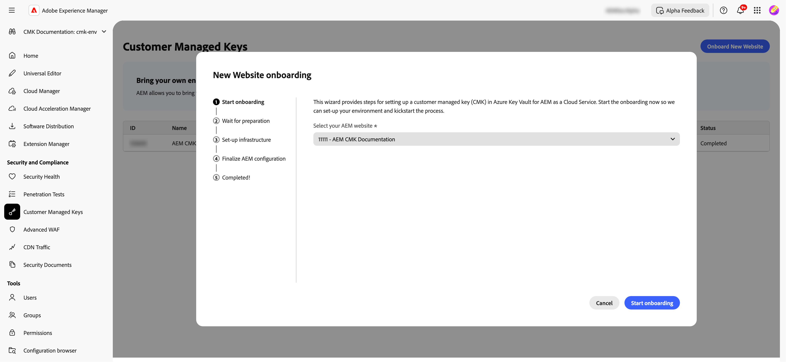
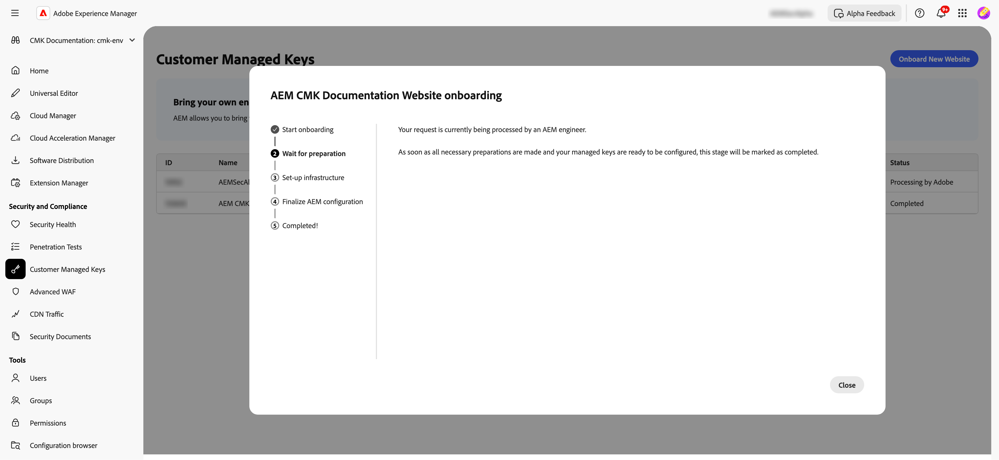
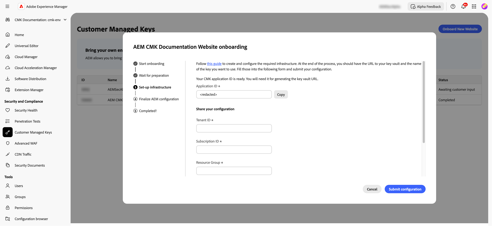
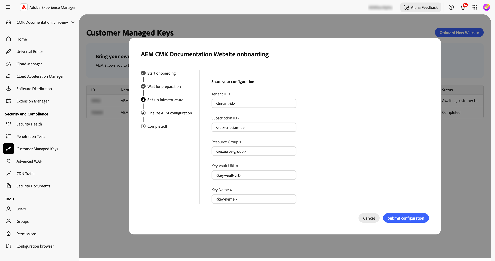
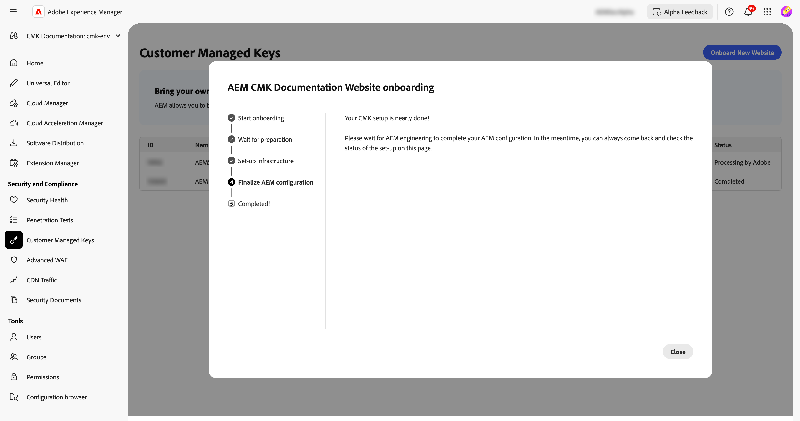
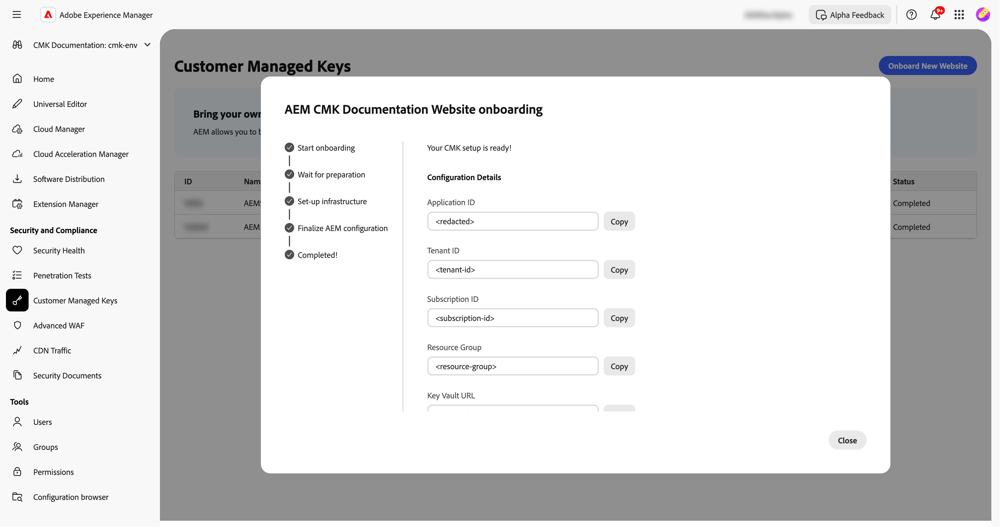

# AEM as a Cloud Service の顧客管理キーの設定 {#customer-managed-keys-for-aem-as-a-cloud-service}

AEM as a Cloud Service は現在、顧客データを Azure Blob Storage と MongoDB に保存し、デフォルトでプロバイダー管理の暗号化キーを使用してデータを保護します。この設定は多くの組織のセキュリティニーズを満たしますが、規制の厳しい業界の企業や強化されたデータセキュリティを必要とする企業は、より厳密な暗号化の制御を求める場合があります。データのセキュリティ、コンプライアンス、暗号化キーの管理機能を優先する組織にとって、顧客管理キー（CMK）ソリューションは重要な機能強化を提供します。

## 解決中の問題 {#the-problem-being-solved}

プロバイダー管理キーは、追加のプライバシーと整合性を必要とする企業にとって懸念となる可能性があります。キー管理を制御できない場合、組織はコンプライアンス要件を満たし、カスタムセキュリティポリシーを実装し、完全なデータセキュリティを確保するという課題に直面します。

顧客管理キー（CMK）の導入により、AEM のお客様は暗号化キーを完全に制御できることで、これらの懸念に対処します。AEM CS では、Microsoft Entra ID（旧称 Azure Active Directory）を通じて認証することで、お客様の Azure Key Vault に安全に接続し、キーの作成、ローテーション、失効を含む暗号化キーのライフサイクルを管理できます。

CMK には、次のようないくつかの利点があります。

* **データとアプリケーションの暗号化を制御：** AEM アプリケーションとデータ暗号化キーを直接管理することで、セキュリティを強化します。
* **機密性と整合性の向上：** 完全な暗号化管理により、機密性の高いデータや専有データへの不用意なアクセスや開示の可能性を軽減します。
* **Azure Key Vault のサポート：** Azure Key Vault を使用すると、キーストレージ、シークレットの操作の処理、キーのローテーションの実行が可能になります。

CMK を採用することで、データセキュリティと暗号化の実践に対する制御を強化し、リスクを軽減しながら、AEM CS のスケーラビリティと柔軟性を引き続き確保できます。

AEM as a Cloud Service を使用すると、保存データを暗号化するための独自の暗号化キーを使用できます。このガイドでは、AEM as a Cloud Service の Azure Key Vault で顧客管理キー（CMK）を設定する手順について説明します。

>[!WARNING]
>
>CMK を設定した後は、システム管理キーに戻すことはできません。データへのアクセスが失われないように、キーを安全に管理し、Azure 内でキーコンテナ、キー、CMK アプリへのアクセスを提供するのはお客様の責任です。

また、必要なインフラストラクチャを作成および設定するための次の手順についても説明します。

1. 環境の設定
1. アドビからのアプリケーション ID の取得
1. 新しいリソースグループの作成
1. Key Vault の作成
1. Key Vault へのAdobe アクセスの許可
1. 暗号化キーの作成

キーコンテナの URL、暗号化キー名、およびキーコンテナに関する情報をアドビと共有する必要があります。

## 環境の設定 {#setup-your-environment}

Azure コマンドラインインターフェイス（CLI）は、このガイドの唯一の要件です。Azure CLI をまだインストールしていない場合は、[こちら](https://learn.microsoft.com/ja-jp/cli/azure/install-azure-cli)にある公式のインストール手順に従ってください。

このガイドの残りの部分に進む前に、`az login` を使用して CLI にログインしてください。

>[!NOTE]
>
>このガイドでは Azure CLI を使用しますが、Azure コンソール経由で同じ操作を実行することもできます。Azure コンソールを使用する場合は、以下のコマンドを参考にしてください。


## AEM as a Cloud Serviceの CMK 設定プロセスの開始 {#request-cmk-for-aem-as-a-cloud-service}

AEM as a Cloud Service環境の顧客管理キー（CMK）設定を UI を使用してリクエストする必要があります。 これをおこなうには、AEM ホームセキュリティ UI の「**顧客管理キー** セクションに移動します。
その後、「オンボーディングを開始 **ボタンをクリックして、オンボーディングプロセスを開始** きます。




## アドビからのアプリケーション ID の取得 {#obtain-an-application-id-from-adobe}

オンボーディングプロセスを開始すると、Adobeから Entra アプリケーション ID が提供されます。 このアプリケーション ID は、ガイドの残りの部分で必要であり、Adobeが Key Vault にアクセスできるようにするサービスプリンシパルの作成に使用されます。 アプリケーション ID がまだない場合は、Adobeから提供されるまで待つ必要があります。



リクエストが完了すると、CMK UI でアプリケーション ID を確認できるようになります。



## 新しいリソースグループの作成 {#create-a-new-resource-group}

選択した場所に新しいリソースグループを作成します。

```powershell
# Choose a location and a name for the resource group.
$location="<AZURE LOCATION>"
$resourceGroup="<RESOURCE GROUP>"

# Create the resource group.
az group create --location $location --resource-group $resourceGroup
```

既にリソースグループがある場合は、代わりにそのリソースグループを使用できます。このガイドの残りの部分では、リソースグループの場所とその名前は、それぞれ `$location` と `$resourceGroup` で識別されます。

## キーコンテナの作成 {#create-a-key-vault}

暗号化キーを格納するには、キーコンテナを作成する必要があります。キーコンテナでは、パージ保護が有効になっている必要があります。他の Azure サービスからの保存データを暗号化するには、パージ保護が必要です。Adobe サービスが Key Vault にアクセスできるようにするには、公開ネットワークアクセスを有効にする必要があります。

>[!IMPORTANT]
>パブリックネットワークアクセスを無効にしてキーコンテナを作成すると、キーの作成やローテーションなどのすべてのキーコンテナ関連の操作は、キーコンテナへのネットワークアクセス権を持つ環境（キーコンテナにアクセスできる VM など）から実行する必要があります。

```powershell
# Reuse this information from the previous step.
$location="<AZURE LOCATION>"
$resourceGroup="<RESOURCE GROUP>"

# Choose a name for the key vault.
$keyVaultName="<KEY VAULT NAME>"

# Create the key vault.
az keyvault create `
  --location $location `
  --resource-group $resourceGroup `
  --name $keyVaultName `
  --default-action=Allow `
  --enable-purge-protection `
  --enable-rbac-authorization `
  --public-network-access Enabled
```

## キーコンテナに対して Adobe アクセス権を付与する {#grant-adobe-access-to-the-key-vault}

この手順では、アドビが Entra アプリケーションを通じてキーコンテナにアクセスできるようにします。Entra アプリケーションの ID は、アドビから既に提供されている必要があります。

まず、Entra アプリケーションに接続されたサービスプリンシパルを作成し、それに **Key Vault Reader** ロールと **Key Vault Crypto User** ロールを割り当てる必要があります。 役割は、このガイドで作成したキーコンテナに限定されます。

```powershell
# Reuse this information from the previous steps.
$resourceGroup="<RESOURCE GROUP>"
$keyVaultName="<KEY VAULT NAME>"

# The application ID is provided by Adobe.
$appId="<APPLICATION ID>"

# Retrieve the ID of the key vault.
$keyVaultId=(az keyvault show --resource-group $resourceGroup --name $keyVaultName --query id --output tsv)

# Create a new service principal.
$servicePrincipalId=(az ad sp create --id $appId --query id --out tsv)

# Assign the roles to the service principal.
az role assignment create --assignee $servicePrincipalId --role "Key Vault Reader" --scope $keyVaultId
az role assignment create --assignee $servicePrincipalId --role "Key Vault Crypto User" --scope $keyVaultId
```

## 暗号化キーの作成 {#create-an-encryption-key}

最後に、キーコンテナで暗号化キーを作成できます。この手順を完了するには、**Key Vault Crypto Officer** の役割が必要です。ログインしたユーザーにこの役割がない場合は、システム管理者に問い合わせて、この役割を付与してもらうか、既にその役割を持っているユーザーにこの手順を完了するよう依頼してください。

暗号化キーを作成するには、キーコンテナへのネットワークアクセスが必要です。まず、キーコンテナにアクセスできることを確認してから、キーを作成します。

```powershell
# Reuse this information from the previous steps.
$keyVaultName="<KEY VAULT NAME>"

# Choose a name for your key.
$keyName="<KEY NAME>"

# Create the key.
az keyvault key create --vault-name $keyVaultName --name $keyName
```

## キーコンテナ情報の共有 {#share-the-key-vault-information}

この時点で、すべての準備が整いました。必要な情報を CMK UI を使用して共有するだけで、環境設定プロセスが開始されます。

```powershell
# Reuse this information from the previous steps.
$resourceGroup="<RESOURCE GROUP>"
$keyVaultName="<KEY VAULT NAME>"

# Retrieve the URL of your key vault.
$keyVaultUri=(az keyvault show --name $keyVaultName `
    --resource-group $resourceGroup `
    --query properties.vaultUri `
    --output tsv)

# In addition we would need the tenantId and the subscriptionId in order to setup the connection.
$tenantId=(az keyvault show --name $keyVaultName `
    --resource-group $resourceGroup `
    --query properties.tenantId `
    --output tsv)
$subscriptionId="<Subscription ID>"
```

CMK UI でこの情報を指定します。


## キーアクセスの取り消しの影響 {#implications-of-revoking-key-access}

キーコンテナ、キー、または CMK アプリへのアクセスを取り消したり無効にしたりすると、プラットフォームの操作に重大な変更が行われるなど、重大な中断が生じる可能性があります。これらのキーが無効になると、プラットフォーム内のデータにアクセスできなくなる場合があり、このデータに依存するダウンストリーム操作は機能しなくなります。主要な設定に変更を行う前に、ダウンストリームの影響を完全に理解することが重要です。

データへのプラットフォームアクセスを取り消す場合は、Azure 内のキーコンテナからアプリケーションに関連付けられているユーザーの役割を削除します。

## 次の手順 {#next-steps}

CMK UI で必要な情報を指定すると、AdobeはAEM as a Cloud Service環境の設定プロセスを開始します。 この処理には時間がかかる場合があり、完了すると通知が表示されます。




## CMK の設定の完了 {#complete-the-cmk-setup}

設定プロセスが完了すると、UI で CMK 設定のステータスを確認できるようになります。 Key Vault と暗号化キーも確認できます。


## 質問とサポート {#questions-and-support}

AEM as a Cloud Serviceの顧客管理キー設定に関するご質問、お問い合わせ、サポートが必要な場合は、お問い合わせください。 Adobe サポートは、ご質問がある場合にお手伝いします。
