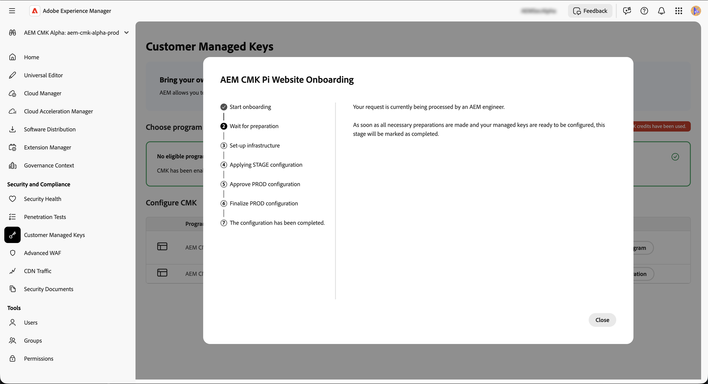

# AEM as a Cloud ServiceのCustomer Managed Keysの設定 {#customer-managed-keys-for-aem-as-a-cloud-service}

AEM as a Cloud Service は現在、顧客データを Azure Blob Storage と MongoDB に保存し、デフォルトでプロバイダー管理の暗号化キーを使用してデータを保護します。 この設定は、多くの組織のセキュリティニーズを満たしていますが、規制が厳しい業界の企業や、データセキュリティの強化が必要な企業は、暗号化方法をより詳細に制御することを求めています。 データのセキュリティ、コンプライアンス、暗号化キーの管理機能を優先する組織にとって、顧客管理キー（CMK）ソリューションは重要な機能強化を提供します。

>[!NOTE]
>
>Azure Key Vaultを設定する前に、まずCloud ManagerでCloud Service プログラムのCMKを有効にする必要があります。 CMKは、実稼動プログラムの作成時または既存プログラムの編集時に、**セキュリティ** タブで有効になります。
>
>[実稼動プログラムの作成](/help/implementing/cloud-manager/getting-access-to-aem-in-cloud/creating-production-programs.md)または[ プログラムの編集](/help/implementing/cloud-manager/getting-access-to-aem-in-cloud/editing-programs.md)を参照してください。


## このソリューションの目的 {#the-problem-being-solved}

プロバイダーが管理するキーは、プライバシーと完全性が追加されることを必要とするビジネスにとって、困難な状況になる可能性があります。 キー管理を制御できない場合、組織はコンプライアンス要件を満たし、カスタムセキュリティポリシーを実装し、完全なデータセキュリティを確保するという課題に直面します。

顧客管理キー（CMK）の導入により、AEM のお客様は暗号化キーを完全に制御できることで、これらの懸念に対処します。 Microsoft Entra ID （旧Azure Active Directory）を介して認証すると、AEM CSはお客様のAzure Key Vaultに安全に接続され、暗号化キーの作成、ローテーション、失効などのライフサイクルを管理できます。

CMK には、次のようないくつかの利点があります。

* **データとアプリケーションの暗号化の管理：** AEM アプリケーションとデータ暗号化キーを直接管理して、セキュリティを強化します。
* **機密性と完全性の向上：**&#x200B;完全な暗号化管理により、機密データや専有データへの誤ったアクセスや開示の可能性を減らします。
* **Azure Key Vaultのサポート：** Azure Key Vaultを使用すると、キーの保存、秘密操作の処理、キーのローテーションの実行が可能になります。

CMKを導入することで、AEM CSの拡張性と柔軟性を維持しながら、お客様はデータセキュリティと暗号化方法の管理を強化し、セキュリティを強化し、リスクを軽減することができます。

AEM as a Cloud Serviceでは、保存データを暗号化するために独自の暗号化キーを使用できます。 このガイドでは、AEM as a Cloud Service用Azure Key Vaultでカスタマーマネージドキー（CMK）を設定する手順について説明します。

>[!WARNING]
>
>CMK を設定した後は、システム管理キーに戻すことはできません。 データへのアクセスが失われないように、キーを安全に管理し、Azure 内でキーコンテナ、キー、CMK アプリへのアクセスを提供するのはお客様の責任です。

このガイドでは、必要なインフラストラクチャを作成および設定するための次の手順について説明します。

1. 環境の設定
1. アドビからのアプリケーション ID の取得
1. 新しいリソースグループの作成
1. Key Vault の作成
1. Key Vault に対して Adobe アクセス権を付与する
1. 暗号化キーの作成

Key Vault URL、暗号化キー名、Key Vaultに関する情報をAdobeと共有する必要があります。

## 環境の設定 {#setup-your-environment}

Azure コマンドラインインターフェイス（CLI）は、このガイドの唯一の要件です。 Azure CLI をまだインストールしていない場合は、[こちら](https://learn.microsoft.com/en-us/cli/azure/install-azure-cli?view=azure-cli-latest)にある公式のインストール手順に従ってください。

このガイドの残りの部分に進む前に、`az login`でCLIにログインしてください。

>[!NOTE]
>
>このガイドでは Azure CLI を使用しますが、Azure コンソール経由で同じ操作を実行することもできます。 Azure コンソールを使用する場合は、以下のコマンドを参考にしてください。


## AEM as a Cloud Serviceの CMK 設定プロセスの開始 {#request-cmk-for-aem-as-a-cloud-service}

AEM as a Cloud Service環境のCustomer Managed Keys （CMK）設定をUI経由でリクエストする必要があります。これを行うには、**Customer Managed Keys** セクションの下にあるAEM Home Security UIに移動します。
その後、**オンボーディングの開始** ボタンをクリックして、オンボーディングプロセスを開始できます。


## アドビからのアプリケーション ID の取得 {#obtain-an-application-id-from-adobe}

オンボーディングプロセスを開始すると、AdobeはEntra アプリケーション IDを提供します。 このアプリケーション IDは、このガイドの残りの部分に必要であり、AdobeがKey Vaultにアクセスできるようにするサービスプリンシパルを作成します。 アプリケーション IDがない場合は、Adobeが提供するまで待ちます。



リクエストが完了すると、CMK UIにアプリケーション IDが表示されます。


## 新しいリソースグループの作成 {#create-a-new-resource-group}

選択した場所に新しいリソースグループを作成します。

```powershell
# Choose a location and a name for the resource group.
$location="<AZURE LOCATION>"
$resourceGroup="<RESOURCE GROUP>"

# Create the resource group.
az group create --location $location --resource-group $resourceGroup
```

既にリソースグループがある場合は、代わりにそれを使用してください。 このガイドの残りの部分では、リソースグループの場所とその名前は、それぞれ `$location` と `$resourceGroup` で識別されます。

## Key Vault の作成 {#create-a-key-vault}

暗号化キーを格納するKey Vaultを作成します。 キーコンテナでは、パージ保護が有効になっている必要があります。 他の Azure サービスからの保存データを暗号化するには、パージ保護が必要です。 アドビのサービスが Key Vault にアクセスできることを確認するには、パブリックネットワークアクセスも有効にする必要があります。

>[!IMPORTANT]
>Key Vaultのパブリック ネットワーク アクセスを無効にするには、Key Vaultへのネットワーク アクセスを持つ環境からキーの作成や回転などの操作を実行する必要があります。 例えば、Key VaultにアクセスできるVMなどです。

```powershell
# Reuse this information from the previous step.
$location="<AZURE LOCATION>"
$resourceGroup="<RESOURCE GROUP>"

# Choose a name for the key vault.
$keyVaultName="<KEY VAULT NAME>"

# Create the key vault.
az keyvault create `
  --location $location `
  --resource-group $resourceGroup `
  --name $keyVaultName `
  --default-action=Allow `
  --enable-purge-protection `
  --enable-rbac-authorization `
  --public-network-access Enabled
```

## Key Vault に対して Adobe アクセス権を付与する {#grant-adobe-access-to-the-key-vault}

この手順では、AdobeがEntra アプリケーションを通じてKey Vaultにアクセスできるようにします。 Adobeは、既にEntra アプリケーションのIDを提供している必要があります。

最初に、Entra アプリケーションに添付されたサービス プリンシパルを作成し、**Key Vault Reader**&#x200B;および&#x200B;**Key Vault Crypto User**&#x200B;のロールを割り当てる必要があります。 役割は、このガイドで作成したキーコンテナに限定されます。

```powershell
# Reuse this information from the previous steps.
$resourceGroup="<RESOURCE GROUP>"
$keyVaultName="<KEY VAULT NAME>"

# The application ID is provided by Adobe.
$appId="<APPLICATION ID>"

# Retrieve the ID of the key vault.
$keyVaultId=(az keyvault show --resource-group $resourceGroup --name $keyVaultName --query id --output tsv)

# Create a new service principal.
$servicePrincipalId=(az ad sp create --id $appId --query id --out tsv)

# Assign the roles to the service principal.
az role assignment create --assignee $servicePrincipalId --role "Key Vault Reader" --scope $keyVaultId
az role assignment create --assignee $servicePrincipalId --role "Key Vault Crypto User" --scope $keyVaultId
```

## 暗号化キーの作成 {#create-an-encryption-key}

最後に、キーコンテナで暗号化キーを作成できます。 この手順を完了するには、**Key Vault Crypto Officer**&#x200B;の役割が必要です。 この役割を付与するには、ログインユーザーにこの役割がない場合は、システム管理者にお問い合わせください。 あるいは、既にその役割を持っている人に、このステップを完了するように依頼することもできます。

暗号化キーを作成するには、キーコンテナへのネットワークアクセスが必要です。 まず、キーコンテナにアクセスできることを確認してから、キーを作成します。

```powershell
# Reuse this information from the previous steps.
$keyVaultName="<KEY VAULT NAME>"

# Choose a name for your key.
$keyName="<KEY NAME>"

# Create the key.
az keyvault key create --vault-name $keyVaultName --name $keyName
```

## 重要なVault情報の共有 {#share-the-key-vault-information}

この時点で、設定は完了です。 必要な情報をCMK UIを介して共有し、環境設定プロセスを開始します。

```powershell
# Reuse this information from the previous steps.
$resourceGroup="<RESOURCE GROUP>"
$keyVaultName="<KEY VAULT NAME>"

# Retrieve the URL of your key vault.
$keyVaultUri=(az keyvault show --name $keyVaultName `
    --resource-group $resourceGroup `
    --query properties.vaultUri `
    --output tsv)

# In addition we would need the tenantId and the subscriptionId in order to setup the connection.
$tenantId=(az keyvault show --name $keyVaultName `
    --resource-group $resourceGroup `
    --query properties.tenantId `
    --output tsv)
$subscriptionId="<Subscription ID>"
```

CMK UIに次の情報を入力します。


## キーアクセスの取り消しの影響 {#implications-of-revoking-key-access}

Key Vault、key、またはCMK アプリへのアクセスを取り消すか無効にすると、AEM as a Cloud Service環境の運用が大幅に中断される可能性があります。 これらのキーを無効にすると、AEM as a Cloud Serviceのデータにアクセスできなくなり、このデータに依存するダウンストリームオペレーションは機能しなくなります。 重要な設定を変更する前に、潜在的な影響を把握することが重要です。

データに対するAEM as a Cloud Serviceのアクセス権を取り消す場合は、Azure内のKey Vaultからアプリケーションに関連付けられているユーザーロールを削除することで取り消すことができます。

## 次の手順 {#next-steps}

CMK UIで必要な情報を指定すると、AdobeはAEM as a Cloud Service環境の設定プロセスを開始します。 このプロセスには時間がかかり、完了すると通知が送信されます。


## CMK設定の完了 {#complete-the-cmk-setup}

設定プロセスが完了すると、UIでCMK設定のステータスを確認できます。Key Vaultと暗号化キーも確認できます。


## 質問とサポート {#questions-and-support}

AEM as a Cloud ServiceのCustomer Managed Keys設定に関するご質問やご質問、サポートが必要な場合は、Adobeにお問い合わせください。 Adobe サポートでは、お客様の質問に対応します。
